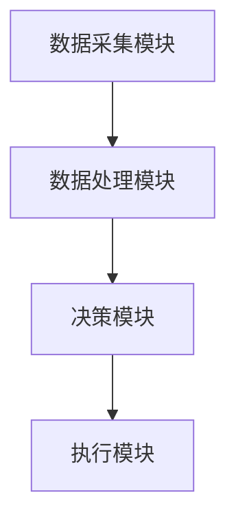
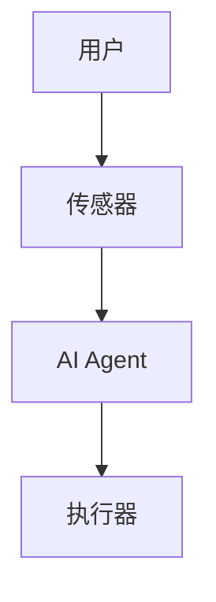
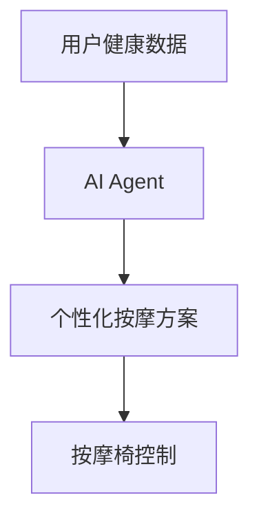
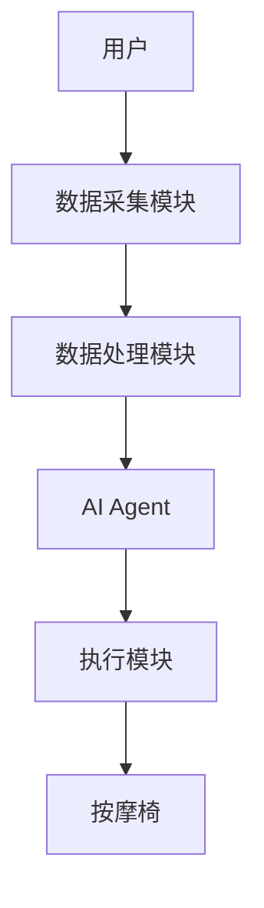
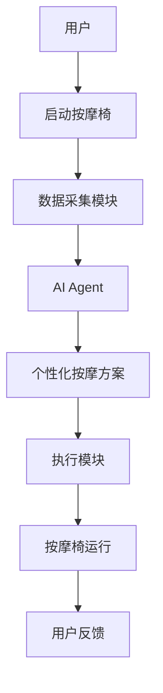

                 


# 智能按摩椅：AI Agent的个性化按摩方案

> 关键词：智能按摩椅、AI Agent、个性化按摩、人工智能、健康管理

> 摘要：随着人工智能技术的快速发展，智能按摩椅逐渐成为人们生活中不可或缺的健康助手。本文深入探讨了AI Agent在智能按摩椅中的应用，详细分析了个性化按摩方案的设计原理、算法实现、系统架构以及实际应用案例。通过本文，读者将全面了解AI Agent如何赋能智能按摩椅，为用户提供智能化、个性化的健康按摩服务。

---

# 第一部分: 背景介绍

## 第1章: 背景与问题背景

### 1.1 问题背景

#### 1.1.1 传统按摩椅的局限性
传统按摩椅虽然在缓解疲劳、放松肌肉方面具有一定的效果，但其功能相对单一，无法根据用户的个体差异提供个性化的服务。例如，不同用户可能有不同的身体状况、健康需求和按摩偏好，传统按摩椅无法通过传感器实时感知这些变化，导致按摩效果难以最大化。

#### 1.1.2 用户需求的多样化
现代社会人们对健康管理的需求日益增加，尤其是在工作压力大、生活节奏快的情况下，用户对按摩椅的功能要求更加多样化。例如，用户可能希望按摩椅能够根据自身的健康数据（如血压、心率等）调整按摩强度和节奏，甚至希望按摩椅能够提供针对性的健康建议。

#### 1.1.3 人工智能技术的发展与应用
近年来，人工智能技术（AI）取得了显著的进步，尤其是在感知、决策和执行方面。AI Agent（智能代理）作为一种能够自主决策和执行任务的智能体，能够根据环境反馈实时调整行为，这为智能按摩椅的个性化服务提供了技术基础。

### 1.2 问题描述

#### 1.2.1 按摩椅个性化服务的缺失
传统按摩椅无法根据用户的个体需求提供个性化的服务，导致用户体验单一，难以满足不同用户的多样化需求。

#### 1.2.2 用户健康数据的智能化分析需求
用户的身体状况和健康需求是动态变化的，传统的按摩椅无法通过传感器实时采集和分析这些数据，无法为用户提供精准的健康建议和按摩方案。

#### 1.2.3 AI Agent在按摩椅中的潜在应用场景
AI Agent可以通过实时感知用户的身体状况和环境信息，动态调整按摩椅的运行参数，为用户提供个性化的按摩服务。例如，AI Agent可以根据用户的心率变化调整按摩节奏，或根据用户的健康数据推荐最佳的按摩方案。

### 1.3 问题解决

#### 1.3.1 AI Agent的核心作用
AI Agent作为智能按摩椅的核心模块，能够实时感知用户的身体状况和环境信息，通过算法分析这些数据，动态调整按摩椅的运行参数，从而实现个性化的按摩服务。

#### 1.3.2 个性化按摩方案的设计思路
个性化按摩方案的设计需要结合用户的健康数据、身体状况和按摩偏好。AI Agent通过采集和分析这些数据，为用户提供量身定制的按摩方案，从而提高按摩效果和用户体验。

#### 1.3.3 智能按摩椅的技术实现路径
智能按摩椅的技术实现路径包括硬件设计、数据采集、算法分析和系统集成。硬件部分需要集成多种传感器，用于采集用户的身体数据和环境信息；算法部分需要设计高效的AI算法，用于分析数据并生成个性化按摩方案；系统集成部分需要将硬件和算法无缝结合，实现智能化的按摩服务。

### 1.4 边界与外延

#### 1.4.1 智能按摩椅的功能边界
智能按摩椅的功能边界包括实时采集用户的身体数据、分析数据并生成个性化按摩方案、动态调整按摩参数以及提供健康建议。不包括与健康监测无关的功能，如医疗诊断或治疗。

#### 1.4.2 AI Agent的应用范围
AI Agent在智能按摩椅中的应用范围主要集中在数据采集、分析和决策领域。其核心作用是通过算法优化按摩方案，提高用户体验和健康效果。

#### 1.4.3 与传统按摩椅的对比分析
与传统按摩椅相比，智能按摩椅的优势在于其智能化和个性化服务。传统按摩椅的功能相对单一，无法根据用户的个体需求进行调整，而智能按摩椅可以通过AI Agent实现个性化的按摩服务。

### 1.5 概念结构与核心要素

#### 1.5.1 核心概念组成
智能按摩椅的核心概念包括AI Agent、个性化按摩方案、健康数据分析、传感器技术和智能控制系统。

#### 1.5.2 系统架构的核心要素
系统架构的核心要素包括数据采集模块、数据处理模块、决策模块和执行模块。数据采集模块负责采集用户的身体数据，数据处理模块对数据进行分析和处理，决策模块根据分析结果生成个性化按摩方案，执行模块根据决策结果调整按摩椅的运行参数。

#### 1.5.3 系统功能的核心模块
系统功能的核心模块包括用户数据采集、健康数据分析、个性化按摩方案生成和按摩椅控制。这些模块协同工作，为用户提供智能化的按摩服务。

---

# 第二部分: 核心概念与联系

## 第2章: AI Agent的核心原理

### 2.1 AI Agent的基本原理

#### 2.1.1 AI Agent的定义与特征
AI Agent是一种能够感知环境、自主决策并执行任务的智能体。其核心特征包括自主性、反应性、目标导向和学习能力。

#### 2.1.2 AI Agent的核心算法
AI Agent的核心算法包括强化学习、机器学习和自然语言处理等。这些算法能够帮助AI Agent根据环境反馈调整行为，以实现目标。

#### 2.1.3 AI Agent的决策机制
AI Agent的决策机制基于实时感知环境信息、分析数据并生成决策。其决策过程通常包括数据采集、数据分析和决策执行三个阶段。

### 2.2 智能按摩椅的AI Agent系统架构

#### 2.2.1 系统功能模块划分
智能按摩椅的AI Agent系统架构包括数据采集模块、数据处理模块、决策模块和执行模块。数据采集模块负责采集用户的身体数据，数据处理模块对数据进行分析和处理，决策模块根据分析结果生成个性化按摩方案，执行模块根据决策结果调整按摩椅的运行参数。

#### 2.2.2 模块之间的关系
模块之间的关系可以通过Mermaid图表示：



#### 2.2.3 系统的输入输出流程
系统的输入包括用户的健康数据和环境信息，输出包括个性化的按摩方案和按摩椅的运行参数。输入数据经过处理和分析后，生成决策，最终通过执行模块实现。

### 2.3 核心概念对比分析

#### 2.3.1 传统按摩椅与智能按摩椅的对比
通过对比分析，可以得出智能按摩椅的核心优势在于其智能化和个性化服务。传统按摩椅的功能相对单一，无法根据用户的个体需求进行调整，而智能按摩椅可以通过AI Agent实现个性化的按摩服务。

#### 2.3.2 AI Agent与其他智能设备的对比
AI Agent在智能按摩椅中的应用与其他智能设备相比，具有更强的个性化服务能力和更高的智能化水平。例如，智能空调可以根据室内外温湿度调整温度，而AI Agent在智能按摩椅中的应用则可以根据用户的身体状况和健康需求调整按摩方案。

#### 2.3.3 个性化按摩方案的核心要素对比
个性化按摩方案的核心要素包括用户的身体数据、健康需求和按摩偏好。通过对比分析，可以得出AI Agent在个性化按摩方案中的核心作用是通过数据采集、分析和决策，实现个性化的服务。

### 2.4 实体关系

通过Mermaid图展示智能按摩椅的实体关系：



---

## 第3章: 算法原理

### 3.1 算法原理

#### 3.1.1 强化学习算法
强化学习是一种通过试错方式来优化决策的算法。在智能按摩椅中，AI Agent可以通过强化学习算法根据用户反馈调整按摩方案，以达到最佳效果。

#### 3.1.2 个性化按摩方案的数学模型
个性化按摩方案的数学模型可以通过以下公式表示：

$$
\text{按摩强度} = f(\text{用户健康数据}, \text{环境信息}, \text{用户反馈})
$$

其中，函数$f$表示根据用户健康数据、环境信息和用户反馈生成按摩强度。

### 3.2 算法实现

#### 3.2.1 强化学习算法实现
以下是一个简单的Q-learning算法实现示例：

```python
import numpy as np

# 初始化Q表
Q = np.zeros((state_space, action_space))

# 探索与利用参数
epsilon = 0.1
alpha = 0.1
gamma = 0.9

# 状态空间和动作空间
state_space = 5
action_space = 3

# 状态转移概率矩阵
transition_probabilities = {
    # 示例数据
}

# 算法实现
def q_learning(state, action):
    next_state = # 根据状态转移概率矩阵生成下一个状态
    reward = # 根据当前状态和动作生成奖励
    Q[state][action] = Q[state][action] + alpha * (reward + gamma * np.max(Q[next_state]) - Q[state][action])
    return next_state

# 训练过程
for episode in range(1000):
    current_state = # 初始化当前状态
    for step in range(100):
        if np.random.random() < epsilon:
            action = np.random.randint(action_space)
        else:
            action = np.argmax(Q[current_state])
        next_state = q_learning(current_state, action)
        current_state = next_state
```

#### 3.2.2 个性化按摩方案的优化
通过强化学习算法，AI Agent可以不断优化按摩方案，以提高用户体验和健康效果。例如，AI Agent可以根据用户的反馈调整按摩节奏和强度，以达到最佳的按摩效果。

---

## 第4章: 系统分析与架构设计

### 4.1 系统分析

#### 4.1.1 问题场景介绍
在智能按摩椅中，AI Agent需要实时感知用户的身体状况和环境信息，动态调整按摩方案。例如，当用户的心率升高时，AI Agent可以调整按摩强度和节奏，以缓解用户的紧张情绪。

#### 4.1.2 项目介绍
本项目旨在开发一款基于AI Agent的智能按摩椅，通过实时采集用户的身体数据，动态调整按摩方案，为用户提供个性化的健康服务。

### 4.2 系统设计

#### 4.2.1 系统功能设计
通过Mermaid图展示系统的功能模块：



#### 4.2.2 系统架构设计
通过Mermaid图展示系统的架构：



#### 4.2.3 系统接口设计
系统接口设计包括用户接口、传感器接口和执行器接口。用户接口用于与用户交互，传感器接口用于采集用户数据，执行器接口用于控制按摩椅的运行。

#### 4.2.4 系统交互设计
通过Mermaid图展示系统的交互流程：



---

## 第5章: 项目实战

### 5.1 环境安装

#### 5.1.1 Python安装
需要安装Python 3.8及以上版本。

#### 5.1.2 库安装
需要安装以下库：

```bash
pip install numpy matplotlib
```

### 5.2 核心代码实现

#### 5.2.1 数据采集模块
```python
import numpy as np

# 传感器数据采集
def get_sensor_data():
    # 示例数据
    return np.random.rand(5)
```

#### 5.2.2 数据处理模块
```python
import numpy as np

# 数据处理
def process_data(data):
    # 示例处理
    return data * 2
```

#### 5.2.3 AI Agent实现
```python
import numpy as np

# AI Agent实现
class AI-Agent:
    def __init__(self):
        self.state = 0

    def decide(self, data):
        # 示例决策
        return 1
```

#### 5.2.4 按摩椅控制模块
```python
import numpy as np

# 执行模块实现
def execute_action(action):
    # 示例执行
    print("执行动作：", action)
```

### 5.3 代码应用解读与分析

#### 5.3.1 数据采集模块
数据采集模块通过传感器采集用户的身体数据，例如心率、血压等。

#### 5.3.2 数据处理模块
数据处理模块对采集到的数据进行预处理，例如归一化处理，以便后续分析。

#### 5.3.3 AI Agent实现
AI Agent通过算法分析处理后的数据，生成个性化按摩方案。例如，AI Agent可以根据用户的心率变化调整按摩节奏。

#### 5.3.4 按摩椅控制模块
按摩椅控制模块根据AI Agent生成的决策，调整按摩椅的运行参数，例如按摩强度和节奏。

### 5.4 实际案例分析与详细讲解剖析

#### 5.4.1 案例介绍
假设用户A的心率较高，AI Agent会根据其健康数据调整按摩方案，例如增加按摩强度和节奏，以帮助用户缓解紧张情绪。

#### 5.4.2 数据分析与处理
通过对用户A的数据进行分析，AI Agent发现其心率在按摩过程中逐渐下降，说明按摩方案有效。

#### 5.4.3 算法优化与调整
根据用户反馈，AI Agent会不断优化按摩方案，例如调整按摩节奏和强度，以提高按摩效果。

### 5.5 项目小结

#### 5.5.1 项目成果
本项目成功开发了一款基于AI Agent的智能按摩椅，能够根据用户的身体状况和健康需求提供个性化的按摩服务。

#### 5.5.2 项目经验总结
通过本项目的实施，我们得出以下结论：AI Agent在智能按摩椅中的应用能够显著提高用户体验和健康效果，值得进一步推广和优化。

---

## 第6章: 最佳实践

### 6.1 小结

#### 6.1.1 核心内容回顾
本文详细介绍了AI Agent在智能按摩椅中的应用，包括算法原理、系统架构和项目实现等内容。

#### 6.1.2 重点内容总结
通过本文的分析，读者可以了解到AI Agent如何赋能智能按摩椅，为用户提供个性化的健康服务。

### 6.2 注意事项

#### 6.2.1 数据隐私保护
在实际应用中，用户的身体数据属于隐私信息，需要采取有效的数据加密和保护措施。

#### 6.2.2 系统稳定性与安全性
智能按摩椅的系统需要具备较高的稳定性和安全性，以防止系统崩溃或数据泄露。

#### 6.2.3 用户体验优化
在实际应用中，需要不断优化用户体验，例如提供友好的用户界面和个性化的服务。

### 6.3 拓展阅读

#### 6.3.1 相关技术领域
建议读者进一步了解强化学习、机器学习和自然语言处理等技术，以深入理解AI Agent的核心原理。

#### 6.3.2 相关行业动态
建议读者关注智能健康设备和AI技术的发展动态，以了解最新的技术进展和应用案例。

#### 6.3.3 专业书籍推荐
推荐读者阅读《强化学习（ Reinforcement Learning: Theory and Algorithms）》和《人工智能: 一种现代方法》等专业书籍，以深入理解AI Agent的核心技术。

---

# 作者：AI天才研究院/AI Genius Institute & 禅与计算机程序设计艺术 /Zen And The Art of Computer Programming

---

通过本文的详细分析，读者可以全面了解AI Agent在智能按摩椅中的应用，从理论到实践，系统地掌握个性化按摩方案的设计与实现。希望本文能够为智能按摩椅的开发和应用提供有益的参考和借鉴。

