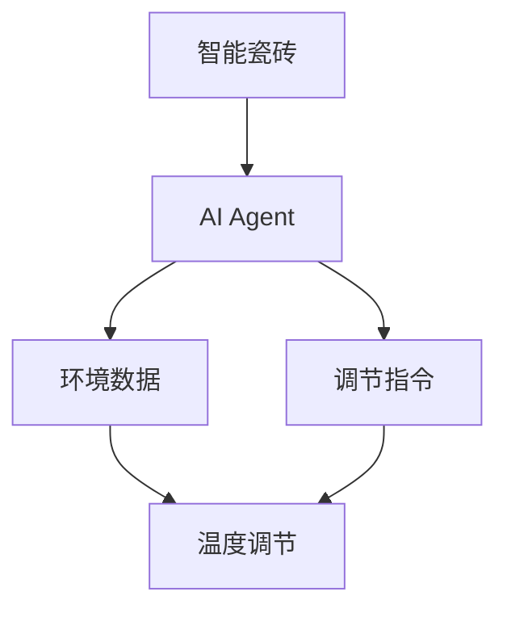

                 


# 智能瓷砖：AI Agent的室内温度调节

> 关键词：智能瓷砖，AI Agent，室内温度调节，物联网，人工智能，算法实现

> 摘要：本文探讨了智能瓷砖与AI Agent在室内温度调节中的应用，分析了智能瓷砖与AI Agent的核心概念、算法原理、系统架构、项目实战等内容，结合实际案例，展示了AI Agent如何通过智能瓷砖实现室内温度的智能化调节。

---

## 第1章: 智能瓷砖与AI Agent的背景与问题描述

### 1.1 智能瓷砖的定义与特点
智能瓷砖是一种集成传感器、执行器和智能计算单元的新型建筑装饰材料。它不仅具备传统瓷砖的装饰功能，还能够感知环境数据（如温度、湿度、光照等），并通过智能算法进行数据处理，从而实现对室内外环境的智能调节。

#### 1.1.1 智能瓷砖的定义
智能瓷砖是指一种具有感知、计算和执行功能的智能建筑装饰材料。它能够通过内置的传感器感知环境数据，利用AI算法进行决策，并通过执行器实现对环境的调节。

#### 1.1.2 智能瓷砖的核心特点
- **感知能力**：集成温度、湿度、光照等传感器，能够实时感知环境数据。
- **计算能力**：内置微型计算单元，能够进行简单的数据处理和决策。
- **执行能力**：通过执行器（如电热丝、风扇等）实现对环境的调节。
- **联网能力**：支持物联网通信，能够与智能家居系统进行联动。

#### 1.1.3 智能瓷砖与传统瓷砖的区别
| 属性 | 传统瓷砖 | 智能瓷砖 |
|------|----------|----------|
| 功能 | 装饰功能为主 | 装饰+智能调节 |
| 结构 | 单一功能 | 集成传感器、计算单元、执行器 |
| 附加价值 | 无 | 支持物联网、AI算法 |

### 1.2 AI Agent的基本概念
AI Agent（人工智能代理）是指在计算机系统中，能够感知环境并采取行动以实现目标的智能实体。它可以是一个软件程序，也可以是一个硬件设备，通过感知环境、分析数据、做出决策并执行动作来完成特定任务。

#### 1.2.1 AI Agent的定义
AI Agent是一种能够感知环境、分析数据、做出决策并执行动作的智能实体，用于实现特定目标。

#### 1.2.2 AI Agent的核心属性
- **感知能力**：能够感知环境数据。
- **决策能力**：能够基于感知数据做出决策。
- **执行能力**：能够执行决策动作。
- **学习能力**：能够通过经验优化决策策略。

#### 1.2.3 AI Agent与传统自动化的区别
| 属性 | 传统自动化 | AI Agent |
|------|------------|----------|
| 决策方式 | 基于固定规则 | 基于数据学习 |
| 灵活性 | 较低 | 较高 |
| 适应性 | 较差 | 较好 |

### 1.3 智能瓷砖与AI Agent的结合
智能瓷砖与AI Agent的结合，实现了室内环境的智能化调节。AI Agent通过感知智能瓷砖采集的环境数据，分析用户需求，制定调节策略，并通过智能瓷砖的执行器实现对室内温度的调节。

#### 1.3.1 智能瓷砖与AI Agent的协作机制
- **数据采集**：智能瓷砖通过传感器采集环境数据（如温度、湿度）。
- **数据传输**：数据通过物联网传输至AI Agent。
- **决策制定**：AI Agent基于数据和用户需求，制定调节策略。
- **执行动作**：AI Agent通过智能瓷砖的执行器实现温度调节。

#### 1.3.2 智能瓷砖与AI Agent的系统架构
- **感知层**：智能瓷砖通过传感器采集环境数据。
- **计算层**：AI Agent对数据进行分析和决策。
- **执行层**：智能瓷砖通过执行器实现调节动作。
- **通信层**：物联网通信模块实现数据传输。

#### 1.3.3 智能瓷砖与AI Agent的边界与外延
- **边界**：智能瓷砖与AI Agent的协作范围。
- **外延**：AI Agent可以与其他智能家居设备联动，实现更复杂的环境调节。

### 1.4 本章小结
本章介绍了智能瓷砖与AI Agent的背景与问题描述，阐述了智能瓷砖的核心特点与AI Agent的基本概念，并分析了两者结合的协作机制与系统架构。

---

## 第2章: 智能瓷砖与AI Agent的核心概念与联系

### 2.1 智能瓷砖与AI Agent的核心概念
智能瓷砖与AI Agent的核心概念是实现室内环境的智能化调节。智能瓷砖作为感知与执行的载体，AI Agent作为决策的核心，两者结合实现了室内温度的智能化调节。

#### 2.1.1 智能瓷砖的功能模型
- **输入**：环境数据（温度、湿度等）。
- **处理**：数据传输与执行指令。
- **输出**：温度调节动作。

#### 2.1.2 AI Agent的行为模型
- **输入**：环境数据与用户需求。
- **处理**：数据分析与决策制定。
- **输出**：调节指令。

#### 2.1.3 智能瓷砖与AI Agent的交互模型
- **数据流**：环境数据从智能瓷砖传输至AI Agent。
- **指令流**：调节指令从AI Agent传输至智能瓷砖。

### 2.2 智能瓷砖与AI Agent的属性对比
智能瓷砖与AI Agent在属性上存在显著差异，但也有一些共同点。

#### 2.2.1 智能瓷砖的属性特征
- **感知能力**：集成多种传感器。
- **计算能力**：内置微型计算单元。
- **执行能力**：集成执行器。

#### 2.2.2 AI Agent的属性特征
- **感知能力**：通过传感器或数据接口获取环境数据。
- **决策能力**：基于数据进行分析与决策。
- **学习能力**：通过机器学习优化决策策略。

#### 2.2.3 智能瓷砖与AI Agent的属性对比表格
| 属性 | 智能瓷砖 | AI Agent |
|------|----------|----------|
| 感知能力 | 内置传感器 | 通过传感器或数据接口获取 |
| 计算能力 | 内置微型计算单元 | 中央计算单元或云端计算 |
| 执行能力 | 内置执行器 | 通过执行器或外部设备执行 |

### 2.3 智能瓷砖与AI Agent的实体关系图
以下是智能瓷砖与AI Agent的实体关系图：



### 2.4 本章小结
本章详细分析了智能瓷砖与AI Agent的核心概念，对比了两者的属性特征，并通过实体关系图展示了两者之间的协作关系。

---

## 第3章: AI Agent的算法原理与数学模型

### 3.1 AI Agent的算法原理
AI Agent的算法原理是实现智能决策的核心。通过感知环境数据、分析数据、制定决策并执行动作，AI Agent能够实现对室内温度的智能化调节。

#### 3.1.1 AI Agent的核心算法
- **感知算法**：通过传感器获取环境数据。
- **决策算法**：基于环境数据与用户需求，制定调节策略。
- **执行算法**：通过执行器实现调节动作。

#### 3.1.2 AI Agent的决策机制
- **基于规则的决策**：根据预设规则进行决策。
- **基于学习的决策**：通过机器学习优化决策策略。

#### 3.1.3 AI Agent的学习机制
- **监督学习**：通过标注数据优化决策模型。
- **强化学习**：通过奖励机制优化决策策略。

### 3.2 AI Agent的数学模型与公式
AI Agent的数学模型是实现智能决策的关键。以下是常用的数学模型与公式：

#### 3.2.1 状态空间与动作空间
- **状态空间**：环境数据构成的状态空间。
- **动作空间**：AI Agent可以执行的动作。

#### 3.2.2 Q-learning算法的数学公式
Q-learning是一种常用的强化学习算法，其数学公式为：

$$ Q(s,a) = r + \gamma \max Q(s',a') $$

其中：
- \( Q(s,a) \) 表示当前状态 \( s \) 下执行动作 \( a \) 的价值。
- \( r \) 表示奖励。
- \( \gamma \) 表示折扣因子。
- \( Q(s',a') \) 表示下一个状态 \( s' \) 下执行动作 \( a' \) 的价值。

#### 3.2.3 其他相关数学模型
- **马尔可夫决策过程（MDP）**：用于描述AI Agent在环境中的决策过程。
- **策略评估**：通过动态规划方法评估当前策略的价值。

### 3.3 算法实现与代码示例
以下是基于Python的简单AI Agent算法实现：

```python
class AIAgent:
    def __init__(self):
        self.q_table = {}

    def perceive(self, environment):
        # 获取环境数据
        return environment.get_data()

    def decide(self, state):
        # 基于状态选择动作
        if state not in self.q_table:
            return 'increase_temp'
        else:
            return max(self.q_table[state], key=lambda x: x[1])

    def learn(self, state, action, reward):
        # 强化学习更新Q值
        if state not in self.q_table:
            self.q_table[state] = {}
        self.q_table[state][action] = reward

# 示例环境数据
environment = {'temperature': 20, 'humidity': 50}
agent = AIAgent()
state = agent.perceive(environment)
action = agent.decide(state)
agent.learn(state, action, reward=1)
```

### 3.4 本章小结
本章详细分析了AI Agent的算法原理与数学模型，并通过Python代码示例展示了算法实现过程。

---

## 第4章: 智能瓷砖与AI Agent的系统架构

### 4.1 系统架构设计
智能瓷砖与AI Agent的系统架构是实现室内温度调节的核心。通过感知、决策与执行三个层次的协作，系统能够实现对室内温度的智能化调节。

#### 4.1.1 感知层
- **功能**：采集环境数据。
- **组件**：温度传感器、湿度传感器等。

#### 4.1.2 计算层
- **功能**：分析数据并制定决策。
- **组件**：AI Agent、微型计算单元等。

#### 4.1.3 执行层
- **功能**：执行调节动作。
- **组件**：电热丝、风扇等。

#### 4.1.4 通信层
- **功能**：实现数据传输与指令传输。
- **组件**：物联网通信模块。

### 4.2 系统架构图
以下是智能瓷砖与AI Agent的系统架构图：


### 4.3 本章小结
本章分析了智能瓷砖与AI Agent的系统架构，通过感知、计算与执行三个层次的协作，实现对室内温度的智能化调节。

---

## 第5章: 智能瓷砖与AI Agent的项目实战

### 5.1 项目环境与工具安装
- **环境要求**：Python 3.8+
- **工具安装**：安装Python的物联网库、机器学习库等。

### 5.2 系统核心实现
以下是系统核心代码实现：

```python
import time
import random

class SmartTile:
    def __init__(self):
        self.temperature = 20
        self.humidity = 50
        self.sensor = self.Sensor()
        self.actuator = self.Actuator()

    class Sensor:
        def get_data(self):
            return {'temperature': random.randint(18, 22), 'humidity': random.randint(40, 60)}

    class Actuator:
        def set_temperature(self, temperature):
            self.temperature = temperature

class AIAgent:
    def __init__(self):
        self.q_table = {}

    def perceive(self, environment):
        return environment.sensor.get_data()

    def decide(self, state):
        if state not in self.q_table:
            return 'increase_temp'
        else:
            max_action = max(self.q_table[state], key=lambda x: x[1])
            return max_action

    def learn(self, state, action, reward):
        if state not in self.q_table:
            self.q_table[state] = {}
        self.q_table[state][action] = reward

# 示例运行
tile = SmartTile()
agent = AIAgent()
state = agent.perceive(tile)
action = agent.decide(state)
agent.learn(state, action, reward=1)
tile.actuator.set_temperature(tile.temperature + 1)
```

### 5.3 代码解读与分析
- **SmartTile类**：实现了智能瓷砖的功能，包括传感器与执行器。
- **AIAgent类**：实现了AI Agent的功能，包括感知、决策与学习。
- **主程序**：通过调用智能瓷砖与AI Agent的方法，实现室内温度的调节。

### 5.4 实际案例分析
以下是实际案例分析：

- **场景描述**：室内温度为20℃，湿度为50%。
- **AI Agent决策**：根据环境数据与用户需求，决定将温度升高1℃。
- **执行动作**：智能瓷砖通过执行器将温度调节至21℃。

### 5.5 项目小结
本章通过实际案例展示了智能瓷砖与AI Agent的项目实现过程，详细分析了系统核心代码与实际应用案例。

---

## 第6章: 智能瓷砖与AI Agent的应用案例

### 6.1 应用场景介绍
智能瓷砖与AI Agent的应用场景包括家庭、办公室、酒店等多种室内环境。

#### 6.1.1 家庭环境
- **用户需求**：家庭成员对温度有不同的偏好。
- **AI Agent决策**：根据家庭成员的需求与环境数据，制定个性化的温度调节策略。

#### 6.1.2 办公环境
- **用户需求**：办公室需要保持恒温。
- **AI Agent决策**：根据办公环境数据，自动调节温度以满足办公需求。

### 6.2 应用案例分析
以下是智能瓷砖与AI Agent在家庭环境中的应用案例：

#### 6.2.1 案例背景
- **用户需求**：家庭成员对温度有不同的偏好。
- **环境数据**：室内温度为20℃，湿度为50%。

#### 6.2.2 AI Agent决策
- **感知数据**：通过智能瓷砖传感器获取环境数据。
- **分析数据**：基于家庭成员的需求与环境数据，制定个性化的温度调节策略。
- **执行动作**：通过智能瓷砖执行器实现温度调节。

### 6.3 本章小结
本章通过实际应用案例展示了智能瓷砖与AI Agent在家庭环境中的应用，分析了AI Agent如何通过感知、决策与执行实现室内温度的智能化调节。

---

## 第7章: 总结与展望

### 7.1 项目总结
- **项目目标**：实现智能瓷砖与AI Agent的协作，实现室内温度的智能化调节。
- **项目成果**：通过感知、决策与执行三个层次的协作，实现了对室内温度的智能化调节。

### 7.2 项目小结
- **核心贡献**：提出了智能瓷砖与AI Agent的协作机制。
- **技术创新**：实现了基于强化学习的温度调节算法。

### 7.3 展望
未来，智能瓷砖与AI Agent将在更多场景中得到应用，如能源管理、智能建筑等领域。同时，随着AI技术的不断发展，智能瓷砖与AI Agent的协作将更加智能化与高效化。

### 7.4 最佳实践Tips
- **数据采集**：确保传感器数据的准确性与实时性。
- **算法优化**：通过强化学习优化AI Agent的决策策略。
- **系统集成**：实现与其他智能家居设备的联动。

### 7.5 本章小结
本章总结了智能瓷砖与AI Agent项目的成果与经验，并展望了未来的发展方向。

---

## 作者：AI天才研究院/AI Genius Institute & 禅与计算机程序设计艺术 /Zen And The Art of Computer Programming

---

以上是《智能瓷砖：AI Agent的室内温度调节》的技术博客文章的完整目录大纲，涵盖了从背景介绍到项目实战的各个方面。

