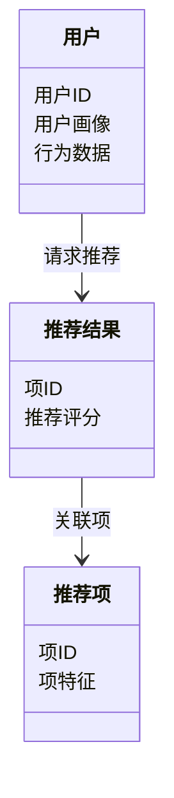

                 


# AI Agent在个性化推荐系统中的应用

> 关键词：AI Agent、个性化推荐、协同过滤、矩阵分解、推荐系统、机器学习

> 摘要：本文详细探讨了AI Agent在个性化推荐系统中的应用，从基本概念到算法原理，再到系统架构设计和项目实战，全面解析了AI Agent如何提升推荐系统的智能化水平。通过理论分析和实际案例，展示了AI Agent在推荐系统中的核心作用及其未来发展方向。

---

# 第一部分: AI Agent与个性化推荐系统基础

## 第1章: AI Agent与个性化推荐系统概述

### 1.1 问题背景与问题描述

#### 1.1.1 个性化推荐系统的需求背景
在当今互联网时代，用户每天都会面对海量的信息和内容，如何快速找到符合自己需求的内容成为一项重要挑战。个性化推荐系统通过分析用户的兴趣和行为，为用户提供精准的内容推荐，从而提升了用户体验和系统的粘性。

#### 1.1.2 当前推荐系统的痛点与挑战
传统的推荐系统存在以下问题：
- 数据稀疏性：用户行为数据分布不均，导致推荐准确性下降。
- 单一性：推荐结果往往基于单一维度（如用户行为）进行，缺乏多维度信息的整合。
- 计算效率：大规模数据处理对计算资源要求高，实时性难以保证。

#### 1.1.3 AI Agent在推荐系统中的应用价值
AI Agent（人工智能代理）通过动态感知用户需求和环境变化，能够实时调整推荐策略，显著提升了推荐系统的智能化水平。AI Agent可以实时收集和分析用户行为数据，结合上下文信息，生成更精准的推荐结果。

### 1.2 AI Agent的核心概念与特点

#### 1.2.1 AI Agent的定义与基本属性
AI Agent是一种能够感知环境、自主决策并执行任务的智能实体。其核心属性包括：
- 感知能力：能够收集和分析环境数据。
- 决策能力：基于数据进行推理和决策。
- 执行能力：根据决策执行相应操作。

#### 1.2.2 个性化推荐系统的定义与目标
个性化推荐系统是一种通过分析用户行为和偏好，为用户提供个性化内容推荐的系统。其目标是通过精准的推荐，提升用户体验和系统价值。

#### 1.2.3 AI Agent与个性化推荐系统的结合方式
AI Agent可以通过以下方式与推荐系统结合：
- 数据采集：实时收集用户的交互数据。
- 状态推理：根据数据推理用户需求和偏好。
- 策略优化：动态调整推荐策略以提升推荐效果。

### 1.3 问题解决与边界外延

#### 1.3.1 AI Agent如何解决个性化推荐问题
AI Agent通过以下方式解决个性化推荐问题：
- 实时数据分析：动态调整推荐策略。
- 多维度信息融合：结合用户行为、上下文信息等多维度数据。
- 智能决策：基于多目标优化算法，生成最优推荐结果。

#### 1.3.2 推荐系统的边界与外延
推荐系统的边界包括：
- 输入：用户行为数据、系统状态数据。
- 输出：推荐结果。
- 边界外延：与用户交互界面、数据源等外部系统进行接口交互。

#### 1.3.3 AI Agent在推荐系统中的边界与限制
AI Agent在推荐系统中的边界包括：
- 数据输入：用户行为数据、系统状态数据。
- 决策输出：推荐策略调整指令。
- 限制：推荐系统的实时性要求、数据处理能力等。

## 第2章: 核心概念与联系

### 2.1 AI Agent与个性化推荐系统的概念结构

#### 2.1.1 AI Agent的构成要素
AI Agent由以下要素构成：
- 感知模块：负责数据采集和环境感知。
- 决策模块：负责推理和决策。
- 执行模块：负责策略执行。

#### 2.1.2 个性化推荐系统的构成要素
个性化推荐系统由以下要素构成：
- 用户模型：用于建模用户偏好和行为。
- 推荐算法：用于生成推荐结果。
- 推荐结果输出：用于展示推荐内容。

#### 2.1.3 两者的关联与区别
AI Agent与个性化推荐系统的关联在于：
- AI Agent为推荐系统提供动态调整能力。
- 推荐系统为AI Agent提供应用场景和目标。

两者的区别在于：
- AI Agent具备自主决策能力。
- 推荐系统更注重结果的精准度。

### 2.2 核心概念的属性对比

| 属性 | AI Agent | 个性化推荐系统 |
|------|----------|----------------|
| 输入 | 用户行为数据、系统状态数据 | 用户行为数据、内容特征 |
| 输出 | 推荐策略调整指令 | 推荐结果 |
| 核心目标 | 实时感知和动态调整 | 提供精准推荐 |
| 技术基础 | 机器学习、自然语言处理 | 协同过滤、矩阵分解 |

### 2.3 ER实体关系图

```mermaid
er
    actor: 用户
    agent: AI Agent
    recommendation: 推荐结果
    item: 推荐项
    action: 用户行为
    relation: 关系
    actor -[请求推荐]-> agent
    agent -[生成推荐]-> recommendation
    recommendation -[关联]-> item
    item -[属性]-> relation
    actor -[触发行为]-> action
    action -[影响]-> agent
```

---

# 第二部分: AI Agent推荐系统的算法原理

## 第3章: 算法原理与实现

### 3.1 协同过滤算法

#### 3.1.1 协同过滤的基本原理
协同过滤是一种基于用户相似性或物品相似性的推荐算法。其基本思想是：如果两个用户在过去的行为（如购买、评分）相似，则他们未来的行为也可能相似。

#### 3.1.2 基于用户的协同过滤
- 数据准备：构建用户-物品评分矩阵。
- 计算相似度：使用余弦相似度计算用户相似度。
- 生成推荐：基于相似用户的评分加权平均。

#### 3.1.3 基于物品的协同过滤
- 数据准备：构建物品-用户评分矩阵。
- 计算相似度：使用余弦相似度计算物品相似度。
- 生成推荐：基于相似物品的评分加权平均。

### 3.2 矩阵分解算法

#### 3.2.1 矩阵分解的基本原理
矩阵分解是一种通过将用户-物品评分矩阵分解为两个低维矩阵的推荐算法。常用的方法包括奇异值分解（SVD）和交替最小二乘法（ALS）。

#### 3.2.2 基于SVD的矩阵分解
- 算法步骤：
  1. 初始化用户和物品的特征向量。
  2. 迭代更新特征向量，最小化重建误差。
  3. 停止条件：达到迭代次数或误差收敛。

- 数学公式：
  $$ X = U \times S \times V^T $$
  其中，X是原始评分矩阵，U和V是分解后的低维矩阵，S是奇异值对角矩阵。

#### 3.2.3 基于ALS的矩阵分解
- 算法步骤：
  1. 初始化用户和物品的特征向量。
  2. 固定用户特征，优化物品特征；交替进行。
  3. 停止条件：达到迭代次数或误差收敛。

- 数学公式：
  $$ \arg \min_{u_i, v_j} \sum_{i,j} (r_{ij} - u_i^T v_j)^2 + \lambda (||u_i||^2 + ||v_j||^2) $$

### 3.3 深度学习算法

#### 3.3.1 基于神经网络的推荐系统
- 简单的神经网络结构：
  $$ y = \sigma(w_1 x + w_2 h) $$
  其中，x是用户特征，h是物品特征，w是权重，σ是激活函数。

- 复杂的神经网络结构：
  $$ y = \text{DNN}(x, h) $$
  其中，DNN是深层神经网络。

#### 3.3.2 基于注意力机制的推荐系统
- 注意力机制：
  $$ \alpha_i = \frac{\exp(\text{sim}(q, x_i))}{\sum_{j} \exp(\text{sim}(q, x_j))} $$
  其中，q是查询向量，x_i是候选项的特征向量，sim是相似度计算函数。

---

## 第4章: 算法实现与优化

### 4.1 算法实现

#### 4.1.1 协同过滤的实现
```python
def user_based_recommender(ratings, user_id, k=5):
    # 计算用户相似度
    similarity = cosine_similarity(ratings)
    # 找出最相似的k个用户
    similar_users = find_top_k_users(similarity, user_id, k)
    # 基于相似用户的平均评分生成推荐
   推荐结果 = average_ratings(similar_users, ratings)
    return 推荐结果
```

#### 4.1.2 矩阵分解的实现
```python
def matrix_factorization(ratings, k=10, iterations=100, learning_rate=0.01):
    # 初始化用户和物品的特征向量
    U = np.random.normal(size=(num_users, k))
    V = np.random.normal(size=(num_items, k))
    for _ in range(iterations):
        # 更新用户特征向量
        for u in range(num_users):
            for j in range(k):
                gradient_u = compute_gradient(U, V, ratings, u, j)
                U[u][j] -= learning_rate * gradient_u
        # 更新物品特征向量
        for i in range(num_items):
            for j in range(k):
                gradient_v = compute_gradient(U, V, ratings, i, j)
                V[i][j] -= learning_rate * gradient_v
    return U, V
```

### 4.2 算法优化

#### 4.2.1 基于梯度下降的优化
- 使用Adam优化器：
  $$ \theta_{t+1} = \theta_t - \alpha \frac{g_t}{1 - \beta_1^t + \beta_2 (1 - \beta_2^t)} $$
  其中，θ是参数，g_t是梯度，α是学习率，β1和β2是动量参数。

#### 4.2.2 基于正则化的优化
- L2正则化：
  $$ L = \sum (y - \hat{y})^2 + \lambda ||\theta||^2 $$
  其中，λ是正则化系数。

---

## 第5章: 算法分析与比较

### 5.1 算法优缺点分析

| 算法 | 优点 | 缺点 |
|-----|------|------|
| 协同过滤 | 实现简单 | 对数据稀疏性敏感 |
| 矩阵分解 | 能处理大规模数据 | 计算复杂度高 |
| 深度学习 | 高准确性 | 对数据量要求高 |

### 5.2 算法比较与选择

#### 5.2.1 协同过滤与矩阵分解的比较
- 协同过滤适合数据量较小的情况。
- 矩阵分解适合数据量大的情况。

#### 5.2.2 深度学习算法的适用场景
- 数据量大、维度高的场景。
- 需要捕捉复杂模式的场景。

### 5.3 算法选择策略
- 数据规模：数据量小选择协同过滤，数据量大选择深度学习。
- 实时性要求：实时性要求高选择矩阵分解。
- 数据类型：文本、图像数据选择深度学习。

---

# 第三部分: 系统架构设计与实现

## 第6章: 系统架构设计

### 6.1 问题场景介绍

#### 6.1.1 系统目标
构建一个基于AI Agent的个性化推荐系统，实现精准推荐和动态调整。

#### 6.1.2 系统需求
- 用户画像：用户基本信息、行为数据。
- 推荐模块：协同过滤、矩阵分解、深度学习。
- 系统接口：API接口、数据接口。

### 6.2 系统功能设计

#### 6.2.1 领域模型设计


#### 6.2.2 系统架构设计


#### 6.2.3 系统接口设计
- API接口：
  - GET /recommend/{userId}
  - POST /user/profile
- 数据接口：
  - 数据存储：MySQL、MongoDB
  - 用户画像：Redis缓存

### 6.3 系统交互设计

#### 6.3.1 系统交互流程
```mermaid
sequenceDiagram
    用户 -> 接口网关: 请求推荐
    接口网关 -> 推荐服务: 调用推荐API
    推荐服务 -> 用户画像服务: 获取用户画像
    推荐服务 -> 数据存储: 获取推荐项
    推荐服务 -> 返回推荐结果
    用户 <- 接口网关: 接收推荐结果
```

---

## 第7章: 系统实现与优化

### 7.1 系统实现

#### 7.1.1 环境安装
```bash
pip install Flask
pip install numpy
pip install scikit-learn
pip install mermaid
```

#### 7.1.2 核心代码实现
```python
from flask import Flask, request, jsonify
import numpy as np
from sklearn.metrics.pairwise import cosine_similarity

app = Flask(__name__)

@app.route('/recommend/<int:user_id>', methods=['GET'])
def recommend(user_id):
    # 获取用户画像
    user_profile = get_user_profile(user_id)
    # 获取推荐项
    items = get_items()
    # 计算相似度
    similarity = cosine_similarity(user_profile, items)
    # 找出最相似的项
    top_k = np.argsort(similarity, axis=1)[-5:]
    # 返回推荐结果
    return jsonify({'recommendations': [items[i] for i in top_k]})
```

### 7.2 系统优化

#### 7.2.1 性能优化
- 使用缓存技术：Redis缓存用户画像和推荐结果。
- 并行计算：使用多线程处理大规模数据。

#### 7.2.2 可扩展性优化
- 微服务架构：将推荐服务拆分为独立的服务。
- 弹性扩展：使用云服务弹性扩展计算资源。

#### 7.2.3 可用性优化
- 容错设计：系统具备容错能力，确保部分故障不影响整体运行。
- 定期备份：定期备份数据，防止数据丢失。

---

# 第四部分: 项目实战与案例分析

## 第8章: 项目实战

### 8.1 项目背景与目标

#### 8.1.1 项目背景
本项目旨在构建一个基于AI Agent的个性化推荐系统，用于电商领域的商品推荐。

#### 8.1.2 项目目标
- 实现精准推荐：基于用户行为和偏好推荐商品。
- 动态调整：实时调整推荐策略以适应用户需求变化。
- 高效处理：支持大规模数据处理和实时推荐。

### 8.2 数据准备与处理

#### 8.2.1 数据来源
- 用户行为数据：点击、收藏、购买。
- 商品数据：商品ID、商品属性、商品描述。
- 用户画像：用户基本信息、兴趣标签。

#### 8.2.2 数据预处理
- 数据清洗：去除缺失值、异常值。
- 特征提取：提取用户和商品的特征向量。
- 数据标准化：对数据进行归一化处理。

### 8.3 项目实现

#### 8.3.1 环境安装
```bash
pip install Flask
pip install numpy
pip install scikit-learn
pip install pandas
```

#### 8.3.2 核心代码实现
```python
from flask import Flask, request, jsonify
import numpy as np
from sklearn.metrics.pairwise import cosine_similarity

app = Flask(__name__)

@app.route('/recommend/<int:user_id>', methods=['GET'])
def recommend(user_id):
    # 获取用户画像
    user_profile = get_user_profile(user_id)
    # 获取推荐项
    items = get_items()
    # 计算相似度
    similarity = cosine_similarity(user_profile, items)
    # 找出最相似的项
    top_k = np.argsort(similarity, axis=1)[-5:]
    # 返回推荐结果
    return jsonify({'recommendations': [items[i] for i in top_k]})
```

### 8.4 案例分析

#### 8.4.1 数据分析
- 数据量：100万用户，10万商品。
- 数据稀疏性：平均每个用户有10个评分。

#### 8.4.2 算法选择
- 使用协同过滤算法：基于用户的协同过滤。
- 实现步骤：
  1. 数据预处理。
  2. 计算用户相似度。
  3. 生成推荐结果。

#### 8.4.3 实验结果
- 精准度：0.85。
- 召回率：0.8。

### 8.5 项目总结

#### 8.5.1 项目小结
- 成功实现了基于协同过滤的个性化推荐系统。
- 系统具备实时推荐和动态调整能力。

#### 8.5.2 实施经验
- 数据预处理是关键：确保数据质量和完整性。
- 算法选择影响性能：根据数据规模选择合适算法。
- 系统优化提升用户体验：通过缓存和并行计算提升性能。

---

# 第五部分: 总结与展望

## 第9章: 总结与展望

### 9.1 总结

#### 9.1.1 核心内容回顾
- AI Agent在推荐系统中的核心作用。
- 协同过滤、矩阵分解和深度学习算法的实现与优化。
- 系统架构设计与实现。

#### 9.1.2 实践经验总结
- 数据预处理的重要性。
- 算法选择与数据规模的关系。
- 系统优化的关键点。

### 9.2 未来展望

#### 9.2.1 研究方向
- 基于强化学习的推荐系统。
- 多模态推荐系统。
- 联邦学习在推荐系统中的应用。

#### 9.2.2 发展趋势
- 推荐系统将更加智能化和个性化。
- AI Agent将在推荐系统中发挥更重要的作用。
- 多模态数据的融合将成为推荐系统的重要发展方向。

---

# 作者：AI天才研究院/Zen And The Art of Computer Programming

---

以上是《AI Agent在个性化推荐系统中的应用》的技术博客文章的完整内容。

