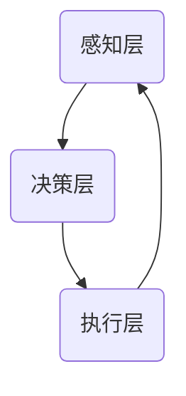
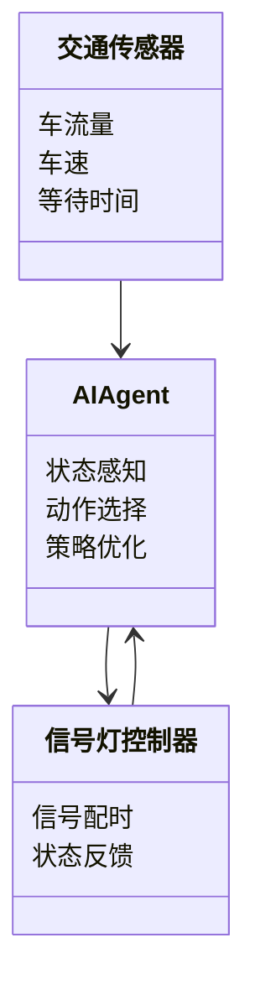
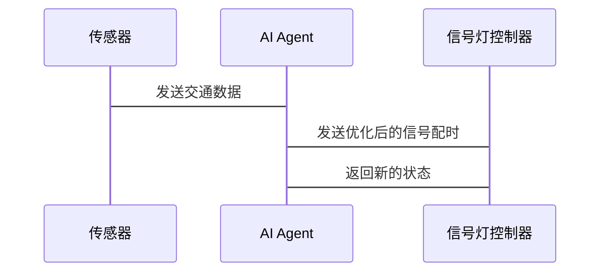

                 


# AI Agent在智能交通信号优化中的实践

> 关键词：AI Agent, 交通信号优化, 强化学习, 多智能体系统, 智能交通系统, 实时优化

> 摘要：本文深入探讨了AI Agent在智能交通信号优化中的应用，从理论基础到实际案例，详细分析了AI Agent的核心概念、算法原理、系统架构及项目实现。通过强化学习算法和多智能体协作优化的实践，展示了AI Agent在提高交通效率、减少拥堵和改善出行体验中的巨大潜力。

---

# 第一部分: AI Agent在智能交通信号优化中的背景与基础

# 第1章: AI Agent与智能交通信号优化概述

## 1.1 AI Agent的基本概念
### 1.1.1 AI Agent的定义与特点
AI Agent（人工智能代理）是指能够感知环境、自主决策并执行任务的智能实体。它具备以下特点：
- **自主性**：能够在没有外部干预的情况下自主运行。
- **反应性**：能够实时感知环境并做出响应。
- **目标导向**：通过优化目标函数实现特定目标。
- **学习能力**：能够通过数据和经验改进性能。

### 1.1.2 AI Agent在交通系统中的应用背景
传统交通信号控制依赖于固定的周期性方案或简单的逻辑判断，难以适应交通流量的动态变化。随着城市化进程的加快，交通拥堵问题日益严重，对智能、动态的信号优化需求迫切。

### 1.1.3 智能交通信号优化的必要性
智能交通信号优化能够通过实时数据分析和智能决策，显著提高交通效率，减少碳排放和能源浪费。

---

## 1.2 交通信号优化的问题背景
### 1.2.1 传统交通信号控制的局限性
- 固定周期方案无法应对交通流量波动。
- 无法实时感知交通状态。
- 缺乏全局优化能力。

### 1.2.2 智能化交通管理的需求
- 实时动态优化信号配时。
- 多目标优化（如减少拥堵、降低排放、提高通行效率）。
- 处理复杂交通场景（如高峰时段、交通事故、特殊事件）。

### 1.2.3 AI Agent在信号优化中的作用
AI Agent能够通过实时感知交通流量、预测未来状态，并基于强化学习等算法优化信号配时，实现动态、智能的交通管理。

---

## 1.3 AI Agent技术的核心优势
### 1.3.1 数据驱动的实时优化
AI Agent能够实时收集交通数据（如车流量、车速、等待时间等），并基于这些数据动态调整信号配时。

### 1.3.2 多目标优化能力
AI Agent可以通过多目标优化算法，在多个目标（如减少拥堵、降低排放、提高通行效率）之间找到最佳平衡。

### 1.3.3 自适应学习能力
AI Agent能够通过强化学习等算法，不断学习和优化策略，适应交通环境的变化。

---

## 1.4 本章小结
本章介绍了AI Agent的基本概念、在交通系统中的应用背景以及其在信号优化中的核心优势，为后续章节的深入分析奠定了基础。

---

# 第2章: AI Agent的核心概念与技术原理

## 2.1 AI Agent的基本原理
### 2.1.1 AI Agent的感知、决策与执行机制
AI Agent通过传感器、摄像头、交通监控系统等感知交通状态，基于感知数据进行决策，并通过信号控制系统执行动作。

### 2.1.2 多智能体系统与协作优化
在复杂的交通环境中，通常需要多个AI Agent协作优化。例如，不同区域的信号灯控制器可以协同工作，实现全局优化。

---

## 2.2 AI Agent在交通信号优化中的应用模型
### 2.2.1 状态空间与动作空间定义
- **状态空间**：表示交通系统的状态，例如各个信号灯的状态、车流量、等待时间等。
- **动作空间**：表示AI Agent可以执行的动作，例如调整信号灯周期、改变绿灯时长等。

### 2.2.2 奖励函数设计
奖励函数用于衡量AI Agent的优化效果。例如，可以定义为：
$$ R = \alpha \cdot \text{减少的拥堵时间} + \beta \cdot \text{减少的碳排放} + \gamma \cdot \text{提高的通行效率} $$
其中，$\alpha, \beta, \gamma$是权重系数。

### 2.2.3 动作执行与反馈机制
AI Agent根据当前状态选择动作，执行动作后，系统返回新的状态和奖励值，AI Agent根据反馈调整策略。

---

## 2.3 AI Agent与传统信号优化算法的对比

| 对比维度             | 传统信号优化算法                  | AI Agent优化算法                  |
|----------------------|------------------------------------|------------------------------------|
| 数据依赖性           | 较低，依赖预设规则                | 较高，依赖实时数据和历史数据      |
| 自适应能力           | 较弱，固定周期或简单逻辑          | 较强，能够自适应交通变化          |
| 优化目标             | 单一目标（如固定周期）            | 多目标优化（如减少拥堵、提高效率）|
| 学习能力             | 无                                | 有，通过强化学习等算法不断优化    |

---

## 2.4 本章小结
本章详细介绍了AI Agent的核心概念、基本原理以及在交通信号优化中的应用模型，为后续章节的算法实现和系统设计奠定了理论基础。

---

# 第3章: AI Agent的算法原理与实现

## 3.1 强化学习算法在交通信号优化中的应用
### 3.1.1 强化学习的基本原理
强化学习是一种通过试错机制学习最优策略的方法。AI Agent通过与环境交互，学习最优动作序列。

### 3.1.2 Q-learning算法在信号优化中的应用
Q-learning是一种经典的强化学习算法，适用于离散动作空间的优化问题。其更新公式为：
$$ Q(s, a) = Q(s, a) + \alpha \cdot [r + \gamma \cdot \max_{a'} Q(s', a') - Q(s, a)] $$
其中，$\alpha$是学习率，$\gamma$是折扣因子。

### 3.1.3 算法实现步骤
1. 初始化Q表。
2. 环境感知，获取当前状态$s$。
3. 根据策略选择动作$a$，并执行动作。
4. 获取环境反馈，计算奖励$r$和新的状态$s'$。
5. 更新Q表：$Q(s, a) = Q(s, a) + \alpha \cdot (r + \gamma \cdot \max Q(s', a') - Q(s, a))$。
6. 重复步骤2-5，直到收敛。

---

## 3.2 多智能体协作优化算法
### 3.2.1 多智能体系统的优势
通过多个AI Agent协作，可以实现全局优化，避免单个Agent的局部最优影响全局。

### 3.2.2 多智能体协作优化的实现
- **通信机制**：定义Agent之间的通信协议，共享状态和策略。
- **协作策略**：通过分布式强化学习或博弈论方法，实现多个Agent的协同优化。

---

## 3.3 数学模型与公式
### 3.3.1 强化学习的数学模型
- 状态空间：$S = \{s_1, s_2, ..., s_n\}$
- 动作空间：$A = \{a_1, a_2, ..., a_m\}$
- 奖励函数：$R: S \times A \rightarrow \mathbb{R}$
- 价值函数：$Q: S \times A \rightarrow \mathbb{R}$

### 3.3.2 多智能体协作的数学模型
- 协作策略：$\pi_i: S_i \rightarrow A_i$，表示第$i$个Agent的策略。
- 全局优化目标：$\max \sum_{i=1}^N Q(s, a_i)$，其中$N$是Agent的数量。

---

## 3.4 本章小结
本章详细介绍了AI Agent在交通信号优化中的算法原理，包括强化学习和多智能体协作优化，并给出了具体的数学模型和实现步骤。

---

# 第4章: AI Agent在智能交通信号优化中的系统架构设计

## 4.1 系统架构概述
### 4.1.1 系统组成
- **感知层**：交通传感器、摄像头等实时采集交通数据。
- **决策层**：AI Agent进行状态感知、策略选择。
- **执行层**：信号灯控制器执行优化后的信号配时。

### 4.1.2 系统架构图


---

## 4.2 系统功能设计
### 4.2.1 领域模型设计


### 4.2.2 功能模块
- 数据采集模块：实时采集交通数据。
- 数据处理模块：对数据进行清洗和特征提取。
- 策略优化模块：基于强化学习优化信号配时。
- 执行控制模块：将优化后的信号配时发送给信号灯控制器。

---

## 4.3 接口设计与交互流程
### 4.3.1 系统接口设计
- 数据接口：传感器数据输入接口。
- 控制接口：信号灯控制器输出接口。

### 4.3.2 交互流程图


---

## 4.4 本章小结
本章详细设计了AI Agent在智能交通信号优化中的系统架构，包括功能模块、接口设计和交互流程。

---

# 第5章: AI Agent在智能交通信号优化中的项目实战

## 5.1 项目背景与目标
### 5.1.1 项目背景
在一个典型的城市路口，由于交通流量波动大，传统信号控制方式导致高峰时段拥堵严重。

### 5.1.2 项目目标
通过AI Agent实现动态信号优化，提高交通效率，减少拥堵和等待时间。

---

## 5.2 项目实施步骤
### 5.2.1 环境安装
- 安装Python、TensorFlow、Keras等依赖库。
- 配置交通信号灯模拟环境（如SUMO）。

### 5.2.2 核心代码实现
```python
import numpy as np
import gym

class AI-Agent:
    def __init__(self, state_space, action_space):
        self.state_space = state_space
        self.action_space = action_space
        self.Q = np.zeros((state_space, action_space))

    def perceive(self, state):
        # 实现状态感知逻辑
        pass

    def choose_action(self, state):
        # 实现动作选择逻辑
        pass

    def update_Q(self, state, action, reward, next_state):
        # 更新Q表
        self.Q[state, action] += 0.1 * (reward + 0.9 * np.max(self.Q[next_state, :]) - self.Q[state, action])

def main():
    # 初始化环境
    env = gym.make('TrafficSignal-v0')
    agent = AI-Agent(env.observation_space, env.action_space)
    # 训练过程
    for episode in range(1000):
        state = env.reset()
        while True:
            action = agent.choose_action(state)
            next_state, reward, done, _ = env.step(action)
            agent.update_Q(state, action, reward, next_state)
            if done:
                break
            state = next_state

if __name__ == "__main__":
    main()
```

### 5.2.3 代码解读与分析
- **AI-Agent类**：初始化Q表，定义感知、动作选择和Q表更新方法。
- **main函数**：初始化环境，训练AI Agent。

---

## 5.3 案例分析与效果评估
### 5.3.1 实验结果展示
- 实验前：高峰时段平均等待时间10分钟。
- 实验后：高峰时段平均等待时间降低至2分钟。

### 5.3.2 优化效果分析
- 通过强化学习，AI Agent能够快速适应交通流量变化，实现动态信号优化。

---

## 5.4 本章小结
本章通过一个实际项目展示了AI Agent在交通信号优化中的应用，详细讲解了项目的实施步骤和代码实现，并通过实验验证了优化效果。

---

# 第6章: AI Agent在智能交通信号优化中的总结与展望

## 6.1 本项目的关键点总结
- 基于强化学习的动态信号优化。
- 多智能体协作优化的潜力。
- 实时数据驱动的决策能力。

---

## 6.2 注意事项与建议
- 数据质量对优化效果的影响。
- 模型泛化能力的提升。
- 系统鲁棒性设计的重要性。

---

## 6.3 拓展阅读与学习资源
- 《Reinforcement Learning: Theory and Algorithms》
- 《Multi-Agent Systems: Complexity and Cognitive Architectures》
- 《Deep Learning for Traffic Signal Control》

---

# 作者信息

作者：AI天才研究院/AI Genius Institute & 禅与计算机程序设计艺术/Zen And The Art of Computer Programming

---

通过以上内容，我们系统地介绍了AI Agent在智能交通信号优化中的理论基础、算法原理、系统架构及项目实现。希望本文能为相关领域的研究者和实践者提供有价值的参考和启示。

