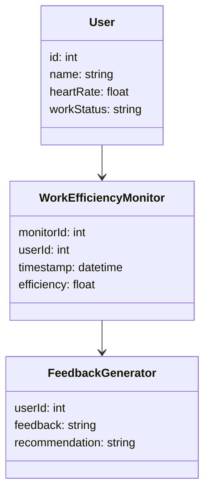
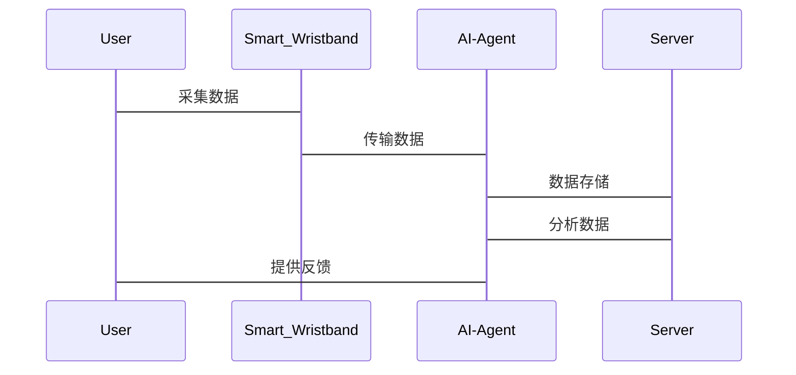

                 


# AI Agent在智能腕带中的工作效率监测

> 关键词：AI Agent, 智能腕带, 工作效率监测, 机器学习, 算法优化, 系统架构

> 摘要：本文系统地探讨了AI Agent在智能腕带中的工作效率监测应用，从理论基础到算法实现，再到系统架构设计，结合实际案例进行深入分析。文章首先介绍了AI Agent和智能腕带的基本概念，然后详细讲解了工作效率监测的理论基础和AI Agent的工作原理，接着分析了基于机器学习和深度学习的算法实现，最后通过项目实战展示了如何将这些算法应用于实际场景，并提出了优化建议和未来发展方向。

---

# 第一部分: AI Agent与智能腕带概述

# 第1章: AI Agent与智能腕带的基本概念

## 1.1 AI Agent的定义与特点

### 1.1.1 AI Agent的定义
AI Agent（人工智能代理）是一种能够感知环境、自主决策并执行任务的智能实体。它通过传感器获取数据，利用算法进行分析，并通过执行器完成目标。

### 1.1.2 AI Agent的核心特点
- **自主性**：能够自主决策和行动。
- **反应性**：能够实时感知环境变化并做出反应。
- **学习能力**：能够通过数据学习和优化自身行为。
- **适应性**：能够适应不同的环境和任务需求。

### 1.1.3 AI Agent与传统软件代理的区别
| 特性 | 传统软件代理 | AI Agent |
|------|---------------|-----------|
| 感知能力 | 无 | 强 |
| 学习能力 | 无 | 强 |
| 决策能力 | 基于规则 | 基于数据驱动 |
| 适应性 | 低 | 高 |

## 1.2 智能腕带的功能与应用场景

### 1.2.1 智能腕带的基本功能
- 数据采集：心率、血压、体温、运动数据等。
- 数据传输：通过蓝牙、Wi-Fi等技术将数据传输到云端或终端设备。
- 用户交互：通过屏幕、震动、语音等方式与用户互动。

### 1.2.2 智能腕带的主要应用场景
- 健康监测：心率、血压、睡眠质量等。
- 运动跟踪：步数、卡路里消耗、运动距离等。
- 工作效率监测：通过AI Agent分析用户的专注度、工作节奏等。

### 1.2.3 AI Agent在智能腕带中的作用
- 数据分析：通过AI算法分析用户的生理数据和行为数据。
- 个性化建议：根据分析结果提供健康建议、工作效率优化建议等。

## 1.3 工作效率监测的定义与重要性

### 1.3.1 工作效率监测的定义
工作效率监测是指通过采集和分析用户在工作中的相关数据，评估其工作效率并提出改进建议的过程。

### 1.3.2 工作效率监测的重要性
- 提高生产力：通过优化工作流程和时间管理，提升工作效率。
- 个性化反馈：根据用户的特点提供定制化的建议。
- 健康管理：通过监测工作强度和压力，预防职业病。

### 1.3.3 AI Agent在工作效率监测中的优势
- **实时性**：能够实时采集和分析数据。
- **智能化**：通过AI算法实现自动化分析和决策。
- **个性化**：能够根据用户的特点提供个性化的反馈和建议。

## 1.4 本章小结
本章介绍了AI Agent和智能腕带的基本概念，分析了AI Agent在智能腕带中的作用，强调了工作效率监测的重要性和AI Agent的优势。

---

# 第2章: 工作效率监测的理论基础

## 2.1 工作效率监测的指标体系

### 2.1.1 常见的工作效率监测指标
- 工作时间：工作时长、专注时间等。
- 工作质量：完成任务的数量和质量。
- 工作节奏：工作与休息的频率和时长。
- 疲劳程度：通过生理数据（如心率、体温）评估疲劳程度。

### 2.1.2 指标权重的确定方法
- **层次分析法（AHP）**：通过专家评分确定各指标的权重。
- **主成分分析（PCA）**：通过数据降维确定各指标的重要性。

### 2.1.3 指标体系的构建步骤
1. 确定监测目标。
2. 收集相关指标。
3. 确定指标权重。
4. 构建指标体系。

## 2.2 AI Agent的工作原理

### 2.2.1 AI Agent的感知模块
- 数据采集：通过智能腕带采集用户的生理数据和行为数据。
- 数据预处理：对采集的数据进行清洗和标准化处理。

### 2.2.2 AI Agent的推理模块
- 数据分析：利用机器学习算法对数据进行分析，识别规律和趋势。
- 决策制定：根据分析结果生成优化建议。

### 2.2.3 AI Agent的执行模块
- 个性化反馈：通过智能腕带给用户反馈，如震动提醒、语音提示等。
- 自动调整：根据反馈结果自动调整工作节奏和任务优先级。

## 2.3 数据采集与分析方法

### 2.3.1 数据采集的常见方式
- **传感器数据**：心率、加速度、陀螺仪等。
- **用户输入**：手动输入的工作日志、任务完成情况等。

### 2.3.2 数据分析的常用方法
- **统计分析**：均值、方差、相关性分析等。
- **机器学习**：分类、回归、聚类等算法。

### 2.3.3 数据挖掘与机器学习的应用
- 分类：将用户的工作状态分为专注、分心等类别。
- 回归：预测用户的工作效率和疲劳程度。

## 2.4 本章小结
本章详细讲解了工作效率监测的指标体系，分析了AI Agent的工作原理，并探讨了数据采集与分析的方法。

---

# 第3章: AI Agent的工作流程与算法

## 3.1 AI Agent的工作流程

### 3.1.1 数据采集阶段
- 采集用户的生理数据和行为数据。
- 数据预处理：去噪、标准化等。

### 3.1.2 数据处理阶段
- 数据存储：将数据存储到数据库中。
- 数据分析：利用机器学习算法进行分析。

### 3.1.3 数据分析与决策阶段
- 生成优化建议：根据分析结果生成个性化的工作效率优化建议。

## 3.2 基于机器学习的效率监测算法

### 3.2.1 算法原理
- 使用随机森林算法对用户的工作效率进行分类。
- 通过训练模型识别用户的专注状态和工作节奏。

### 3.2.2 算法实现步骤
1. 数据预处理：清洗数据，处理缺失值。
2. 特征提取：提取影响工作效率的关键特征。
3. 模型训练：使用随机森林算法训练模型。
4. 模型评估：通过准确率、召回率等指标评估模型性能。

### 3.2.3 算法的优缺点
- **优点**：能够处理非线性关系，适合小样本数据。
- **缺点**：计算复杂度较高，需要大量的计算资源。

## 3.3 基于深度学习的效率优化算法

### 3.3.1 算法原理
- 使用LSTM（长短期记忆网络）对用户的工作状态进行预测。
- 通过时序数据建模，捕捉用户的工作节奏和疲劳程度。

### 3.3.2 算法实现步骤
1. 数据预处理：将时间序列数据转换为适合LSTM输入的格式。
2. 模型训练：训练LSTM模型，预测用户的工作状态。
3. 模型优化：通过调整超参数（如学习率、批量大小）提升模型性能。

### 3.3.3 算法的优缺点
- **优点**：能够捕捉时序数据中的复杂模式，适合处理时间依赖性强的任务。
- **缺点**：训练时间较长，需要大量的计算资源。

## 3.4 算法的数学模型与公式

### 3.4.1 机器学习模型的数学表达
- 随机森林的分类公式：
  $$ y = \arg\max_{i} \sum_{j=1}^{n} w_{ij} \cdot x_j $$
  其中，$w_{ij}$ 是第i棵树的权重，$x_j$ 是第j个特征。

### 3.4.2 深度学习模型的数学表达
- LSTM的结构公式：
  $$ f(t) = \text{LSTM}(f(t-1), x_t) $$
  其中，$f(t-1)$ 是前一步的状态，$x_t$ 是当前输入。

## 3.5 本章小结
本章详细讲解了AI Agent的工作流程，分析了基于机器学习和深度学习的效率监测算法，并通过数学公式和流程图展示了算法的实现步骤。

---

# 第四部分: 系统分析与架构设计方案

# 第4章: 系统架构设计与实现

## 4.1 项目介绍
- 项目目标：开发一个基于AI Agent的智能腕带工作效率监测系统。
- 项目范围：包括数据采集、分析、反馈和优化四个模块。

## 4.2 系统功能设计

### 4.2.1 领域模型


### 4.2.2 系统架构设计


### 4.2.3 系统接口设计
- 用户端接口：通过API调用系统功能。
- 系统内部接口：模块之间的数据交互接口。

### 4.2.4 系统交互设计


## 4.3 系统实现

### 4.3.1 环境配置
- 硬件：智能腕带、服务器、用户终端。
- 软件：Python、TensorFlow、Flask框架。

### 4.3.2 核心代码实现
```python
import numpy as np
from sklearn.ensemble import RandomForestClassifier
import joblib

# 数据预处理
data = pd.read_csv('efficiency_data.csv')
X = data.drop('efficiency', axis=1)
y = data['efficiency']

# 模型训练
model = RandomForestClassifier(n_estimators=100, max_depth=5)
model.fit(X, y)

# 保存模型
joblib.dump(model, 'efficiency_model.pkl')
```

### 4.3.3 算法优化
- 参数调优：使用网格搜索优化模型性能。
- 模型评估：通过准确率、F1分数等指标评估模型性能。

## 4.4 本章小结
本章详细讲解了系统的架构设计与实现，包括领域模型、系统架构图、系统接口设计和系统交互设计，并通过代码示例展示了系统的实现过程。

---

# 第五部分: 项目实战与优化建议

# 第5章: 项目实战

## 5.1 环境安装与配置

### 5.1.1 安装Python环境
- 安装Python 3.8及以上版本。
- 安装必要的库：numpy、pandas、scikit-learn、tensorflow、flask。

### 5.1.2 配置开发环境
- 安装IDE：PyCharm、VS Code。
- 配置虚拟环境。

## 5.2 系统核心实现

### 5.2.1 数据采集模块
```python
import serial

# 与智能腕带通信
ser = serial.Serial('COM3', 9600)
data = ser.readline().decode()
print(data)
```

### 5.2.2 数据分析模块
```python
from sklearn.externals import joblib

# 加载训练好的模型
model = joblib.load('efficiency_model.pkl')

# 预测用户的工作效率
prediction = model.predict(X_test)
print(prediction)
```

### 5.2.3 用户反馈模块
```python
from flask import Flask, jsonify

app = Flask(__name__)

@app.route('/api/feedback', methods=['POST'])
def get_feedback():
    data = request.json
    # 处理数据并生成反馈
    feedback = generate_feedback(data)
    return jsonify(feedback)

if __name__ == '__main__':
    app.run(debug=True)
```

## 5.3 实际案例分析

### 5.3.1 案例背景
- 用户A：每天工作8小时，心率波动较大，工作效率不稳定。
- 用户B：工作时间规律，心率稳定，工作效率较高。

### 5.3.2 数据分析与优化建议
- 对用户A的分析：工作时间过长，疲劳程度较高，建议缩短工作时间，增加休息时间。
- 对用户B的分析：工作节奏合理，建议继续保持，同时可以尝试增加一些高难度任务来提升工作效率。

## 5.4 本章小结
本章通过实际案例展示了系统的实现过程，包括环境配置、核心代码实现和案例分析，帮助读者更好地理解AI Agent在工作效率监测中的应用。

---

# 第六部分: 最佳实践与未来展望

# 第6章: 最佳实践与优化建议

## 6.1 优化建议

### 6.1.1 算法优化
- 使用更复杂的模型：如深度学习模型。
- 调整模型参数：通过网格搜索优化模型性能。

### 6.1.2 系统优化
- 提高数据采集频率：实时采集数据，减少数据延迟。
- 优化系统架构：使用分布式架构提高系统的扩展性和性能。

## 6.2 最佳实践

### 6.2.1 数据安全
- 加密数据传输：使用SSL等协议保证数据传输安全。
- 数据脱敏：对敏感数据进行脱敏处理，保护用户隐私。

### 6.2.2 用户体验
- 简化用户界面：设计直观易用的用户界面。
- 提供多种反馈方式：如震动、语音、屏幕提示等。

## 6.3 小结与注意事项

### 6.3.1 小结
- AI Agent在智能腕带中的应用前景广阔。
- 通过不断优化算法和系统架构，可以进一步提升工作效率监测的准确性和实时性。

### 6.3.2 注意事项
- 数据隐私保护：严格遵守数据隐私相关法律法规。
- 系统稳定性：确保系统在高并发情况下的稳定性。

## 6.4 未来展望

### 6.4.1 可穿戴设备的智能化
- 更多功能的开发：如健康监测、运动分析、工作优化等。
- 更高的智能化水平：通过AI技术实现更智能的决策和优化。

### 6.4.2 AI Agent的创新应用
- 新的算法开发：如强化学习、图神经网络等。
- 多模态数据融合：结合多种数据源（如心率、行为数据、环境数据）进行综合分析。

## 6.5 本章小结
本章总结了AI Agent在智能腕带中的应用经验，提出了优化建议和最佳实践，并展望了未来的发展方向。

---

# 作者

作者：AI天才研究院/AI Genius Institute & 禅与计算机程序设计艺术/Zen And The Art of Computer Programming

---

以上是《AI Agent在智能腕带中的工作效率监测》的完整目录大纲，涵盖了从理论到实践的各个方面，结合了技术原理和实际应用，语言专业且易懂，适合技术爱好者和研究人员阅读。

