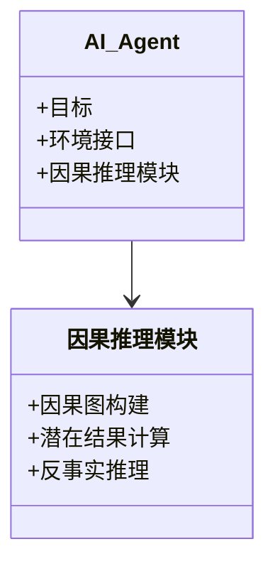
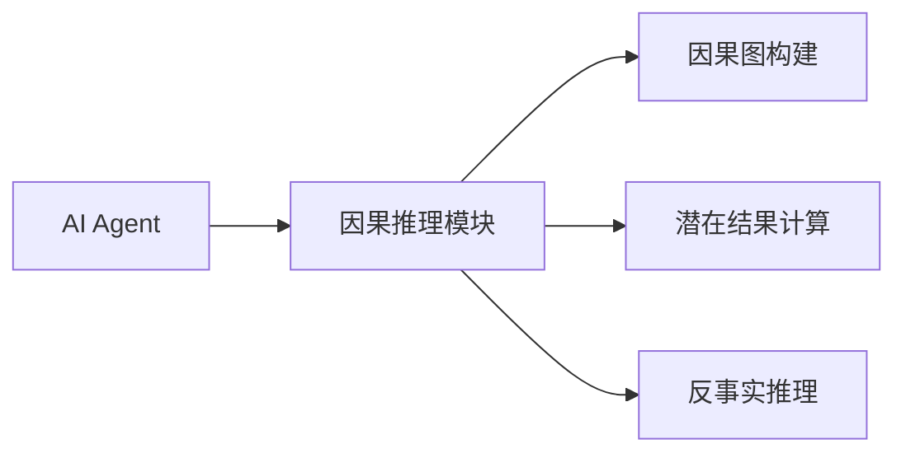
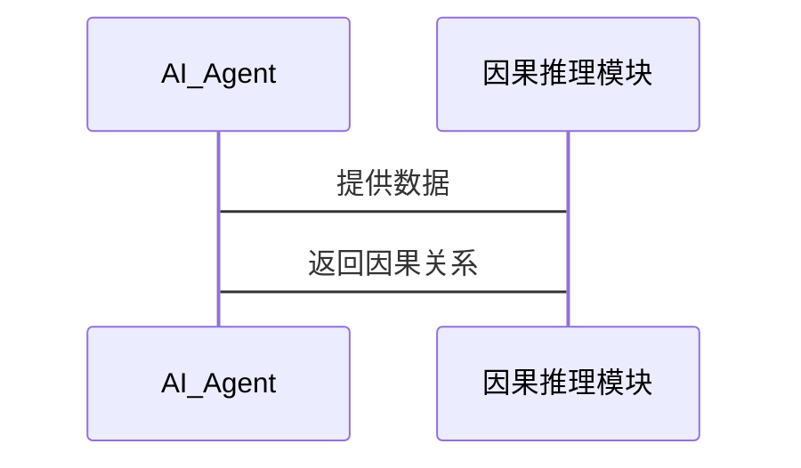

                 


# AI Agent的因果推理能力构建

## 关键词：AI Agent, 因果推理, 潜在结果框架, 因果图, 反事实推理, 系统架构, 项目实战

## 摘要：  
本文详细探讨了AI Agent因果推理能力的构建过程，从基本概念到算法实现，再到系统架构设计，结合实际项目案例，全面解析因果推理的核心原理和应用场景。通过本篇文章，读者将能够理解因果推理的重要性，掌握其算法原理，学习系统设计方法，并通过实战项目巩固所学知识。

---

# 第1章: AI Agent与因果推理概述

## 1.1 AI Agent的基本概念

### 1.1.1 AI Agent的定义
- **定义**：AI Agent是指在计算机系统中，能够感知环境并采取行动以实现目标的智能实体。
- **核心特征**：自主性、反应性、目标导向、社交能力。
- **应用场景**：自动驾驶、智能助手、推荐系统、机器人控制。

### 1.1.2 AI Agent的核心特征
- **自主性**：能够在没有外部干预的情况下运行。
- **反应性**：能够感知环境并实时做出反应。
- **目标导向**：所有行动都以实现特定目标为导向。
- **社交能力**：能够与其他AI Agent或人类进行交互。

### 1.1.3 AI Agent的应用场景
- **自动驾驶**：通过感知环境和决策系统实现智能驾驶。
- **智能助手**：如Siri、Alexa等，能够理解和执行用户的指令。
- **推荐系统**：基于用户行为推荐个性化内容。
- **机器人控制**：工业机器人或服务机器人通过AI Agent进行决策和控制。

## 1.2 因果推理的定义与重要性

### 1.2.1 因果关系的定义
- **因果关系**：指一个事件（原因）导致另一个事件（结果）的发生。
- **相关性与因果关系的区别**：相关性表示变量之间的统计关联，而因果关系表示变量之间的直接作用关系。

### 1.2.2 因果推理在AI Agent中的作用
- **决策能力提升**：通过理解因果关系，AI Agent能够做出更可靠的决策。
- **推理能力增强**：因果推理使AI Agent能够从数据中推导出因果关系，从而更好地理解问题的本质。
- **动态环境适应**：在动态环境中，因果推理帮助AI Agent预测行动的结果，从而做出更灵活的反应。

### 1.2.3 构建因果推理能力的意义
- **提高AI Agent的智能水平**：因果推理是实现更高层次人工智能的核心能力之一。
- **增强系统可靠性**：通过理解因果关系，AI Agent能够更好地预测和控制系统的输出。
- **推动AI技术应用**：因果推理在医疗、金融、教育等领域有广泛的应用潜力。

## 1.3 问题背景与目标

### 1.3.1 当前AI Agent面临的挑战
- **因果关系的复杂性**：因果关系可能涉及多个变量和多层次的相互作用。
- **动态环境的不确定性**：在动态环境中，因果关系可能随时发生变化，增加了推理的难度。
- **数据的稀缺性**：在某些情况下，可用数据不足以支持因果推理。

### 1.3.2 构建因果推理能力的必要性
- **提升决策的准确性**：因果推理能够帮助AI Agent做出更准确的决策。
- **增强系统的适应性**：通过理解因果关系，AI Agent能够更好地适应环境的变化。
- **实现更高级的人工智能**：因果推理是实现通用人工智能（AGI）的重要组成部分。

### 1.3.3 本书的目标与范围
- **目标**：系统地介绍因果推理的基本原理，探讨其在AI Agent中的应用，提供构建因果推理能力的方法和工具。
- **范围**：涵盖因果推理的基本概念、算法原理、系统设计、项目实战以及最佳实践。

## 1.4 本章小结
- 本章介绍了AI Agent的基本概念和因果推理的重要作用，分析了当前AI Agent面临的挑战，并明确了本书的目标和范围。

---

# 第2章: 因果推理的核心概念与联系

## 2.1 因果关系的原理

### 2.1.1 因果关系的定义
- **直接因果关系**：一个变量直接引起另一个变量的变化。
- **间接因果关系**：一个变量通过中间变量引起另一个变量的变化。

### 2.1.2 因果结构的类型
- **线性因果结构**：变量之间的因果关系是线性的。
- **非线性因果结构**：变量之间的因果关系是非线性的。
- **双向因果关系**：两个变量之间可能存在相互影响的因果关系。

### 2.1.3 因果推理的基本原则
- **独立性原则**：原因变量与其他变量独立。
- **干预原则**：通过干预一个变量来观察其对其他变量的影响。
- **可识别性原则**：因果关系可以通过观察数据或干预实验来识别。

## 2.2 因果推理与相关概念的对比

### 2.2.1 因果推理与相关性
- **相关性**：表示两个变量之间存在统计关联，但不一定存在因果关系。
- **区别**：相关性是观察数据的关联，而因果关系是变量之间的直接影响。

### 2.2.2 因果推理与预测
- **预测**：基于数据模式预测未来结果。
- **区别**：预测关注结果的可能值，而因果推理关注行动对结果的影响。

### 2.2.3 因果推理与反事实推理
- **反事实推理**：通过假设相反的事实来推断因果关系。
- **区别**：反事实推理是因果推理的一种方法，而因果推理是更广泛的概念。

## 2.3 因果关系图的构建

### 2.3.1 因果图的基本结构
- **有向图**：节点代表变量，有向边表示因果关系。
- **无向图**：节点代表变量，无向边表示相关关系。

### 2.3.2 贝叶斯网络与因果图的关系
- **贝叶斯网络**：一种基于概率的图形化模型，可以表示变量之间的依赖关系。
- **因果图**：一种基于因果关系的图形化模型，可以表示变量之间的因果关系。

### 2.3.3 使用Mermaid绘制因果关系图


## 2.4 本章小结
- 本章介绍了因果关系的基本概念，探讨了因果推理与相关概念的区别，并通过Mermaid图展示了因果关系图的构建方法。

---

# 第3章: 因果推理算法原理与实现

## 3.1 潜在结果框架

### 3.1.1 潜在结果的定义
- **潜在结果**：在给定干预下，每个单位可能的结果。
- **个体化处理**：针对每个单位的干预。
- **平均处理效应**：所有单位的潜在结果的平均值。

### 3.1.2 潜在结果的计算
- **反事实推理**：通过假设相反的事实来计算潜在结果。
- **公式**：
  - 潜在结果：$Y_i^{t}$ 表示在处理 $t$ 下单位 $i$ 的结果。
  - 平均处理效应：$\text{ATE} = \mathbb{E}[Y_i^{t} - Y_i^{t'}]$。

### 3.1.3 潜在结果框架的应用
- **因果识别**：通过潜在结果框架识别因果关系。
- **因果推断**：通过潜在结果框架推断因果效应。

## 3.2 因果图结构学习

### 3.2.1 因果图结构学习的原理
- **基于贝叶斯网络的结构学习**：通过贝叶斯网络的结构学习算法构建因果图。
- **基于最大似然估计的结构学习**：通过最大似然估计方法构建因果图。

### 3.2.2 因果图结构学习的实现
- **算法步骤**：
  1. 收集数据。
  2. 计算变量之间的依赖关系。
  3. 构建因果图的有向边。
  4. 验证和调整因果图。

### 3.2.3 使用Mermaid绘制因果图


## 3.3 反事实推理

### 3.3.1 反事实推理的原理
- **反事实推理**：通过假设相反的事实来推断因果关系。
- **公式**：
  - 反事实期望：$\mathbb{E}[Y | do(X=x)]$。

### 3.3.2 反事实推理的实现
- **算法步骤**：
  1. 构建因果图。
  2. 识别反事实路径。
  3. 计算反事实期望。

### 3.3.3 反事实推理的应用
- **因果推断**：通过反事实推理推断因果效应。
- **政策评估**：通过反事实推理评估政策的效果。

## 3.4 本章小结
- 本章介绍了因果推理算法的基本原理，包括潜在结果框架、因果图结构学习和反事实推理，并通过Mermaid图展示了因果图的构建方法。

---

# 第4章: 因果推理的数学模型与公式

## 4.1 因果关系的数学表达

### 4.1.1 因果关系的数学定义
- **因果关系**：$X \rightarrow Y$ 表示 $X$ 是 $Y$ 的原因。
- **数学表达式**：$Y = f(X) + \epsilon$，其中 $\epsilon$ 是误差项。

### 4.1.2 因果关系的数学性质
- **可传递性**：如果 $X \rightarrow Y$ 且 $Y \rightarrow Z$，则 $X \rightarrow Z$。
- **可分解性**：因果关系可以通过分解变量来表示。

## 4.2 潜在结果的数学模型

### 4.2.1 潜在结果的定义
- **个体处理效应**：$Y_i^{t} - Y_i^{t'}$。
- **平均处理效应**：$\text{ATE} = \mathbb{E}[Y_i^{t} - Y_i^{t'}]$。

### 4.2.2 潜在结果的计算
- **公式**：
  - 潜在结果：$Y_i^{t} = \beta t_i + \epsilon_i$。
  - 平均处理效应：$\text{ATE} = \beta$。

## 4.3 反事实推理的数学模型

### 4.3.1 反事实推理的定义
- **反事实期望**：$\mathbb{E}[Y | do(X=x)]$。
- **公式**：
  - 反事实期望：$\mathbb{E}[Y | X=x] = \beta x + \gamma$。

### 4.3.2 反事实推理的实现
- **步骤**：
  1. 构建因果图。
  2. 识别反事实路径。
  3. 计算反事实期望。

## 4.4 本章小结
- 本章介绍了因果关系的数学表达，潜在结果的数学模型和反事实推理的数学公式。

---

# 第5章: 因果推理系统的分析与架构设计

## 5.1 问题场景介绍

### 5.1.1 问题背景
- **动态环境**：因果关系可能随时变化。
- **数据稀疏性**：数据可能不足以支持因果推理。

### 5.1.2 问题描述
- **目标**：构建一个能够进行因果推理的AI Agent系统。
- **约束条件**：系统必须能够在动态环境中运行，并且能够处理数据稀疏性问题。

## 5.2 系统功能设计

### 5.2.1 领域模型
- **领域模型**：通过Mermaid类图展示系统中的各个组件及其关系。



### 5.2.2 系统架构
- **系统架构**：通过Mermaid架构图展示系统的整体架构。



### 5.2.3 接口设计
- **输入接口**：接收外部输入的数据。
- **输出接口**：输出因果推理的结果。

### 5.2.4 交互流程
- **流程图**：通过Mermaid序列图展示系统的交互流程。



## 5.3 本章小结
- 本章介绍了因果推理系统的分析与架构设计，包括问题场景的描述、系统功能设计和系统架构设计。

---

# 第6章: 项目实战——基于因果推理的AI Agent实现

## 6.1 环境安装

### 6.1.1 Python环境安装
- **安装Python**：确保系统上安装了Python 3.x。
- **安装依赖库**：安装所需的依赖库，如`numpy`, `pandas`, `graphviz`, `sklearn`等。

### 6.1.2 开发工具配置
- **代码编辑器**：配置PyCharm或VS Code。
- **版本控制工具**：配置Git。

## 6.2 核心代码实现

### 6.2.1 因果图构建
- **代码实现**：使用`networkx`库构建因果图。

```python
import networkx as nx
G = nx.DiGraph()
G.add_edges_from([('X', 'Y'), ('X', 'Z'), ('Z', 'Y')])
```

### 6.2.2 潜在结果计算
- **代码实现**：使用`sklearn`库进行潜在结果计算。

```python
from sklearn import linear_model
import numpy as np
X = np.array([[1, 2], [3, 4], [5, 6]])
Y = np.array([7, 8, 9])
model = linear_model.LinearRegression()
model.fit(X, Y)
potential_outcome = model.predict(X)
```

### 6.2.3 反事实推理
- **代码实现**：使用`graphviz`库进行反事实推理。

```python
from graphviz import Digraph
dot = Digraph()
dot.edge('X', 'Y')
dot.edge('X', 'Z')
dot.edge('Z', 'Y')
dot.view()
```

## 6.3 代码解读与分析

### 6.3.1 因果图构建代码解读
- **代码功能**：使用`networkx`库构建因果图。
- **关键代码**：
  ```python
  G.add_edges_from([('X', 'Y'), ('X', 'Z'), ('Z', 'Y')])
  ```

### 6.3.2 潜在结果计算代码解读
- **代码功能**：使用`sklearn`库进行潜在结果计算。
- **关键代码**：
  ```python
  model = linear_model.LinearRegression()
  model.fit(X, Y)
  potential_outcome = model.predict(X)
  ```

### 6.3.3 反事实推理代码解读
- **代码功能**：使用`graphviz`库进行反事实推理。
- **关键代码**：
  ```python
  dot = Digraph()
  dot.edge('X', 'Y')
  dot.edge('X', 'Z')
  dot.edge('Z', 'Y')
  dot.view()
  ```

## 6.4 实际案例分析与详细讲解

### 6.4.1 案例背景
- **案例名称**：假设我们有一个简单的因果关系模型，其中变量X影响变量Z，变量Z影响变量Y。

### 6.4.2 案例分析
- **因果图**：构建因果图，展示变量之间的因果关系。
- **潜在结果计算**：计算在不同处理下的潜在结果。
- **反事实推理**：通过反事实推理推断因果效应。

## 6.5 项目小结
- 本章通过实际项目展示了因果推理在AI Agent中的应用，包括环境安装、核心代码实现、代码解读与分析，以及实际案例分析。

---

# 第7章: 总结与展望

## 7.1 最佳实践 Tips

### 7.1.1 数据质量的重要性
- **数据质量**：因果推理的结果依赖于数据的质量，数据的质量越高，因果推理的结果越准确。
- **数据完整性**：确保数据的完整性，避免数据缺失。

### 7.1.2 模型选择的注意事项
- **模型选择**：选择合适的模型进行因果推理，不同的模型适用于不同的场景。
- **模型评估**：通过交叉验证等方法评估模型的性能。

## 7.2 小结

### 7.2.1 核心内容回顾
- **因果推理的基本概念**：因果关系、因果图、潜在结果框架、反事实推理。
- **算法原理**：潜在结果框架、因果图结构学习、反事实推理。
- **系统架构设计**：问题场景分析、系统功能设计、系统架构设计、系统接口设计、系统交互流程设计。

## 7.3 注意事项

### 7.3.1 数据隐私与安全
- **数据隐私**：在处理敏感数据时，需要注意数据隐私问题。
- **数据安全**：确保数据的安全性，防止数据泄露。

### 7.3.2 模型的可解释性
- **模型的可解释性**：因果推理模型需要具有较高的可解释性，以便理解和验证结果。
- **模型的透明性**：模型的决策过程需要透明，以便进行审查和验证。

## 7.4 拓展阅读

### 7.4.1 推荐书籍
- **《因果的科学革命》**：J. Pearl 著。
- **《贝叶斯网络与因果推理》**：D. Rubin 著。

### 7.4.2 推荐论文
- **“ causal inference in statistics”**：J. Pearl 著。
- **“ Bayesian networks for causal reasoning”**：D. Heckerman 著。

## 7.5 本章小结
- 本章总结了全文的核心内容，提出了最佳实践的建议，并展望了未来的研究方向。

---

# 作者：AI天才研究院/AI Genius Institute & 禅与计算机程序设计艺术 /Zen And The Art of Computer Programming

---

以上是关于“AI Agent的因果推理能力构建”的完整目录大纲和文章内容。希望对您有所帮助！

