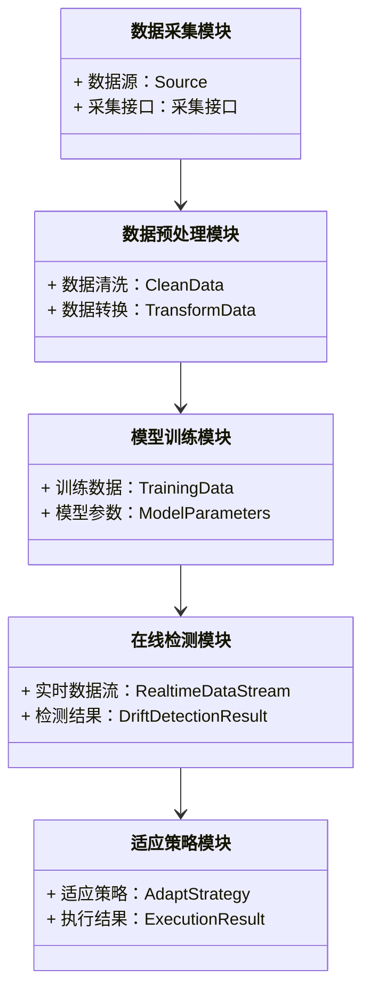
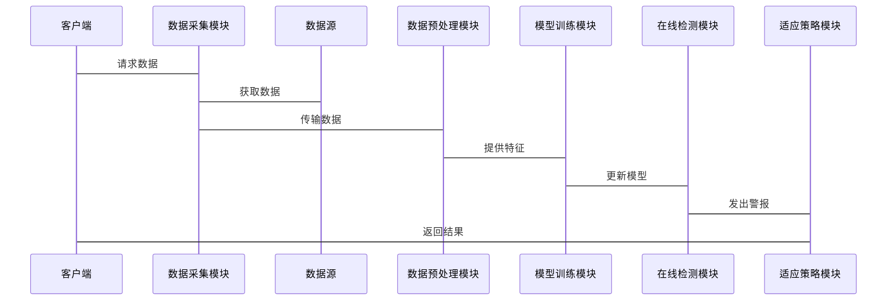

                 


# AI Agent的概念漂移检测与适应

> 关键词：AI Agent, 概念漂移, 检测算法, 系统架构, 实战案例

> 摘要：本文深入探讨了AI Agent在动态数据环境中的概念漂移检测与适应问题，结合理论分析、算法实现和系统设计，系统地介绍了概念漂移的定义、检测方法、适应策略以及实际应用案例。通过详细的技术分析和代码实现，帮助读者全面理解并掌握AI Agent的概念漂移检测与适应技术。

---

# 第1章: 概念漂移与AI Agent概述

## 1.1 概念漂移的定义与类型

### 1.1.1 什么是概念漂移

概念漂移（Concept Drift）是指数据分布的变化，导致模型的性能下降。这种变化可能影响AI Agent的预测能力，使其无法准确适应新的数据环境。概念漂移可以分为**渐进式漂移**（Gradual Drift）、**突然式漂移**（Sudden Drift）和**回归式漂移**（Recurrent Drift）三种类型。

- **渐进式漂移**：数据分布的变化是缓慢而持续的，例如用户偏好逐渐变化。
- **突然式漂移**：数据分布突然发生重大变化，例如市场突发事件导致的用户行为骤变。
- **回归式漂移**：数据分布回到早期状态，例如季节性变化。

### 1.1.2 概念漂移的类型

概念漂移可以基于数据分布的变化方式分为以下几类：

| 类型            | 描述                                      | 示例场景                     |
|-----------------|------------------------------------------|------------------------------|
| 标量漂移（Real-Drift） | 数据分布的统计特征变化，如均值、方差的变化 | 用户购买行为的变化          |
| 分布漂移（Distribution-Drift） | 数据整体分布的变化，如类别比例的变化 | 市场推广活动的影响           |
| 类别漂移（Class-Drift）   | 数据类别之间的关系变化               | 竞争对手策略调整的影响       |

### 1.1.3 概念漂移的特征

概念漂移的特征可以通过以下几个方面进行描述：

1. **数据分布的变化**：数据的概率分布发生变化，影响模型的泛化能力。
2. **时间相关性**：概念漂移通常与时间相关，数据分布的变化具有时间序列特征。
3. **渐进性或突然性**：概念漂移可能是渐进的，也可能是突然的，取决于数据变化的速度和幅度。

---

## 1.2 AI Agent的基本概念

### 1.2.1 什么是AI Agent

AI Agent（人工智能代理）是一种能够感知环境、自主决策并执行任务的智能体。AI Agent可以是软件程序、机器人或其他智能系统，其核心目标是通过感知和行动来优化目标函数。

AI Agent的特点包括：

- **自主性**：能够在没有外部干预的情况下自主运行。
- **反应性**：能够实时感知环境并做出反应。
- **目标导向**：具有明确的目标，并通过行为来实现目标。
- **学习能力**：能够通过经验改进性能。

### 1.2.2 AI Agent的核心功能

AI Agent的核心功能可以概括为以下几点：

1. **感知环境**：通过传感器或其他数据源获取环境信息。
2. **决策与规划**：基于感知信息，通过算法做出决策或规划行动。
3. **执行行动**：根据决策结果执行相应的操作。
4. **学习与适应**：通过学习算法优化自身性能，适应环境变化。

### 1.2.3 AI Agent的应用场景

AI Agent广泛应用于多个领域，包括：

- **推荐系统**：根据用户行为推荐商品或内容。
- **自动化交易**：在金融市场上自动进行买卖决策。
- **智能客服**：通过自然语言处理技术为用户提供支持。
- **自动驾驶**：通过实时感知和决策实现自动驾驶。

---

## 1.3 概念漂移与AI Agent的关联

### 1.3.1 概念漂移对AI Agent的影响

概念漂移对AI Agent的影响主要体现在以下几个方面：

1. **模型性能下降**：数据分布的变化可能导致模型预测能力下降。
2. **决策错误增加**：概念漂移可能导致AI Agent做出错误的决策。
3. **系统适应性不足**：如果AI Agent无法检测并适应概念漂移，可能导致系统崩溃或性能严重下降。

### 1.3.2 AI Agent如何应对概念漂移

AI Agent可以通过以下几种方式应对概念漂移：

1. **在线检测**：实时监控数据分布的变化，及时发现概念漂移。
2. **增量学习**：在检测到概念漂移后，通过增量学习更新模型。
3. **模型切换**：在极端情况下，切换到新的模型以应对概念漂移。

### 1.3.3 概念漂移检测的重要性

概念漂移检测是AI Agent实现动态适应的关键技术，其重要性体现在以下几个方面：

1. **及时发现变化**：通过检测概念漂移，AI Agent可以及时适应环境变化。
2. **优化模型性能**：通过概念漂移检测，可以避免模型性能的持续下降。
3. **提高系统可靠性**：通过检测和适应概念漂移，可以提高AI Agent的可靠性和稳定性。

---

## 1.4 本章小结

本章主要介绍了概念漂移的定义、类型及其对AI Agent的影响。通过分析概念漂移的特征，我们理解了其对AI Agent性能的影响。同时，我们探讨了AI Agent如何通过检测和适应概念漂移来提高自身的适应能力。这些内容为后续章节的深入分析奠定了基础。

---

# 第2章: 概念漂移检测的核心概念

## 2.1 概念漂移检测的原理

### 2.1.1 数据分布变化的数学模型

概念漂移检测的核心是发现数据分布的变化。我们可以从统计学和概率论的角度出发，建立数据分布变化的数学模型。

1. **统计检验方法**：通过假设检验的方法，检测数据分布的变化。
2. **距离度量方法**：通过计算数据分布之间的距离，判断是否发生概念漂移。
3. **概率密度估计方法**：通过估计数据的概率密度函数，发现分布的变化。

### 2.1.2 概念漂移检测的指标

在概念漂移检测中，我们需要定义一些指标来衡量数据分布的变化程度。常用的指标包括：

1. **KL散度（Kullback-Leibler Divergence）**：衡量两个概率分布之间的差异。
2. **Jensen-Shannon散度**：对称的散度指标，用于衡量两个概率分布的相似性。
3. **马氏距离（Mahalanobis Distance）**：衡量多维数据分布的差异。

### 2.1.3 概念漂移检测的边界与外延

概念漂移检测的边界和外延需要根据具体的业务场景来确定。例如，在金融领域，我们需要敏感地检测概念漂移，以避免重大损失；而在推荐系统中，可以容忍一定的数据变化。

---

## 2.2 概念漂移检测的核心要素

### 2.2.1 数据特征

数据特征是概念漂移检测的基础。我们需要选择合适的特征来表示数据，并通过这些特征的变化来判断是否发生概念漂移。

1. **数值型特征**：如用户的行为数据、交易金额等。
2. **类别型特征**：如用户类型、产品类别等。
3. **文本型特征**：如用户评论、文本内容等。

### 2.2.2 时间序列分析

概念漂移通常与时间相关，因此时间序列分析是概念漂移检测的重要手段。

1. **滑动窗口技术**：通过比较当前窗口和历史窗口的数据分布，发现变化。
2. **趋势分析**：通过时间序列的趋势分析，预测和发现数据分布的变化。

### 2.2.3 统计方法

统计方法是概念漂移检测的核心方法之一。常用的统计方法包括：

1. **Z-检验**：用于检验样本均值与总体均值的差异。
2. **卡方检验**：用于检验分类变量的分布差异。
3. **t-检验**：用于检验两个样本均值的差异。

---

## 2.3 概念漂移检测与AI Agent的结合

### 2.3.1 检测机制

AI Agent可以通过以下机制实现概念漂移检测：

1. **实时监控**：通过实时采集数据，定期进行分布变化检测。
2. **阈值设定**：设定阈值，当数据分布的变化超过阈值时触发警报。
3. **自适应检测**：根据历史数据动态调整检测阈值。

### 2.3.2 适应策略

在检测到概念漂移后，AI Agent需要采取相应的适应策略：

1. **模型更新**：通过重新训练模型或微调模型，适应新的数据分布。
2. **规则调整**：根据新的数据分布调整决策规则。
3. **行为优化**：通过优化行动策略，提高系统适应能力。

### 2.3.3 检测频率与粒度

概念漂移检测的频率和粒度需要根据业务需求进行调整：

1. **实时检测**：适用于需要快速响应的场景。
2. **定期检测**：适用于对实时性要求不高的场景。
3. **自适应检测**：根据数据变化自动调整检测频率。

---

## 2.4 本章小结

本章详细介绍了概念漂移检测的核心概念，包括检测原理、核心要素以及与AI Agent的结合。通过分析数据特征、时间序列分析和统计方法，我们理解了概念漂移检测的实现机制。同时，我们探讨了AI Agent如何通过检测和适应概念漂移来提高自身的适应能力。

---

# 第3章: 概念漂移检测的算法原理

## 3.1 基于统计的方法

### 3.1.1 基于分布的统计方法

基于分布的统计方法通过比较数据分布的变化来检测概念漂移。

1. **Z-检验**：用于检验样本均值与总体均值的差异。
2. **卡方检验**：用于检验分类变量的分布差异。
3. **t-检验**：用于检验两个样本均值的差异。

### 3.1.2 基于距离的统计方法

基于距离的统计方法通过计算数据分布之间的距离来判断是否发生概念漂移。

1. **KL散度**：衡量两个概率分布之间的差异。
2. **Jensen-Shannon散度**：对称的散度指标，用于衡量两个概率分布的相似性。
3. **马氏距离**：衡量多维数据分布的差异。

### 3.1.3 基于密度的统计方法

基于密度的统计方法通过计算数据点的密度变化来检测概念漂移。

1. **Kernel密度估计**：通过核密度估计方法计算数据分布的密度。
2. **局部密度对比**：通过比较局部密度的变化，发现数据分布的变化。

---

## 3.2 基于机器学习的方法

### 3.2.1 基于分类器的漂移检测

基于分类器的漂移检测方法通过训练分类器，利用分类性能的变化来检测概念漂移。

1. **性能监控法**：通过监控分类器的准确率变化，判断是否发生概念漂移。
2. **增量学习法**：在检测到概念漂移后，通过增量学习更新分类器。

### 3.2.2 基于回归模型的漂移检测

基于回归模型的漂移检测方法通过回归模型的预测误差来判断是否发生概念漂移。

1. **残差分析法**：通过分析回归模型的残差，判断数据分布的变化。
2. **模型更新法**：在检测到概念漂移后，通过重新训练回归模型来适应新数据。

### 3.2.3 基于聚类的漂移检测

基于聚类的漂移检测方法通过聚类分析，发现数据分布的变化。

1. **聚类对比法**：通过比较当前聚类结果与历史聚类结果，判断是否发生概念漂移。
2. **动态聚类法**：通过动态调整聚类参数，实现在线概念漂移检测。

---

## 3.3 基于在线检测的方法

### 3.3.1 滑动窗口技术

滑动窗口技术通过维护一个固定大小的滑动窗口，实时监控数据分布的变化。

1. **窗口大小选择**：根据业务需求选择合适的窗口大小。
2. **窗口更新策略**：通过滑动窗口不断更新，实时监控数据分布的变化。

### 3.3.2 增量学习方法

增量学习方法通过在线更新模型，适应数据分布的变化。

1. **在线训练法**：在检测到概念漂移后，通过在线训练更新模型。
2. **模型切换法**：在极端情况下，切换到新的模型以应对概念漂移。

### 3.3.3 自适应检测策略

自适应检测策略通过动态调整检测参数，实现更高效的概念漂移检测。

1. **参数自适应**：根据历史数据动态调整检测参数。
2. **阈值自适应**：根据数据分布的变化动态调整检测阈值。

---

## 3.4 本章小结

本章详细介绍了概念漂移检测的几种主流算法，包括基于统计的方法、基于机器学习的方法和基于在线检测的方法。通过分析这些算法的原理和实现方式，我们理解了如何在实际应用中选择合适的算法来实现概念漂移检测。同时，我们还探讨了这些算法在AI Agent中的应用，为后续章节的系统设计奠定了基础。

---

# 第4章: 概念漂移检测的系统分析与架构设计

## 4.1 问题场景介绍

概念漂移检测的系统设计需要考虑以下几个方面：

1. **数据采集**：如何实时采集和处理数据。
2. **数据预处理**：如何清洗和转换数据，提取特征。
3. **模型训练与部署**：如何训练和部署检测模型。
4. **在线检测与适应**：如何实时监控数据分布的变化，并进行相应的适应。

---

## 4.2 系统功能设计

### 4.2.1 系统功能模块

系统功能模块包括：

1. **数据采集模块**：负责采集实时数据。
2. **数据预处理模块**：负责清洗和转换数据，提取特征。
3. **模型训练模块**：负责训练和部署检测模型。
4. **在线检测模块**：负责实时监控数据分布的变化。
5. **适应策略模块**：负责在检测到概念漂移后，采取相应的适应策略。

### 4.2.2 领域模型类图

以下是领域模型类图的Mermaid图示：



---

### 4.2.3 系统架构设计

以下是系统架构设计的Mermaid图示：


---

## 4.3 系统接口设计

系统接口设计需要考虑以下几个方面：

1. **数据接口**：如何与数据源进行交互。
2. **模型接口**：如何与检测模型进行交互。
3. **用户接口**：如何与用户进行交互。

以下是系统接口设计的Mermaid序列图：



---

## 4.4 本章小结

本章通过系统分析和架构设计，详细介绍了概念漂移检测系统的实现过程。通过领域模型类图和系统架构图，我们理解了系统各模块之间的关系和交互方式。同时，我们还探讨了系统接口设计的实现方式，为后续章节的项目实战奠定了基础。

---

# 第5章: 项目实战：基于AI Agent的概念漂移检测系统

## 5.1 项目背景

在电商领域，用户的行为数据容易受到市场变化、用户偏好变化等因素的影响，导致数据分布的变化。通过概念漂移检测，我们可以及时发现用户行为的变化，调整推荐策略，提高用户满意度。

---

## 5.2 环境配置

### 5.2.1 系统环境

- 操作系统：Linux/Windows/MacOS
- Python版本：3.7及以上
- 开发工具：PyCharm/Jupyter Notebook

### 5.2.2 依赖安装

以下是项目所需的依赖库：

```bash
pip install numpy
pip install scikit-learn
pip install matplotlib
pip install pandas
```

---

## 5.3 系统核心实现

### 5.3.1 数据采集模块

以下是数据采集模块的代码示例：

```python
import pandas as pd
import requests

def fetch_data(api_url):
    response = requests.get(api_url)
    data = response.json()
    return pd.DataFrame(data)
```

### 5.3.2 数据预处理模块

以下是数据预处理模块的代码示例：

```python
import pandas as pd
from sklearn.preprocessing import StandardScaler

def preprocess_data(data):
    # 数据清洗
    data = data.dropna()
    # 数据标准化
    scaler = StandardScaler()
    processed_data = scaler.fit_transform(data)
    return processed_data
```

### 5.3.3 模型训练模块

以下是模型训练模块的代码示例：

```python
from sklearn.svm import OneClassSVM

def train_model(data):
    model = OneClassSVM(gamma='auto')
    model.fit(data)
    return model
```

### 5.3.4 在线检测模块

以下是在线检测模块的代码示例：

```python
import numpy as np

def detect_drift(model, new_data):
    # 预测异常分数
    scores = model.predict_score(new_data)
    # 设置阈值
    threshold = 0.05
    # 判断是否发生漂移
    drift = np.any(scores < threshold)
    return drift
```

### 5.3.5 适应策略模块

以下是适应策略模块的代码示例：

```python
from sklearn.svm import OneClassSVM

def adapt_strategy(model, new_data):
    # 重新训练模型
    new_model = OneClassSVM(gamma='auto')
    new_model.fit(new_data)
    return new_model
```

---

## 5.4 项目运行与结果分析

### 5.4.1 环境配置

按照上述步骤安装所需的依赖库，配置好开发环境。

### 5.4.2 代码实现

将上述代码整合到一个完整的系统中，运行并测试系统功能。

### 5.4.3 结果分析

通过运行系统，观察数据采集、预处理、模型训练、在线检测和适应策略的实现效果，分析系统的性能和准确性。

---

## 5.5 项目总结

通过本项目，我们实现了基于AI Agent的概念漂移检测系统，验证了概念漂移检测算法的可行性和有效性。同时，我们还探讨了系统设计和实现的细节，为实际应用提供了参考。

---

# 第6章: 最佳实践与小结

## 6.1 最佳实践

1. **模型更新频率**：根据业务需求和数据变化频率，合理设置模型更新频率。
2. **数据预处理**：在数据预处理阶段，注意处理异常值和缺失值，确保数据质量。
3. **算法选择**：根据具体场景选择合适的算法，避免过度复杂的模型。
4. **系统监控**：建立完善的系统监控机制，及时发现和处理概念漂移问题。

---

## 6.2 小结

通过本文的深入探讨，我们系统地介绍了AI Agent的概念漂移检测与适应技术，结合理论分析、算法实现和系统设计，帮助读者全面理解并掌握相关技术。希望本文的内容能够为实际应用提供参考和启发。

---

# 作者：AI天才研究院 & 禅与计算机程序设计艺术

---

以上就是《AI Agent的概念漂移检测与适应》的技术博客文章的详细目录和内容概述。希望这篇文章能够帮助读者深入理解AI Agent的概念漂移检测与适应技术，并为实际应用提供参考和启发。

