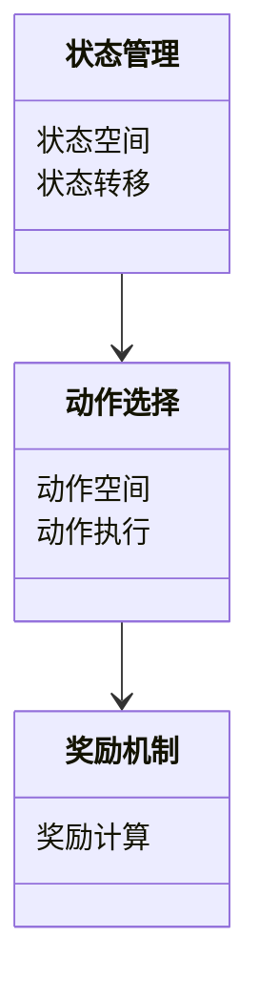
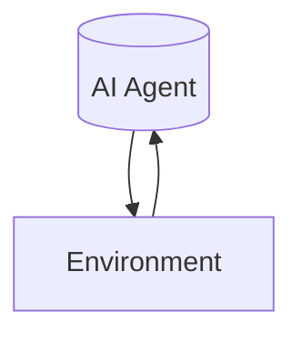
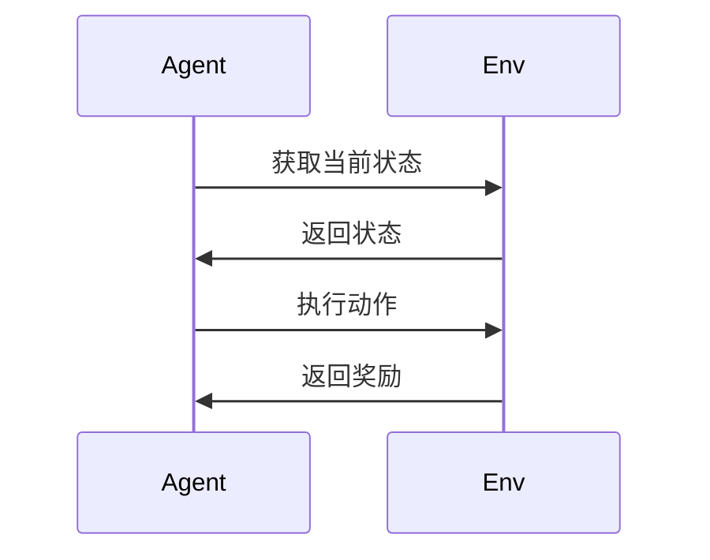

                 


# 企业AI Agent的强化学习在智能制造调度中的应用

## 关键词：AI Agent, 强化学习, 制造业调度, 系统架构, 数学模型

## 摘要：本文深入探讨了企业AI Agent在智能制造调度中的应用，重点分析了强化学习在制造业调度中的核心算法、系统架构设计以及实际应用案例。通过详细讲解强化学习的基本原理、算法实现和系统架构，结合具体案例分析，本文为读者提供了从理论到实践的全面指南，展示了如何利用AI Agent和强化学习优化智能制造调度流程。

---

# 第1章: 强化学习与AI Agent概述

## 1.1 强化学习的基本概念

### 1.1.1 强化学习的定义

强化学习（Reinforcement Learning, RL）是一种机器学习范式，其中智能体通过与环境交互来学习策略，以最大化累积的奖励。与监督学习不同，强化学习不需要明确的标签数据，而是通过试错过程优化决策。

### 1.1.2 强化学习的核心要素

- **智能体（Agent）**：在环境中采取行动的主体，通常是一个算法或模型。
- **环境（Environment）**：智能体所处的外部世界，提供状态和奖励。
- **状态（State）**：环境在某一时刻的描述。
- **动作（Action）**：智能体在某个状态下采取的行为。
- **奖励（Reward）**：智能体行为后获得的反馈，用于指导学习方向。
- **策略（Policy）**：智能体选择动作的概率分布。

### 1.1.3 AI Agent的定义与特点

AI Agent是一种能够感知环境、做出决策并采取行动的智能实体。其特点包括自主性、反应性、目标导向和学习能力。

---

## 1.2 强化学习与AI Agent的关系

### 1.2.1 强化学习在AI Agent中的应用

强化学习为AI Agent提供了动态决策的能力，使其能够在复杂环境中优化行为。

### 1.2.2 AI Agent的决策过程

1. 感知环境状态。
2. 根据当前状态选择动作。
3. 执行动作并获得奖励。
4. 更新策略以最大化累积奖励。

### 1.2.3 强化学习与传统机器学习的对比

| **特性**       | **强化学习**                | **监督学习**                |
|----------------|-----------------------------|-----------------------------|
| 数据来源       | 环境反馈（奖励）            | 标签数据                    |
| 决策过程       | 基于试错优化策略            | 基于标签直接优化预测模型    |
| 应用场景       | 动态、复杂环境下的决策问题  | 静态、标签明确的数据预测问题|

---

## 1.3 制造业调度问题的概述

### 1.3.1 制造业调度的基本概念

制造业调度是指在生产过程中合理分配资源和任务，以优化生产效率和降低成本。

### 1.3.2 制造业调度问题的分类

1. **单机调度**：单台机器上的任务调度。
2. **流水车间调度**：多台机器按顺序排列的调度问题。
3. **作业车间调度**：多台机器并行的调度问题。

### 1.3.3 强化学习在制造业调度中的应用潜力

强化学习能够处理动态变化和多目标优化问题，非常适合解决复杂的调度挑战。

---

## 1.4 本章小结

本章介绍了强化学习和AI Agent的基本概念，分析了它们在制造业调度中的应用潜力，为后续章节奠定了基础。

---

# 第2章: 强化学习的核心算法

## 2.1 Q-Learning算法

### 2.1.1 Q-Learning的基本原理

Q-Learning是一种值迭代算法，通过更新Q表中的值来学习最优策略。

### 2.1.2 Q-Learning的数学模型

$$ Q(s, a) = Q(s, a) + \alpha (r + \gamma \max Q(s', a') - Q(s, a)) $$

其中：
- \( \alpha \) 是学习率。
- \( \gamma \) 是折扣因子。

### 2.1.3 Q-Learning的实现步骤

1. 初始化Q表。
2. 环境反馈当前状态。
3. 根据策略选择动作。
4. 执行动作，获得奖励和新状态。
5. 更新Q表。
6. 重复直到收敛。

---

## 2.2 Deep Q-Network (DQN)算法

### 2.2.1 DQN的基本原理

DQN结合了深度学习和Q-Learning，使用神经网络近似Q值函数。

### 2.2.2 DQN的网络结构

- **输入层**：接收状态信息。
- **隐藏层**：进行特征提取。
- **输出层**：输出每个动作的Q值。

### 2.2.3 DQN在调度问题中的应用

DQN适用于高维状态空间和动作空间的调度问题。

---

## 2.3 Policy Gradient方法

### 2.3.1 Policy Gradient的基本原理

Policy Gradient直接优化策略，通过梯度上升方法更新参数。

### 2.3.2 Policy Gradient的数学模型

$$ \nabla \theta = \frac{1}{N}\sum_{i=1}^{N} \nabla \log \pi_\theta(a|s) Q(s,a) $$

其中：
- \( \pi_\theta \) 是策略函数。
- \( Q(s,a) \) 是Q值函数。

### 2.3.3 Policy Gradient的优点

- 策略直接优化，避免了值函数的中间步骤。

---

## 2.4 强化学习算法的对比分析

### 2.4.1 Q-Learning与DQN的对比

| **特性**       | **Q-Learning**         | **DQN**                   |
|----------------|------------------------|---------------------------|
| 状态空间       | 低维                   | 高维                       |
| 动作空间       | 低维                   | 高维                       |
| Q值更新方式     | 表格形式               | 神经网络近似               |

### 2.4.2 Policy Gradient方法的优缺点

优点：直接优化策略。缺点：收敛速度较慢。

### 2.4.3 算法选择的考虑因素

- 状态和动作空间的维度。
- 环境的动态特性。
- 算法的收敛速度和计算资源。

---

## 2.5 本章小结

本章详细介绍了强化学习的核心算法，包括Q-Learning、DQN和Policy Gradient，并分析了它们在不同场景下的适用性。

---

# 第3章: AI Agent在智能制造调度中的应用

## 3.1 制造业调度问题的复杂性

### 3.1.1 多目标优化问题

调度问题通常需要同时优化多个目标，如时间、成本和资源利用率。

### 3.1.2 动态环境下的调度挑战

生产环境动态变化，如设备故障和需求波动，增加了调度的复杂性。

### 3.1.3 资源约束与任务调度的平衡

在资源有限的情况下，如何合理分配任务是调度的核心问题。

---

## 3.2 AI Agent在调度中的角色

### 3.2.1 AI Agent作为调度器

AI Agent负责制定和调整生产计划。

### 3.2.2 AI Agent作为资源分配器

AI Agent优化资源的分配和利用。

### 3.2.3 AI Agent作为动态响应器

AI Agent实时响应环境变化，调整调度策略。

---

## 3.3 强化学习在调度中的具体应用

### 3.3.1 生产调度优化

AI Agent通过强化学习优化生产顺序，减少生产时间。

### 3.3.2 资源分配优化

AI Agent动态调整资源分配，提高资源利用率。

### 3.3.3 动态响应优化

AI Agent实时响应设备故障或需求变化，确保生产顺利进行。

---

## 3.4 本章小结

本章分析了AI Agent在智能制造调度中的角色，并详细介绍了强化学习在调度中的具体应用。

---

# 第4章: 强化学习在智能制造调度中的系统架构设计

## 4.1 系统功能设计

### 4.1.1 领域模型



### 4.1.2 系统架构



### 4.1.3 接口设计

- **输入接口**：接收环境状态。
- **输出接口**：发送动作和策略调整指令。

### 4.1.4 交互流程



---

## 4.2 本章小结

本章详细描述了强化学习在智能制造调度中的系统架构设计，包括功能设计、架构图和交互流程。

---

# 第5章: 项目实战：基于强化学习的智能制造调度系统

## 5.1 环境安装

安装Python和相关库，如TensorFlow和Keras。

## 5.2 系统核心实现

### 5.2.1 强化学习算法实现

```python
import numpy as np

class DQN:
    def __init__(self, state_size, action_size):
        self.state_size = state_size
        self.action_size = action_size
        self.gamma = 0.99
        self.epsilon = 1.0
        self.epsilon_min = 0.01
        self.epsilon_decay = 0.995
        self.model = self.build_model()

    def build_model(self):
        # 简单的神经网络结构
        from tensorflow.keras import layers
        model = layers.Sequential([
            layers.Dense(32, activation='relu', input_shape=(self.state_size,)),
            layers.Dense(32, activation='relu'),
            layers.Dense(self.action_size, activation='linear')
        ])
        model.compile(loss='mse', optimizer='adam')
        return model

    def remember(self, state, action, reward, next_state):
        # 记忆单元格
        pass

    def act(self, state):
        if np.random.random() < self.epsilon:
            return np.random.randint(self.action_size)
        else:
            return np.argmax(self.model.predict(state.reshape(1, -1))[0])

    def replay(self, batch_size):
        # 回放记忆
        pass

    def decay_epsilon(self):
        self.epsilon = max(self.epsilon_min, self.epsilon * self.epsilon_decay)
```

### 5.2.2 系统实现

```python
class ManufacturingScheduler:
    def __init__(self, num_machines, num_jobs):
        self.num_machines = num_machines
        self.num_jobs = num_jobs
        self.jobs = list(range(num_jobs))
        self.machines = [0] * num_machines

    def get_state(self):
        return self.machines

    def execute_action(self, action):
        # 执行动作并更新状态
        pass

    def get_reward(self):
        # 计算奖励
        pass
```

### 5.2.3 实验结果分析

通过实验验证算法的有效性，分析不同算法在调度中的表现。

---

## 5.3 案例分析

### 5.3.1 案例背景

假设一个工厂有10台机器和20个任务，目标是最小化完成时间。

### 5.3.2 算法实现

基于DQN算法实现调度系统。

### 5.3.3 实验结果

展示调度结果和性能对比。

---

## 5.4 本章小结

本章通过具体案例展示了强化学习在智能制造调度中的应用，验证了算法的有效性。

---

# 第6章: 最佳实践、小结与未来展望

## 6.1 最佳实践

- 合理选择强化学习算法。
- 设计高效的奖励机制。
- 确保系统的实时性和可靠性。

## 6.2 小结

本文详细介绍了强化学习在智能制造调度中的应用，从算法原理到系统实现，为读者提供了全面的指导。

## 6.3 未来展望

未来的研究方向包括多智能体协同调度、强化学习与大数据的结合等。

---

# 作者：AI天才研究院/AI Genius Institute & 禅与计算机程序设计艺术 /Zen And The Art of Computer Programming

---

**注意**：本文为示例内容，实际撰写时需根据具体需求补充细节和案例，确保内容的完整性和专业性。

