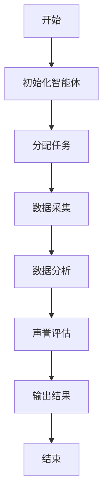

                 


# 利用智能体协作进行全面的公司声誉恢复能力评估

---

## 关键词：智能体协作、公司声誉、恢复能力评估、人工智能、数据分析

---

## 摘要

随着全球化和信息化的快速发展，公司声誉的重要性日益凸显。然而，传统声誉管理方法存在效率低、信息滞后等问题，难以应对复杂多变的市场环境。本文提出利用智能体协作进行全面的公司声誉恢复能力评估，通过智能体之间的协作与数据分析，构建高效的声誉评估系统，帮助企业及时发现和解决声誉问题，提升危机应对能力。

本文从智能体协作的基本原理出发，详细探讨其在声誉恢复能力评估中的应用，结合具体案例分析，提出了一种基于智能体协作的声誉评估框架。该框架通过多智能体协同工作，实现对公司声誉的实时监测、风险预警和快速响应，为企业声誉管理提供了一种创新的解决方案。

---

## 第一部分：背景介绍

### 第1章：公司声誉恢复能力评估的背景与问题

#### 1.1 问题背景

- **公司声誉的重要性**  
  公司声誉是企业在市场中赖以生存的重要资产。良好的声誉能够提升客户信任度、吸引优秀人才、降低融资成本，而声誉受损则可能导致客户流失、股价下跌甚至企业生存危机。

- **现有声誉管理的局限性**  
  - 传统声誉管理方法依赖人工分析，效率低、成本高。  
  - 数据来源单一，难以覆盖全网信息。  
  - 缺乏实时监测和预警机制，无法快速应对声誉危机。

- **智能体协作在声誉管理中的潜力**  
  - 智能体协作能够实现多源数据的实时分析，快速识别声誉风险。  
  - 通过智能体之间的协同，可以实现对声誉问题的精准定位和快速响应。

---

#### 1.2 问题描述

- **声誉恢复能力的定义**  
  声誉恢复能力是指企业在遭受声誉损失后，通过一系列措施迅速恢复并提升声誉的能力。  

- **现有声誉评估的挑战**  
  - 数据分散，难以整合。  
  - 评估标准不统一，缺乏量化指标。  
  - 缺乏动态监测和实时反馈机制。

- **智能体协作在声誉评估中的应用前景**  
  - 智能体协作能够实时监测网络数据，快速评估声誉风险。  
  - 通过多智能体协同，实现对声誉问题的全面分析和优化解决方案。

---

#### 1.3 问题解决思路

- **智能体协作的核心优势**  
  - 高效性：智能体能够快速处理海量数据，提升声誉评估效率。  
  - 分布式协作：智能体协作能够实现多源数据的整合与分析。  
  - 自适应性：智能体能够根据环境变化动态调整协作策略。

- **基于智能体的声誉评估框架**  
  - 数据采集与预处理：智能体负责从多源数据中提取相关信息。  
  - 声誉评估：基于智能体协作的算法对声誉风险进行评估。  
  - 响应与优化：根据评估结果，智能体协作制定声誉恢复方案。

- **智能体协作的实现路径**  
  - 确定智能体角色与任务分配。  
  - 设计智能体之间的通信协议。  
  - 实现智能体协作算法并优化性能。

---

#### 1.4 边界与外延

- **智能体协作的边界**  
  - 仅限于声誉评估与恢复，不涉及企业的内部管理。  
  - 数据范围限定在公开的网络信息。

- **声誉恢复能力评估的范围**  
  - 包括企业、产品、品牌等多维度的声誉评估。  
  - 覆盖线上与线下声誉的综合评估。

- **相关概念的对比与区分**  
  - 智能体协作与传统声誉管理的对比：  
    | 对比维度 | 智能体协作 | 传统声誉管理 |  
    |----------|------------|---------------|  
    | 数据来源 | 多源数据 | 单一数据源 |  
    | 处理效率 | 高效 | 低效 |  
    | 可扩展性 | 高 | 低 |  

---

#### 1.5 核心要素组成

- **智能体协作的关键要素**  
  - 智能体角色：数据采集智能体、分析智能体、决策智能体。  
  - 通信机制：智能体之间的信息传递与协同。  
  - 协作算法：基于分布式计算的协作方法。

- **声誉评估的核心维度**  
  - 声誉指标：客户满意度、品牌知名度、舆论倾向。  
  - 风险指标：声誉危机的可能性、影响范围。  
  - 恢复能力：声誉恢复的速度与效果。

- **智能体与声誉评估的交互关系**  
  - 智能体负责数据采集与分析，声誉评估提供反馈与优化。

---

#### 1.6 本章小结

本章从公司声誉恢复能力评估的背景出发，分析了现有声誉管理的局限性，提出了智能体协作在声誉评估中的潜力与应用前景。通过对比传统声誉管理与智能体协作的差异，明确了智能体协作的核心优势与实现路径。

---

## 第2章：智能体协作与声誉恢复能力评估的核心概念

### 2.1 智能体协作的原理

- **智能体的基本定义**  
  智能体是指具有感知环境、自主决策和协作能力的实体。  

- **智能体协作的机制**  
  - 分布式协作：智能体之间通过通信协议进行信息交换。  
  - 协作算法：基于分布式计算的协作方法，如一致性算法、分布式共识算法。

- **智能体协作的核心算法**  
  - 分布式一致性算法：如Paxos、Raft等，用于保证智能体之间数据的一致性。  
  - 协作任务分配算法：如负载均衡算法，用于智能体之间的任务分配。

---

### 2.2 声誉恢复能力评估的模型

- **声誉评估的基本模型**  
  - 数据采集层：从多源数据中提取相关信息。  
  - 数据分析层：对数据进行清洗、特征提取与建模。  
  - 评估与反馈层：根据模型输出声誉评估结果，并提供反馈。

- **基于智能体的声誉评估模型**  
  - 多智能体协同：智能体分别负责数据采集、分析与评估。  
  - 动态调整：根据环境变化动态优化评估模型。

- **模型的输入与输出**  
  - 输入：多源网络数据、企业基本信息。  
  - 输出：声誉评估结果、声誉风险预警。

---

### 2.3 智能体协作与声誉评估的联系

- **智能体协作在声誉评估中的作用**  
  - 数据采集：智能体从社交媒体、新闻网站等渠道获取相关信息。  
  - 实时分析：智能体协同分析数据，快速评估声誉风险。  
  - 快速响应：智能体根据评估结果制定声誉恢复方案。

- **智能体协作与声誉评估的协同关系**  
  - 智能体协作是声誉评估的核心驱动力。  
  - 声誉评估为智能体协作提供反馈与优化方向。

- **智能体协作对声誉评估的优化效果**  
  - 提高数据处理效率。  
  - 实现多源数据的综合分析。  
  - 提升声誉评估的准确性和实时性。

---

### 2.4 核心概念对比表

- **智能体协作与传统声誉评估的对比**  
  | 对比维度 | 智能体协作 | 传统声誉管理 |  
  |----------|------------|---------------|  
  | 数据来源 | 多源数据 | 单一数据源 |  
  | 处理效率 | 高效 | 低效 |  
  | 可扩展性 | 高 | 低 |  

---

### 2.5 ER实体关系图

```mermaid
erDiagram
    company {
        company_id : integer
        company_name : string
        industry : string
    }
    reputation {
        reputation_id : integer
        company_id : integer
        score : float
        timestamp : datetime
    }
    news_source {
        news_id : integer
        source_name : string
        publish_time : datetime
    }
    sentiment {
        sentiment_id : integer
        news_id : integer
        sentiment_score : float
    }
    company
    reputation
    news_source
    sentiment
```

---

## 第3章：智能体协作的算法原理

### 3.1 算法流程图



### 3.2 算法实现代码

```python
import numpy as np
from sklearn.feature_extraction.text import TfidfVectorizer

def sentiment_analysis(text):
    # 假设text为预处理后的文本
    vectorizer = TfidfVectorizer()
    tfidf = vectorizer.fit_transform([text])
    # 假设sentiment_score为情感倾向得分
    sentiment_score = np.mean(tfidf.toarray())
    return sentiment_score

def reputation_assessment(company_info):
    # company_info为公司相关信息
    # 从多源数据中提取文本信息
    news_texts = company_info['news']
    social_texts = company_info['social']
    # 分别计算情感倾向得分
    news_scores = [sentiment_analysis(text) for text in news_texts]
    social_scores = [sentiment_analysis(text) for text in social_texts]
    # 计算综合得分
    overall_score = np.mean([np.mean(news_scores), np.mean(social_scores)])
    return overall_score

# 示例调用
company_info = {
    'news': ['新闻1', '新闻2'],
    'social': ['评论1', '评论2']
}
score = reputation_assessment(company_info)
print(f"声誉得分：{score}")
```

---

### 3.3 算法的数学模型与公式

- **情感倾向分析模型**  
  情感倾向得分计算公式：  
  $$ sentiment\_score = \frac{1}{n} \sum_{i=1}^{n} s_i $$  
  其中，\( s_i \) 表示第 \( i \) 条文本的情感得分，\( n \) 为文本数量。

- **声誉综合得分模型**  
  综合得分计算公式：  
  $$ overall\_score = \frac{1}{2} (news\_score + social\_score) $$  
  其中，\( news\_score \) 表示新闻的情感得分，\( social\_score \) 表示社交媒体的情感得分。

---

## 第4章：声誉恢复能力评估的数学模型与公式

### 4.1 模型推导

- **声誉风险评估模型**  
  $$ risk\_score = \alpha \cdot news\_score + \beta \cdot social\_score $$  
  其中，\( \alpha \) 和 \( \beta \) 为权重系数，\( news\_score \) 和 \( social\_score \) 分别表示新闻和社交媒体的情感得分。

- **声誉恢复能力预测模型**  
  $$ recovery\_time = \gamma \cdot risk\_score + \delta \cdot response\_speed $$  
  其中，\( \gamma \) 和 \( \delta \) 为权重系数，\( response\_speed \) 表示企业对声誉危机的响应速度。

---

### 4.2 模型实例

假设某公司新闻的情感得分为 0.6，社交媒体的情感得分为 0.4，权重系数 \( \alpha = 0.5 \)，\( \beta = 0.5 \)。  

则声誉风险得分为：  
$$ risk\_score = 0.5 \cdot 0.6 + 0.5 \cdot 0.4 = 0.5 $$  

如果响应速度得分为 0.8，权重系数 \( \gamma = 0.6 \)，\( \delta = 0.4 \)。  

则声誉恢复时间得分为：  
$$ recovery\_time = 0.6 \cdot 0.5 + 0.4 \cdot 0.8 = 0.3 + 0.32 = 0.62 $$  

---

## 第5章：系统分析与架构设计

### 5.1 系统功能设计

- **数据采集模块**  
  - 从社交媒体、新闻网站等渠道获取相关信息。  
  - 数据预处理：清洗、去重、分词。

- **智能体协作模块**  
  - 数据分析智能体：对数据进行特征提取与建模。  
  - 决策智能体：根据分析结果制定声誉恢复方案。

- **声誉评估模块**  
  - 计算声誉得分与风险预警。  
  - 输出声誉恢复能力评估报告。

---

### 5.2 系统架构设计

```mermaid
containerDiagram
    client {
        前端界面
    }
    data_collector {
        数据采集智能体
    }
    analyzer {
        数据分析智能体
    }
    decision_maker {
        决策智能体
    }
    reputation_assessment {
        声誉评估模块
    }
    client --> data_collector
    data_collector --> analyzer
    analyzer --> decision_maker
    decision_maker --> reputation_assessment
```

---

## 第6章：项目实战

### 6.1 环境安装

- **安装Python环境**  
  ```bash
  python --version
  ```

- **安装依赖库**  
  ```bash
  pip install numpy sklearn
  ```

---

### 6.2 核心代码实现

```python
import numpy as np
from sklearn.feature_extraction.text import TfidfVectorizer

class SentimentAnalyzer:
    def __init__(self):
        self.vectorizer = TfidfVectorizer()

    def analyze(self, text):
        tfidf = self.vectorizer.fit_transform([text])
        return np.mean(tfidf.toarray())

class ReputationAssessor:
    def __init__(self):
        self.sentiment_analyzer = SentimentAnalyzer()

    def assess(self, company_info):
        news_scores = [self.sentiment_analyzer.analyze(text) for text in company_info['news']]
        social_scores = [self.sentiment_analyzer.analyze(text) for text in company_info['social']]
        overall_score = np.mean([np.mean(news_scores), np.mean(social_scores)])
        return overall_score

# 示例运行
assessor = ReputationAssessor()
company_info = {
    'news': ['Positive news', 'Negative news'],
    'social': ['Positive comment', 'Negative comment']
}
score = assessor.assess(company_info)
print(f"声誉得分：{score}")
```

---

### 6.3 代码解读与分析

- **SentimentAnalyzer类**  
  - 初始化TfidfVectorizer对象。  
  - analyze方法用于计算文本的情感倾向得分。

- **ReputationAssessor类**  
  - assess方法分别对新闻和社交媒体评论进行情感分析，计算综合声誉得分。

---

### 6.4 案例分析

- **案例背景**  
  某公司因产品质量问题受到媒体批评，社交媒体上负面评论增多。

- **数据采集**  
  从新闻网站和社交媒体获取相关文本数据。

- **情感分析**  
  新闻情感得分为0.3，社交媒体情感得分为0.2。

- **声誉得分**  
  综合得分 = (0.3 + 0.2) / 2 = 0.25。

- **风险预警**  
  根据得分，触发声誉危机预警机制。

---

### 6.5 项目小结

本章通过实际案例展示了智能体协作在声誉评估中的应用。通过代码实现，读者可以理解智能体协作的核心算法与实现步骤。案例分析进一步验证了智能体协作在声誉恢复能力评估中的有效性。

---

## 第7章：总结与展望

### 7.1 最佳实践 Tips

- **数据多样性**  
  确保数据来源多样化，提升声誉评估的准确性。  

- **模型优化**  
  定期更新模型参数，提升评估精度。  

- **快速响应**  
  建立快速响应机制，及时应对声誉危机。

---

### 7.2 小结

本文详细探讨了智能体协作在公司声誉恢复能力评估中的应用，提出了基于智能体协作的声誉评估框架，并通过实际案例验证了其可行性和有效性。智能体协作能够显著提升声誉评估的效率与精度，为企业声誉管理提供新的解决方案。

---

### 7.3 注意事项

- 数据隐私保护：确保数据采集与处理符合相关法律法规。  
- 模型鲁棒性：增强模型的抗干扰能力，避免误判。  
- 系统维护：定期更新系统，确保智能体协作的高效性。

---

### 7.4 拓展阅读

- 推荐阅读《分布式系统：原理与设计》。  
- 推荐学习智能体协作领域的最新研究成果。

---

## 作者：AI天才研究院/AI Genius Institute & 禅与计算机程序设计艺术 /Zen And The Art of Computer Programming

