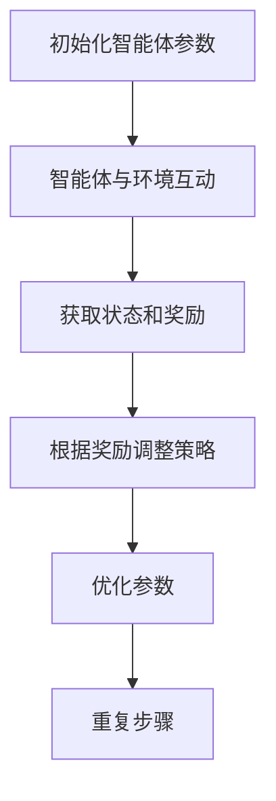
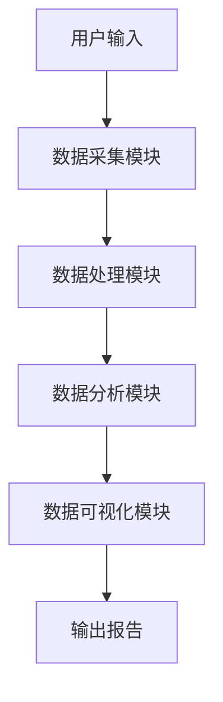
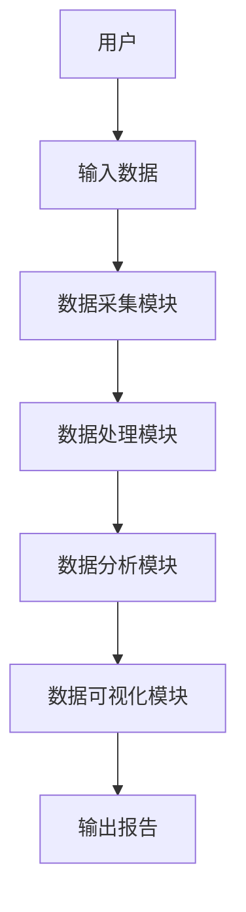

                 


# 基于多智能体的自动化尽职调查系统在价值投资中的应用

> 关键词：多智能体系统、自动化尽职调查、价值投资、协同算法、系统架构

> 摘要：本文探讨了基于多智能体的自动化尽职调查系统在价值投资中的应用，分析了多智能体系统的核心原理，详细讲解了算法实现和系统架构设计，提供了实际案例分析和最佳实践建议。

---

## 第1章：背景与概述

### 1.1 多智能体系统的背景与概念

#### 1.1.1 多智能体系统的定义与特点
- 多智能体系统（Multi-Agent System，MAS）是由多个智能体组成的分布式系统，每个智能体能够独立感知环境、自主决策并协同完成任务。
- **特点**：
  - **自主性**：智能体能够独立决策。
  - **反应性**：能够实时感知环境变化。
  - **协作性**：通过协同完成复杂任务。
  - **分布性**：各智能体相对独立，不存在集中控制。

#### 1.1.2 多智能体系统在金融领域的应用
- **金融数据分析**：利用多智能体进行实时数据处理和预测。
- **风险管理**：通过多智能体协同优化风险控制。
- **投资决策**：利用多智能体进行复杂的投资策略分析。

#### 1.1.3 自动化尽职调查的背景与意义
- **背景**：传统尽职调查依赖人工分析，效率低下且容易出错。
- **意义**：自动化尽职调查通过多智能体系统提高效率和准确性，支持价值投资决策。

### 1.2 价值投资与尽职调查

#### 1.2.1 价值投资的核心理念
- 价值投资强调长期持有优质资产，通过深入分析企业基本面进行投资决策。
- 核心理念：寻找被市场低估的优质企业。

#### 1.2.2 尽职调查在价值投资中的作用
- 尽职调查是价值投资的关键步骤，用于评估企业的财务状况、市场竞争力和管理团队。
- **作用**：
  - 确保投资决策的准确性。
  - 降低投资风险。

#### 1.2.3 传统尽职调查的局限性
- **效率低下**：人工调查耗时长，成本高。
- **主观性**：依赖分析师的经验和判断，存在主观误差。
- **信息不全**：难以全面收集和分析多源信息。

### 1.3 基于多智能体的自动化尽职调查系统

#### 1.3.1 系统的设计目标
- 提供高效的自动化尽职调查工具，支持价值投资决策。
- 实现多智能体协同，提高数据处理和分析效率。

#### 1.3.2 系统的核心优势
- **高效性**：多智能体协同处理，提高调查速度。
- **准确性**：通过智能算法确保分析结果的准确性。
- **全面性**：整合多源数据，提供全面的分析结果。

#### 1.3.3 系统的适用场景
- **企业基本面分析**：评估企业的财务状况、市场竞争力等。
- **风险管理**：识别投资中的潜在风险。
- **投资决策支持**：提供数据支持，优化投资策略。

---

## 第2章：多智能体系统的核心概念

### 2.1 多智能体系统的组成与协同机制

#### 2.1.1 多智能体系统的组成要素
- **智能体**：具备感知、决策和执行能力的实体。
- **环境**：智能体所处的外部环境，包括数据源和目标。
- **通信机制**：智能体之间的信息交换方式。
- **协作协议**：定义智能体之间的协同规则。

#### 2.1.2 智能体之间的协同方式
- **任务分配**：根据智能体的能力分配任务。
- **协作计划**：制定协同计划以完成共同目标。
- **动态协调**：根据环境变化实时调整协同策略。

#### 2.1.3 系统的通信与协调机制
- **通信协议**：定义智能体之间的信息交换格式。
- **协调算法**：通过算法实现智能体的动态协调。

### 2.2 多智能体系统与传统单智能体系统的对比

#### 2.2.1 系统复杂度对比
- **单智能体系统**：结构简单，易于管理。
- **多智能体系统**：结构复杂，但更具灵活性和扩展性。

#### 2.2.2 任务处理能力对比
- **单智能体系统**：处理任务能力有限，适用于简单任务。
- **多智能体系统**：能够处理复杂任务，适合多目标优化。

#### 2.2.3 系统灵活性对比
- **单智能体系统**：灵活性较低，适应性较差。
- **多智能体系统**：灵活性高，适应性强。

### 2.3 多智能体系统在金融领域的应用案例

#### 2.3.1 金融数据分析中的多智能体应用
- 多智能体协同分析股票市场数据，预测市场趋势。
- 案例：利用多智能体系统分析多个市场的实时数据，提供准确的市场预测。

#### 2.3.2 风险评估中的多智能体协同
- 多智能体协同评估企业的财务风险。
- 案例：利用多智能体系统评估某企业的财务状况，识别潜在风险。

#### 2.3.3 投资决策中的多智能体优化
- 多智能体协同优化投资组合。
- 案例：利用多智能体系统优化投资组合，提高投资收益。

---

## 第3章：多智能体协同算法

### 3.1 基于强化学习的多智能体协同算法

#### 3.1.1 强化学习的基本原理
- **强化学习**：通过试错学习，智能体通过与环境互动获得奖励或惩罚，优化决策策略。
- **数学模型**：
  - 状态空间 $S$
  - 动作空间 $A$
  - 奖励函数 $R$
  - 策略 $\pi(a|s)$

#### 3.1.2 多智能体协同算法的实现步骤
1. 初始化智能体参数。
2. 智能体与环境互动，获取状态和奖励。
3. 根据奖励调整策略，优化参数。
4. 重复步骤2和3，直到达到目标。

#### 3.1.3 算法的数学模型
- **状态转移矩阵**：
  $$ P(s' | s, a) $$
- **策略评估**：
  $$ V(s) = \max_{a} [ R(s,a) + \gamma V(s') ] $$
- **策略改进**：
  $$ \pi(a|s) = \arg\max_{a} [ R(s,a) + \gamma V(s') ] $$

#### 3.1.4 算法流程图（Mermaid）


#### 3.1.5 Python实现示例
```python
import numpy as np

class Agent:
    def __init__(self, state_space, action_space):
        self.state_space = state_space
        self.action_space = action_space
        self.theta = np.random.randn(100, 1)  # 初始化参数

    def act(self, state):
        Q = np.dot(state, self.theta)
        action = np.argmax(Q)
        return action

    def update(self, state, action, reward, next_state):
        Q = np.dot(state, self.theta)
        Q_next = np.dot(next_state, self.theta)
        Q[action] += reward + 0.99 * Q_next.max()
        self.theta = np.linalg.lstsq(state.T, Q, rcond=None)[0]

# 初始化环境
env = Environment(state_space, action_space)
agent = Agent(state_space, action_space)

# 训练过程
for episode in range(1000):
    state = env.reset()
    done = False
    while not done:
        action = agent.act(state)
        reward, next_state, done = env.step(action)
        agent.update(state, action, reward, next_state)
```

---

## 第4章：系统分析与架构设计

### 4.1 系统应用场景介绍

#### 4.1.1 价值投资中的数据处理
- 处理企业财务数据、市场数据和新闻数据。
- 数据来源：财务报表、市场报告、新闻文章等。

#### 4.1.2 系统功能设计
- **数据采集**：从多种来源获取数据。
- **数据处理**：清洗和预处理数据。
- **数据分析**：利用多智能体协同算法进行分析。
- **数据可视化**：生成可视化报告。

#### 4.1.3 系统架构设计（Mermaid）


### 4.2 系统功能模块设计

#### 4.2.1 数据采集模块
- **功能**：从多种来源采集数据，包括企业财务数据、市场数据和新闻数据。
- **实现**：使用爬虫技术采集数据，利用API接口获取实时数据。

#### 4.2.2 数据处理模块
- **功能**：清洗数据，处理缺失值和异常值。
- **实现**：使用Pandas库进行数据清洗和预处理。

#### 4.2.3 数据分析模块
- **功能**：利用多智能体协同算法进行数据分析，生成评估结果。
- **实现**：基于强化学习的协同算法，实现多智能体协同分析。

#### 4.2.4 数据可视化模块
- **功能**：将分析结果可视化，生成报告。
- **实现**：使用Matplotlib或Seaborn库生成可视化图表。

### 4.3 系统架构设计

#### 4.3.1 系统架构图（Mermaid）


#### 4.3.2 接口设计
- **输入接口**：接收用户的输入数据。
- **输出接口**：输出分析报告和可视化结果。

#### 4.3.3 交互流程图（Mermaid）


---

## 第5章：项目实战

### 5.1 环境安装与配置

#### 5.1.1 安装Python环境
- 使用Anaconda安装Python 3.8及以上版本。
- 安装必要的库：numpy、pandas、matplotlib、scikit-learn、强化学习库（如OpenAI Gym）。

#### 5.1.2 安装强化学习框架
- 安装TensorFlow或PyTorch框架，用于实现强化学习算法。
- 安装OpenAI Gym，用于环境模拟。

#### 5.1.3 安装数据处理工具
- 安装爬虫工具（如BeautifulSoup、Scrapy）。
- 安装API接口调用工具（如requests库）。

### 5.2 核心代码实现

#### 5.2.1 数据采集模块
```python
import requests
from bs4 import BeautifulSoup

def fetch_data(url):
    response = requests.get(url)
    soup = BeautifulSoup(response.text, 'html.parser')
    data = []
    # 提取数据
    return data
```

#### 5.2.2 数据处理模块
```python
import pandas as pd

def preprocess_data(data):
    df = pd.DataFrame(data)
    # 数据清洗和预处理
    return df
```

#### 5.2.3 数据分析模块
```python
class MultiAgentSystem:
    def __init__(self, agents):
        self.agents = agents

    def协同分析(self, data):
        # 调用各智能体进行分析
        return results
```

#### 5.2.4 数据可视化模块
```python
import matplotlib.pyplot as plt

def visualize_data(data):
    plt.figure(figsize=(10,6))
    # 绘制图表
    plt.show()
```

### 5.3 代码解读与分析

#### 5.3.1 数据采集模块解读
- 使用requests库发送HTTP请求，获取网页内容。
- 使用BeautifulSoup解析HTML，提取所需数据。

#### 5.3.2 数据处理模块解读
- 使用Pandas库进行数据清洗和预处理，确保数据质量。

#### 5.3.3 数据分析模块解读
- 初始化多智能体系统，调用各智能体协同分析数据，生成评估结果。

#### 5.3.4 数据可视化模块解读
- 使用Matplotlib库生成可视化图表，直观展示分析结果。

### 5.4 实际案例分析

#### 5.4.1 案例背景
- 某企业财务数据、市场数据和新闻数据的分析。

#### 5.4.2 数据处理过程
- 数据清洗、预处理，确保数据准确无误。

#### 5.4.3 分析结果解读
- 通过多智能体协同分析，生成企业财务状况评估报告。

#### 5.4.4 可视化结果展示
- 生成图表展示分析结果，帮助用户直观理解。

### 5.5 项目小结
- 通过实际案例展示系统的应用效果，总结项目中的经验教训。

---

## 第6章：案例分析与总结

### 6.1 案例分析

#### 6.1.1 案例背景
- 某企业的尽职调查分析。

#### 6.1.2 数据分析过程
- 多智能体协同分析企业的财务数据、市场数据和新闻数据。

#### 6.1.3 分析结果解读
- 生成企业评估报告，支持投资决策。

### 6.2 总结与展望

#### 6.2.1 总结
- 本文介绍了基于多智能体的自动化尽职调查系统的应用，详细讲解了系统的架构设计、算法实现和项目实战。

#### 6.2.2 展望
- 未来，随着人工智能技术的发展，多智能体系统在金融领域的应用将更加广泛，推动价值投资进入新的阶段。

### 6.3 最佳实践 tips

#### 6.3.1 系统优化建议
- 定期更新智能体模型，适应市场变化。
- 提高数据处理能力，支持更大规模的数据分析。

#### 6.3.2 注意事项
- 数据安全：确保数据的保密性和安全性。
- 系统维护：定期维护系统，确保其稳定运行。

#### 6.3.3 拓展阅读
- 推荐阅读《Multi-Agent Systems: Algorithm and Applications》深入理解多智能体系统。
- 参考相关论文，了解最新的研究成果。

---

## 作者信息

作者：AI天才研究院/AI Genius Institute & 禅与计算机程序设计艺术 /Zen And The Art of Computer Programming

---

# 结语

基于多智能体的自动化尽职调查系统在价值投资中的应用，不仅提高了尽职调查的效率和准确性，还为投资者提供了更有力的决策支持。未来，随着人工智能技术的不断进步，多智能体系统将在金融领域发挥更大的作用，推动价值投资进入新的发展阶段。

