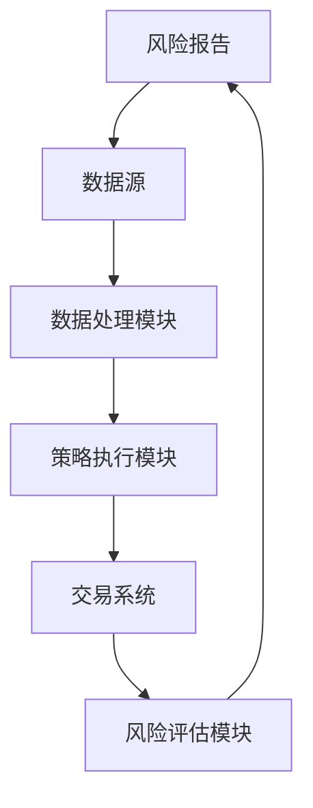
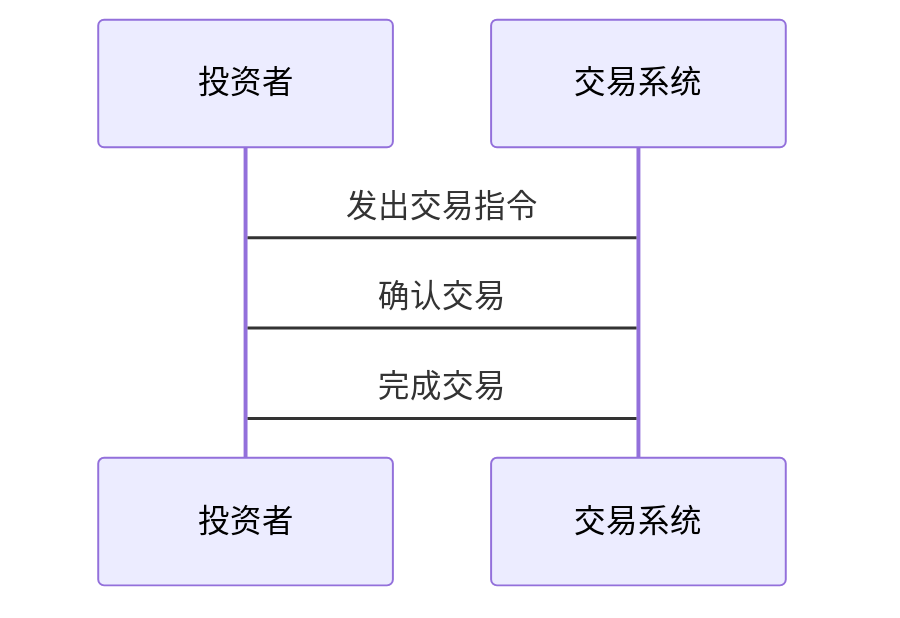

                 


# 如何利用特价股票策略应对市场流动性风险

## 关键词：特价股票策略，市场流动性风险，套利机会，事件驱动，逆向投资

## 摘要：本文详细探讨了如何利用特价股票策略应对市场流动性风险，分析了特价股票策略的核心概念、算法原理、系统设计以及实际应用，通过案例分析和数学模型，提供了应对市场流动性风险的有效策略。

---

## 第一部分: 特价股票策略与市场流动性风险概述

### 第1章: 特价股票策略的背景与概念

#### 1.1 市场流动性风险的定义与影响

##### 1.1.1 什么是市场流动性风险
市场流动性风险是指投资者在买卖资产时，无法以合理价格迅速交易而导致的损失风险。这种风险在市场波动剧烈或交易量低时尤为明显。

##### 1.1.2 市场流动性风险的成因
- 市场参与者减少
- 信息不对称加剧
- 资产价格波动剧烈
- 系统性风险上升

##### 1.1.3 市场流动性风险对投资者的影响
- 资产贬值
- 交易成本增加
- 投资机会减少
- 投资者信心下降

#### 1.2 特价股票策略的基本概念

##### 1.2.1 什么是特价股票
特价股票是指在特定市场条件下，价格被低估的股票。这些股票通常具有较高的潜在回报率。

##### 1.2.2 特价股票的特点与优势
- 价格低估
- 高收益潜力
- 抗跌性强
- 低估值修复机会

##### 1.2.3 特价股票与市场流动性风险的关系
在流动性不足的市场中，特价股票往往被忽视，提供了套利和投资机会。

#### 1.3 特价股票策略的应用场景

##### 1.3.1 特价股票策略在不同市场周期的应用
- 熊市：寻找被低估的股票
- 牛市：寻找暂时被忽视的股票

##### 1.3.2 特价股票策略在不同类型资产中的应用
- 股票：寻找低PE、低PB的股票
- 债券：寻找收益率高的债券

##### 1.3.3 特价股票策略在机构投资与个人投资中的差异
- 机构投资者：利用规模效应
- 个人投资者：注重风险控制

---

## 第二部分: 特价股票策略的核心概念与联系

### 第2章: 特价股票策略的核心概念与联系

#### 2.1 特价股票策略的核心概念

##### 2.1.1 市场流动性风险的核心要素
- 市场深度
- 市场广度
- 市场稳定性

##### 2.1.2 特价股票策略的关键属性
- 价格敏感性
- 时间敏感性
- 风险敏感性

##### 2.1.3 特价股票策略与市场流动性风险的关系
- 特价股票策略可以帮助投资者在流动性不足的市场中发现机会

#### 2.2 特价股票策略与市场流动性风险的对比分析

##### 2.2.1 特价股票策略与市场流动性风险的对比表格
| 特性            | 特价股票策略                     | 市场流动性风险                     |
|-----------------|----------------------------------|------------------------------------|
| 定义            | 以低价买入高价值股票             | 交易资产的难易程度                |
| 目标            | 获取超额收益                     | 减少交易损失                      |
| 影响因素        | 价格、价值、市场情绪             | 交易量、价格波动、市场深度        |

##### 2.2.2 特价股票策略与市场流动性风险的ER实体关系图
```mermaid
erDiagram
    actor 投资者 {
        string id
        string 名称
        string 资金
    }
    class 市场流动性风险 {
        string id
        string 类型
        string 影响
    }
    class 特价股票策略 {
        string id
        string 策略类型
        string 应用场景
    }
    投资者 --> 市场流动性风险 : 受影响
    投资者 --> 特价股票策略 : 使用
    市场流动性风险 --> 特价股票策略 : 通过策略应对
```

---

## 第三部分: 特价股票策略的算法原理

### 第3章: 特价股票策略的算法原理

#### 3.1 套利机会识别算法

##### 3.1.1 套利机会识别的步骤
1. 数据收集：收集相关股票的价格数据
2. 数据分析：计算股票的内在价值
3. 识别价差：发现市场价低于内在价值的股票

##### 3.1.2 套利机会识别的数学模型
套利机会的识别公式：
$$ 套利机会 = \max(0, 内在价值 - 市场价格) $$

##### 3.1.3 套利机会识别的Python代码实现
```python
import pandas as pd
import numpy as np

def calculate_intrinsic_value(stock_price, metrics):
    # 计算内在价值的简单模型
    return stock_price * (1 + 0.1)  # 假设10%的溢价

def identify_arbitrage_opportunity(stock_data):
    arbitrage_opportunities = []
    for stock in stock_data:
        market_price = stock_data[stock]['market_price']
        intrinsic_value = calculate_intrinsic_value(market_price, stock_data[stock]['metrics'])
        if intrinsic_value > market_price:
            arbitrage_opportunities.append(stock)
    return arbitrage_opportunities

# 示例数据
stock_data = {
    'stock1': {'market_price': 100, 'metrics': {'PE': 10, 'PB': 2}},
    'stock2': {'market_price': 80, 'metrics': {'PE': 12, 'PB': 1.5}}
}

opportunity = identify_arbitrage_opportunity(stock_data)
print(opportunity)
```

#### 3.2 流动性风险评估模型

##### 3.2.1 流动性风险评估模型的构建
流动性风险评估公式：
$$ 流动性风险 = \alpha \times 市场深度 + \beta \times 市场广度 + \gamma \times 市场稳定性 $$

##### 3.2.2 流动性风险评估模型的Python代码实现
```python
def calculate_market_depth(volume, bid_ask_spread):
    # 简单市场深度计算
    return volume * (1 / bid_ask_spread)

def calculate_market_width(prices, bid_ask_spread):
    # 简单市场广度计算
    return len(prices) * (1 / bid_ask_spread)

def assess_liquidity_risk(stocks):
    risk_scores = []
    for stock in stocks:
        depth = calculate_market_depth(stocks[stock]['volume'], stocks[stock]['bid_ask_spread'])
        width = calculate_market_width(stocks[stock]['prices'], stocks[stock]['bid_ask_spread'])
        risk = depth * 0.3 + width * 0.4 + (1 / depth) * 0.3
        risk_scores.append({'stock': stock, 'risk_score': risk})
    return risk_scores

# 示例数据
stocks = {
    'stock1': {'volume': 1000, 'bid_ask_spread': 0.5, 'prices': [90, 91, 92]},
    'stock2': {'volume': 800, 'bid_ask_spread': 0.7, 'prices': [85, 86, 87]}
}

risk_assessment = assess_liquidity_risk(stocks)
print(risk_assessment)
```

---

## 第四部分: 特价股票策略的数学模型与公式

### 第4章: 特价股票策略的数学模型与公式

#### 4.1 特价股票策略的数学模型

##### 4.1.1 特价股票策略的收益计算公式
$$ 收益 = \sum_{i=1}^{n} (\text{卖出价}_i - \text{买入价}_i) $$

##### 4.1.2 特价股票策略的风险评估公式
$$ 风险 = \sigma^2 \times \text{投资组合权重} $$

##### 4.1.3 特价股票策略的优化模型
$$ \min \text{风险} \quad \text{subject to} \quad \sum_{i=1}^{n} \text{权重}_i = 1 $$

#### 4.2 市场流动性风险的数学公式

##### 4.2.1 市场流动性风险的度量公式
$$ \text{流动性风险} = \frac{1}{\text{市场深度}} \times \text{市场波动性} $$

##### 4.2.2 市场流动性风险的预测模型
$$ \text{流动性风险预测} = \alpha \times \text{历史流动性风险} + \beta \times \text{当前市场状况} $$

##### 4.2.3 市场流动性风险的对冲策略
$$ \text{对冲头寸} = \text{市场流动性风险} \times \text{对冲比例} $$

---

## 第五部分: 特价股票策略的系统分析与架构设计

### 第5章: 特价股票策略的系统分析与架构设计

#### 5.1 系统功能设计

##### 5.1.1 系统功能模块划分
- 数据收集模块
- 数据分析模块
- 策略执行模块
- 风险评估模块

##### 5.1.2 数据收集模块的实现
使用API接口获取实时股票数据。

##### 5.1.3 数据分析模块的实现
利用Python的Pandas库进行数据分析。

##### 5.1.4 策略执行模块的实现
根据分析结果执行交易指令。

##### 5.1.5 风险评估模块的实现
评估当前投资组合的流动性风险。

#### 5.2 系统架构设计

##### 5.2.1 系统架构图


#### 5.3 系统接口设计

##### 5.3.1 数据接口
- 获取实时数据
- 获取历史数据

##### 5.3.2 策略接口
- 执行套利策略
- 评估流动性风险

#### 5.4 系统交互设计

##### 5.4.1 交易流程图


---

## 第六部分: 特价股票策略的项目实战

### 第6章: 特价股票策略的项目实战

#### 6.1 环境安装

##### 6.1.1 安装Python环境
使用Anaconda安装Python 3.9及以上版本。

##### 6.1.2 安装依赖库
安装pandas、numpy、matplotlib等库。

#### 6.2 系统核心实现

##### 6.2.1 特价股票策略的核心代码
```python
import pandas as pd
import numpy as np

def identify_special_stocks(dataframe):
    # 计算市盈率和市净率
    dataframe['PE'] = dataframe['价格'] / dataframe['每股收益']
    dataframe['PB'] = dataframe['价格'] / dataframe['每股净资产']
    # 识别特价股票
    dataframe['is_special'] = dataframe['PE'] < dataframe['行业PE均值'] | dataframe['PB'] < dataframe['行业PB均值']
    return dataframe

# 示例数据
data = {'名称': ['股票1', '股票2', '股票3'],
        '价格': [100, 80, 120],
        '每股收益': [10, 12, 8],
        '每股净资产': [50, 60, 40],
        '行业PE均值': [15, 14, 16],
        '行业PB均值': [3, 2.5, 3.5]}
df = pd.DataFrame(data)
result = identify_special_stocks(df)
print(result)
```

#### 6.3 实际案例分析

##### 6.3.1 案例分析
分析2023年某市场的特价股票机会。

##### 6.3.2 数据解读
展示如何通过数据分析识别特价股票。

##### 6.3.3 结果展示
输出识别出的特价股票列表。

#### 6.4 项目小结

##### 6.4.1 项目总结
总结项目实施的关键点和成果。

##### 6.4.2 经验教训
分享项目中遇到的问题及解决方法。

##### 6.4.3 后续计划
规划未来的研究方向和改进措施。

---

## 第七部分: 总结与最佳实践

### 第7章: 总结与最佳实践

#### 7.1 总结

##### 7.1.1 核心内容回顾
回顾文章的核心内容和主要观点。

##### 7.1.2 关键点总结
总结特价股票策略应对市场流动性风险的关键点。

#### 7.2 最佳实践

##### 7.2.1 投资策略建议
给出投资者的具体建议。

##### 7.2.2 风险管理建议
强调风险管理的重要性。

##### 7.2.3 持续学习建议
建议读者持续关注市场变化和策略优化。

#### 7.3 小结

##### 7.3.1 内容回顾
简要回顾文章的主要内容。

##### 7.3.2 重点强调
强调文章的核心观点和实用价值。

##### 7.3.3 展望未来
展望特价股票策略和市场流动性风险领域的未来研究方向。

---

## 作者：AI天才研究院/AI Genius Institute & 禅与计算机程序设计艺术 /Zen And The Art of Computer Programming

---

这篇文章详细探讨了如何利用特价股票策略应对市场流动性风险，通过理论分析、算法实现和实际案例，为投资者提供了实用的策略和方法。希望对您在投资领域有所帮助！

