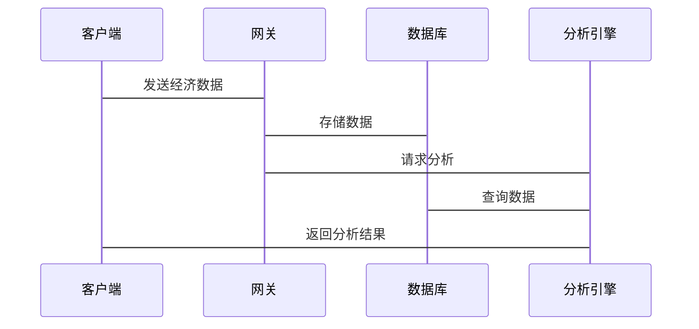

                 


# 巴菲特的经济周期投资：如何在不同阶段调整策略

> 关键词：巴菲特, 经济周期, 投资策略, 价值投资, 风险管理

> 摘要：本文深入探讨巴菲特的经济周期投资策略，分析其在不同经济阶段的投资方法，结合技术语言和系统架构，提供从理论到实践的全面解析。通过数学模型和实际案例，揭示巴菲特的成功秘诀，并为读者提供可操作的投资策略和风险管理建议。

---

## 第1章: 经济周期的基本概念

### 1.1 经济周期的定义与特征

#### 1.1.1 经济周期的定义
经济周期是指经济活动的波动性变化，通常分为繁荣、衰退、复苏和成熟四个阶段。每个阶段具有独特的市场特征和投资机会。

#### 1.1.2 经济周期的主要阶段
- **繁荣阶段**：经济增长迅速，市场活跃，企业盈利高。
- **衰退阶段**：经济下滑，企业盈利下降，市场波动大。
- **复苏阶段**：经济逐渐恢复，市场开始回暖。
- **成熟阶段**：经济稳定，市场波动小，企业盈利稳定。

#### 1.1.3 经济周期的影响因素
- 宏观经济政策
- 市场供需关系
- 投资者心理

### 1.2 巴菲特投资理念的核心要素

#### 1.2.1 巴菲特的投资哲学
巴菲特强调长期投资和价值投资，认为市场波动是投资机会。

#### 1.2.2 价值投资的定义与原则
- 买入低于内在价值的股票
- 长期持有优质企业
- 重视企业基本面和管理层能力

#### 1.2.3 长期投资的优势与风险
- 优势：避免短期波动，捕捉长期增长
- 风险：市场波动可能导致短期亏损

### 1.3 经济周期与投资策略的关系

#### 1.3.1 经济周期对投资决策的影响
不同经济阶段影响企业盈利和市场估值。

#### 1.3.2 不同经济阶段的投资机会
- 繁荣阶段：高增长企业
- 衰退阶段：廉价资产
- 复苏阶段：边际收益提升企业
- 成熟阶段：稳定收益企业

#### 1.3.3 巴菲特如何利用经济周期进行投资
通过长期持有优质企业，在市场低谷时买入，市场高点时卖出。

---

## 第2章: 巴菲特的投资策略分析

### 2.1 巴菲特的投资策略框架

#### 2.1.1 价值投资的核心框架
- 买入价格低于内在价值
- 长期持有
- 分散投资

#### 2.1.2 股票估值的基本方法
- 市盈率（P/E）
- 市净率（P/B）
- 股息率（Dividend Yield）

#### 2.1.3 投资组合的构建原则
- 分散投资以降低风险
- 选择具有持续竞争优势的企业
- 长期持有优质股票

### 2.2 巴菲特的选股标准

#### 2.2.1 公司基本面分析
- 盈利能力：ROE、净利率
- 财务状况：负债率、现金流
- 管理层能力：管理层诚信和决策能力

#### 2.2.2 财务指标的筛选标准
- 低市盈率和低市净率
- 高ROE和稳定现金流
- 健康的资产负债表

#### 2.2.3 管理层的信任与能力评估
- 管理层是否诚信
- 管理层是否具有长期眼光
- 管理层是否具备持续创新能力

### 2.3 巴菲特的长期投资策略

#### 2.3.1 长期投资的优势
- 避免短期波动
- 捕捉企业长期增长

#### 2.3.2 长期投资的风险管理
- 分散投资以降低风险
- 选择具有防御性的企业
- 避免过度集中

#### 2.3.3 巴菲特的分散投资策略
- 投资于不同行业和企业
- 避免过度集中在某一行业
- 保持投资组合的多样性

---

## 第3章: 不同经济阶段的投资策略调整

### 3.1 经济繁荣阶段的投资策略

#### 3.1.1 繁荣阶段的市场特征
- 经济增长快
- 企业盈利高
- 市场估值高

#### 3.1.2 巴菲特在繁荣阶段的投资策略
- 选择具有持续增长能力的企业
- 避免追高，选择估值合理的股票
- 分散投资以降低风险

#### 3.1.3 典型案例分析
- 可口可乐在繁荣阶段的持续增长

### 3.2 经济衰退阶段的投资策略

#### 3.2.1 衰退阶段的市场特征
- 经济下滑
- 企业盈利下降
- 市场估值低

#### 3.2.2 巴菲特在衰退阶段的投资策略
- 寻找具有防御性的企业
- 投资于廉价资产
- 增加对优质企业的持股

#### 3.2.3 典型案例分析
- 巴菲特在2008年金融危机期间投资高盛和通用电气

### 3.3 经济复苏阶段的投资策略

#### 3.3.1 复苏阶段的市场特征
- 经济逐渐恢复
- 市场估值逐步回升
- 企业盈利开始增长

#### 3.3.2 巴菲特在复苏阶段的投资策略
- 选择边际收益提升的企业
- 增加对周期性行业的投资
- 逐步增加投资组合的仓位

#### 3.3.3 典型案例分析
- 巴菲特在复苏阶段投资富国银行

### 3.4 经济成熟阶段的投资策略

#### 3.4.1 成熟阶段的市场特征
- 经济稳定
- 市场波动小
- 企业盈利稳定

#### 3.4.2 巴菲特在成熟阶段的投资策略
- 选择具有稳定增长能力的企业
- 维持投资组合的稳定性
- 保持长期投资策略

#### 3.4.3 典型案例分析
- 巴菲特长期持有美国运通和伯克希尔哈撒韦

---

## 第4章: 投资组合管理与风险管理

### 4.1 投资组合管理的基本原则

#### 4.1.1 资产配置的核心理念
- 分散投资以降低风险
- 保持投资组合的多样性
- 根据市场变化调整资产配置

#### 4.1.2 投资组合的风险分散策略
- 选择不同行业和不同风险级别的资产
- 通过多样化投资降低特定风险

#### 4.1.3 投资组合的动态调整
- 定期评估投资组合的表现
- 根据市场变化和个人目标调整投资组合
- 保持对市场变化的敏感性

### 4.2 风险管理的具体方法

#### 4.2.1 风险识别与评估
- 识别潜在风险因素
- 评估风险对企业盈利和市场估值的影响
- 制定风险管理计划

#### 4.2.2 风险控制的策略选择
- 设置止损点
- 分散投资以降低风险
- 选择具有防御性的资产

#### 4.2.3 风险管理的执行与监控
- 定期审查投资组合的风险敞口
- 监控市场变化和企业基本面
- 及时调整投资策略以应对风险

### 4.3 巴菲特的防御性投资策略

#### 4.3.1 防御性投资的定义与特点
- 防御性投资旨在保护资本不受损失
- 投资于具有稳定收益和防御性的企业
- 适用于市场波动大的时期

#### 4.3.2 防御性投资的适用场景
- 经济衰退时期
- 市场波动剧烈时期
- 投资者风险承受能力低时

#### 4.3.3 巴菲特的防御性投资案例
- 投资于公用事业和金融企业

---

## 第5章: 巴菲特投资策略的数学模型与算法分析

### 5.1 价值投资的数学模型

#### 5.1.1 股票估值的数学公式
$$ \text{内在价值} = \sum_{t=1}^{\infty} \frac{\text{现金流}_t}{(1 + r)^t} $$
其中，\( r \) 是折现率，\( \text{现金流}_t \) 是第 \( t \) 年的现金流。

#### 5.1.2 股票内在价值的计算方法
- 确定企业的未来现金流
- 确定合适的折现率
- 计算未来现金流的现值

#### 5.1.3 股票市场价值与内在价值的对比
- 当市场价值低于内在价值时，股票具有投资价值
- 当市场价值高于内在价值时，股票被高估

### 5.2 投资组合优化的算法分析

#### 5.2.1 投资组合优化的数学模型
$$ \text{最大化} \sum_{i=1}^n \sum_{j=1}^m w_{ij} r_{ij} $$
$$ \text{满足} \sum_{i=1}^n \sum_{j=1}^m w_{ij} = 1 $$
其中，\( w_{ij} \) 是投资于第 \( i \) 个资产的比例，\( r_{ij} \) 是第 \( i \) 个资产的预期收益率。

#### 5.2.2 风险与收益的权衡
- 风险调整后的收益最大化
- 风险承受能力与收益目标的匹配

#### 5.2.3 投资组合优化的实现步骤
1. 确定可投资资产和它们的预期收益率和风险
2. 确定投资目标和风险承受能力
3. 构建投资组合优化模型
4. 求解模型得到最优投资组合

---

## 第6章: 系统分析与架构设计方案

### 6.1 问题场景介绍

#### 6.1.1 问题背景
- 经济周期波动对企业投资的影响
- 投资者如何在不同经济阶段调整投资策略
- 如何利用技术手段辅助投资决策

#### 6.1.2 问题描述
- 如何构建一个基于经济周期的投资策略调整系统
- 如何利用数据分析和算法优化投资组合
- 如何实时监控市场变化并调整投资策略

### 6.2 系统功能设计

#### 6.2.1 领域模型（Mermaid类图）


#### 6.2.2 系统架构设计（Mermaid架构图）


#### 6.2.3 系统接口设计
- 输入接口：经济数据、市场指标、投资目标
- 输出接口：投资建议、投资组合优化结果、风险管理报告

#### 6.2.4 系统交互（Mermaid序列图）


---

## 第7章: 项目实战

### 7.1 环境安装

#### 7.1.1 安装Python和相关库
```bash
pip install numpy pandas matplotlib
```

#### 7.1.2 安装数据分析工具
```bash
pip install yfinance
```

### 7.2 核心实现源代码

#### 7.2.1 股票估值函数
```python
def calculate_intrinsic_value(fcf, growth_rate, discount_rate):
    return fcf / (discount_rate - growth_rate)
```

#### 7.2.2 投资组合优化算法
```python
import numpy as np

def optimize_portfolio(returns, weights):
    # 计算投资组合的收益和风险
    portfolio_return = np.dot(returns, weights)
    portfolio_risk = np.sqrt(np.dot(weights.T, np.dot(returns.cov(), weights)))
    return portfolio_return, portfolio_risk
```

### 7.3 代码应用解读与分析

#### 7.3.1 股票估值函数解读
- 输入：自由现金流（FCF）、增长率（growth_rate）、折现率（discount_rate）
- 输出：股票的内在价值

#### 7.3.2 投资组合优化算法解读
- 输入：资产的预期收益率矩阵、权重向量
- 输出：投资组合的预期收益和风险

### 7.4 实际案例分析

#### 7.4.1 案例背景
- 经济衰退阶段，选择防御性投资策略

#### 7.4.2 数据分析与建模
- 收集相关企业的基本面数据
- 计算内在价值和市场价值
- 构建投资组合优化模型

#### 7.4.3 模型实现与结果展示
- 使用Python代码实现投资组合优化
- 通过可视化工具展示结果

### 7.5 项目小结
- 成功构建了基于经济周期的投资策略调整系统
- 通过数学模型和算法优化了投资组合
- 提供了实际案例分析和代码实现

---

## 第8章: 最佳实践、小结与注意事项

### 8.1 最佳实践

#### 8.1.1 投资策略的动态调整
- 定期审查投资组合
- 根据市场变化调整策略
- 保持对经济周期的敏感性

#### 8.1.2 风险管理的注意事项
- 设置止损点
- 分散投资以降低风险
- 避免过度集中

### 8.2 小结

#### 8.2.1 核心内容回顾
- 巴菲特的经济周期投资策略
- 价值投资的核心理念
- 不同经济阶段的投资策略调整

#### 8.2.2 本文的独特见解
- 结合技术语言和系统架构，提供从理论到实践的全面解析
- 提供数学模型和算法分析，帮助读者深入理解投资策略
- 通过实际案例分析，展示如何在不同经济阶段调整投资策略

### 8.3 注意事项

#### 8.3.1 投资者心理
- 避免贪婪和恐惧
- 保持理性决策

#### 8.3.2 市场变化
- 保持对市场变化的敏感性
- 根据市场变化及时调整投资策略

#### 8.3.3 风险管理
- 避免过度集中
- 设置合理的止损点
- 定期审查投资组合

---

## 第9章: 拓展阅读与进一步思考

### 9.1 拓展阅读

#### 9.1.1 经济周期相关书籍
- 《大萧条时期的宏观经济学》
- 《投资的不变法则》

#### 9.1.2 价值投资经典文献
- 《证券分析》
- 《聪明的投资者》

### 9.2 进一步思考

#### 9.2.1 经济周期与技术进步的关系
- 技术进步如何影响经济周期
- 如何利用技术进步进行投资

#### 9.2.2 数字化工具在投资中的应用
- 数据分析工具如何辅助投资决策
- 人工智能在投资策略中的应用

#### 9.2.3 未来经济周期的投资策略
- 新兴产业的投资机会
- 数字经济对投资策略的影响

---

## 作者：AI天才研究院/AI Genius Institute & 禅与计算机程序设计艺术 /Zen And The Art of Computer Programming

