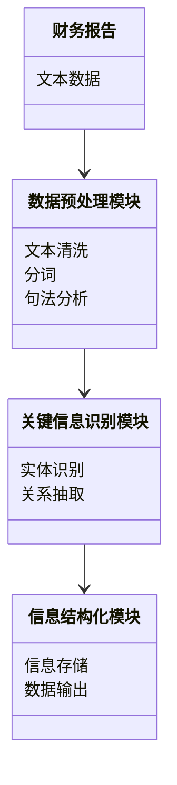
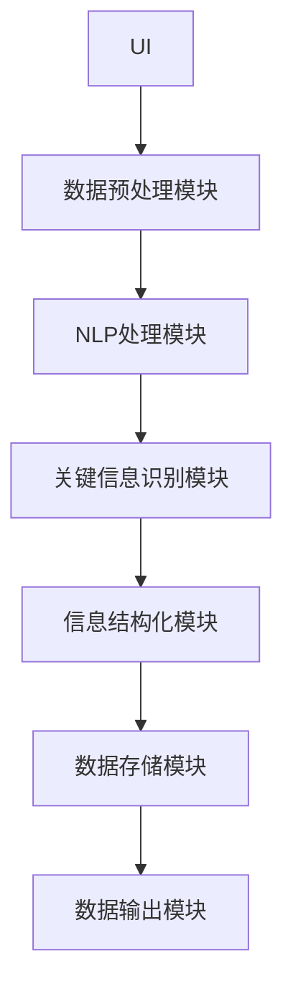
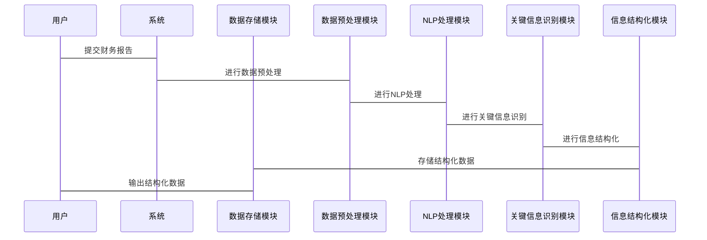

                 


# 智能财务报告关键信息提取系统

> 关键词：智能财务报告，信息提取，自然语言处理，机器学习，预训练语言模型

> 摘要：本文系统地探讨了智能财务报告关键信息提取系统的构建与实现。通过分析财务报告中的关键信息类型、信息提取的痛点与解决思路，结合自然语言处理与机器学习技术，详细阐述了系统的核心算法原理、系统架构设计、项目实战等关键环节。本文旨在为财务信息自动化处理提供一种高效、可靠的解决方案，助力企业实现财务数据的智能化管理。

---

## 第一部分: 财务报告关键信息提取的背景与意义

### 第1章: 财务报告关键信息提取的背景与意义

#### 1.1 问题背景

##### 1.1.1 财务报告的重要性  
财务报告是企业经济活动的重要记录，包含着大量关键的财务数据和信息，如收入、支出、利润、资产负债等。这些信息对于企业的决策者、投资者、债权人等利益相关者来说，具有极高的参考价值。

##### 1.1.2 传统财务信息提取的痛点  
传统的财务信息提取方式主要依赖人工操作，存在以下痛点：  
1. **效率低下**：人工提取需要逐行阅读财务报告，耗时且效率低。  
2. **误差率高**：人工提取容易出现漏提取、误提取等问题，影响数据准确性。  
3. **成本高昂**：需要大量专业人员参与，增加了企业的运营成本。  

##### 1.1.3 智能化提取的必要性  
随着人工智能技术的快速发展，利用自然语言处理（NLP）和机器学习技术实现财务报告关键信息的智能化提取，能够显著提升提取效率和准确性，降低企业运营成本，为企业决策提供实时、可靠的财务数据支持。

#### 1.2 问题描述

##### 1.2.1 财务报告的关键信息类型  
财务报告中的关键信息主要包括：  
1. **财务数据**：如收入、支出、利润等。  
2. **财务科目**：如资产、负债、所有者权益等。  
3. **财务指标**：如毛利率、净利率、资产负债率等。  

##### 1.2.2 信息提取的复杂性  
财务报告中的信息通常以文本形式呈现，且格式多样、内容复杂。关键信息的提取需要考虑以下因素：  
1. **文本结构多样性**：财务报告中的信息可能以段落、表格、列表等多种形式呈现。  
2. **专业术语的多样性**：财务报告中使用了大量的专业术语，需要准确识别和提取。  
3. **上下文依赖性**：某些信息的提取需要结合上下文进行推理和判断。  

##### 1.2.3 智能提取的目标与范围  
智能财务报告关键信息提取系统的目标是通过自然语言处理和机器学习技术，自动提取财务报告中的关键信息，并将其结构化为可分析的数据格式。其范围包括：  
1. **文本数据预处理**：如分词、句法分析等。  
2. **关键信息识别**：如实体识别、关系抽取等。  
3. **信息结构化**：将提取的信息转化为结构化的数据格式。  

#### 1.3 问题解决思路

##### 1.3.1 自然语言处理技术的应用  
自然语言处理技术是实现财务报告关键信息提取的核心技术之一。通过分词、句法分析、实体识别等技术，可以将文本数据转化为结构化的信息。

##### 1.3.2 机器学习在信息提取中的作用  
机器学习技术可以用于训练分类器、序列标注模型等，帮助系统自动识别和提取关键信息。通过监督学习，系统可以学习财务报告中关键信息的特征，从而提高提取的准确率。

##### 1.3.3 智能提取系统的构建框架  
智能财务报告关键信息提取系统的构建框架包括以下步骤：  
1. 数据采集：获取财务报告文本数据。  
2. 数据预处理：对文本数据进行清洗、分词、句法分析等处理。  
3. 关键信息识别：利用自然语言处理和机器学习技术，识别和提取关键信息。  
4. 信息结构化：将提取的信息转化为结构化的数据格式，便于后续分析和应用。  

#### 1.4 系统的边界与外延

##### 1.4.1 系统功能边界  
智能财务报告关键信息提取系统的核心功能包括：  
1. 文本数据预处理。  
2. 关键信息识别。  
3. 信息结构化。  

##### 1.4.2 与其他系统的关联  
该系统可以与其他企业信息系统（如ERP、CRM等）集成，提供实时的财务数据支持，辅助企业决策。

##### 1.4.3 系统的可扩展性  
系统设计时充分考虑了可扩展性，支持多种格式的财务报告输入，且可以通过模型微调支持不同行业的财务信息提取需求。

#### 1.5 核心概念与系统架构

##### 1.5.1 关键信息提取的定义  
关键信息提取是指从财务报告文本中提取出具有重要意义的财务数据、科目和指标的过程。

##### 1.5.2 系统核心要素组成  
智能财务报告关键信息提取系统的核心要素包括：  
1. **文本数据预处理模块**：负责对财务报告文本进行清洗和结构化。  
2. **关键信息识别模块**：利用自然语言处理和机器学习技术，识别和提取关键信息。  
3. **信息结构化模块**：将提取的信息转化为结构化的数据格式。  

##### 1.5.3 系统架构的初步设想  
系统架构包括以下组件：  
1. **数据输入模块**：接收财务报告文本数据。  
2. **数据预处理模块**：对文本数据进行分词、句法分析等处理。  
3. **信息提取模块**：利用自然语言处理和机器学习技术，识别和提取关键信息。  
4. **信息结构化模块**：将提取的信息转化为结构化的数据格式。  
5. **输出模块**：将结构化数据输出，供其他系统使用。  

---

## 第二部分: 关键信息提取的核心概念与联系

### 第2章: 关键信息提取的核心概念

#### 2.1 实体识别与关系抽取

##### 2.1.1 实体识别的基本原理  
实体识别（Named Entity Recognition, NER）是自然语言处理中的一个核心任务，旨在从文本中识别出命名实体，如人名、地名、组织名、时间、日期等。在财务报告中，实体识别主要用于识别公司名称、金额、日期等关键信息。

##### 2.1.2 关系抽取的实现方法  
关系抽取（Relation Extraction）旨在识别文本中实体之间的关系。在财务报告中，关系抽取可以用于识别公司与供应商之间的关系、公司与客户之间的关系等。

##### 2.1.3 实体与关系的关联性  
实体识别和关系抽取是相辅相成的。实体识别为关系抽取提供了基础，而关系抽取则进一步丰富了实体之间的语义信息。

##### 2.1.4 实体关系图的构建  
实体关系图（Entity-Relation Graph）是将实体及其关系以图的形式表示，可以直观地展示财务报告中的关键信息及其关联关系。

##### 2.1.5 实体关系图的构建过程  
1. **实体识别**：从文本中识别出命名实体。  
2. **关系抽取**：识别实体之间的关系。  
3. **图构建**：将实体及其关系以图的形式表示。  

#### 2.2 信息抽取的特征对比

##### 2.2.1 不同信息抽取方法的对比表格  
以下表格对比了不同信息抽取方法的优缺点：

| 方法 | 优点 | 缺点 |  
|------|------|------|  
| 基于规则的方法 | 简单易实现，适用于规则明确的场景 | 无法处理复杂场景，缺乏灵活性 |  
| 基于统计的方法 | 能够处理复杂场景，准确性较高 | 实现复杂，需要大量标注数据 |  
| 基于深度学习的方法 | 准确性高，能够处理复杂场景 | 需要大量计算资源，实现复杂 |  

##### 2.2.2 特征维度的详细分析  
信息抽取的特征维度包括：  
1. **文本特征**：如词频、句长等。  
2. **语法特征**：如句法结构、语态等。  
3. **语义特征**：如上下文、领域知识等。  

##### 2.2.3 优缺点的总结  
基于规则的方法简单易实现，但灵活性差；基于统计的方法能够处理复杂场景，但实现复杂；基于深度学习的方法准确性高，但实现复杂且需要大量计算资源。

#### 2.3 实体关系图的构建

##### 2.3.1 ER实体关系图的定义  
ER实体关系图（Entity-Relation Graph）是一种用于表示实体及其关系的图结构。在财务报告中，ER实体关系图可以用于展示公司、金额、时间等实体及其关系。

##### 2.3.2 实体关系的分类  
实体关系可以分为以下几类：  
1. **一对一关系**：如公司与法人代表。  
2. **一对多关系**：如公司与子公司。  
3. **多对多关系**：如公司与客户。  

##### 2.3.3 实体关系图的构建过程  
1. **实体识别**：从文本中识别出命名实体。  
2. **关系抽取**：识别实体之间的关系。  
3. **图构建**：将实体及其关系以图的形式表示。  

#### 2.4 本章小结

##### 2.4.1 核心概念的总结  
本章介绍了实体识别和关系抽取的基本原理及其在财务报告中的应用，分析了不同信息抽取方法的优缺点，并提出了实体关系图的构建方法。

##### 2.4.2 系统构建的基础框架  
通过实体识别和关系抽取，系统可以提取出财务报告中的关键信息，并构建实体关系图，为后续的信息结构化和分析提供基础。

##### 2.4.3 后续章节的铺垫  
本章内容为后续章节的算法实现和系统设计奠定了基础，后续章节将详细介绍算法原理和系统架构设计。

---

## 第三部分: 智能信息提取的算法原理

### 第3章: 预训练语言模型的应用

#### 3.1 模型原理概述

##### 3.1.1 预训练语言模型的基本原理  
预训练语言模型（Pre-trained Language Models）是基于深度学习的自然语言处理模型，通过在大规模文本数据上进行预训练，模型能够学习到语言的语法、语义等信息。常用的预训练语言模型包括BERT、GPT、RoBERTa等。

##### 3.1.2 模型在信息提取中的优势  
预训练语言模型在信息提取中的优势包括：  
1. **语义理解能力强**：模型能够理解上下文语义，准确识别实体和关系。  
2. **通用性强**：模型可以在多个任务上进行微调，适用于不同领域的信息提取。  
3. **准确性高**：通过大规模数据训练，模型具有较高的准确率。  

##### 3.1.3 模型的适用场景分析  
预训练语言模型适用于以下场景：  
1. **多领域信息提取**：模型可以在多个领域进行信息提取任务。  
2. **复杂文本结构**：模型能够处理复杂文本结构，如长句、复合句等。  
3. **实时性要求高**：模型可以在短时间内完成信息提取任务。  

#### 3.2 模型的结构与训练

##### 3.2.1 模型结构的详细分析  
以BERT模型为例，其结构包括：  
1. **输入层**：接收文本数据。  
2. **嵌入层**：将文本数据转换为向量表示。  
3. **变换层**：对向量进行变换，提取语义信息。  
4. **输出层**：输出最终的向量表示或标签。  

##### 3.2.2 预训练任务的设计  
预训练任务包括：  
1. **Masked Language Model (MLM)**：随机遮蔽部分词汇，预测遮蔽词汇。  
2. **Next Sentence Prediction (NSP)**：预测下一句是否为原文的下一句。  

##### 3.2.3 模型的微调策略  
在特定任务上对预训练模型进行微调，如：  
1. **任务特定的标签空间**：根据任务需求定义标签。  
2. **任务特定的数据增强**：对训练数据进行数据增强，如随机遮蔽、插入噪声等。  
3. **微调策略**：采用小批量训练、学习率调整等策略。  

#### 3.3 模型的实现流程

##### 3.3.1 数据预处理流程  
1. **文本清洗**：去除多余空格、标点符号等。  
2. **分词**：将文本分割为单词或短语。  
3. **标注**：根据任务需求对文本进行标注，如实体标注、关系标注等。  

##### 3.3.2 模型训练过程  
1. **数据加载**：将标注数据加载到模型中。  
2. **模型微调**：在特定任务上对模型进行微调。  
3. **模型评估**：通过验证集评估模型的性能。  

##### 3.3.3 模型评估方法  
评估方法包括：  
1. **准确率**：正确识别的实体或关系占总实体或关系的比例。  
2. **召回率**：正确识别的实体或关系占所有实际存在的实体或关系的比例。  
3. **F1值**：准确率和召回率的调和平均数。  

#### 3.4 本章小结

##### 3.4.1 模型原理的总结  
本章详细介绍了预训练语言模型的基本原理及其在信息提取中的应用，分析了模型的结构和训练过程。

##### 3.4.2 模型在系统中的应用  
预训练语言模型可以应用于财务报告的关键信息提取，通过微调模型，可以实现高准确率的实体识别和关系抽取。

##### 3.4.3 后续章节的关联  
后续章节将详细介绍模型在财务报告中的具体应用，包括系统架构设计和项目实战。

---

## 第四部分: 系统分析与架构设计

### 第4章: 系统分析与架构设计

#### 4.1 项目背景与目标

##### 4.1.1 项目背景  
随着企业数字化转型的推进，对财务数据的实时性和准确性要求越来越高。传统的财务信息提取方式已经无法满足企业的需求，因此需要构建一个智能化的财务信息提取系统。

##### 4.1.2 项目目标  
项目目标是构建一个基于自然语言处理和机器学习技术的智能财务报告关键信息提取系统，实现财务报告的关键信息自动提取，并将其结构化为可分析的数据格式。

##### 4.1.3 项目范围  
项目范围包括：  
1. **文本数据预处理**：对财务报告文本进行清洗和结构化。  
2. **关键信息识别**：利用自然语言处理技术，识别和提取关键信息。  
3. **信息结构化**：将提取的信息转化为结构化的数据格式。  

#### 4.2 系统功能设计

##### 4.2.1 领域模型图  
以下是系统的领域模型图：



##### 4.2.2 系统架构设计  
以下是系统的架构设计图：



##### 4.2.3 接口设计  
系统接口设计如下：  
1. **输入接口**：接收财务报告文本数据。  
2. **输出接口**：输出结构化的财务数据。  
3. **数据预处理接口**：对文本数据进行清洗和分词。  
4. **信息提取接口**：实现实体识别和关系抽取。  

##### 4.2.4 交互序列图  
以下是系统的交互序列图：



#### 4.3 本章小结

##### 4.3.1 系统分析的总结  
本章通过对项目的背景和目标进行分析，设计了系统的功能模块和架构，并详细描述了系统的接口设计和交互流程。

##### 4.3.2 系统架构的合理性  
系统架构设计合理，各模块分工明确，能够实现财务报告关键信息的高效提取和结构化。

##### 4.3.3 后续章节的关联  
后续章节将基于本章的系统架构设计，详细介绍系统的实现过程和项目实战。

---

## 第五部分: 项目实战

### 第5章: 项目实战

#### 5.1 环境安装

##### 5.1.1 安装Python环境  
建议使用Python 3.6及以上版本。可以通过以下命令安装：  
```bash
python --version
```

##### 5.1.2 安装必要的库  
安装以下库：  
```bash
pip install numpy
pip install pandas
pip install transformers
pip install torch
pip install matplotlib
```

#### 5.2 系统核心实现

##### 5.2.1 数据预处理模块  
以下是数据预处理模块的代码实现：

```python
import re
from transformers import AutoTokenizer

def text_cleaning(text):
    # 去除多余空格
    text = re.sub(r'\s+', ' ', text).strip()
    # 去除标点符号
    text = re.sub(r'[^\w\s]', '', text)
    return text

def tokenize(text):
    tokenizer = AutoTokenizer.from_pretrained('bert-base-uncased')
    tokens = tokenizer.tokenize(text)
    return tokens

# 示例
text = "公司在2022年的收入为1000万元，利润为200万元。"
cleaned_text = text_cleaning(text)
tokens = tokenize(cleaned_text)
print(tokens)
```

##### 5.2.2 关键信息识别模块  
以下是关键信息识别模块的代码实现：

```python
from transformers import AutoModelForTokenClassification, AutoTokenizer
import torch

class NerModel:
    def __init__(self, model_name='bert-base-uncased'):
        self.tokenizer = AutoTokenizer.from_pretrained(model_name)
        self.model = AutoModelForTokenClassification.from_pretrained(model_name, num_labels=8)

    def predict(self, text):
        inputs = self.tokenizer(text, return_tensors='pt')
        with torch.no_grad():
            outputs = self.model(**inputs)
        return outputs

# 示例
ner_model = NerModel()
text = "公司在2022年的收入为1000万元，利润为200万元。"
outputs = ner_model.predict(text)
print(outputs)
```

##### 5.2.3 信息结构化模块  
以下是信息结构化模块的代码实现：

```python
import json

def structure_data(extracted_info):
    structured_data = {
        '公司名称': extracted_info['company'],
        '收入': extracted_info['revenue'],
        '利润': extracted_info['profit']
    }
    return json.dumps(structured_data, ensure_ascii=False, indent=2)

# 示例
extracted_info = {
    'company': 'ABC公司',
    'revenue': '1000万元',
    'profit': '200万元'
}
structured_data = structure_data(extracted_info)
print(structured_data)
```

#### 5.3 代码应用解读与分析

##### 5.3.1 数据预处理模块  
数据预处理模块包括文本清洗和分词两个步骤。文本清洗用于去除多余空格和标点符号，分词用于将文本分割为单词或短语。

##### 5.3.2 关键信息识别模块  
关键信息识别模块基于预训练语言模型，通过模型预测获取实体和关系的标签。示例中使用了BERT模型，将模型加载到NerModel类中，并对输入文本进行预测。

##### 5.3.3 信息结构化模块  
信息结构化模块将提取的关键信息转化为结构化的数据格式，便于后续分析和应用。示例中将提取的公司名称、收入和利润信息转化为JSON格式的数据。

#### 5.4 实际案例分析

##### 5.4.1 案例描述  
以以下财务报告文本为例：  
"ABC公司在2022年的收入为1000万元，利润为200万元。"

##### 5.4.2 提取过程  
1. **文本清洗**：去除多余空格和标点符号，得到："ABC公司 在2022年的收入为1000万元 利润为200万元"。  
2. **分词**：将文本分割为单词或短语，得到：["ABC公司", "在", "2022年", "的收入", "为", "1000万元", "利润", "为", "200万元"]。  
3. **实体识别**：识别出公司名称 "ABC公司"，金额 "1000万元" 和 "200万元"，时间 "2022年"。  
4. **关系抽取**：识别出公司与收入、利润之间的关系。  
5. **信息结构化**：将提取的信息转化为结构化的数据格式：  
```json
{
    "公司名称": "ABC公司",
    "收入": "1000万元",
    "利润": "200万元"
}
```

##### 5.4.3 案例分析  
通过上述案例可以看出，系统能够准确提取财务报告中的关键信息，并将其结构化为可分析的数据格式。这为企业提供了高效、可靠的财务数据支持，有助于企业实时监控财务状况，优化决策。

#### 5.5 项目小结

##### 5.5.1 项目实现的总结  
本章通过具体的代码实现，展示了智能财务报告关键信息提取系统的实现过程，包括数据预处理、关键信息识别和信息结构化三个主要步骤。

##### 5.5.2 系统实现的优势  
系统实现的优势包括：  
1. **高效性**：通过预训练语言模型实现了高效的信息提取。  
2. **准确性**：模型在训练过程中学习了大量数据，具有较高的准确率。  
3. **可扩展性**：系统架构设计合理，支持多种格式的财务报告输入。  

##### 5.5.3 系统实现的不足  
系统实现的不足包括：  
1. **模型训练成本高**：预训练语言模型需要大量的计算资源和时间。  
2. **领域适应性**：模型在特定领域的表现可能不佳，需要进行领域微调。  
3. **文本多样性**：财务报告的文本格式多样，模型需要适应不同的文本结构。  

---

## 第六部分: 总结

### 第6章: 总结

#### 6.1 最佳实践 tips

##### 6.1.1 数据预处理的建议  
在数据预处理阶段，建议根据具体任务需求进行定制化的数据清洗和分词，以提高模型的准确率。

##### 6.1.2 模型选择的建议  
在模型选择阶段，建议根据任务需求选择合适的预训练语言模型，并进行领域微调，以提高模型的适应性。

##### 6.1.3 系统部署的建议  
在系统部署阶段，建议采用云部署的方式，利用云计算资源进行模型训练和推理，以提高系统的可扩展性和稳定性。

#### 6.2 小结

##### 6.2.1 核心内容的总结  
本文系统地探讨了智能财务报告关键信息提取系统的构建与实现，详细介绍了系统的背景、核心概念、算法原理、系统架构设计和项目实战。

##### 6.2.2 实现过程的回顾  
通过具体的代码实现，展示了系统从数据预处理到信息提取再到信息结构化的完整流程。

##### 6.2.3 系统实现的意义  
系统的实现为企业提供了高效、可靠的财务数据支持，有助于企业实时监控财务状况，优化决策。

#### 6.3 注意事项

##### 6.3.1 数据隐私与安全  
在实际应用中，需要注意财务数据的隐私与安全，确保数据的机密性和完整性。

##### 6.3.2 模型的可解释性  
在模型应用中，需要关注模型的可解释性，以便更好地理解和优化模型。

##### 6.3.3 系统的可维护性  
在系统设计中，需要考虑系统的可维护性，以便后续进行功能扩展和性能优化。

#### 6.4 拓展阅读

##### 6.4.1 推荐书籍  
1. 《自然语言处理实战：基于深度学习的Python实现》  
2. 《机器学习实战》  

##### 6.4.2 推荐论文  
1. "BERT: Pre-training of Deep Bidirectional Transformers for Natural Language Processing"  
2. "Language Models are Few-Shot Learners"  

---

## 作者信息

作者：AI天才研究院/AI Genius Institute & 禅与计算机程序设计艺术 /Zen And The Art of Computer Programming

