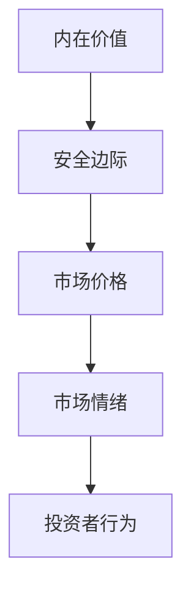
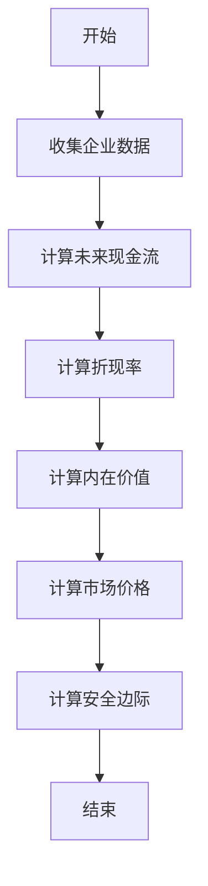
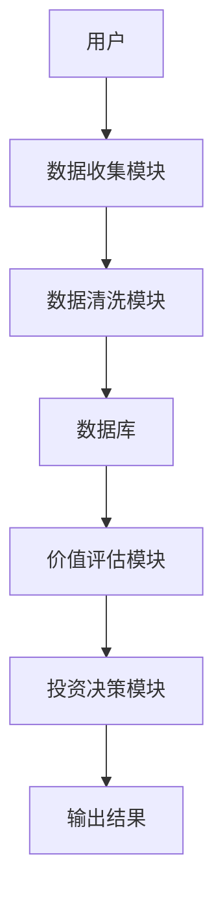
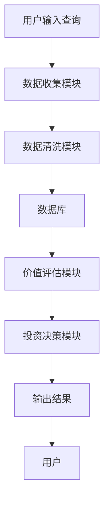

                 


# 沃尔特·施洛斯的小盘股价值投资策略

> 关键词：价值投资，小盘股，沃尔特·施洛斯，安全边际，内在价值，投资策略

> 摘要：本文详细介绍了沃尔特·施洛斯的小盘股价值投资策略，从背景介绍、核心概念到算法原理、系统架构，再到项目实战和最佳实践，全面解析了该策略的理论基础和实际应用。通过本文，读者将深入了解如何运用价值投资的方法在小盘股市场中寻找投资机会，并构建稳健的投资组合。

---

# 第一部分: 小盘股价值投资的背景与核心理念

## 第1章: 小盘股价值投资的背景介绍

### 1.1 小盘股投资的定义与特点

#### 1.1.1 小盘股的定义
小盘股是指市值较小的公司股票，通常指市值在50亿至500亿美元之间的公司。这些公司通常处于成长阶段，具有较高的增长潜力，但也伴随着较高的风险。

#### 1.1.2 小盘股投资的核心特点
- **高增长潜力**：小盘股公司通常处于扩张阶段，具有较高的增长潜力。
- **高波动性**：由于市值较小，小盘股的股价波动较大，容易受到市场情绪的影响。
- **低关注**：与大盘股相比，小盘股通常不受市场广泛关注，这为投资者提供了挖掘潜在机会的空间。

#### 1.1.3 小盘股投资的市场定位
小盘股投资在资本市场中占据重要地位，尤其是在成长型投资中。与大盘股相比，小盘股具有更高的增长潜力，但也需要投资者具备更强的市场敏感性和风险控制能力。

### 1.2 沃尔特·施洛斯的投资理念

#### 1.2.1 价值投资的基本原理
价值投资是一种投资策略，强调以低于内在价值的价格购买优质资产。其核心在于寻找市场先生的错误定价，通过长期持有优质资产实现财富增长。

#### 1.2.2 施洛斯的价值投资策略
沃尔特·施洛斯是价值投资的代表人物之一，他专注于小盘股投资，强调安全边际和内在价值。他的策略包括：
- **寻找低估的公司**：通过分析财务报表和行业趋势，寻找那些市场价格低于内在价值的公司。
- **长期持有**：一旦找到优质的低估股票，长期持有，等待市场重新评估其价值。
- **分散投资**：通过分散投资降低风险，避免过度集中于单一行业或公司。

#### 1.2.3 施洛斯投资风格的独特性
施洛斯的投资风格独特之处在于他对小盘股的专注和对安全边际的高度重视。他不仅关注公司的基本面，还关注市场的波动性和情绪，从而在市场低估时买入，高估时卖出。

## 第2章: 小盘股价值投资的核心概念与联系

### 2.1 价值投资的核心原理

#### 2.1.1 内在价值的定义与计算
内在价值是指一家公司基于其财务状况、行业地位和未来前景，通过折现现金流法等方法计算出的理论价值。施洛斯通过分析公司的盈利能力、成长潜力和财务健康状况来估算其内在价值。

#### 2.1.2 安全边际的概念与重要性
安全边际是指市场价格与内在价值之间的差距。施洛斯认为，买入时的安全边际越大，投资风险越小，收益潜力越大。安全边际是价值投资的核心要素之一，它帮助投资者在市场波动中保持稳健。

#### 2.1.3 市场先生的角色与影响
市场先生是本杰明·格雷厄姆提出的概念，指市场的短期波动性。施洛斯认为，市场先生经常犯错，投资者应利用市场的非理性波动，抓住低估的机会。

### 2.2 核心概念对比分析

#### 2.2.1 内在价值与市场价值的对比
| 属性         | 内在价值         | 市场价值       |
|--------------|------------------|----------------|
| 定义         | 理论价值，基于公司基本面 | 当前市场价格     |
| 变化因素     | 公司盈利、成长性 | 市场情绪、供需   |
| 作用         | 作为买入参考     | 作为市场信号     |

#### 2.2.2 安全边际与风险控制的对比
| 属性         | 安全边际         | 风险控制       |
|--------------|------------------|----------------|
| 定义         | 市场价与内在价值的差距 | 控制投资风险   |
| 方法         | 选择低估股票     | 分散投资、止损  |
| 作用         | 提高投资安全性   | 减少损失       |

#### 2.2.3 小盘股与大盘股的对比
| 属性         | 小盘股         | 大盘股       |
|--------------|----------------|----------------|
| 市值范围     | 50-500亿美元   | 500亿美元以上 |
| 成长潜力     | 高             | 中等          |
| 波动性         | 高             | 低            |
| 投资难度     | 高             | 中等          |

### 2.3 实体关系图



---

# 第二部分: 小盘股价值投资的算法与数学模型

## 第3章: 小盘股价值评估的数学模型

### 3.1 价值评估的基本公式

#### 3.1.1 内在价值计算公式
$$ V = \frac{E}{k} $$
其中，$E$ 是企业未来现金流的现值，$k$ 是折现率。

#### 3.1.2 安全边际计算公式
$$ \text{安全边际} = V - P $$
其中，$V$ 是内在价值，$P$ 是市场价格。

### 3.2 价值评估的流程图



### 3.3 Python实现示例

```python
def calculate_intrinsic_value(enterprise_value, discount_rate):
    return enterprise_value / discount_rate

def calculate_margin_of_safety(intrinsic_value, market_price):
    return intrinsic_value - market_price

# 示例数据
enterprise_value = 1000  # 以百万美元为单位
discount_rate = 0.1       # 10%
market_price = 800        # 以美元为单位

intrinsic_value = calculate_intrinsic_value(enterprise_value, discount_rate)
margin_of_safety = calculate_margin_of_safety(intrinsic_value, market_price)

print(f"内在价值: ${intrinsic_value:.2f}百万美元")
print(f"安全边际: ${margin_of_safety:.2f}美元")
```

---

## 第4章: 投资组合优化的数学模型

### 4.1 投资组合优化的基本原理

#### 4.1.1 投资组合优化的目标
投资组合优化的目标是在风险可控的前提下，实现收益的最大化。施洛斯通过分散投资于多个小盘股，降低单一股票的风险。

#### 4.1.2 投资组合优化的数学模型
$$ \text{收益} = \sum (w_i \times r_i) $$
$$ \text{风险} = \sum (w_i^2 \times \sigma_i^2) $$
其中，$w_i$ 是第$i$只股票的权重，$r_i$ 是预期收益率，$\sigma_i$ 是收益的标准差。

---

# 第三部分: 小盘股价值投资的系统分析与架构设计

## 第5章: 小盘股价值投资的系统架构

### 5.1 系统功能设计

#### 5.1.1 数据收集模块
- 数据来源：财务报表、行业报告、市场数据等。
- 数据清洗：剔除无效或异常数据。
- 数据存储：存储于数据库中，便于后续分析。

#### 5.1.2 价值评估模块
- 内在价值计算：基于财务数据计算内在价值。
- 安全边际计算：比较市场价格与内在价值，计算安全边际。
- 筛选股票：根据安全边际和内在价值，筛选出符合条件的股票。

#### 5.1.3 投资决策模块
- 投资组合优化：根据筛选结果，优化投资组合。
- 风险控制：设置止损点和止盈点，控制投资风险。

### 5.2 系统架构设计



### 5.3 系统交互流程



---

# 第四部分: 小盘股价值投资的项目实战

## 第6章: 小盘股价值投资的实战分析

### 6.1 项目环境安装

#### 6.1.1 安装Python环境
使用Anaconda安装Python 3.8及以上版本。

#### 6.1.2 安装相关库
```bash
pip install pandas numpy matplotlib
```

### 6.2 核心代码实现

#### 6.2.1 数据收集与清洗
```python
import pandas as pd

# 假设我们从Yahoo Finance获取数据
def get_stock_data(ticker):
    # 这里需要实现获取股票数据的逻辑
    pass

tickers = ['AAPL', 'MSFT', 'AMZN']  # 示例股票代码
df = pd.DataFrame()
for ticker in tickers:
    data = get_stock_data(ticker)
    df = df.append(data)
```

#### 6.2.2 价值评估与筛选
```python
def calculate_intrinsic_value(df):
    # 假设df包含企业价值和折现率
    df['内在价值'] = df['企业价值'] / df['折现率']
    return df

def calculate_margin_of_safety(df, market_price):
    df['安全边际'] = df['内在价值'] - market_price
    return df

# 示例数据
df = pd.DataFrame({
    '企业价值': [1000, 1200, 900],
    '折现率': [0.1, 0.09, 0.11],
    '市场价格': [800, 900, 700]
})

df = calculate_intrinsic_value(df)
df = calculate_margin_of_safety(df, df['市场价格'])
print(df)
```

### 6.3 投资组合优化与风险控制

#### 6.3.1 投资组合优化
```python
import numpy as np

def optimize_portfolio(returns, weights):
    # 计算风险
    risk = np.sum(weights**2 * np.array(returns)**2)
    return risk

# 示例数据
returns = [0.1, 0.15, 0.08]
weights = [0.3, 0.4, 0.3]

risk = optimize_portfolio(returns, weights)
print(f"投资组合风险: {risk:.4f}")
```

#### 6.3.2 风险控制
```python
def set_stop_loss(price, stop_loss_percent):
    stop_loss_price = price * (1 - stop_loss_percent)
    return stop_loss_price

# 示例数据
price = 100
stop_loss_percent = 0.1  # 10%

stop_loss_price = set_stop_loss(price, stop_loss_percent)
print(f"止损价格: ${stop_loss_price:.2f}")
```

---

## 第7章: 小盘股价值投资的小结与展望

### 7.1 小结

- **核心理念**：价值投资的核心在于寻找市场价格低于内在价值的公司。
- **策略优势**：通过小盘股投资，投资者可以挖掘高成长潜力的公司，同时通过安全边际降低投资风险。
- **系统支持**：通过系统化的数据收集、分析和决策模块，投资者可以更高效地进行价值评估和投资决策。

### 7.2 展望

- **技术进步**：随着人工智能和大数据技术的发展，小盘股投资将更加依赖于量化分析和机器学习模型。
- **市场变化**：小盘股市场的波动性和不确定性要求投资者不断调整策略，以应对市场的变化。

---

# 第五部分: 小盘股价值投资的最佳实践

## 第8章: 小盘股价值投资的最佳实践

### 8.1 投资策略

- **分散投资**：避免过度集中于单一股票或行业。
- **长期持有**：耐心等待市场重新评估公司价值。
- **定期复盘**：定期检查投资组合，调整不符合条件的股票。

### 8.2 风险管理

- **设置止损**：当股价下跌超过一定幅度时，及时止损。
- **控制仓位**：避免杠杆交易，控制投资仓位。
- **关注流动性**：选择流动性较好的小盘股，避免交易不活跃的股票。

### 8.3 心理素质

- **保持耐心**：价值投资需要长期持有，耐心等待收益。
- **避免情绪化**：市场波动时，避免情绪化交易，坚持基本面分析。
- **持续学习**：不断学习市场知识，提升自己的投资能力。

---

## 第9章: 小盘股价值投资的注意事项

### 9.1 注意事项

- **市场波动**：小盘股的股价波动较大，投资者需具备较强的心理承受能力。
- **公司基本面**：投资前需对公司的财务状况和行业前景进行深入分析。
- **行业风险**：小盘股集中在某些行业，需关注行业周期性风险。

### 9.2 常见误区

- **忽视流动性**：交易不活跃的小盘股可能难以以合理价格买卖。
- **过度分散**：过于分散可能导致收益稀释，降低整体回报。
- **忽略管理层**：公司管理层对公司发展至关重要，需关注管理层的素质和稳定性。

---

## 第10章: 小盘股价值投资的拓展阅读

### 10.1 经典书籍

- 《The Intelligent Investor》——本杰明·格雷厄姆
- 《The Little Book of Value Investing》——克里斯·哈根
- 《Warren Buffett and the Art of Stock Investing》——查理·芒格

### 10.2 网络资源

- 网站：[Value Investing Research](https://www.valueinvestingresearch.com)
- 论坛：[Investor's Buz](https://www.investorsbuz.com)
- 书籍推荐：[小盘股投资策略](https://www.amazon.com/s?k=small-cap+value+investing)

---

# 结语

沃尔特·施洛斯的小盘股价值投资策略为投资者提供了独特的视角和方法。通过深入分析公司的内在价值和市场价格之间的关系，投资者可以在小盘股市场中找到低估的机会，并通过长期持有实现稳健的收益。然而，小盘股投资也伴随着较高的风险和不确定性，投资者需要具备扎实的基本面分析能力和较强的心理素质，才能在市场波动中保持冷静，抓住投资机会。

---

# 作者：AI天才研究院/AI Genius Institute & 禅与计算机程序设计艺术 /Zen And The Art of Computer Programming

