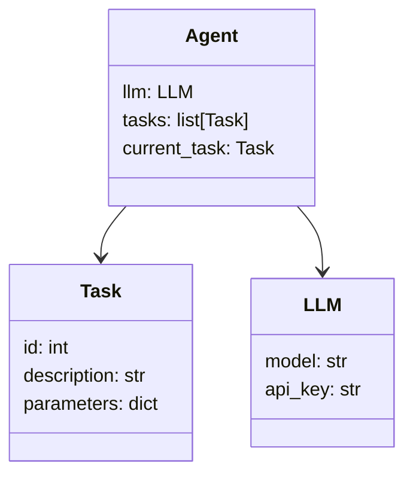
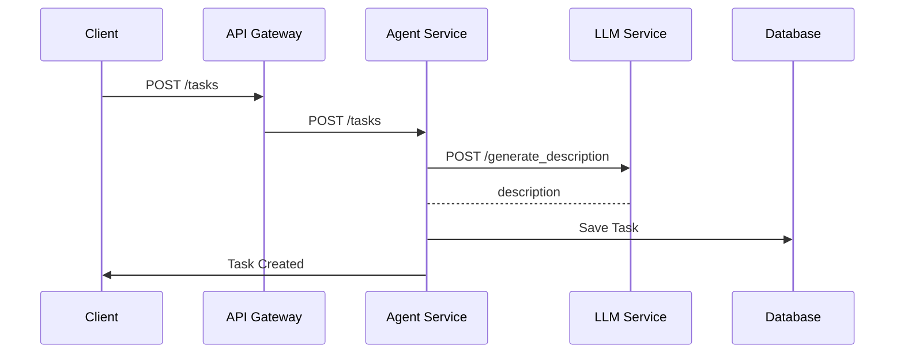

                 


# AI Agent的元学习：快速适应新任务的LLM

## 关键词：AI Agent，元学习，大语言模型，快速适应，任务迁移

## 摘要：  
本文深入探讨了AI Agent在大语言模型（LLM）中的元学习机制，分析了元学习如何帮助AI Agent快速适应新任务，提升其泛化能力和任务迁移能力。通过详细阐述元学习的原理、算法实现以及系统架构，本文为读者提供了从理论到实践的全面指导。

---

# 第一部分: AI Agent的元学习基础

## 第1章: AI Agent与元学习概述

### 1.1 AI Agent的基本概念

#### 1.1.1 AI Agent的定义与分类
AI Agent（人工智能代理）是一种能够感知环境、自主决策并执行任务的智能实体。它可以分为以下几类：
- **简单反射型代理**：基于当前输入直接生成输出。
- **基于模型的反射型代理**：维护环境的状态模型，用于决策。
- **目标驱动型代理**：根据预定义的目标执行任务。
- **实用驱动型代理**：通过最大化效用函数来优化决策。

#### 1.1.2 AI Agent的核心功能与特点
AI Agent的核心功能包括：
- **感知环境**：通过传感器或API获取环境信息。
- **自主决策**：基于感知信息做出决策。
- **执行任务**：通过执行器或API与环境交互。
- **学习与适应**：通过学习算法优化自身行为。

AI Agent的特点：
- **自主性**：能够在没有外部干预的情况下运行。
- **反应性**：能够实时感知并响应环境变化。
- **目标导向性**：通过目标或任务驱动行为。
- **可扩展性**：能够适应不同规模的任务。

#### 1.1.3 AI Agent在LLM中的应用
AI Agent可以与大语言模型（LLM）结合，通过自然语言处理能力完成复杂任务。例如：
- **对话代理**：在客服系统中提供智能对话服务。
- **任务执行代理**：通过LLM理解任务描述并执行具体操作。
- **多轮交互代理**：在复杂场景中维护上下文并进行多轮对话。

---

### 1.2 元学习的基本概念

#### 1.2.1 元学习的定义与特点
元学习（Meta-Learning）是一种机器学习范式，旨在通过学习如何学习，快速适应新任务。其特点包括：
- **快速适应性**：能够在少量数据或经验下快速掌握新任务。
- **任务多样性**：适用于多种不同任务的迁移学习。
- **元参数优化**：通过优化元参数（meta-parameters）来适应新任务。

#### 1.2.2 元学习与传统机器学习的区别
| 特性 | 传统机器学习 | 元学习 |
|------|--------------|--------|
| 数据需求 | 需要大量标注数据 | 适用于小样本数据 |
| 任务适应 | 适用于单一任务 | 适用于多种任务的快速迁移 |
| 学习目标 | 学习具体任务 | 学习如何学习 |

#### 1.2.3 元学习在AI Agent中的作用
元学习通过以下方式提升AI Agent的能力：
- **快速任务适应**：在新任务上线时，AI Agent能够快速调整策略。
- **多任务处理**：AI Agent可以在多种任务之间切换，无需重新训练。
- **泛化能力**：通过元学习，AI Agent能够更好地泛化到未见过的场景。

---

### 1.3 LLM与AI Agent的结合

#### 1.3.1 LLM的基本原理
大语言模型（LLM）通过大规模数据训练，掌握了丰富的语言模式和知识。其基本原理包括：
- **预训练**：在海量文本数据上进行无监督学习。
- **微调**：针对特定任务进行有监督微调。
- **生成机制**：通过解码器生成自然语言文本。

#### 1.3.2 LLM与AI Agent的协同工作
AI Agent通过调用LLM的API，结合自身的任务理解和执行能力，完成复杂任务。例如：
- **任务理解**：AI Agent通过LLM理解用户需求。
- **决策制定**：AI Agent基于LLM的建议做出决策。
- **多模态交互**：AI Agent通过LLM与用户进行自然语言对话。

#### 1.3.3 元学习在LLM中的应用前景
元学习可以使LLM具备更好的任务适应能力：
- **快速微调**：通过元学习，LLM可以在少量数据下快速适应新任务。
- **多任务优化**：元学习可以优化LLM在多个任务上的表现。
- **动态调整**：元学习可以使LLM根据实时反馈动态调整输出。

---

### 1.4 本章小结
本章介绍了AI Agent和元学习的基本概念，分析了它们在LLM中的应用。元学习通过提升AI Agent的任务适应能力，为大语言模型的应用带来了新的可能性。

---

# 第二部分: 元学习的核心原理

## 第2章: 元学习的原理与机制

### 2.1 元学习的核心概念

#### 2.1.1 元学习的层次结构
元学习的层次结构包括：
- **元任务**：定义多个相关任务的集合。
- **任务层**：具体任务的定义和数据分布。
- **学习者**：通过元学习优化模型参数以适应新任务。

#### 2.1.2 元学习的特征与优势
元学习的特征：
- **快速适应性**：能够在少量数据下快速掌握新任务。
- **任务多样性**：适用于多种任务的迁移学习。
- **可解释性**：元学习模型通常具有较高的可解释性。

元学习的优势：
- **减少数据需求**：在数据不足的情况下，元学习仍然能够有效工作。
- **提升泛化能力**：通过元学习，模型能够更好地泛化到未见过的场景。
- **降低训练成本**：元学习可以在一次训练中优化多个任务。

#### 2.1.3 元学习的数学模型概述
元学习的数学模型通常包括以下几个部分：
- **元参数**：用于控制模型的参数更新。
- **任务损失**：定义具体任务的损失函数。
- **元损失**：定义元任务的损失函数，用于优化元参数。

---

### 2.2 元学习的算法框架

#### 2.2.1 元学习的通用算法框架
元学习的通用算法框架包括：
1. **初始化**：初始化模型参数和元参数。
2. **任务循环**：遍历所有任务。
3. **任务训练**：在每个任务上优化模型参数。
4. **元训练**：通过元损失优化元参数。

#### 2.2.2 典型元学习算法对比
| 算法名称 | MAML | Reptile | 其他 |
|----------|-------|---------|------|
| 核心思想 | 使用梯度的梯度 | 使用梯度下降的梯度 | 各自有特点 |
| 优势 | 能够处理非i.i.d任务 | 计算简单 | - |
| 劣势 | 计算复杂 | 对任务分布假设较强 | - |

---

### 2.3 元学习与AI Agent的结合

#### 2.3.1 元学习在AI Agent任务适应中的作用
元学习通过以下方式帮助AI Agent适应新任务：
- **快速微调**：在新任务上线时，通过元学习快速调整模型参数。
- **多任务处理**：元学习使得AI Agent可以在多个任务之间切换，无需重新训练。
- **动态调整**：元学习可以使AI Agent根据实时反馈动态调整输出。

#### 2.3.2 元学习如何提升AI Agent的泛化能力
元学习通过以下方式提升AI Agent的泛化能力：
- **任务多样性**：通过在多个任务上进行元训练，提升模型的泛化能力。
- **任务间关联**：利用任务之间的关联性，提升模型的泛化能力。
- **动态适应**：通过元学习，模型可以动态调整参数以适应新任务。

#### 2.3.3 元学习在AI Agent中的具体应用场景
元学习在AI Agent中的具体应用场景包括：
- **多轮对话**：在对话过程中，AI Agent可以根据上下文动态调整回复策略。
- **任务执行**：在执行复杂任务时，AI Agent可以通过元学习快速调整执行策略。
- **动态环境适应**：在动态变化的环境中，AI Agent可以通过元学习快速适应新环境。

---

### 2.4 本章小结
本章深入分析了元学习的核心原理和算法框架，探讨了元学习在AI Agent中的具体应用。通过元学习，AI Agent能够快速适应新任务，提升其泛化能力和任务迁移能力。

---

# 第三部分: 元学习算法的数学模型与实现

## 第3章: 元学习算法的数学模型

### 3.1 元学习的基本数学模型

#### 3.1.1 元学习的优化目标
元学习的优化目标是：
$$ \min_{\theta} \mathbb{E}_{t \sim \mathcal{T}} \left[ \mathcal{L}_t(f_{\theta}(x_t)) \right] $$
其中，$\theta$是元参数，$\mathcal{T}$是任务分布，$\mathcal{L}_t$是任务损失函数，$f_{\theta}$是模型参数。

---

#### 3.1.2 元学习的损失函数
元学习的损失函数通常包括任务损失和元损失：
$$ \mathcal{L}_{\text{meta}} = \mathbb{E}_{t \sim \mathcal{T}} \left[ \mathcal{L}_t(f_{\theta}(x_t)) \right] $$

---

#### 3.1.3 元学习的参数更新公式
元学习的参数更新公式通常包括两个步骤：
1. 在每个任务上优化模型参数：
$$ \theta_t = \theta - \eta \nabla_{\theta} \mathcal{L}_t(f_{\theta}(x_t)) $$
2. 通过元损失优化元参数：
$$ \theta_{\text{new}} = \theta - \beta \nabla_{\theta} \mathcal{L}_{\text{meta}} $$

---

### 3.2 典型元学习算法的数学推导

#### 3.2.1 MAML算法的数学推导
MAML算法的核心思想是通过计算梯度的梯度来优化元参数。具体步骤如下：
1. 计算任务损失的梯度：
$$ \nabla_{\theta} \mathcal{L}_t $$
2. 计算梯度的梯度：
$$ \nabla_{\theta} (\nabla_{\theta} \mathcal{L}_t) $$
3. 更新元参数：
$$ \theta_{\text{new}} = \theta - \beta \nabla_{\theta} (\nabla_{\theta} \mathcal{L}_t) $$

---

#### 3.2.2 Reptile算法的数学推导
Reptile算法的核心思想是通过计算梯度的平均值来优化元参数。具体步骤如下：
1. 在每个任务上计算梯度：
$$ \nabla_{\theta} \mathcal{L}_t $$
2. 计算梯度的平均值：
$$ \nabla_{\theta} \mathcal{L}_{\text{meta}} = \frac{1}{K} \sum_{t=1}^{K} \nabla_{\theta} \mathcal{L}_t $$
3. 更新元参数：
$$ \theta_{\text{new}} = \theta - \beta \nabla_{\theta} \mathcal{L}_{\text{meta}} $$

---

### 3.3 元学习算法的代码实现

#### 3.3.1 环境安装与配置
安装必要的库：
```bash
pip install torch
```

---

#### 3.3.2 元学习算法的Python代码实现
以下是MAML算法的Python代码示例：
```python
import torch

def maml_update(model, optimizer, tasks, inner_steps, inner_learning_rate, outer_learning_rate):
    # 零阶初始化
    for task in tasks:
        # 前向传播
        outputs = model(task.x)
        # 计算损失
        loss = model.criterion(outputs, task.y)
        # 反向传播
        loss.backward()
        # 更新模型参数
        optimizer.step(inner_learning_rate)
    # 计算梯度的梯度
    for param in model.parameters():
        param.grad = param.grad / len(tasks)
    # 更新元参数
    optimizer.step(outer_learning_rate)
```

---

#### 3.3.3 代码的功能解读与优化建议
1. **零阶初始化**：在每个任务上进行前向传播和反向传播，更新模型参数。
2. **梯度计算**：计算任务损失的梯度，并求平均。
3. **元参数更新**：通过平均梯度更新元参数。

优化建议：
- **学习率调整**：在训练过程中动态调整学习率。
- **正则化**：在损失函数中添加正则化项，防止过拟合。
- **任务采样**：在训练过程中动态采样任务，保持任务多样性。

---

### 3.4 本章小结
本章详细推导了典型元学习算法的数学模型，并提供了Python代码实现。通过这些算法，AI Agent可以快速适应新任务，提升其任务迁移能力。

---

# 第四部分: 系统分析与架构设计

## 第4章: 系统分析与架构设计方案

### 4.1 问题场景介绍
假设我们正在开发一个AI Agent系统，该系统需要通过大语言模型（LLM）快速适应多种任务。系统需要具备以下功能：
- **任务理解**：理解用户需求并解析任务。
- **任务执行**：根据任务描述执行具体操作。
- **结果反馈**：将结果反馈给用户并进行多轮交互。

---

### 4.2 项目介绍
本项目的目标是开发一个基于元学习的AI Agent系统，通过LLM快速适应新任务。项目包括以下模块：
- **任务管理模块**：管理所有任务的定义和执行。
- **LLM调用模块**：与大语言模型进行交互。
- **元学习模块**：通过元学习优化模型参数。

---

### 4.3 系统功能设计

#### 4.3.1 领域模型设计
以下是领域模型的类图（使用Mermaid）：


---

#### 4.3.2 系统架构设计
以下是系统架构的架构图（使用Mermaid）：


---

#### 4.3.3 系统接口设计
系统接口设计包括：
- **任务提交接口**：`POST /tasks`
- **任务执行接口**：`POST /execute_task`
- **结果反馈接口**：`POST /feedback`

---

#### 4.3.4 系统交互序列图
以下是系统交互的序列图（使用Mermaid）：


---

### 4.4 本章小结
本章分析了AI Agent系统的整体架构，并通过领域模型和系统架构图展示了各模块的交互关系。通过接口设计和序列图，进一步明确了系统的实现细节。

---

# 第五部分: 项目实战

## 第5章: 项目实战

### 5.1 环境安装与配置
安装必要的库：
```bash
pip install torch transformers
```

---

### 5.2 系统核心实现源代码

#### 5.2.1 任务管理模块
```python
class TaskManager:
    def __init__(self):
        self.tasks = []
    
    def add_task(self, task):
        self.tasks.append(task)
    
    def get_task(self, task_id):
        return next((task for task in self.tasks if task.id == task_id), None)
```

---

#### 5.2.2 LLM调用模块
```python
class LLMCaller:
    def __init__(self, model_name, api_key):
        self.model_name = model_name
        self.api_key = api_key
    
    def call(self, prompt):
        # 这里需要实现具体的API调用逻辑
        pass
```

---

#### 5.2.3 元学习模块
```python
class MetaLearningModule:
    def __init__(self, model, optimizer):
        self.model = model
        self.optimizer = optimizer
    
    def update(self, tasks, inner_steps, inner_learning_rate, outer_learning_rate):
        # 这里需要实现具体的元学习更新逻辑
        pass
```

---

### 5.3 代码应用解读与分析
1. **任务管理模块**：负责任务的添加和获取。
2. **LLM调用模块**：负责与大语言模型进行交互。
3. **元学习模块**：负责通过元学习优化模型参数。

---

### 5.4 实际案例分析与详细讲解
假设我们有一个客服对话系统，AI Agent需要通过元学习快速适应不同客户的对话风格。具体步骤如下：
1. **任务理解**：AI Agent通过元学习理解不同客户的对话风格。
2. **任务执行**：AI Agent根据理解的对话风格生成合适的回复。
3. **结果反馈**：根据客户的反馈调整对话策略。

---

### 5.5 项目小结
本章通过实际案例分析，展示了如何将元学习应用于AI Agent系统中。通过代码实现和案例分析，读者可以更好地理解元学习在实际项目中的应用。

---

# 第六部分: 最佳实践

## 第6章: 最佳实践

### 6.1 小结
通过本文的介绍，读者可以了解到AI Agent的元学习机制，以及如何通过元学习快速适应新任务。元学习为AI Agent的应用带来了新的可能性。

---

### 6.2 注意事项
1. **数据质量**：元学习对数据质量要求较高，需要确保数据的多样性和代表性。
2. **任务关联性**：元学习适用于任务之间存在关联性的场景。
3. **计算资源**：元学习的计算复杂度较高，需要充足的计算资源。

---

### 6.3 拓展阅读
1. **MAML论文**：《Meta-Learning via Backward and Forward Knowledge Transfer》。
2. **Reptile论文**：《Reptile: A Simple and Scalable Meta-Learning Algorithm》。
3. **大语言模型**：《The Anatomy of Deep Learning: A Comprehensive Survey》。

---

# 结语

通过本文的详细介绍，读者可以全面了解AI Agent的元学习机制，以及如何通过元学习快速适应新任务。元学习作为人工智能领域的重要技术，必将在未来的AI Agent应用中发挥越来越重要的作用。

---

# 作者：AI天才研究院/AI Genius Institute & 禅与计算机程序设计艺术 /Zen And The Art of Computer Programming

