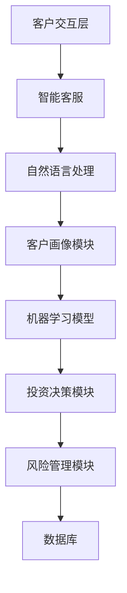
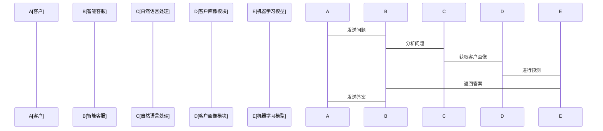

                 


# AI技术在私人银行业务中的应用前景分析

> 关键词：AI技术、私人银行、财富管理、智能投顾、风险管理、客户画像

> 摘要：随着人工智能技术的迅速发展，AI在金融领域的应用越来越广泛。本文分析了AI技术在私人银行业务中的应用前景，探讨了AI在客户画像、风险评估、智能投顾等核心业务中的具体应用，揭示了AI如何提升私人银行的效率和客户体验。通过结合机器学习、自然语言处理和深度学习等技术，本文深入探讨了AI在私人银行中的实际应用场景，并展望了未来的发展趋势。

---

# 第1章: AI技术与私人银行的背景介绍

## 1.1 私人银行的基本概念

### 1.1.1 私人银行的定义与核心业务

私人银行是指为高净值个人（High Net Worth Individuals, HNWI）提供个性化金融服务的机构。其核心业务包括财富管理、资产配置、投资顾问、风险管理、税务规划等。私人银行的目标是帮助客户实现财富保值、增值，并优化税务负担。

### 1.1.2 私人银行的客户群体特征

私人银行的客户通常具有高净值、复杂的投资需求和个性化服务需求。这些客户对金融服务的精准性和定制化要求较高，且对隐私保护有严格要求。

### 1.1.3 私人银行的传统运作模式

传统私人银行主要依赖人工服务，通过一对一的客户经理与客户互动，提供个性化的财务建议。这种模式虽然能够满足客户的个性化需求，但存在效率低下、成本高昂的问题，尤其是在面对大量客户需求时，难以实现快速响应和高效处理。

## 1.2 AI技术的基本概念与发展趋势

### 1.2.1 AI技术的定义与技术架构

人工智能（Artificial Intelligence, AI）是指通过模拟人类智能的某些方面，如学习、推理、问题解决和自然语言处理，来构建能够执行复杂任务的系统。AI的核心技术包括机器学习、自然语言处理（NLP）、计算机视觉、强化学习等。

### 1.2.2 当前AI技术的主要发展趋势

近年来，AI技术在多个领域取得了显著进展，尤其是在金融行业。深度学习、强化学习和自然语言处理技术的快速发展，使得AI在金融领域的应用更加广泛和深入。

### 1.2.3 AI技术在金融领域的应用现状

AI技术已经在金融领域的多个方面得到了应用，包括智能投顾、风险管理、信用评估、 fraud detection等。在私人银行领域，AI技术的应用还处于起步阶段，但其潜力巨大。

## 1.3 AI技术与私人银行的结合背景

### 1.3.1 私人银行面临的业务挑战

私人银行在传统运作模式下，面临着以下挑战：
- **客户数量增长**：高净值客户的数量不断增加，传统的人工服务模式难以满足高效服务的需求。
- **服务成本高昂**：私人银行依赖大量客户经理，导致运营成本居高不下。
- **个性化需求复杂**：客户需求日益多样化和复杂化，需要更加精准的服务。
- **风险控制压力大**：市场波动和客户需求变化使得风险管理更具挑战性。

### 1.3.2 AI技术如何解决私人银行的痛点

AI技术可以通过自动化、智能化的方式，帮助私人银行解决上述痛点：
- **提高服务效率**：AI可以快速处理大量数据，提供实时的市场分析和客户建议。
- **降低运营成本**：通过自动化流程减少对人工的依赖，降低运营成本。
- **精准满足客户需求**：利用AI进行客户画像和需求预测，提供个性化服务。
- **加强风险管理**：通过实时监控和预测模型，有效识别和规避风险。

### 1.3.3 二者的结合对行业的影响

AI技术的应用将推动私人银行从传统的人工服务模式向智能化服务模式转型，从而提升服务效率、降低运营成本、增强客户满意度，并在市场竞争中占据优势地位。

## 1.4 本章小结

本章介绍了私人银行的基本概念、客户群体特征和传统运作模式，并探讨了AI技术的基本概念和发展趋势。最后，结合私人银行面临的业务挑战，分析了AI技术如何解决这些痛点，并指出了二者的结合对行业的影响。

---

# 第2章: AI技术在私人银行中的核心应用场景

## 2.1 客户画像与需求分析

### 2.1.1 客户画像的构建方法

客户画像是基于客户的各项数据，构建一个全面、精准的客户信息模型。通过分析客户的财务状况、投资偏好、风险承受能力等信息，AI可以帮助私人银行更好地理解客户需求。

#### 使用机器学习构建客户画像的步骤：

1. **数据收集**：收集客户的财务数据、投资历史、消费行为等信息。
2. **数据清洗**：去除无效数据，处理缺失值和异常值。
3. **特征提取**：提取客户的财务状况、风险偏好等关键特征。
4. **模型训练**：使用监督学习算法（如决策树、随机森林）进行客户分类或聚类。
5. **结果分析**：根据模型输出，生成客户画像。

### 2.1.2 利用AI进行客户需求预测

通过分析客户的画像，AI可以预测客户未来的投资需求和风险偏好。例如，利用时间序列分析模型（如ARIMA）预测市场走势，帮助客户做出投资决策。

#### 示例：使用时间序列分析模型预测市场走势

```python
from statsmodels.tsa.arima.model import ARIMA
import pandas as pd

# 假设我们有一个包含市场指数的数据集
data = pd.read_csv('market_data.csv')
# 拆分训练集和测试集
train = data[:80]
test = data[80:]
# 训练ARIMA模型
model = ARIMA(train, order=(5,1,0))
model_fit = model.fit()
# 预测未来的价格
future_forecast = model_fit.forecast(steps=20)
print(future_forecast)
```

### 2.1.3 客户分层与精准营销

通过客户画像和需求分析，AI可以帮助私人银行将客户分为不同的群体，并制定个性化的营销策略。例如，利用聚类分析将客户分为保守型、稳健型和激进型投资者，并针对不同类型的客户推荐不同的投资产品。

## 2.2 风险评估与管理

### 2.2.1 利用AI进行信用风险评估

信用风险评估是私人银行风险管理的重要组成部分。AI可以通过分析客户的信用历史、财务状况等数据，评估客户的信用风险。

#### 使用逻辑回归模型进行信用风险评估

```python
from sklearn.linear_model import LogisticRegression
from sklearn.metrics import accuracy_score

# 假设我们有一个包含客户信用数据的训练集和测试集
X_train = ... # 特征变量
y_train = ... # 标签（违约与否）
X_test = ... 
y_test = ...

# 训练逻辑回归模型
model = LogisticRegression()
model.fit(X_train, y_train)

# 预测测试集的标签
y_pred = model.predict(X_test)

# 计算准确率
print("Accuracy:", accuracy_score(y_test, y_pred))
```

### 2.2.2 市场风险的智能化监控

通过实时监控市场数据，AI可以帮助私人银行识别潜在的市场风险。例如，利用自然语言处理技术分析新闻和社交媒体数据，预测市场情绪的变化。

#### 使用情感分析模型预测市场情绪

```python
from transformers import pipeline

# 加载预训练的情感分析模型
sentiment_analyzer = pipeline("sentiment-analysis")

# 分析一条市场新闻的情绪
text = "The stock market is expected to rise due to positive economic indicators."
result = sentiment_analyzer(text)
print(result)
```

### 2.2.3 AI在合规与反欺诈中的应用

通过分析交易数据，AI可以帮助私人银行识别欺诈行为和洗钱活动。例如，利用异常检测算法（如Isolation Forest）识别异常交易。

#### 使用Isolation Forest进行异常检测

```python
from sklearn.ensemble import IsolationForest

# 假设我们有一个包含交易数据的训练集
X = ... # 特征变量

# 训练Isolation Forest模型
model = IsolationForest(random_state=42)
model.fit(X)

# 预测异常交易
X_new = ... # 新的交易数据
y_pred = model.predict(X_new)
print(y_pred)
```

## 2.3 投资决策与资产配置

### 2.3.1 AI驱动的智能投顾系统

智能投顾系统可以根据客户的风险偏好和财务状况，推荐合适的投资组合。例如，使用强化学习算法（如Deep Q-Learning）优化投资组合。

#### 使用强化学习优化投资组合

```python
import numpy as np
from tensorflow.keras import Sequential
from tensorflow.keras.layers import Dense, LSTM

# 假设我们有一个包含历史股价的数据集
prices = ... # 历史股价数据

# 定义强化学习环境
class TradingEnvironment:
    def __init__(self, prices):
        self.prices = prices
        self.current_step = 0
        self.done = False

    def reset(self):
        self.current_step = 0
        return self.prices[self.current_step]

    def step(self, action):
        # 动作：0（买入），1（卖出）
        reward = 0
        next_price = self.prices[self.current_step + 1]
        if action == 0:
            reward = (next_price - self.prices[self.current_step]) / self.prices[self.current_step]
        elif action == 1:
            reward = (self.prices[self.current_step] - next_price) / self.prices[self.current_step]
        self.current_step += 1
        if self.current_step >= len(self.prices) - 1:
            self.done = True
        return next_price, reward, self.done

# 定义强化学习模型
model = Sequential()
model.add(LSTM(32, input_shape=(1, 1)))
model.add(Dense(2, activation='softmax'))
model.compile(optimizer='adam', loss='sparse_categorical_crossentropy')

# 训练模型
env = TradingEnvironment(prices)
for _ in range(100):
    state = env.reset()
    while not env.done:
        action_probs = model.predict(np.array([state]))
        action = np.random.choice(2, p=action_probs[0])
        next_state, reward, done = env.step(action)
```

### 2.3.2 资产配置的动态优化

通过实时市场数据和客户反馈，AI可以动态优化资产配置，帮助客户实现财富最大化。

#### 示例：动态资产配置模型

```python
import numpy as np
from tensorflow.keras import Sequential
from tensorflow.keras.layers import Dense

# 假设我们有一个包含市场数据和客户偏好的数据集
market_data = ... # 市场数据
customer_preferences = ... # 客户偏好

# 定义动态资产配置模型
model = Sequential()
model.add(Dense(64, activation='relu', input_dim=market_data.shape[1]))
model.add(Dense(len(customer_preferences), activation='softmax'))
model.compile(optimizer='adam', loss='sparse_categorical_crossentropy')

# 训练模型
model.fit(market_data, customer_preferences, epochs=100, batch_size=32)

# 预测最优资产配置
new_market_data = ... # 新的市场数据
predicted_allocation = model.predict(new_market_data)
print(predicted_allocation)
```

### 2.3.3 市场趋势预测与投资组合管理

通过分析市场趋势和客户需求，AI可以帮助私人银行制定最优的投资策略。例如，利用时间序列分析模型预测市场走势，优化投资组合。

#### 示例：使用ARIMA模型预测市场走势

```python
from statsmodels.tsa.arima.model import ARIMA
import pandas as pd

# 假设我们有一个包含市场指数的数据集
data = pd.read_csv('market_data.csv')
# 拆分训练集和测试集
train = data[:80]
test = data[80:]
# 训练ARIMA模型
model = ARIMA(train, order=(5,1,0))
model_fit = model.fit()
# 预测未来的价格
future_forecast = model_fit.forecast(steps=20)
print(future_forecast)
```

## 2.4 客户关系管理

### 2.4.1 AI驱动的客户交互体验优化

通过自然语言处理技术，AI可以实现智能客服，提供24/7的客户支持。例如，利用聊天机器人（如Rasa或Dialogflow）与客户进行实时互动。

#### 示例：使用Rasa框架实现智能客服

```python
from rasa.nlu.md import MarkdownConfig
from rasa.core.policies import RulePolicy, MemoizationPolicy
from rasa.core.agent import Agent

# 定义对话策略
config = MarkdownConfig()
config.nlu = """
nlu:
  - regex:
      patterns: ["hi", "hello"]
      intents: greet
  - regex:
      patterns: ["bye", "goodbye"]
      intents: goodbye
"""
config.core = """
core:
  policies:
    - RulePolicy
    - MemoizationPolicy
"""

# 训练对话模型
agent = Agent.load_core("path/to/core")
```

### 2.4.2 智能客服与客户满意度提升

通过分析客户的互动记录和反馈，AI可以优化客户服务流程，提升客户满意度。例如，利用情感分析技术识别客户情绪，并根据情绪调整服务策略。

#### 示例：使用情感分析模型识别客户情绪

```python
from transformers import pipeline

# 加载预训练的情感分析模型
sentiment_analyzer = pipeline("sentiment-analysis")

# 分析客户反馈的情绪
text = "The service was excellent, thank you!"
result = sentiment_analyzer(text)
print(result)
```

### 2.4.3 客户生命周期管理的智能化

通过分析客户的生命周期，AI可以制定个性化的客户 retention 策略。例如，利用生存分析模型预测客户流失风险，并制定相应的 retention 战略。

#### 示例：使用生存分析模型预测客户流失

```python
from sklearn.linear_model import CoxPHSurvivalAnalysis
import pandas as pd

# 假设我们有一个包含客户数据和流失标签的数据集
data = pd.read_csv('customer_churn.csv')
X = data.drop(columns='churn')
y = data['churn']

# 训练Cox比例风险模型
model = CoxPHSurvivalAnalysis()
model.fit(X, y)

# 预测客户流失风险
new_customer = ... # 新客户的特征
predicted_risk = model.predict(new_customer)
print(predicted_risk)
```

## 2.5 本章小结

本章详细探讨了AI技术在私人银行中的核心应用场景，包括客户画像与需求分析、风险评估与管理、投资决策与资产配置以及客户关系管理。通过具体的技术实现和案例分析，展示了AI如何帮助私人银行提升服务效率、降低运营成本、增强客户满意度，并优化投资决策和风险管理。

---

# 第3章: AI技术的核心概念与原理

## 3.1 机器学习基础

### 3.1.1 机器学习的基本概念

机器学习是AI的核心技术之一，它通过数据训练模型，使得模型能够从数据中学习规律，并用于预测或分类任务。机器学习可以分为监督学习、无监督学习和半监督学习。

### 3.1.2 监督学习、无监督学习与强化学习的对比

- **监督学习**：输入数据有标签，模型通过学习输入与标签的关系，进行预测。例如，使用线性回归进行回归任务，使用SVM进行分类任务。
- **无监督学习**：输入数据没有标签，模型通过学习数据的结构，进行聚类或降维。例如，使用K-means进行聚类，使用PCA进行降维。
- **强化学习**：模型通过与环境交互，学习策略以最大化累计奖励。例如，使用Q-Learning进行游戏控制，使用Deep Q-Learning进行复杂决策。

### 3.1.3 常见机器学习算法及其适用场景

- **线性回归**：适用于回归任务，如预测房价。
- **逻辑回归**：适用于分类任务，如信用评分。
- **决策树**：适用于分类和回归任务，如客户分层。
- **随机森林**：适用于分类、回归和聚类任务，如特征重要性分析。
- **支持向量机（SVM）**：适用于分类和回归任务，如信用评分。
- **K-means**：适用于聚类任务，如客户分层。

## 3.2 自然语言处理（NLP）在私人银行中的应用

### 3.2.1 NLP的基本原理与技术架构

NLP的目标是使计算机能够理解、处理和生成人类语言。主要技术包括分词、句法分析、情感分析、实体识别等。

### 3.2.2 NLP在客户沟通与文档处理中的应用

- **客户沟通**：通过NLP技术实现智能客服，自动解析客户意图，生成回复。
- **文档处理**：通过NLP技术自动提取文档中的关键信息，如财务报告中的数据。

### 3.2.3 基于NLP的智能问答系统

通过NLP技术，私人银行可以构建智能问答系统，帮助客户快速获取信息。例如，使用预训练的大语言模型（如GPT-3）进行问题解答。

#### 示例：使用GPT-3进行问答

```python
from transformers import pipeline

# 加载预训练的问答模型
qa_model = pipeline("question-answering", model="deepseek/roberta-base-squad")

# 提问并获取答案
question = "What is the best investment strategy for a conservative investor?"
context = "Conservative investors prefer low-risk investments such as bonds and dividend-paying stocks."
answer = qa_model(question, context)
print(answer)
```

## 3.3 深度学习与神经网络

### 3.3.1 深度学习的基本原理

深度学习是机器学习的一种，通过多层神经网络来学习数据的高层次特征。深度学习在图像识别、自然语言处理等领域取得了显著成果。

### 3.3.2 卷积神经网络（CNN）与循环神经网络（RNN）的对比

- **CNN**：适用于图像识别、时间序列分析等任务，具有局部感知和权值共享的特性。
- **RNN**：适用于序列数据的处理，如时间序列预测、文本生成等任务，具有记忆单元的特性。

### 3.3.3 常见深度学习模型及其应用

- **CNN**：图像识别、时间序列分析。
- **RNN**：文本生成、机器翻译。
- **LSTM**：时间序列预测、自然语言处理。
- **Transformer**：机器翻译、文本摘要。

## 3.4 本章小结

本章介绍了机器学习、NLP和深度学习的基本原理与核心概念，并探讨了这些技术在私人银行中的具体应用。通过具体的技术实现和案例分析，展示了AI技术如何帮助私人银行提升服务效率、降低运营成本、增强客户满意度，并优化投资决策和风险管理。

---

# 第4章: 系统架构设计与项目实战

## 4.1 系统架构设计

### 4.1.1 系统功能设计

私人银行AI系统的功能模块包括：
- **客户画像模块**：收集和分析客户数据，生成客户画像。
- **需求预测模块**：基于客户画像，预测客户需求。
- **智能投顾模块**：根据客户需求，推荐投资组合。
- **风险管理模块**：实时监控市场风险和信用风险。
- **客户交互模块**：提供智能客服和个性化服务。

### 4.1.2 系统架构设计

以下是私人银行AI系统的架构图：



### 4.1.3 接口设计

系统的主要接口包括：
- **客户数据接口**：与银行的客户数据库对接，获取客户数据。
- **市场数据接口**：与金融数据供应商对接，获取市场数据。
- **客户交互接口**：与智能客服系统对接，提供客户交互服务。

### 4.1.4 系统交互设计

以下是系统交互的序列图：



## 4.2 项目实战

### 4.2.1 环境安装

要运行以下代码，需要安装以下Python库：

```bash
pip install numpy pandas scikit-learn transformers tensorflow keras
```

### 4.2.2 系统核心实现源代码

以下是客户画像模块的实现代码：

```python
import pandas as pd
from sklearn.cluster import KMeans

# 加载客户数据
data = pd.read_csv('customer_data.csv')

# 提取特征变量
X = data[['age', 'income', 'net_worth']]

# 训练K-means模型
model = KMeans(n_clusters=3, random_state=42)
model.fit(X)

# 预测客户分群
clusters = model.predict(X)
data['cluster'] = clusters
print(data.head())
```

### 4.2.3 代码应用解读与分析

上述代码实现了客户分群功能，通过K-means算法将客户分为不同的群体，为后续的精准营销提供基础。

### 4.2.4 实际案例分析和详细讲解剖析

以客户分群为例，假设我们有以下客户数据：

| 客户ID | 年龄 | 收入 | 净资产 |
|-------|-----|-----|-------|
| C1    | 30  | 100 | 500   |
| C2    | 40  | 200 | 1000  |
| C3    | 50  | 300 | 1500  |
| C4    | 25  | 80  | 300   |

通过K-means算法，将客户分为三类：

- **Cluster 0**：客户C1和C4，属于低净值客户。
- **Cluster 1**：客户C2，属于中等净值客户。
- **Cluster 2**：客户C3，属于高净值客户。

基于客户分群结果，私人银行可以制定不同的营销策略，例如向高净值客户推荐高端投资产品，向低净值客户推荐基础理财产品。

### 4.2.5 项目小结

本章通过具体的项目实战，展示了AI技术在私人银行中的实际应用。通过客户画像模块的实现，帮助私人银行更好地理解客户需求，制定精准的营销策略。

---

# 第5章: 未来展望与挑战

## 5.1 AI技术的未来发展趋势

### 5.1.1 技术层面

- **模型优化**：通过模型压缩和知识蒸馏等技术，提高模型的运行效率。
- **多模态学习**：结合文本、图像、语音等多种数据源，提升模型的综合分析能力。
- **自适应学习**：模型能够根据反馈实时调整，实现动态优化。

### 5.1.2 应用层面

- **智能化服务**：通过AI技术实现更加个性化的客户服务。
- **实时决策**：利用实时数据和模型，实现快速决策。
- **数据融合**：整合多源数据，提升分析的准确性。

## 5.2 当前面临的主要挑战

### 5.2.1 数据隐私与安全

AI技术的应用需要处理大量的客户数据，如何保证数据的安全和隐私是私人银行面临的重要挑战。

### 5.2.2 模型解释性

复杂的AI模型（如深度学习模型）往往缺乏可解释性，这使得私人银行难以信任AI的决策。

### 5.2.3 技术与业务的结合

AI技术的应用需要与私人银行的业务流程紧密结合，这需要银行在技术和业务方面进行大量的投入和协调。

## 5.3 应对挑战的策略

### 5.3.1 数据隐私与安全的应对策略

- **数据加密**：采用加密技术保护客户数据。
- **访问控制**：严格控制数据的访问权限。
- **隐私计算**：采用隐私计算技术，如联邦学习，实现数据的安全共享。

### 5.3.2 模型解释性的应对策略

- **模型解释工具**：使用LIME、SHAP等工具，提高模型的可解释性。
- **可解释模型**：选择具有可解释性的模型，如线性回归、决策树。
- **人机协作**：结合人工审核和解释，提升模型的可信度。

### 5.3.3 技术与业务结合的应对策略

- **技术培训**：对银行员工进行技术培训，提高其AI技术应用能力。
- **业务流程优化**：将AI技术嵌入到业务流程中，实现无缝对接。
- **合作伙伴生态**：与技术供应商和第三方服务提供商合作，共同推动AI技术的应用。

## 5.4 本章小结

本章探讨了AI技术在私人银行中的未来发展趋势，并分析了当前面临的主要挑战。最后，提出了应对挑战的具体策略，为私人银行在AI技术应用中提供了宝贵的参考。

---

# 结语

随着AI技术的不断发展，其在私人银行业务中的应用前景将更加广阔。通过AI技术，私人银行可以实现更加精准的客户需求分析、更加智能的投资决策、更加高效的风险管理，从而提升客户满意度和业务效率。然而，私人银行在应用AI技术的过程中，也需要关注数据隐私、模型解释性等挑战，并采取相应的应对策略。未来，随着技术的不断进步和行业认知的提升，AI技术将在私人银行业务中发挥越来越重要的作用。

---

# 作者：AI天才研究院/AI Genius Institute & 禅与计算机程序设计艺术 /Zen And The Art of Computer Programming

---

