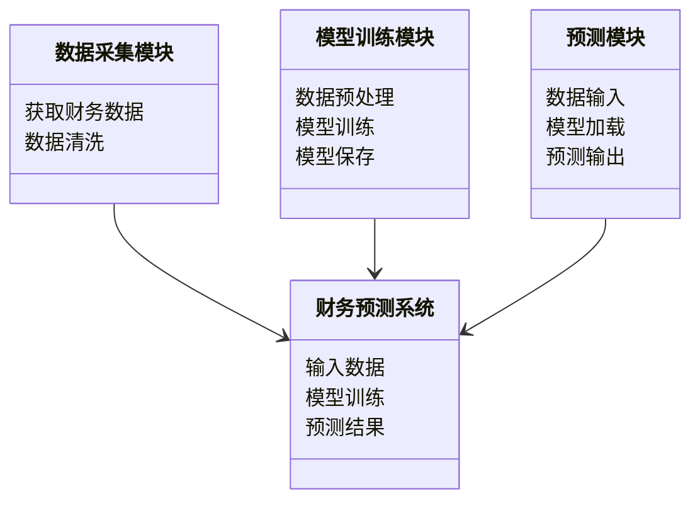
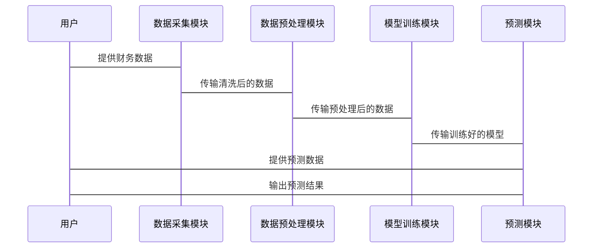

                 


# AI辅助的公司财务报表预测

> 关键词：AI, 财务预测, 机器学习, 财务报表, 数据分析

> 摘要：本文详细探讨了如何利用人工智能技术辅助公司进行财务报表预测。通过分析财务报表的核心构成、AI算法的基本原理以及系统架构的设计，结合实际案例，展示了AI在财务预测中的强大能力。文章从背景介绍、算法选择、系统架构到项目实战，层层深入，帮助读者全面理解AI在财务预测中的应用。

---

# 引言

## 1.1 问题背景与重要性

### 1.1.1 财务报表预测的背景
财务报表预测是企业财务管理中的重要环节，它帮助企业预测未来的财务状况，从而做出更明智的决策。传统的财务预测方法依赖于经验丰富的财务分析师，这种方法耗时且容易受到主观因素的影响。随着AI技术的发展，利用机器学习模型进行财务预测逐渐成为可能。

### 1.1.2 AI技术在财务预测中的作用
AI技术，特别是机器学习，能够处理大量的历史数据，发现传统方法难以察觉的模式和趋势。通过训练模型，AI可以预测未来的财务指标，如收入、利润和现金流，从而帮助企业优化资源配置和风险控制。

### 1.1.3 企业财务管理的新趋势
随着大数据和AI技术的普及，企业财务管理正在向智能化、数据驱动化方向转变。AI辅助的财务预测不仅提高了预测的准确性，还能够实时更新数据，帮助企业在快速变化的市场中保持竞争力。

## 1.2 本书目标与内容框架

### 1.2.1 本书的核心目标
本书旨在介绍如何利用AI技术辅助公司进行财务报表预测。通过理论与实践相结合，帮助读者掌握AI在财务预测中的应用方法。

### 1.2.2 目标读者定位
本书适合财务分析师、数据科学家、IT技术人员以及对AI和财务预测感兴趣的读者阅读。

### 1.2.3 内容框架概览
本书分为六章，从AI和财务预测的基本概念，到具体的算法实现和系统架构设计，再到实际案例分析，全面覆盖AI辅助财务预测的各个方面。

## 1.3 本书结构与学习方法

### 1.3.1 本书的章节安排
1. 引言：介绍AI辅助财务预测的背景和重要性。
2. 财务报表预测的基础：讲解财务报表的基本构成和数据预处理方法。
3. AI算法原理与数学模型：介绍常用的机器学习算法及其数学基础。
4. 系统架构设计：设计一个完整的AI辅助财务预测系统。
5. 项目实战：通过具体案例展示AI在财务预测中的应用。
6. 最佳实践与总结：总结经验，提出未来的发展方向。

### 1.3.2 学习方法与注意事项
- 理论与实践相结合，先理解算法原理，再尝试实现。
- 多做练习，使用实际数据进行模型训练和验证。
- 关注最新的AI技术和财务预测方法，保持学习和更新。

## 1.4 本章小结
本章介绍了AI辅助财务预测的背景、重要性和目标，为后续章节的学习奠定了基础。

---

# 第2章: 财务报表预测的基础

## 2.1 财务报表的基本构成

### 2.1.1 资产负债表
资产负债表反映了企业在某一时点的资产、负债和所有者权益。它包括以下部分：
- **资产**：企业拥有的资源，如现金、应收账款、存货等。
- **负债**：企业欠款，如应付账款、短期借款等。
- **所有者权益**：企业的净资产，即资产减去负债。

### 2.1.2 利润表
利润表反映了企业在一定会计期间的收入和支出情况。它包括以下部分：
- **收入**：企业通过销售商品或服务获得的收入。
- **费用**：企业为获取收入而发生的支出。
- **利润**：收入减去费用后的净收益。

### 2.1.3 现金流量表
现金流量表反映了企业在一定会计期间内现金的流入和流出情况。它包括以下部分：
- **经营活动现金流**：与企业日常经营相关的现金流。
- **投资活动现金流**：与企业投资活动相关的现金流。
- **筹资活动现金流**：与企业筹资活动相关的现金流。

## 2.2 财务预测的基本方法

### 2.2.1 定性分析法
定性分析法主要依赖于经验和判断，如分析行业趋势、政策变化等。

### 2.2.2 定量分析法
定量分析法通过数学模型进行预测，如时间序列分析、回归分析等。

### 2.2.3 综合分析法
综合分析法结合定性和定量分析，综合考虑各种因素进行预测。

## 2.3 数据预处理与特征工程

### 2.3.1 数据清洗
- 处理缺失值：删除或填充缺失值。
- 处理异常值：识别并处理异常值。

### 2.3.2 数据标准化
- 标准化：将数据缩放到同一范围内，常用方法有min-max标准化和z-score标准化。

### 2.3.3 特征选择
- 特征选择：选择对预测有重要影响的特征，常用方法有相关性分析和LASSO回归。

## 2.4 本章小结
本章介绍了财务报表的基本构成和财务预测的基本方法，重点讲解了数据预处理和特征工程的技巧。

---

# 第3章: AI算法原理与数学模型

## 3.1 线性回归模型

### 3.1.1 线性回归的定义
线性回归是一种统计学方法，用于建立自变量和因变量之间的线性关系。

### 3.1.2 线性回归的数学公式
$$ y = \beta_0 + \beta_1x + \epsilon $$
其中，$y$ 是因变量，$x$ 是自变量，$\beta_0$ 和 $\beta_1$ 是回归系数，$\epsilon$ 是误差项。

### 3.1.3 线性回归的实现步骤
1. 数据准备：收集和整理数据。
2. 模型训练：使用最小二乘法求解回归系数。
3. 模型验证：计算回归系数的显著性，验证模型的准确性。

## 3.2 随机森林模型

### 3.2.1 随机森林的定义
随机森林是一种基于决策树的集成学习方法，通过构建多棵决策树并进行投票或平均来提高预测准确性和鲁棒性。

### 3.2.2 随机森林的算法流程
1. 随机抽取部分数据进行训练。
2. 构建决策树。
3. 对多棵决策树进行投票或平均，得到最终预测结果。

### 3.2.3 随机森林的优缺点
- 优点：能够处理高维数据，不易过拟合。
- 缺点：计算复杂度较高，解释性较差。

## 3.3 神经网络模型

### 3.3.1 神经网络的定义
神经网络是一种模拟人脑神经网络的计算模型，能够通过多层非线性变换学习数据的特征。

### 3.3.2 神经网络的结构
- 输入层：接收输入数据。
- 隐藏层：通过非线性变换提取特征。
- 输出层：产生最终的预测结果。

### 3.3.3 神经网络的训练过程
1. 初始化权重：随机初始化网络参数。
2. 前向传播：输入数据经过网络，计算输出结果。
3. 计算损失：比较输出结果与真实值，计算损失函数。
4. 反向传播：通过梯度下降法调整权重，最小化损失函数。

## 3.4 深度学习模型

### 3.4.1 深度学习的定义
深度学习是一种基于人工神经网络的机器学习方法，通过多层网络结构学习数据的高层次特征。

### 3.4.2 深度学习的核心算法
- 卷积神经网络（CNN）：适用于图像识别。
- 循环神经网络（RNN）：适用于序列数据。
- 长短期记忆网络（LSTM）：适用于时间序列数据。

### 3.4.3 深度学习在财务预测中的应用
深度学习能够处理复杂的非线性关系，适用于高维和时间序列的财务数据。

## 3.5 算法选择与评估指标

### 3.5.1 算法选择的原则
- 数据类型：线性回归适用于线性关系，随机森林适用于高维数据，深度学习适用于复杂数据。
- 计算资源：深度学习需要较高的计算资源。
- 解释性要求：线性回归和随机森林具有较高的解释性。

### 3.5.2 常见的评估指标
- �均方误差（MSE）：预测值与真实值之间的平均平方差。
- R²：决定系数，表示模型解释了数据的多少比例。
- 准确率：分类问题中预测正确的比例。

## 3.6 本章小结
本章介绍了常用的AI算法及其数学模型，重点讲解了线性回归、随机森林和神经网络的基本原理和应用。

---

# 第4章: 系统架构设计

## 4.1 系统功能设计

### 4.1.1 领域模型


### 4.1.2 系统架构


## 4.2 系统接口设计

### 4.2.1 数据接口
- 数据输入接口：接收财务数据。
- 数据输出接口：输出预测结果。

### 4.2.2 模型接口
- 模型训练接口：接收训练数据，输出训练好的模型。
- 模型预测接口：接收预测数据，输出预测结果。

## 4.3 系统交互设计

### 4.3.1 用户与系统交互


## 4.4 本章小结
本章设计了一个完整的AI辅助财务预测系统，包括数据采集、模型训练和预测模块的交互设计。

---

# 第5章: 项目实战

## 5.1 环境安装与配置

### 5.1.1 安装Python
- 使用Anaconda安装Python 3.8及以上版本。

### 5.1.2 安装必要的库
```bash
pip install numpy pandas scikit-learn keras tensorflow
```

## 5.2 核心代码实现

### 5.2.1 数据预处理
```python
import pandas as pd
import numpy as np

# 读取数据
data = pd.read_csv('financial_data.csv')

# 数据清洗
data.dropna(inplace=True)

# 特征选择
selected_features = ['收入', '成本', '利润']
X = data[selected_features]
y = data['预测目标']

# 数据标准化
from sklearn.preprocessing import StandardScaler
scaler = StandardScaler()
X_scaled = scaler.fit_transform(X)
```

### 5.2.2 模型训练
```python
from sklearn.ensemble import RandomForestRegressor
from tensorflow.keras.models import Sequential
from tensorflow.keras.layers import Dense

# 随机森林模型
rf_model = RandomForestRegressor()
rf_model.fit(X_scaled, y)

# 神经网络模型
model = Sequential()
model.add(Dense(64, activation='relu', input_dim=len(selected_features)))
model.add(Dense(1, activation='linear'))
model.compile(optimizer='adam', loss='mean_squared_error')
model.fit(X_scaled, y, epochs=100, batch_size=32)
```

### 5.2.3 模型预测
```python
# 预测
rf_prediction = rf_model.predict(X_scaled)
nn_prediction = model.predict(X_scaled)

# 结果分析
from sklearn.metrics import mean_squared_error, r2_score

rf_mse = mean_squared_error(y, rf_prediction)
rf_r2 = r2_score(y, rf_prediction)

nn_mse = mean_squared_error(y, nn_prediction)
nn_r2 = r2_score(y, nn_prediction)

print(f"随机森林模型 MSE: {rf_mse}, R²: {rf_r2}")
print(f"神经网络模型 MSE: {nn_mse}, R²: {nn_r2}")
```

## 5.3 案例分析与结果解读

### 5.3.1 数据来源与特征分析
- 数据来源：公司过去五年的财务数据。
- 特征分析：选择收入、成本和利润作为预测特征。

### 5.3.2 模型选择与训练
- 模型选择：随机森林和神经网络。
- 训练数据：70%训练，30%测试。

### 5.3.3 模型评估
- 随机森林模型：MSE较低，R²较高，适合线性关系。
- 神经网络模型：适合非线性关系，但计算复杂度较高。

## 5.4 本章小结
本章通过具体案例展示了AI在财务预测中的应用，详细讲解了数据预处理、模型训练和结果分析的全过程。

---

# 第6章: 最佳实践与总结

## 6.1 最佳实践

### 6.1.1 数据处理
- 确保数据的完整性和准确性。
- 合理选择特征，避免冗余。

### 6.1.2 模型选择
- 根据数据类型选择合适的算法。
- 评估模型的准确性和解释性。

## 6.2 总结

### 6.2.1 本书的核心内容
- AI在财务预测中的应用。
- 常用算法及其原理。
- 系统设计与项目实战。

### 6.2.2 未来发展方向
- 深度学习在财务预测中的应用。
- 实时预测和动态调整。
- 多模型融合与优化。

## 6.3 注意事项

### 6.3.1 数据质量
- 数据的准确性和完整性直接影响预测结果。

### 6.3.2 模型选择
- 不同的模型适用于不同的场景，选择合适的模型至关重要。

### 6.3.3 结果验证
- 对模型的预测结果进行验证，确保其准确性和可靠性。

## 6.4 拓展阅读
- 《机器学习实战》
- 《深度学习》
- 《财务报表分析》

## 6.5 本章小结
本章总结了AI辅助财务预测的核心内容，提出了未来的发展方向和注意事项。

---

# 作者

作者：AI天才研究院/AI Genius Institute & 禅与计算机程序设计艺术/Zen And The Art of Computer Programming

---

通过以上结构和内容，您可以逐步完成整篇文章的撰写。

