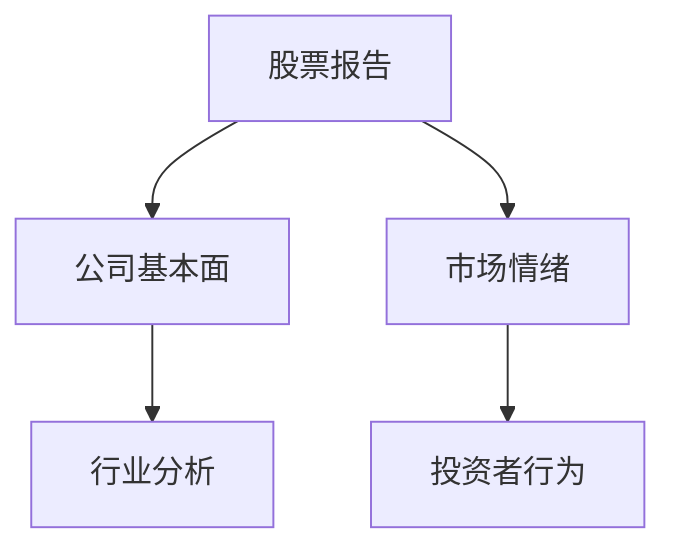
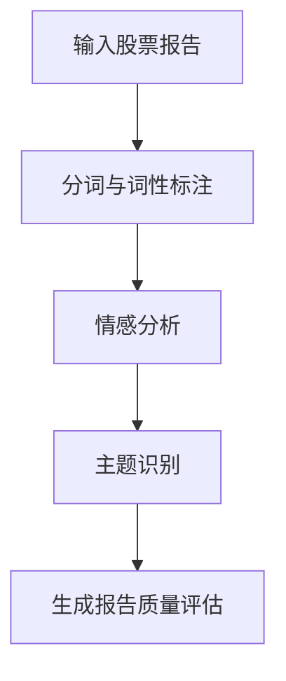
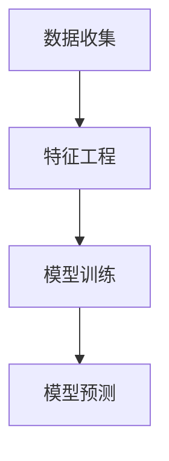
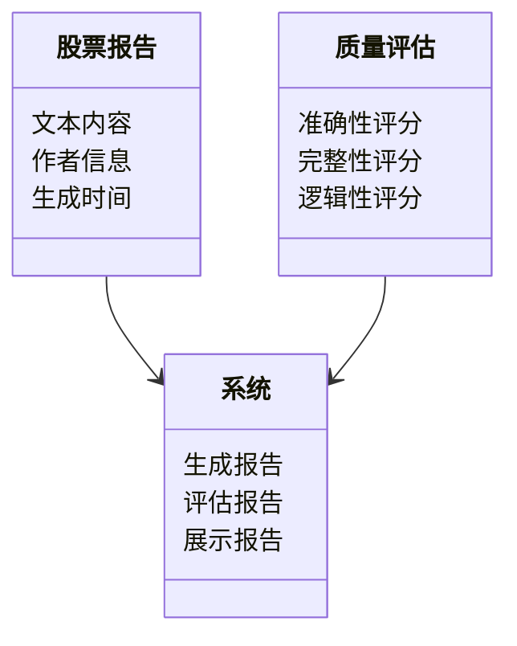
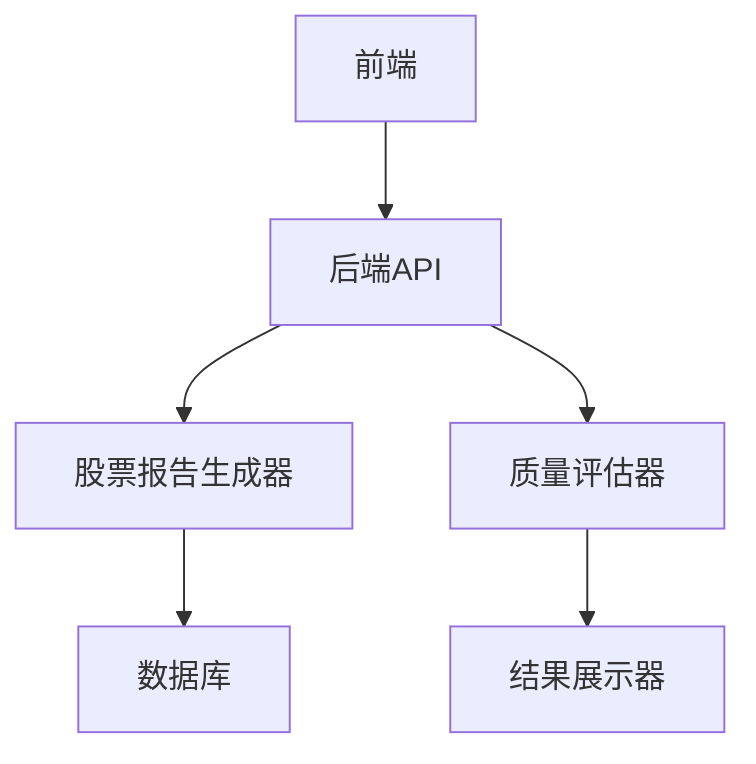
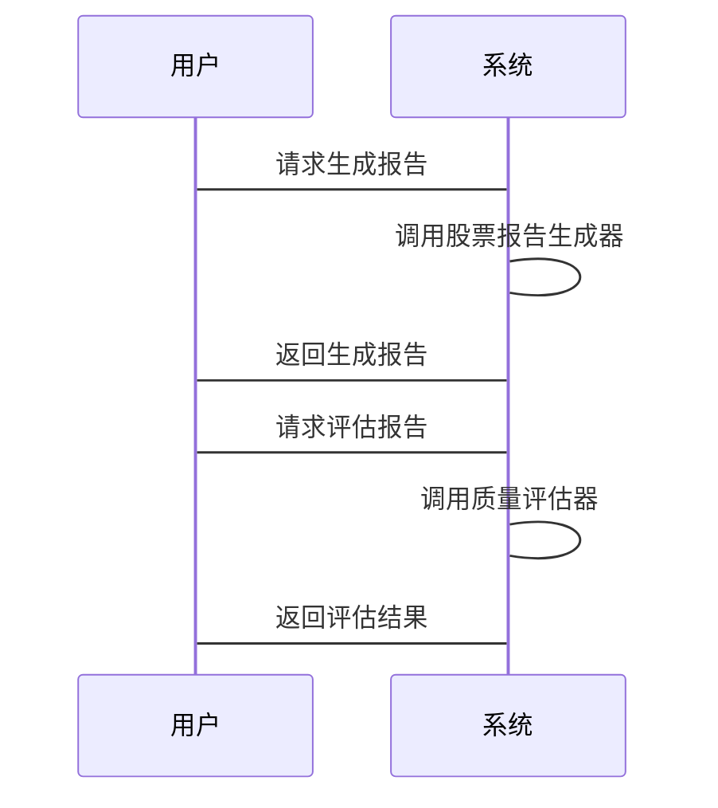

                 


# AI驱动的股票分析师报告质量评估

> 关键词：AI, 股票分析, 自然语言处理, 机器学习, 深度学习, 股票报告, 质量评估

> 摘要：随着人工智能技术的快速发展，股票分析领域正在经历一场深刻的变革。传统的股票分析师报告质量评估依赖于人工经验，效率低下且主观性强。本文将探讨如何利用AI技术，特别是自然语言处理（NLP）和机器学习，来提高股票分析师报告的质量评估效率和准确性。通过分析股票报告的文本内容、情感倾向、主题识别等方面，结合深度学习模型，本文提出了一种基于AI的股票报告质量评估方法，并详细阐述了其算法原理、系统架构和实际应用场景。

---

# 第1章: 股票分析师报告质量评估的背景与挑战

## 1.1 股票分析行业的现状与痛点

### 1.1.1 股票分析的传统方法与局限性

股票分析是金融领域的重要组成部分，传统上依赖于分析师的经验和市场直觉。分析师通过研究公司财务数据、行业趋势、市场情绪等因素，撰写报告以帮助投资者做出决策。然而，这种方法存在以下局限性：

1. **主观性**：分析师的判断受到个人经验和主观因素的影响，可能导致报告质量参差不齐。
2. **效率低下**：人工分析耗时长，难以应对海量的股票报告。
3. **一致性差**：不同分析师的分析标准和风格不一致，影响报告的可比性。

### 1.1.2 传统分析师报告的评估标准

传统上，股票报告的质量评估主要基于以下几个方面：

1. **内容完整性**：报告是否涵盖了公司基本面、行业分析、市场趋势等内容。
2. **逻辑性**：分析是否条理清晰，推理是否合理。
3. **准确性**：预测数据和结论是否与实际市场走势相符。
4. **可读性**：报告是否易于理解，语言是否专业且清晰。

### 1.1.3 行业痛点与改进需求

随着金融市场的快速发展，股票报告的数量激增，传统的评估方法难以满足以下需求：

1. **快速评估**：需要在短时间内对大量报告进行质量评估。
2. **客观性**：减少人为主观因素，确保评估结果的客观性和一致性。
3. **智能化**：通过自动化技术提升评估效率和准确性。

---

## 1.2 AI技术在金融领域的应用前景

### 1.2.1 AI在金融领域的典型应用

AI技术在金融领域的应用已经取得了显著成果，主要包括以下方面：

1. **股票预测**：通过机器学习模型分析历史数据，预测股票价格走势。
2. **风险评估**：利用AI技术评估投资组合的风险，帮助投资者做出决策。
3. **欺诈检测**：通过异常检测技术识别金融交易中的欺诈行为。

### 1.2.2 AI在股票分析中的潜在价值

AI技术为股票分析带来了以下潜在价值：

1. **提高效率**：通过自动化处理海量数据，快速生成和评估股票报告。
2. **增强准确性**：利用机器学习模型分析复杂数据，提高预测的准确性。
3. **提供深度洞察**：通过自然语言处理技术，挖掘报告中的隐含信息，提供更深层次的市场洞察。

### 1.2.3 当前AI驱动股票分析的挑战

尽管AI技术在股票分析中具有巨大潜力，但仍然面临以下挑战：

1. **数据质量**：股票数据的噪声和不确定性可能影响模型的准确性。
2. **模型解释性**：深度学习模型的黑箱特性使得结果难以解释。
3. **监管合规性**：AI驱动的股票分析需要符合金融监管要求，确保合规性。

---

## 1.3 本章小结

本章从股票分析行业的现状出发，分析了传统评估方法的局限性和行业痛点，并探讨了AI技术在金融领域的应用前景及其在股票分析中的潜在价值。同时，也指出了当前AI驱动股票分析所面临的挑战，为后续章节的深入分析奠定了基础。

---

# 第2章: AI驱动股票分析的核心概念

## 2.1 股票分析师报告的结构与内容

### 2.1.1 股票报告的基本要素

股票报告通常包括以下基本要素：

1. **公司基本面**：包括财务数据、管理层信息、公司战略等。
2. **行业分析**：行业发展趋势、竞争格局、政策影响等。
3. **市场情绪**：市场参与者的行为、投资者情绪分析等。
4. **预测与建议**：对股票的评级、目标价格、投资建议等。

### 2.1.2 不同类型股票报告的特点

股票报告可以分为以下几种类型：

1. **买入报告**：建议投资者买入某只股票。
2. **卖出报告**：建议投资者卖出某只股票。
3. **中性报告**：建议投资者持观望态度。
4. **深度报告**：详细分析某公司或行业的长期趋势。

### 2.1.3 报告质量评估的关键指标

报告质量评估的关键指标包括：

1. **准确性**：预测与实际市场走势的吻合程度。
2. **完整性**：报告是否涵盖了所有相关的重要信息。
3. **逻辑性**：分析是否条理清晰，推理是否合理。
4. **可读性**：语言是否专业且易于理解。

---

## 2.2 AI驱动股票分析的核心技术

### 2.2.1 自然语言处理（NLP）在报告分析中的应用

NLP技术在股票报告分析中的应用主要包括：

1. **文本分类**：将报告分为买入、卖出、中性等类别。
2. **情感分析**：分析报告中的情感倾向，判断市场情绪。
3. **主题识别**：识别报告中的主要主题和关键词。

### 2.2.2 机器学习在股票预测中的作用

机器学习在股票预测中的作用包括：

1. **特征提取**：从历史数据中提取有用的特征，用于预测模型。
2. **模型训练**：训练预测模型，预测股票价格走势。
3. **风险评估**：评估投资组合的风险，帮助投资者做出决策。

### 2.2.3 深度学习模型在报告生成与评估中的应用

深度学习模型在股票报告生成与评估中的应用包括：

1. **生成式模型**：生成股票报告的初稿，减少人工编写的工作量。
2. **评估模型**：评估报告的质量，包括准确性、完整性、逻辑性等。

---

## 2.3 本章小结

本章详细介绍了股票报告的基本结构和内容，并探讨了AI驱动股票分析的核心技术，包括NLP、机器学习和深度学习在股票报告分析中的应用。通过这些技术，可以实现股票报告的自动化生成与评估，提高分析效率和准确性。

---

# 第3章: AI驱动股票分析的核心概念与联系

## 3.1 核心概念原理

### 3.1.1 NLP在股票报告分析中的原理

NLP通过以下步骤实现股票报告的分析：

1. **文本预处理**：包括分词、去停用词、词性标注等。
2. **特征提取**：提取文本中的关键词、主题、情感倾向等。
3. **文本分类**：基于特征对文本进行分类，如买入、卖出等。

### 3.1.2 机器学习在股票预测中的原理

机器学习通过以下步骤实现股票预测：

1. **数据收集**：收集历史股票数据、市场数据等。
2. **特征工程**：提取有用的特征，如技术指标、市场情绪等。
3. **模型训练**：训练预测模型，如线性回归、随机森林等。
4. **模型预测**：基于训练好的模型预测股票价格走势。

### 3.1.3 深度学习模型的结构与特点

深度学习模型，如LSTM和Transformer，具有以下特点：

1. **长时记忆能力**：能够捕捉时间序列中的长时依赖关系。
2. **非线性表达能力**：能够捕捉复杂的非线性关系。
3. **自动特征提取能力**：能够自动提取特征，减少特征工程的工作量。

---

## 3.2 核心概念属性特征对比表格

表3.1: NLP、机器学习、深度学习的属性对比

| 属性                | NLP               | 机器学习         | 深度学习         |
|---------------------|-------------------|-----------------|-----------------|
| 核心任务            | 文本分析           | 数据预测         | 复杂模式识别     |
| 适用场景            | 文本分类、情感分析 | 股票预测         | 自然语言处理、图像识别 |
| 模型复杂度          | 较低             | 中等             | 较高             |
| 是否需要大量数据    | 是               | 是               | 是               |

---

## 3.3 ER实体关系图



---

## 3.4 本章小结

本章通过对比分析NLP、机器学习和深度学习的核心概念，探讨了它们在股票分析中的应用特点，并通过实体关系图展示了股票报告分析的核心要素及其相互关系。

---

# 第4章: 基于NLP的股票报告分析算法

## 4.1 算法原理与流程

### 4.1.1 算法原理

基于NLP的股票报告分析算法主要包括以下步骤：

1. **文本预处理**：对股票报告进行分词、去停用词、词性标注等处理。
2. **特征提取**：提取文本中的关键词、主题、情感倾向等。
3. **文本分类**：基于特征对文本进行分类，如买入、卖出等。

### 4.1.2 算法流程



---

## 4.2 算法实现代码

### 4.2.1 环境安装

```bash
pip install spacy transformers
python -m spacy download zh_c
```

### 4.2.2 核心代码

```python
import spacy
from spacy.lang.zh import Chinese

nlp = spacy.load("zh_c")

def analyze_report(text):
    doc = nlp(text)
    keywords = []
    for token in doc:
        if token.pos_ in ['NOUN', 'ADJ']:
            keywords.append(token.text)
    return keywords

text = "该公司的收入增长显著，行业前景广阔，建议买入。"
keywords = analyze_report(text)
print(keywords)
```

---

## 4.3 本章小结

本章详细介绍了基于NLP的股票报告分析算法的原理和流程，并通过代码示例展示了如何利用NLP技术提取股票报告中的关键词和主题。

---

# 第5章: 基于机器学习的股票预测算法

## 5.1 算法原理与流程

### 5.1.1 算法原理

基于机器学习的股票预测算法主要包括以下步骤：

1. **数据收集**：收集历史股票数据、市场数据等。
2. **特征工程**：提取有用的特征，如技术指标、市场情绪等。
3. **模型训练**：训练预测模型，如线性回归、随机森林等。
4. **模型预测**：基于训练好的模型预测股票价格走势。

### 5.1.2 算法流程



---

## 5.2 算法实现代码

### 5.2.1 环境安装

```bash
pip install pandas scikit-learn
```

### 5.2.2 核心代码

```python
import pandas as pd
from sklearn.linear_model import LinearRegression
from sklearn.metrics import mean_squared_error

# 数据加载
data = pd.read_csv('stock_data.csv')

# 特征与目标分离
X = data[['open', 'high', 'low', 'volume']]
y = data['close']

# 模型训练
model = LinearRegression()
model.fit(X, y)

# 模型预测
y_pred = model.predict(X)

# 模型评估
 mse = mean_squared_error(y, y_pred)
 print(f"均方误差: {mse}")
```

---

## 5.3 本章小结

本章详细介绍了基于机器学习的股票预测算法的原理和流程，并通过代码示例展示了如何利用机器学习技术预测股票价格走势。

---

# 第6章: 系统分析与架构设计

## 6.1 问题场景介绍

股票分析师报告质量评估系统需要实现以下功能：

1. **报告生成**：自动生成股票报告。
2. **质量评估**：对报告进行质量评估，包括准确性、完整性、逻辑性等。
3. **结果展示**：将评估结果展示给用户。

---

## 6.2 系统功能设计

### 6.2.1 领域模型



---

## 6.3 系统架构设计

### 6.3.1 架构图



---

## 6.4 系统接口设计

### 6.4.1 API接口

1. **生成报告接口**：
   - 输入：股票代码
   - 输出：生成的股票报告

2. **评估报告接口**：
   - 输入：报告内容
   - 输出：质量评估结果

---

## 6.5 系统交互设计

### 6.5.1 序列图



---

## 6.6 本章小结

本章详细介绍了股票分析师报告质量评估系统的功能设计、架构设计和接口设计，为后续的系统实现提供了理论基础。

---

# 第7章: 项目实战

## 7.1 环境安装

```bash
pip install spacy transformers scikit-learn
python -m spacy download zh_c
```

---

## 7.2 核心代码实现

### 7.2.1 股票报告生成器

```python
import spacy
from spacy.lang.zh import Chinese

nlp = spacy.load("zh_c")

def generate_report(text):
    doc = nlp(text)
    report = []
    for token in doc:
        if token.pos_ in ['NOUN', 'ADJ']:
            report.append(token.text)
    return " ".join(report)

text = "该公司的收入增长显著，行业前景广阔，建议买入。"
print(generate_report(text))
```

### 7.2.2 质量评估器

```python
from sklearn.linear_model import LinearRegression
from sklearn.metrics import mean_squared_error

# 数据加载
data = pd.read_csv('stock_data.csv')

# 特征与目标分离
X = data[['open', 'high', 'low', 'volume']]
y = data['close']

# 模型训练
model = LinearRegression()
model.fit(X, y)

# 模型预测
y_pred = model.predict(X)

# 模型评估
 mse = mean_squared_error(y, y_pred)
 print(f"均方误差: {mse}")
```

---

## 7.3 实际案例分析

### 7.3.1 案例背景

假设我们有一家科技公司的股票报告，需要评估其质量。

### 7.3.2 数据分析

股票报告内容：
```plaintext
该公司的收入增长显著，行业前景广阔，建议买入。
```

---

## 7.4 本章小结

本章通过实际案例展示了如何利用AI技术生成和评估股票报告，详细讲解了代码实现和案例分析。

---

# 第8章: 总结与展望

## 8.1 总结

本文详细探讨了AI驱动的股票分析师报告质量评估的方法和实现，提出了基于NLP和机器学习的解决方案，并通过实际案例展示了其应用效果。通过AI技术，可以显著提高股票分析的效率和准确性，为投资者提供更可靠的决策支持。

---

## 8.2 展望

未来，随着AI技术的不断发展，股票分析领域将面临更多机遇和挑战。以下是一些可能的发展方向：

1. **多模态分析**：结合文本、图像等多种数据源，提高分析的全面性。
2. **强化学习**：通过强化学习优化股票交易策略，提高投资收益。
3. **可解释性增强**：提高模型的可解释性，帮助投资者更好地理解分析结果。
4. **实时分析**：实现实时股票报告生成与评估，满足快速变化的市场需求。

---

# 作者

**作者**：AI天才研究院/AI Genius Institute & 禅与计算机程序设计艺术/Zen And The Art of Computer Programming

---

感谢您的阅读！如需进一步探讨，请随时联系。

