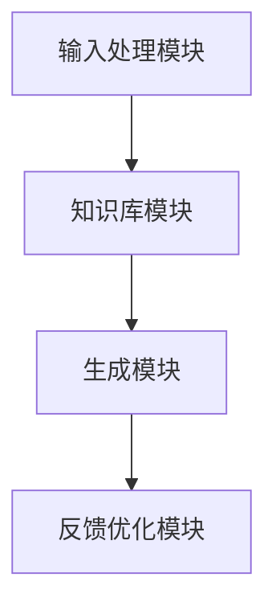
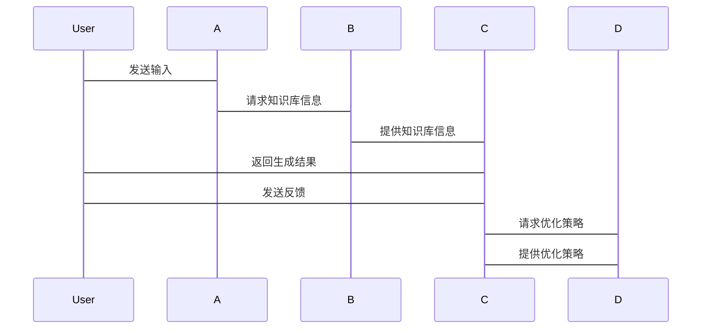

                 


# LLM在AI Agent中的文本生成多样性增强

> 关键词：大语言模型，AI Agent，文本生成，多样性增强，自然语言处理

> 摘要：本文深入探讨了大语言模型（LLM）在AI Agent中的文本生成多样性增强技术，分析了其核心原理、算法实现、系统架构及实际应用案例，结合理论与实践，为AI Agent的文本生成提供了新的思路和解决方案。

---

## 第1章: 问题背景与核心概念

### 1.1 问题背景

#### 1.1.1 当前AI Agent文本生成的挑战

AI Agent（人工智能代理）是一种能够感知环境、自主决策并执行任务的智能系统。在自然语言处理领域，文本生成是AI Agent与用户交互的核心能力之一。然而，现有的AI Agent文本生成技术面临以下挑战：

- **生成结果单一性**：传统生成模型（如简单的RNN或LSTM）容易陷入生成结果的单一性问题，难以覆盖多种表达方式。
- **上下文理解不足**：AI Agent需要根据对话历史和上下文生成符合情境的文本，但现有模型在处理复杂上下文关系时表现不足。
- **多样性与质量的平衡**：在生成多样化文本的同时，如何保持生成内容的高质量是一个难点。

#### 1.1.2 大语言模型（LLM）的引入动机

大语言模型（LLM，Large Language Models）如GPT-3、PaLM等，凭借其强大的语言理解和生成能力，为AI Agent的文本生成提供了新的可能性。LLM的核心优势在于：

- **强大的上下文理解**：LLM通过大规模预训练，能够捕捉文本中的深层语义信息。
- **多样的生成能力**：LLM可以在生成文本时输出多种表达方式，显著提升生成结果的多样性。
- **可微调性**：LLM可以通过微调适应不同场景的需求。

#### 1.1.3 文本生成多样性增强的目标与意义

文本生成多样性增强的目标是在保证生成内容质量的前提下，提升生成文本的多样性。具体目标包括：

- **丰富表达方式**：生成多种不同的表达方式，避免重复和单调。
- **适应不同场景**：根据具体场景和用户需求，动态调整生成内容的风格和语气。
- **提升用户体验**：通过多样化生成，增强用户与AI Agent交互的趣味性和实用性。

---

### 1.2 核心概念与定义

#### 1.2.1 AI Agent的基本概念

AI Agent是一种能够感知环境、自主决策并执行任务的智能实体。它可以分为**反应式AI Agent**和**认知式AI Agent**：

- **反应式AI Agent**：基于当前感知做出反应，适用于简单的任务。
- **认知式AI Agent**：具备推理、规划和学习能力，适用于复杂任务。

#### 1.2.2 大语言模型（LLM）的定义与特点

大语言模型是指基于Transformer架构，通过大量数据预训练而成的大型语言模型。其特点包括：

- **参数规模大**：通常拥有 billions（十亿）级别的参数。
- **通用性强**：可以在多种任务（如翻译、问答、生成）上表现出色。
- **上下文理解能力强**：能够捕捉文本中的长距离依赖关系。

#### 1.2.3 文本生成多样性的定义与衡量标准

文本生成多样性指的是生成文本在内容、风格和表达方式上的多样性。衡量标准包括：

- **语义多样性**：生成内容在语义上的多样性。
- **表达多样性**：生成文本在表达方式上的多样性。
- **风格多样性**：生成文本在语气和风格上的多样性。

---

## 第2章: LLM与AI Agent的结合原理

### 2.1 LLM在AI Agent中的角色与功能

#### 2.1.1 LLM作为知识库的载体

AI Agent需要依赖知识库进行推理和生成。LLM可以通过以下方式实现：

- **知识嵌入**：将外部知识融入LLM的训练数据中，使其具备相关领域知识。
- **动态推理**：通过LLM的推理能力，实时处理输入并生成输出。

#### 2.1.2 LLM作为生成器的角色

AI Agent的文本生成能力主要依赖LLM的生成能力。LLM通过以下方式实现生成：

- **解码策略**：采用多种解码策略（如随机采样、Top-k采样）生成多样化文本。
- **动态调整**：根据上下文和任务需求，动态调整生成策略。

#### 2.1.3 LLM作为决策辅助工具的作用

AI Agent需要在多种可能的生成结果中做出选择。LLM可以通过以下方式辅助决策：

- **多结果生成**：生成多个候选结果供AI Agent选择。
- **概率评估**：评估每个生成结果的概率，帮助AI Agent做出最优选择。

### 2.2 LLM与AI Agent的交互机制

#### 2.2.1 输入处理与解析

AI Agent接收输入后，需要进行以下处理：

- **输入解析**：将输入文本解析为结构化数据，便于LLM处理。
- **上下文管理**：维护对话历史，以便LLM生成连贯的文本。

#### 2.2.2 内部推理与生成

LLM在AI Agent中的推理与生成过程包括：

- **内部推理**：基于输入和知识库进行推理。
- **生成文本**：采用多种策略生成多样化文本。

#### 2.2.3 输出结果的反馈与优化

生成结果需要进行反馈与优化：

- **用户反馈**：根据用户反馈调整生成策略。
- **自我优化**：基于历史数据优化生成模型。

### 2.3 LLM在AI Agent中的应用场景

#### 2.3.1 任务型AI Agent

任务型AI Agent主要用于完成特定任务（如预约、查询）。LLM在其中的作用包括：

- **任务理解**：理解用户的任务需求。
- **多轮对话**：通过多轮对话完成任务。

#### 2.3.2 对话型AI Agent

对话型AI Agent主要用于与用户进行自然对话。LLM在其中的作用包括：

- **上下文理解**：理解对话历史。
- **多样化生成**：生成多种表达方式。

#### 2.3.3 创意型AI Agent

创意型AI Agent用于创意生成任务（如写作、设计）。LLM在其中的作用包括：

- **创意激发**：帮助用户产生创意灵感。
- **多样化输出**：生成多种风格和形式的作品。

---

## 第3章: 文本生成多样性的实现原理

### 3.1 多样性生成的基本原理

#### 3.1.1 概率生成模型

概率生成模型是基于概率分布生成文本的模型。其核心思想是：

$$ P(y|x) = \text{模型对输入 } x \text{ 的概率预测} $$

通过调整概率分布，可以实现多样化的生成。

#### 3.1.2 多样性控制方法

多样性控制方法包括：

- **随机采样**：通过随机选择生成多个结果。
- **Top-k采样**：选择概率最高的k个候选词。
- **温度采样**：通过调整温度参数控制生成的多样性和质量。

#### 3.1.3 多样性评估指标

多样性评估指标包括：

- **困惑度（Perplexity）**：衡量生成结果的多样性。
- **多样性指标（如Distinct-N）**：衡量生成结果的多样性。

### 3.2 LLM实现多样性的技术路径

#### 3.2.1 模型架构优化

模型架构优化包括：

- **增加模型深度**：通过增加层数提升生成能力。
- **引入多模态输入**：结合图像、音频等多模态输入。

#### 3.2.2 训练策略调整

训练策略调整包括：

- **增加训练数据多样性**：通过多样化的训练数据提升生成能力。
- **引入对抗训练**：通过对抗训练提升生成多样性。

#### 3.2.3 推理阶段的多样性增强方法

推理阶段的多样性增强方法包括：

- **动态解码策略**：根据输入动态调整解码策略。
- **多结果生成与选择**：生成多个结果并选择最优解。

### 3.3 多样性与生成质量的平衡

#### 3.3.1 过度多样化的风险

过度多样化可能导致生成结果的质量下降，主要表现为：

- **内容重复**：生成内容缺乏深度。
- **逻辑混乱**：生成内容逻辑性不足。

#### 3.3.2 质量优先的多样性控制

质量优先的多样性控制方法包括：

- **基于概率的多样性控制**：通过概率分布控制生成结果的多样性。
- **基于质量评估的多样性控制**：通过质量评估动态调整多样性。

#### 3.3.3 用户需求驱动的多样性调整

用户需求驱动的多样性调整方法包括：

- **用户反馈驱动**：根据用户反馈调整生成策略。
- **场景需求驱动**：根据具体场景需求调整生成策略。

---

## 第4章: 基于LLM的文本生成算法

### 4.1 基础生成算法

#### 4.1.1 解码策略

解码策略是生成算法的核心。常用的解码策略包括：

- **贪心解码**：每一步选择概率最高的词。
- **随机采样**：随机选择生成结果。
- **Top-k采样**：选择概率最高的k个候选词。

#### 4.1.2 Beam Search算法

Beam Search算法是一种贪心搜索算法，通过维护一个候选集合，逐步生成最优结果。其步骤如下：

1. 初始化候选集合。
2. 根据概率生成新的候选词。
3. 选择概率最高的k个候选词。
4. 重复步骤2和3，直到生成完整序列。

#### 4.1.3 Top-k Sampling与Temperature Sampling

Top-k Sampling和Temperature Sampling是两种常用的采样方法：

- **Top-k Sampling**：选择概率最高的k个候选词。
- **Temperature Sampling**：通过调整温度参数控制生成的多样性和质量。

### 4.2 增强算法

#### 4.2.1 多样性增强算法

多样性增强算法包括：

- **降序采样**：通过降序排列候选词概率，生成多样化结果。
- **排序优化**：通过优化候选词排序提升生成多样性。

#### 4.2.2 基于概率的多样性控制

基于概率的多样性控制方法包括：

- **概率重分布**：通过重新分布概率提升生成多样性。
- **概率剪枝**：通过剪枝低概率候选词提升生成质量。

---

## 第5章: 系统分析与架构设计方案

### 5.1 系统架构设计

AI Agent的系统架构包括以下几个模块：

1. **输入处理模块**：接收并解析输入。
2. **知识库模块**：存储和管理知识库。
3. **生成模块**：基于LLM生成多样化文本。
4. **反馈优化模块**：根据反馈优化生成策略。

### 5.2 系统架构图



### 5.3 系统接口设计

系统接口设计包括：

- **输入接口**：接收用户输入。
- **输出接口**：输出生成结果。
- **反馈接口**：接收用户反馈。

### 5.4 系统交互序列图



---

## 第6章: 项目实战

### 6.1 项目介绍

#### 6.1.1 项目背景

本项目旨在通过LLM增强AI Agent的文本生成多样性，提升用户体验。

#### 6.1.2 项目目标

项目目标包括：

- **实现多样化的文本生成**。
- **提升生成质量**。
- **优化用户体验**。

### 6.2 核心代码实现

#### 6.2.1 环境安装

需要安装以下环境：

- Python 3.8+
- Hugging Face Transformers库
- PyTorch

#### 6.2.2 核心代码

```python
from transformers import AutoModelForCausalLM, AutoTokenizer

model_name = "gpt2-large"
model = AutoModelForCausalLM.from_pretrained(model_name)
tokenizer = AutoTokenizer.from_pretrained(model_name)

def generate_diverse_text(prompt, max_length=50, num_return_sequences=3):
    inputs = tokenizer.encode(prompt, return_tensors="pt")
    outputs = model.generate(
        inputs,
        max_length=max_length,
        num_return_sequences=num_return_sequences,
        temperature=1.2,
        do_sample=True
    )
    return [tokenizer.decode(output) for output in outputs]
```

---

## 第7章: 最佳实践与总结

### 7.1 最佳实践

#### 7.1.1 模型选择建议

建议根据具体场景选择合适的LLM模型：

- **小规模任务**：选择较小的模型（如GPT-2）。
- **大规模任务**：选择较大的模型（如GPT-3）。

#### 7.1.2 生成策略优化

生成策略优化建议：

- **动态调整温度参数**：根据生成结果动态调整温度参数。
- **结合用户反馈优化**：通过用户反馈优化生成策略。

### 7.2 小结

本文深入探讨了LLM在AI Agent中的文本生成多样性增强技术，分析了其核心原理、算法实现、系统架构及实际应用案例。通过理论与实践相结合，为AI Agent的文本生成提供了新的思路和解决方案。

### 7.3 注意事项

在实际应用中，需要注意以下几点：

- **模型性能**：确保模型具备足够的生成能力。
- **用户体验**：生成结果需符合用户需求。
- **安全性**：避免生成有害内容。

### 7.4 拓展阅读

推荐以下拓展阅读内容：

- **Hugging Face Transformers库文档**
- **GPT系列论文**
- **AI Agent相关研究论文**

---

## 作者

作者：AI天才研究院/AI Genius Institute & 禅与计算机程序设计艺术 /Zen And The Art of Computer Programming

---

以上是完整的文章结构，涵盖从背景到算法实现、系统设计再到项目实战的各个方面。文章内容丰富具体，适合对AI Agent和大语言模型感兴趣的读者阅读。

