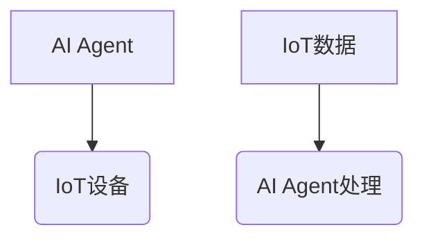
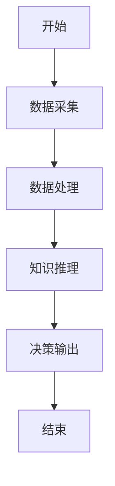
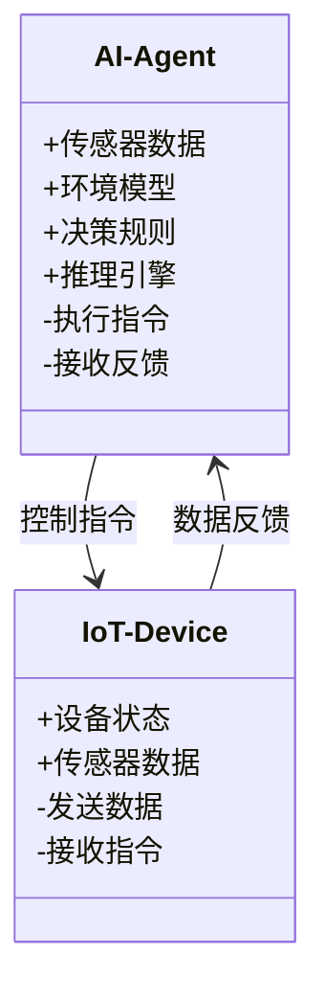
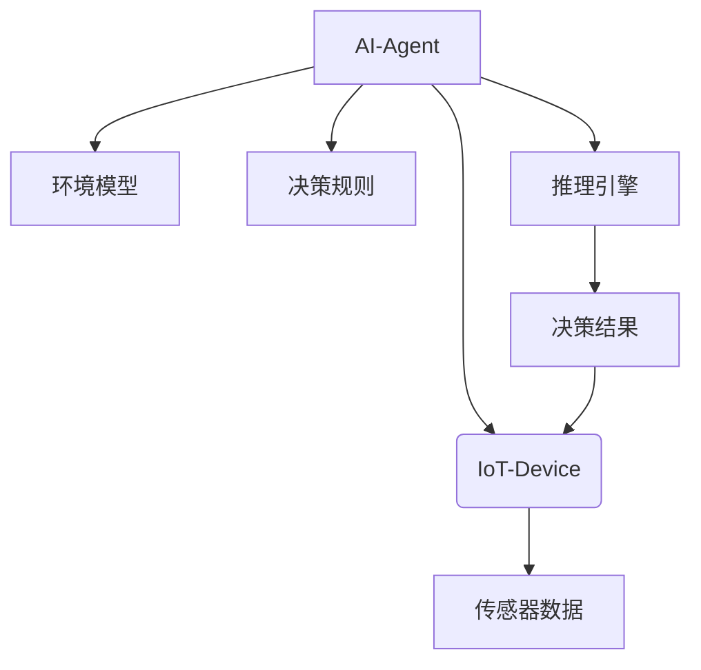
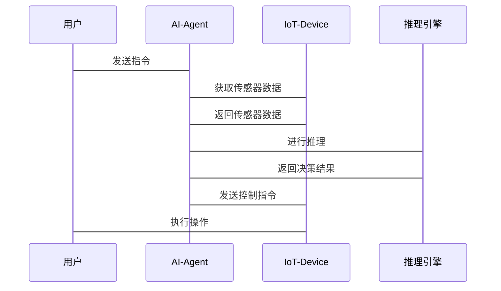

                 


# 企业AI Agent的IoT集成策略

> 关键词：企业AI Agent，IoT集成，智能物联网，AI与IoT结合，边缘计算

> 摘要：本文深入探讨企业AI Agent与IoT的集成策略，从背景、核心概念到算法实现、系统架构，再到项目实战和最佳实践，全面解析如何有效结合AI Agent与IoT技术，提升企业的智能化水平。

## 第1章: AI Agent与IoT概述

### 1.1 AI Agent的基本概念
AI Agent（智能代理）是能够感知环境并采取行动以实现目标的实体。它通过感知环境、理解需求、做出决策并执行操作，帮助企业在复杂环境中实现自动化和智能化。

#### 1.1.1 AI Agent的定义与特征
- **定义**：AI Agent是一个能够感知环境、理解需求、做出决策并执行操作的智能实体。
- **特征**：
  - **自主性**：能够在没有外部干预的情况下自主运行。
  - **反应性**：能够根据环境变化实时调整行为。
  - **目标导向**：所有行动均以实现特定目标为导向。
  - **学习能力**：能够通过经验优化自身行为。

#### 1.1.2 AI Agent的核心功能与分类
- **核心功能**：
  - 数据采集与处理：通过传感器或其他数据源收集信息，并进行预处理。
  - 知识表示：将收集到的信息转化为结构化的知识表示。
  - 推理与决策：基于知识进行推理，生成决策方案。
  - 行为执行：根据决策结果执行相应的操作。
- **分类**：
  - **简单反射型**：基于当前感知做出反应，无复杂推理。
  - **基于模型的反应型**：利用内部模型进行决策。
  - **目标驱动型**：以目标为导向，主动采取行动。
  - **实用驱动型**：以效用最大化为目标，进行最优决策。

#### 1.1.3 AI Agent与传统软件代理的区别
- **区别**：
  - **智能性**：AI Agent具备学习和推理能力，能够处理复杂任务。
  - **自主性**：AI Agent在动态环境中能够自主调整策略，传统软件代理通常需要人工干预。
  - **数据驱动**：AI Agent依赖于大量数据进行训练和优化，传统软件代理依赖预定义规则。

### 1.2 IoT的基本概念
IoT（物联网）是指通过各种信息传感设备，如传感器、RFID技术、全球定位系统、红外感应器等，按照约定的协议，把任何物品与互联网连接起来，进行信息交换和通信，以实现智能化识别、定位、跟踪、监控和管理。

#### 1.2.1 IoT的定义与组成架构
- **定义**：物联网是指通过各种信息传感设备，按约定的协议，把任何物品与互联网连接起来，进行信息交换和通信。
- **组成架构**：
  - **感知层**：负责数据的采集和初步处理，包括传感器和RFID技术。
  - **网络层**：负责数据的传输，包括无线通信技术和网络协议。
  - **应用层**：负责数据的处理和应用，包括数据存储、分析和决策。

#### 1.2.2 IoT的核心技术与应用场景
- **核心技术**：
  - **传感器技术**：用于数据采集。
  - **通信技术**：如Wi-Fi、蓝牙、NB-IoT等，用于数据传输。
  - **云计算与边缘计算**：用于数据存储和处理。
  - **大数据技术**：用于数据分析和挖掘。
- **应用场景**：
  - **智能家居**：通过IoT设备实现家居设备的智能控制。
  - **智慧城市**：通过IoT技术优化城市管理和服务。
  - **工业物联网（IIoT）**：在工业领域应用IoT技术进行设备监控和优化。

#### 1.2.3 IoT的演进与发展趋势
- **演进**：
  - **阶段一**：单一设备连接，数据采集和简单控制。
  - **阶段二**：设备间数据共享，实现初步协同。
  - **阶段三**：数据智能分析，实现智能化决策。
- **发展趋势**：
  - **智能化**：通过AI技术提升IoT系统的智能水平。
  - **边缘计算**：数据处理从云端向边缘设备转移，减少延迟。
  - **安全性**：加强数据安全和隐私保护。

### 1.3 AI Agent与IoT的集成意义
AI Agent与IoT的集成能够显著提升系统的智能化水平，实现更高效的决策和自动化操作。

#### 1.3.1 AI Agent在IoT中的作用
- **数据处理**：AI Agent能够处理IoT设备收集的大量数据，提取有用信息。
- **智能决策**：通过分析数据，AI Agent能够做出最优决策，指导IoT设备执行操作。
- **自主优化**：AI Agent能够学习和优化自身行为，提升系统整体效率。

#### 1.3.2 IoT数据与AI Agent的结合
- **数据采集**：IoT设备采集实时数据，如温度、湿度、位置等。
- **数据处理**：AI Agent对数据进行预处理，识别异常和模式。
- **知识推理**：基于处理后的数据，AI Agent进行知识推理，生成决策方案。
- **决策执行**：AI Agent通过IoT设备执行决策，实现闭环控制。

#### 1.3.3 企业级AI Agent-IoT集成的价值
- **提升效率**：通过自动化决策和执行，减少人工干预，提升运营效率。
- **降低成本**：通过智能化管理和优化，降低资源浪费和运营成本。
- **增强决策能力**：利用AI Agent的智能推理能力，做出更优决策。
- **实时监控**：通过IoT设备实时监控系统状态，及时发现和解决问题。

## 第2章: AI Agent与IoT的核心概念与联系

### 2.1 核心概念原理
AI Agent与IoT的核心概念涉及知识表示、数据处理和通信协议等方面。

#### 2.1.1 AI Agent的知识表示与推理
- **知识表示**：将数据转化为结构化的知识表示，如知识图谱。
- **推理算法**：基于知识图谱进行推理，生成新的知识或决策。

#### 2.1.2 IoT的数据采集与传输机制
- **数据采集**：通过传感器等设备采集实时数据。
- **数据传输**：通过网络将数据传输到处理中心。

#### 2.1.3 AI Agent-IoT交互的实现原理
- **通信协议**：AI Agent与IoT设备之间通过特定协议进行通信，如MQTT、HTTP等。
- **数据流**：数据从IoT设备流向AI Agent，经过处理后，AI Agent向IoT设备发送控制指令。

### 2.2 核心概念对比分析
通过对比分析，明确AI Agent与IoT在功能、结构和应用上的异同。

#### 2.2.1 AI Agent与IoT的特征对比表格
| 特征 | AI Agent | IoT |
|------|-----------|------|
| 自主性 | 高 | 低 |
| 反应性 | 高 | 中 |
| 目标导向 | 高 | 中 |
| 数据依赖 | 高 | 中 |

#### 2.2.2 AI Agent与IoT的实体关系图


### 2.3 核心概念的Mermaid流程图


## 第3章: AI Agent-IoT集成的算法原理

### 3.1 算法原理概述
AI Agent与IoT的集成涉及多种算法，如知识表示、推理和通信协议。

#### 3.1.1 知识表示算法
- **知识表示**：将数据转化为结构化的知识表示，如知识图谱。
- **推理算法**：基于知识图谱进行推理，生成新的知识或决策。

#### 3.1.2 实验推理算法
- **推理方法**：基于规则的推理、基于案例的推理、基于模型的推理。
- **推理过程**：从已知事实出发，通过推理规则生成新的结论。

#### 3.1.3 通信协议算法
- **通信协议**：如MQTT、HTTP等，用于AI Agent与IoT设备之间的数据传输。
- **协议选择**：根据应用场景选择合适的通信协议。

### 3.2 算法流程图


### 3.3 算法实现代码示例
```python
def process_data(data):
    # 数据处理逻辑
    return processed_data

def knowledge_reasoning(processed_data):
    # 知识推理逻辑
    return decision

if __name__ == "__main__":
    data = collect_data()  # 假设collect_data()是数据采集函数
    processed_data = process_data(data)
    decision = knowledge_reasoning(processed_data)
    execute_action(decision)  # 假设execute_action()是执行决策的函数
```

## 第4章: 系统分析与架构设计

### 4.1 问题场景介绍
假设我们有一个智能家居系统，需要通过AI Agent与IoT设备集成，实现智能控制。

#### 4.1.1 项目介绍
- **项目目标**：实现智能家居设备的智能控制，提升用户体验。
- **项目范围**：包括家庭中的灯光、空调、安防设备等。

#### 4.1.2 系统功能设计
- **数据采集**：通过传感器采集环境数据，如温度、湿度、光照强度。
- **数据处理**：对采集的数据进行预处理和分析，识别异常情况。
- **知识推理**：基于环境数据，推理出用户的意图，如“用户需要开启空调”。
- **决策执行**：根据推理结果，向IoT设备发送控制指令，执行相应的操作。

#### 4.1.3 领域模型类图


### 4.2 系统架构设计

#### 4.2.1 系统架构图


#### 4.2.2 系统接口设计
- **接口1**：AI Agent与IoT设备的数据接口，用于数据传输。
- **接口2**：AI Agent与用户交互的接口，用于接收用户指令。

#### 4.2.3 系统交互序列图


## 第5章: 项目实战

### 5.1 环境安装
#### 5.1.1 安装Python环境
- 安装Python 3.x
- 安装必要的库，如paho-mqtt用于MQTT协议通信。

#### 5.1.2 安装IoT设备
- 安装Raspberry Pi或其他支持IoT开发的硬件。
- 安装必要的软件，如Raspbian系统。

### 5.2 系统核心实现

#### 5.2.1 数据采集代码
```python
import paho.mqtt.client as mqtt

def on_connect(client, userdata, flags, rc):
    print("连接到 MQTT 服务器")

def on_message(client, userdata, msg):
    data = msg.payload.decode()
    # 处理数据
    print(f"收到数据: {data}")

client = mqtt.Client()
client.on_connect = on_connect
client.on_message = on_message

client.connect("mqttbroker", 1883)
client.loop_start()
```

#### 5.2.2 知识推理代码
```python
def knowledge_reasoning(processed_data):
    # 简单的规则推理，例如温度高于30度则开启空调
    if processed_data['temperature'] > 30:
        return "开启空调"
    else:
        return "关闭空调"
```

#### 5.2.3 决策执行代码
```python
def execute_action(decision):
    # 发送控制指令到IoT设备
    import paho.mqtt.client as mqtt
    client = mqtt.Client()
    client.connect("mqttbroker", 1883)
    client.publish("air_conditioner_topic", decision)
    client.disconnect()
```

### 5.3 案例分析与详细讲解
- **案例分析**：智能家居系统中，当温度超过30度时，AI Agent推理出需要开启空调，并通过IoT设备执行操作。
- **详细讲解**：从数据采集到推理决策，再到执行操作的整个流程，展示了AI Agent与IoT设备的集成过程。

## 第6章: 最佳实践

### 6.1 小结
- **系统架构**：采用分层架构，明确各层的功能与交互。
- **数据处理**：确保数据采集和处理的准确性，避免数据丢失和误判。
- **通信协议**：选择合适的通信协议，确保数据传输的可靠性和实时性。

### 6.2 注意事项
- **数据安全**：确保数据传输和存储的安全性，防止数据泄露。
- **系统可扩展性**：设计时考虑系统的可扩展性，方便后续功能的添加和升级。
- **异常处理**：设计完善的异常处理机制，确保系统在异常情况下的稳定运行。

### 6.3 拓展阅读
- **推荐书籍**：《物联网技术及应用》、《人工智能：一种现代方法》。
- **推荐文章**：深入理解AI Agent与IoT的集成，探索更多的应用场景和技术细节。

## 第7章: 作者简介
作者：AI天才研究院/AI Genius Institute & 禅与计算机程序设计艺术 /Zen And The Art of Computer Programming

通过以上内容，本文详细介绍了企业AI Agent与IoT的集成策略，从背景、核心概念到算法实现、系统架构，再到项目实战和最佳实践，为读者提供了全面而深入的指导，帮助企业在智能化转型中实现高效、可靠的AI Agent-IoT集成。

--- 

以上是《企业AI Agent的IoT集成策略》的完整目录和部分章节内容。接下来，您可以根据实际需求，逐步完成每一部分的详细写作，确保文章结构完整，内容详实，技术解析深入。

