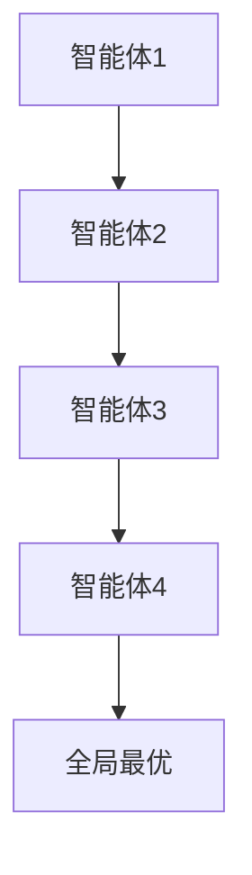
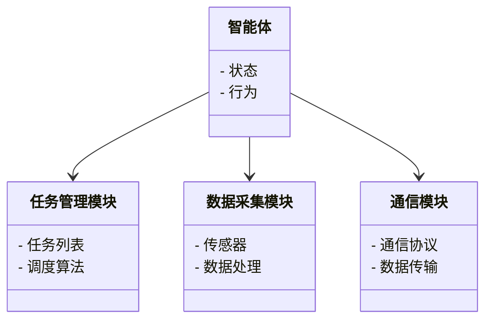
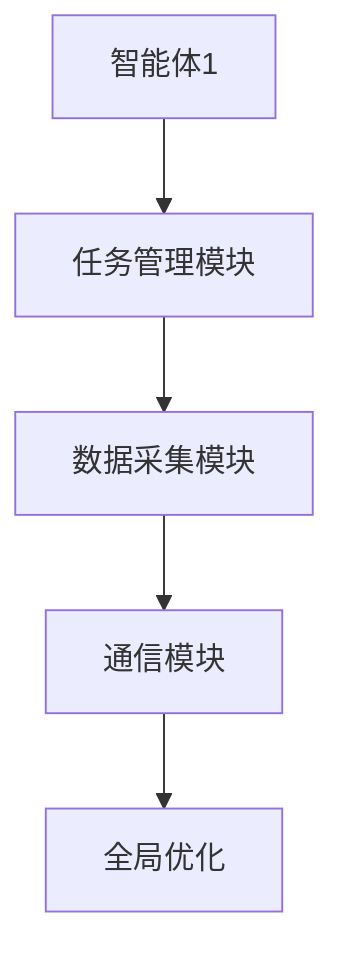
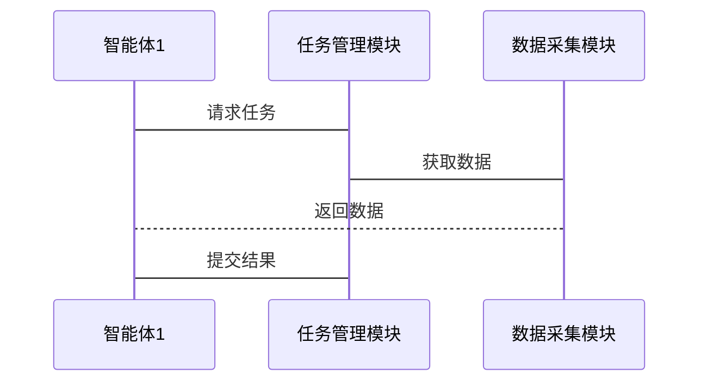

                 


# 多智能体系统实现智能化产业链分析

> 关键词：多智能体系统，智能化产业链，协同优化，分布式计算，系统架构

> 摘要：本文深入分析多智能体系统在实现智能化产业链中的应用，探讨其核心概念、算法原理、系统架构设计及项目实战。通过具体案例分析，展示多智能体系统如何提升产业链的智能化水平，并总结相关最佳实践。

---

## 第一章：多智能体系统概述

### 1.1 多智能体系统的基本概念

#### 1.1.1 智能体的定义与特征
智能体（Agent）是指在环境中能够感知并自主行动以实现目标的实体。其核心特征包括：
- **自主性**：能够独立决策。
- **反应性**：能实时感知环境并做出反应。
- **社会性**：能与其他智能体或人类交互协作。

#### 1.1.2 多智能体系统的定义
多智能体系统（Multi-Agent System, MAS）是由多个智能体组成的分布式系统，这些智能体通过协作完成单一智能体无法完成的任务。

#### 1.1.3 多智能体系统的分类
多智能体系统可以分为：
- **结构化环境**：任务明确，规则固定。
- **非结构化环境**：任务模糊，规则动态。

### 1.2 多智能体系统的应用领域

#### 1.2.1 分布式计算与协作
- 多智能体系统通过分布式计算实现资源优化。
- 例如，在云计算中，多个智能体协同完成任务分配。

#### 1.2.2 智能制造
- 多智能体系统用于生产过程中的实时监控与优化。
- 例如，智能传感器和执行器协同工作，确保生产效率最大化。

#### 1.2.3 智慧城市
- 多智能体系统用于交通管理、环境监测等领域。
- 例如，智能交通系统通过协同优化减少拥堵。

### 1.3 多智能体系统的核心优势

#### 1.3.1 分布式计算的优势
- **容错性**：部分节点故障不影响整体系统运行。
- **扩展性**：易于扩展，适应业务增长需求。

#### 1.3.2 协作智能的实现
- **协同优化**：通过智能体间的协作，实现全局最优。
- **任务分配**：动态调整任务分配，提高效率。

#### 1.3.3 自适应能力
- **动态响应**：系统能够快速响应环境变化。
- **自我修复**：智能体能够自我修复故障，保证系统稳定。

### 1.4 本章小结
本章介绍了多智能体系统的基本概念、应用领域及其核心优势，为后续章节的分析奠定了基础。

---

## 第二章：产业链智能化的背景与挑战

### 2.1 产业链智能化的背景

#### 2.1.1 产业链的概念
产业链是指从原材料供应到产品最终交付的完整过程。智能化产业链的目标是通过技术手段优化各环节效率。

#### 2.1.2 产业链智能化的目标
- **提高效率**：减少资源浪费，降低成本。
- **增强灵活性**：快速响应市场需求变化。
- **提升质量**：通过智能监控确保产品质量。

### 2.2 产业链智能化的关键技术

#### 2.2.1 数据采集与处理
- **物联网技术**：通过传感器采集数据。
- **大数据分析**：处理海量数据，提取有价值的信息。

#### 2.2.2 信息共享与协同
- **区块链技术**：确保数据的安全共享。
- **协同优化**：通过智能体协同优化供应链。

#### 2.2.3 智能决策支持
- **人工智能**：用于预测和决策。
- **专家系统**：提供专业建议。

### 2.3 产业链智能化的挑战

#### 2.3.1 数据孤岛问题
- **数据分散**：不同环节数据分散，难以整合。
- **信息孤岛**：部门间信息不共享，影响协作。

#### 2.3.2 安全与隐私问题
- **数据泄露**：敏感数据可能被泄露。
- **隐私保护**：如何在共享数据的同时保护隐私。

#### 2.3.3 协作机制设计
- **协同复杂性**：多个环节协作复杂，难以协调。
- **利益冲突**：各环节可能有不同的利益诉求，影响协作。

### 2.4 本章小结
本章分析了产业链智能化的背景及其关键技术和面临的挑战，为后续章节的结合分析提供了背景支持。

---

## 第三章：多智能体系统与产业链智能化的结合

### 3.1 多智能体系统在产业链中的应用

#### 3.1.1 制造业的智能化转型

##### 智能工厂的构建
- **智能传感器**：实时监控设备状态。
- **预测性维护**：通过数据分析预测设备故障。

##### 生产过程优化
- **动态调度**：根据实时数据动态调整生产计划。
- **资源优化**：通过智能体协同优化资源配置。

#### 3.1.2 供应链的协同优化

##### 供应链可视化的实现
- **实时监控**：通过多智能体系统实现供应链各环节的实时监控。
- **透明协作**：各环节信息透明，协同优化。

##### 库存管理的智能化
- **需求预测**：基于历史数据预测需求，优化库存。
- **动态调整**：根据实时需求动态调整库存。

#### 3.1.3 智慧物流的应用

##### 智能配送路径优化
- **路径规划**：通过智能体协同优化配送路径，降低物流成本。
- **动态调整**：实时调整配送路线，应对突发情况。

##### 智能仓储管理
- **智能分拣**：通过智能分拣系统提高效率。
- **库存监控**：实时监控库存状态，优化存储空间。

### 3.2 产业链智能化的核心问题

#### 3.2.1 多智能体协同的实现

##### 协作机制设计
- **任务分配**：如何高效分配任务给各个智能体。
- **通信协议**：智能体间如何高效通信。

##### 协调与冲突解决
- **协调机制**：如何协调各智能体的行动。
- **冲突解决**：如何解决智能体间的冲突，确保协同。

#### 3.2.2 智能决策的支持

##### 数据驱动决策
- **数据分析**：基于实时数据进行决策。
- **决策优化**：通过智能算法优化决策过程。

##### 智能预测与规划
- **预测模型**：建立预测模型，预测未来趋势。
- **规划优化**：通过智能规划优化资源配置。

#### 3.2.3 系统安全性与隐私保护

##### 安全威胁应对
- **安全防护**：如何防范网络攻击。
- **数据加密**：如何保护数据安全。

##### 隐私保护
- **数据匿名化**：如何在共享数据的同时保护隐私。
- **访问控制**：如何控制数据访问权限。

### 3.3 本章小结
本章分析了多智能体系统在产业链智能化中的具体应用，探讨了协同优化、智能决策等核心问题，为后续章节的系统设计和项目实施提供了理论支持。

---

## 第四章：多智能体系统实现智能化产业链的算法原理

### 4.1 多智能体系统的核心算法

#### 4.1.1 分布式计算算法

##### 分布式计算的实现
- **任务分配**：如何将任务分配给多个智能体。
- **数据同步**：如何保证各智能体数据的一致性。

##### 分布式计算的优缺点
- **优点**：扩展性强，容错性好。
- **缺点**：通信开销大，协调复杂。

#### 4.1.2 协同优化算法

##### 协同优化的实现
- **协同机制**：如何实现智能体间的协同。
- **优化策略**：如何实现全局最优。

##### 协同优化的优缺点
- **优点**：能够实现全局最优。
- **缺点**：计算复杂度高，通信开销大。

### 4.2 多智能体系统的算法实现

#### 4.2.1 分布式计算的实现

##### 4.2.1.1 环境安装与配置
```bash
# 安装必要的库和工具
pip install distributed
pip install numpy
pip install matplotlib
```

##### 4.2.1.2 核心功能实现
```python
import numpy as np
from distributed import Client

# 初始化分布式计算环境
client = Client('scheduler地址')

# 定义分布式计算函数
def distributed_function(x):
    return np.sqrt(x)

# 提交任务到分布式计算环境
 futures = client.submit(distributed_function, [i for i in range(100)])
 results = client.gather(futures)
```

##### 4.2.1.3 功能解读
- **环境安装**：安装分布式计算所需的库和工具。
- **核心功能实现**：定义分布式计算函数并提交任务到分布式计算环境。
- **结果分析**：收集并分析计算结果。

#### 4.2.2 协同优化算法的实现

##### 4.2.2.1 算法流程图


##### 4.2.2.2 算法实现代码
```python
import numpy as np

# 定义协同优化算法
def cooperative_optimization(n_agents):
    agents = [i for i in range(n_agents)]
    # 初始化目标函数
    target_function = lambda x: x**2 + x + 1
    # 协同优化过程
    for agent in agents:
        # 获取当前智能体的目标值
        current_value = target_function(agent)
        # 更新全局最优值
        global_optimal = min(global_optimal, current_value)
    return global_optimal

# 调用协同优化算法
n_agents = 4
result = cooperative_optimization(n_agents)
print("全局最优值为:", result)
```

##### 4.2.2.3 算法解读
- **算法流程**：多个智能体协同优化，找到全局最优。
- **代码实现**：定义协同优化函数，初始化目标函数，协同优化过程，返回全局最优值。

### 4.3 本章小结
本章详细讲解了多智能体系统实现智能化产业链的核心算法，包括分布式计算和协同优化算法，并通过代码示例和流程图展示了其实现过程。

---

## 第五章：多智能体系统实现智能化产业链的系统分析与架构设计

### 5.1 系统分析

#### 5.1.1 问题场景介绍
- **问题描述**：如何通过多智能体系统实现智能化产业链。
- **需求分析**：分析产业链各环节的需求，明确系统目标。

#### 5.1.2 系统功能设计
##### 5.1.2.1 领域模型


### 5.2 系统架构设计

#### 5.2.1 系统架构图


#### 5.2.2 系统接口设计
- **智能体接口**：定义智能体之间的通信接口。
- **任务管理接口**：定义任务分配和调度接口。
- **数据采集接口**：定义数据采集和处理接口。

#### 5.2.3 系统交互流程


### 5.3 本章小结
本章通过系统分析与架构设计，详细描述了多智能体系统实现智能化产业链的系统结构和交互流程，为后续章节的项目实施提供了设计依据。

---

## 第六章：多智能体系统实现智能化产业链的项目实战

### 6.1 环境安装与配置

#### 6.1.1 安装必要的库和工具
```bash
# 安装Python环境
python3 --version
pip install --upgrade pip

# 安装多智能体系统所需的库
pip install numpy
pip install matplotlib
pip install distributed
pip install dask
pip install pandas
pip install scikit-learn
```

### 6.2 系统核心功能实现

#### 6.2.1 多智能体通信模块

##### 6.2.1.1 通信模块实现
```python
import socket

# 创建通信模块
class Communicator:
    def __init__(self, host, port):
        self.host = host
        self.port = port
        self.sock = None

    def connect(self):
        self.sock = socket.socket(socket.AF_INET, socket.SOCK_STREAM)
        self.sock.connect((self.host, self.port))

    def send_data(self, data):
        self.sock.send(data.encode())

    def receive_data(self):
        data = self.sock.recv(1024).decode()
        return data

    def close(self):
        self.sock.close()
```

##### 6.2.1.2 功能解读
- **通信模块**：实现智能体之间的数据传输。
- **数据传输**：通过TCP/IP协议实现数据的可靠传输。

#### 6.2.2 多智能体协同优化模块

##### 6.2.2.1 协同优化模块实现
```python
import numpy as np

# 协同优化模块
class CooperativeOptimizer:
    def __init__(self, n_agents):
        self.n_agents = n_agents
        self.agents = [i for i in range(n_agents)]

    def optimize(self):
        # 初始化全局最优值
        global_optimal = float('inf')
        # 协同优化过程
        for agent in self.agents:
            # 计算当前智能体的目标值
            current_value = agent**2 + agent + 1
            # 更新全局最优值
            if current_value < global_optimal:
                global_optimal = current_value
        return global_optimal

    def get_result(self):
        return self.optimize()
```

##### 6.2.2.2 功能解读
- **协同优化模块**：通过多个智能体协同优化，找到全局最优。
- **优化过程**：每个智能体计算自己的目标值，更新全局最优值。

### 6.3 系统功能实现与代码解读

#### 6.3.1 多智能体通信模块的实现
- **通信模块**：通过socket实现智能体之间的通信。
- **功能实现**：创建通信模块，连接服务器，发送和接收数据。

#### 6.3.2 多智能体协同优化模块的实现
- **协同优化模块**：通过多个智能体协同优化，找到全局最优。
- **功能实现**：初始化智能体，计算每个智能体的目标值，更新全局最优。

### 6.4 实际案例分析与详细讲解

#### 6.4.1 案例背景介绍
- **案例名称**：智能工厂的生产优化。
- **案例目标**：通过多智能体系统优化生产流程。

#### 6.4.2 系统实现过程
- **环境配置**：安装必要的库和工具。
- **功能实现**：实现多智能体通信模块和协同优化模块。
- **案例分析**：分析系统实现效果，优化生产流程。

### 6.5 项目小结

#### 6.5.1 项目成果
- **系统实现**：成功实现多智能体通信模块和协同优化模块。
- **案例分析**：通过案例分析，验证了系统的有效性。

#### 6.5.2 经验与教训
- **经验**：多智能体系统的协同优化能够显著提升效率。
- **教训**：系统设计时需要充分考虑通信开销和协调问题。

### 6.6 本章小结
本章通过项目实战，详细讲解了多智能体系统实现智能化产业链的具体过程，包括环境配置、功能实现、案例分析和项目总结。

---

## 第七章：多智能体系统实现智能化产业链的最佳实践

### 7.1 小结

#### 7.1.1 核心总结
- **多智能体系统**：通过分布式计算和协同优化实现智能化产业链。
- **算法实现**：分布式计算和协同优化算法是系统实现的关键。

#### 7.1.2 系统设计**：通过系统分析与架构设计，确保系统的高效和稳定。

### 7.2 注意事项

#### 7.2.1 系统安全性
- **数据安全**：确保系统数据的安全性，防止数据泄露。
- **网络安全**：加强网络防护，防止网络攻击。

#### 7.2.2 系统维护
- **系统监控**：实时监控系统运行状态。
- **故障处理**：快速定位和处理系统故障。

### 7.3 拓展阅读

#### 7.3.1 推荐书籍
- 《分布式系统：概念与设计》
- 《多智能体系统：理论与应用》

#### 7.3.2 推荐论文
- "Multi-Agent Systems: Theory and Practice"
- "Distributed Computing and Optimization in Multi-Agent Systems"

### 7.4 本章小结
本章总结了多智能体系统实现智能化产业链的最佳实践，包括小结、注意事项和拓展阅读，为读者提供了进一步学习和实践的指导。

---

## 作者：AI天才研究院 & 禅与计算机程序设计艺术

通过以上详细的内容，本文系统地分析了多智能体系统在实现智能化产业链中的应用，从理论到实践，从算法到系统设计，为读者提供了一个全面的视角。

