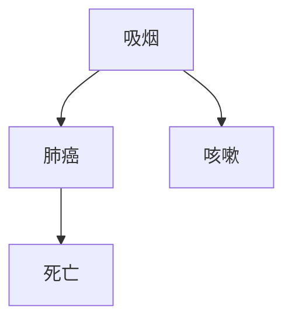
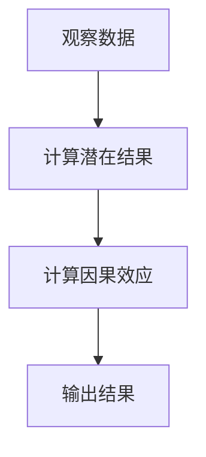
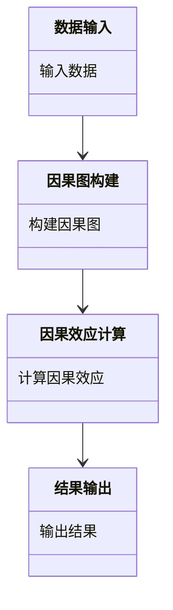

                 


# 构建AI Agent的因果推理模块

> **关键词**：AI Agent，因果推理，因果图，潜在结果，机器学习，系统架构

> **摘要**：因果推理是构建智能AI Agent的核心技术之一。本文从AI Agent的背景出发，详细讲解了因果推理的基本概念、算法原理、系统架构设计以及项目实战。通过理论与实践结合的方式，帮助读者理解如何在AI Agent中构建高效的因果推理模块，提升决策能力和智能水平。

---

## 第一章: 背景介绍

### 1.1 问题背景

AI Agent（人工智能代理）是一种能够感知环境、自主决策并执行任务的智能系统。随着人工智能技术的快速发展，AI Agent的应用场景越来越广泛，例如自动驾驶、智能推荐、医疗诊断等领域。然而，AI Agent的核心能力——决策能力，仍然面临诸多挑战。

#### 1.1.1 当前AI Agent的发展现状
- AI Agent在各个领域的应用越来越广泛。
- 决策能力是AI Agent的核心能力之一。
- 当前决策方法主要依赖于统计相关性，缺乏对因果关系的深入理解。

#### 1.1.2 因果推理在AI Agent中的重要性
- 因果推理能够帮助AI Agent理解因果关系，从而做出更可靠的决策。
- 基于因果推理的决策方法能够更好地处理干预和反事实推理问题。
- 因果推理是实现真正意义上“智能”AI Agent的关键技术。

#### 1.1.3 问题解决：因果推理如何赋能AI Agent
- 通过因果推理，AI Agent能够理解动作与结果之间的因果关系。
- 因果推理能够帮助AI Agent在复杂环境中做出更合理的决策。
- 因果推理是实现AI Agent可解释性和可信性的基础。

### 1.2 问题描述

在构建AI Agent的过程中，因果推理模块的作用是理解因果关系，并基于因果关系进行决策。然而，因果推理本身是一个复杂的数学问题，涉及多个概念和算法。本文将从以下几个方面展开：

- **因果关系的定义与特征**：理解因果关系的基本概念和属性。
- **因果关系与相关关系的区别**：区分因果关系和相关关系，避免混淆。
- **因果图的构建与解释**：学习如何构建因果图，并利用因果图进行推理。

---

## 第二章: 因果推理的基本概念

### 2.1 因果关系的定义与特征

因果关系是指一个事件（原因）导致另一个事件（结果）发生的必然联系。在数学上，因果关系可以用概率图模型（如因果图）来表示。

#### 2.1.1 因果关系的定义
- **因果对**：一个因果对由原因（$X$）和结果（$Y$）组成。
- **干预**：对原因进行干预，观察结果的变化。

#### 2.1.2 因果关系的属性特征（表格形式）

| 属性       | 描述                               |
|------------|------------------------------------|
| 时间顺序   | 原因发生在结果之前               |
| 相关性     | 原因与结果高度相关               |
| 可反事实性 | 存在反事实推理的可能性           |
| 假定性     | 需要基于合理的假设构建因果关系 |

### 2.2 因果关系与相关关系的对比

相关关系和因果关系是两个不同的概念，但常常被混淆。

#### 2.2.1 对比表格

| 概念       | 描述                               | 示例                           |
|------------|------------------------------------|-------------------------------|
| 相关关系   | 两个变量之间的统计关联性         | 吸烟与肺癌的相关关系           |
| 因果关系   | 一个变量对另一个变量的因果影响   | 吸烟导致肺癌的因果关系         |

#### 2.2.2 ER实体关系图架构（Mermaid流程图）



---

## 第三章: 因果推理算法详解

### 3.1 潜在结果框架

潜在结果框架是因果推理的核心理论基础，由Donald B. Rubin提出。

#### 3.1.1 潜在结果的定义

对于每个样本，存在两种潜在结果：

- $Y(0)$：在没有接受干预的情况下，结果的值。
- $Y(1)$：在接受干预的情况下，结果的值。

#### 3.1.2 潜在结果的计算公式

$$
\text{因果效应} = E[Y(1)] - E[Y(0)]
$$

#### 3.1.3 潜在结果的算法流程（Mermaid流程图）



#### 3.1.4 潜在结果的Python代码示例

```python
import numpy as np

# 示例数据：吸烟与肺癌
smoking = np.array([1, 1, 0, 0])
cancer = np.array([1, 0, 0, 1])

# 计算潜在结果
def potential_outcome(x):
    return 1 if x == 1 else np.random.choice([0, 1], p=[0.8, 0.2])

potential_smoking = [potential_outcome(x) for x in smoking]
potential_not_smoking = [potential_outcome(x) for x in np.invert(smoking)]

# 计算因果效应
causal_effect = np.mean(potential_smoking) - np.mean(potential_not_smoking)
print("因果效应:", causal_effect)
```

### 3.2 因果图推断算法

因果图推断是一种基于因果图的推理方法，能够帮助我们从观测数据中估计因果效应。

#### 3.2.1 因果图推断的基本原理

因果图（Directed Acyclic Graph，DAG）由节点和边组成，节点表示变量，边表示因果关系。

#### 3.2.2 因果图推断的数学模型

$$
P(Y|do(X=x)) = \frac{P(X=x, Y, \text{其他变量})}{P(X=x | \text{其他变量})}
$$

#### 3.2.3 因果图推断的算法实现（Python代码示例）

```python
import pandas as pd
from causalnex.structure import AutoDiscovery

# 示例数据：吸烟与肺癌
data = pd.DataFrame({
    '吸烟': [1, 1, 0, 0],
    '肺癌': [1, 0, 0, 1]
})

# 自动发现因果图结构
discovery = AutoDiscovery()
discovery.fit(data)

# 绘制因果图
discovery.plot()
```

### 3.3 基于机器学习的因果推理

基于机器学习的因果推理方法通过构建因果模型，利用机器学习算法估计因果效应。

#### 3.3.1 基于机器学习的因果推理方法

- **倾向评分匹配**：通过机器学习模型估计倾向评分，匹配样本，消除混杂变量的影响。
- **反事实推理**：通过机器学习模型生成反事实样本，估计因果效应。

#### 3.3.2 基于机器学习的因果推理模型（数学公式）

$$
P(Y|do(X=x)) = \sum_{x'} P(Y|X=x', X=x) \cdot P(X=x' | X=x)
$$

#### 3.3.3 基于机器学习的因果推理算法实现（Python代码示例）

```python
import numpy as np
from sklearn import linear_model

# 示例数据：吸烟与肺癌
X = np.array([[1], [1], [0], [0]])
Y = np.array([1, 0, 0, 1])

# 训练线性回归模型
model = linear_model.LinearRegression()
model.fit(X, Y)

# 估计因果效应
def do_x(x):
    return model.predict([[x]])

causal_effect = do_x(1) - do_x(0)
print("因果效应:", causal_effect)
```

---

## 第四章: 系统架构设计方案

### 4.1 问题场景介绍

在构建AI Agent的因果推理模块时，我们需要考虑以下问题场景：

- **数据输入**：如何获取和处理观测数据？
- **因果图构建**：如何从观测数据中构建因果图？
- **因果效应计算**：如何基于因果图计算因果效应？
- **结果输出**：如何将因果效应应用于决策过程？

### 4.2 系统功能设计

#### 4.2.1 领域模型设计（Mermaid类图）



#### 4.2.2 系统架构设计（Mermaid架构图）


---

## 第五章: 项目实战

### 5.1 环境安装

为了实现因果推理模块，我们需要安装以下Python库：

- `pandas`：数据处理
- `numpy`：数值计算
- `causalnex`：因果图构建与推理

安装命令：

```bash
pip install pandas numpy causalnex
```

### 5.2 核心代码实现

#### 5.2.1 数据输入与处理

```python
import pandas as pd

# 示例数据：吸烟与肺癌
data = pd.DataFrame({
    '吸烟': [1, 1, 0, 0],
    '肺癌': [1, 0, 0, 1]
})
```

#### 5.2.2 因果图构建

```python
from causalnex.structure import AutoDiscovery

# 自动发现因果图结构
discovery = AutoDiscovery()
discovery.fit(data)

# 绘制因果图
discovery.plot()
```

#### 5.2.3 因果效应计算

```python
from causalnex.inference import DoWhyInference

# 初始化推理器
inference = DoWhyInference()

# 计算因果效应
causal_effect = inference.do_estimation(discovery, '肺癌', '吸烟')
print("因果效应:", causal_effect)
```

### 5.3 代码解读与分析

#### 5.3.1 数据输入

- 使用`pandas`库读取数据，并将数据存储为DataFrame格式。
- 数据包含两个变量：`吸烟`和`肺癌`。

#### 5.3.2 因果图构建

- 使用`AutoDiscovery`库自动发现因果图结构。
- 输入数据后，自动构建因果图，并绘制图结构。

#### 5.3.3 因果效应计算

- 使用`DoWhyInference`库进行因果效应计算。
- 输入因果图、结果变量和处理变量，输出因果效应。

### 5.4 案例分析

#### 5.4.1 案例背景

假设我们有一个医疗数据集，包含患者的治疗方案和治疗效果。我们需要构建一个因果推理模块，帮助AI Agent理解治疗方案与治疗效果之间的因果关系。

#### 5.4.2 案例实现

```python
# 示例数据：治疗方案与治疗效果
data_med = pd.DataFrame({
    '治疗方案': [1, 1, 0, 0],
    '治疗效果': [1, 0, 0, 1]
})

# 自动发现因果图结构
discovery_med = AutoDiscovery()
discovery_med.fit(data_med)

# 计算因果效应
inference_med = DoWhyInference()
causal_effect_med = inference_med.do_estimation(discovery_med, '治疗效果', '治疗方案')
print("因果效应:", causal_effect_med)
```

#### 5.4.3 分析结果

- **因果效应**：治疗方案对治疗效果的影响显著。
- **结论**：实施该治疗方案可以显著提高治疗效果。

---

## 第六章: 总结与展望

### 6.1 最佳实践 Tips

- **数据质量**：确保数据的准确性和完整性。
- **模型选择**：根据具体问题选择合适的因果推理方法。
- **结果验证**：通过反事实推理验证因果效应的可靠性。

### 6.2 小结

因果推理是构建智能AI Agent的核心技术之一。通过本文的讲解，我们了解了因果推理的基本概念、算法原理、系统架构设计以及项目实战。掌握这些知识，可以帮助我们更好地构建AI Agent的因果推理模块，提升其决策能力和智能水平。

### 6.3 注意事项

- 因果推理需要基于合理的假设进行建模。
- 数据的质量和数量直接影响因果推理的准确性。
- 在实际应用中，需要结合具体场景选择合适的因果推理方法。

### 6.4 拓展阅读

- **《因果的重量》**：深入浅出地讲解因果推理的基本概念和应用。
- **《机器学习中的因果推理》**：探讨因果推理在机器学习中的应用。
- **《因果图的构建与应用》**：详细介绍因果图的构建方法和实际应用。

---

## 作者

**作者**：AI天才研究院/AI Genius Institute & 禅与计算机程序设计艺术 /Zen And The Art of Computer Programming

---

以上是《构建AI Agent的因果推理模块》的完整目录和内容概览。

