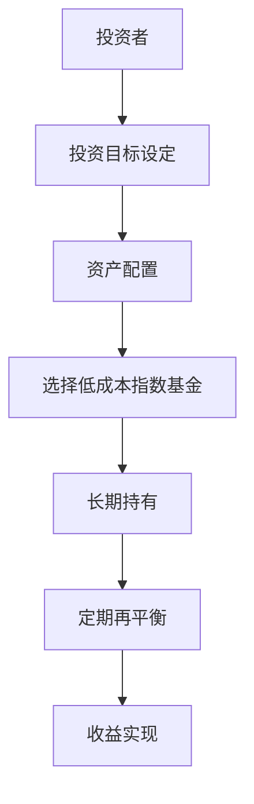
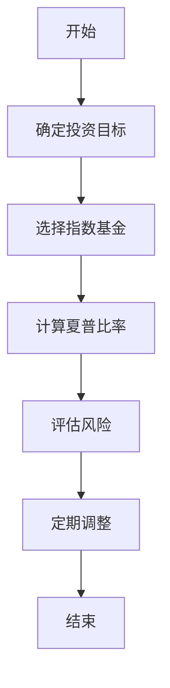
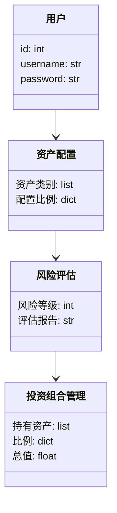
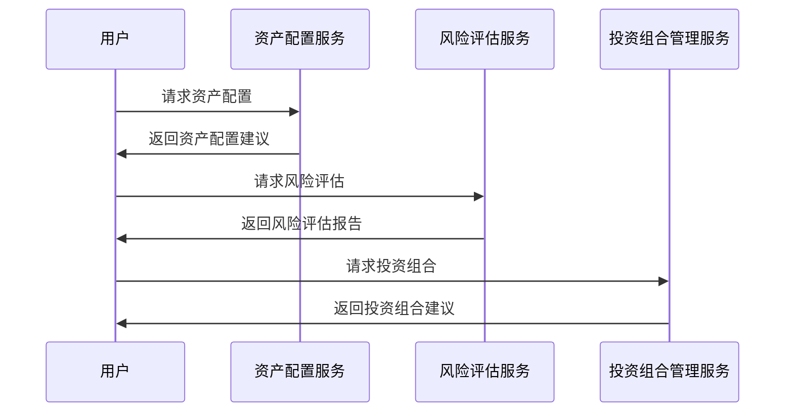

                 


# 约翰·伯格的简单投资法则

> 关键词：约翰·伯格，简单投资，投资法则，指数基金，长期投资，风险管理

> 摘要：约翰·伯格是投资领域的重要人物，他提出的“简单投资法则”强调长期投资、分散投资和低成本投资。本文将从背景、核心概念、算法原理、系统架构、项目实战等角度，全面解析约翰·伯格的简单投资法则，并通过具体案例和代码实现，帮助读者理解其投资理念的科学性和实践性。

---

# 第一部分: 约翰·伯格的简单投资法则引言

## 第1章: 约翰·伯格与简单投资法则

### 1.1 约翰·伯格的背景与投资理念

#### 1.1.1 约翰·伯格的生平简介
约翰·伯格（John Bogle）是美国著名投资家，被誉为“指数基金之父”。他于1934年出生于美国宾夕法尼亚州，1951年进入宾夕法尼亚大学学习，后转学到拉特格勒大学，获得经济学学士学位。伯格的职业生涯始于1958年，他曾在美国运通银行工作，并在1965年创立了 Vanguard 集团。1975年，他推出了第一只指数基金——Vanguard 500 Index Fund，这一创新使他成为指数投资领域的先驱。

#### 1.1.2 简单投资法则的核心理念
约翰·伯格的核心投资理念可以概括为“简单即美”。他认为，投资者不必追求复杂的交易策略或短期收益，而是应该注重长期投资、分散投资和低成本投资。简单投资法则的核心在于通过指数基金实现资产的长期增值，同时避免频繁交易和高昂的管理费用。

#### 1.1.3 简单投资法则的哲学基础
伯格的投资哲学深受本杰明·格雷厄姆的影响，他强调价值投资和风险管理的重要性。他认为，市场波动是不可避免的，但通过分散投资和长期持有优质资产，投资者可以降低风险并实现稳健的收益。

---

### 1.2 简单投资法则的背景与问题背景

#### 1.2.1 现代投资市场的复杂性
现代投资市场充满了复杂性，投资者面临众多选择：股票、债券、基金、ETF 等。许多投资者被复杂的金融产品和高频交易策略迷惑，追求短期收益而忽视了长期目标。

#### 1.2.2 投资者面临的常见问题
许多投资者在投资过程中存在以下问题：
1. 过度交易：频繁买卖导致交易成本和税费增加，影响收益。
2. 追求短期收益：忽视长期投资目标，容易被市场波动影响。
3. 高成本：选择高管理费用的基金产品，长期来看收益会被侵蚀。

#### 1.2.3 简单投资法则的提出与解决
伯格提出简单投资法则，旨在通过以下方式解决这些问题：
1. 降低投资成本：选择低成本的指数基金，减少管理费用。
2. 长期持有：通过长期投资摊低成本，享受复利效应。
3. 分散投资：通过指数基金实现广泛的资产分散，降低风险。

---

### 1.3 简单投资法则的核心概念与联系

#### 1.3.1 核心概念原理
简单投资法则的核心概念包括：
1. 资产配置：通过指数基金实现对整个市场的分散投资。
2. 长期持有：避免频繁交易，降低交易成本。
3. 成本控制：选择低成本的基金产品，提高净收益。

#### 1.3.2 核心概念属性特征对比表格

| 概念           | 特性           | 优势           |
|----------------|----------------|----------------|
| 资产配置       | 分散投资       | 降低风险       |
| 长期持有       | 复利效应       | 提高收益       |
| 成本控制       | 低成本         | 增加净收益     |

#### 1.3.3 ER实体关系图架构的 Mermaid 流程图



---

# 第二部分: 简单投资法则的数学模型与算法原理

## 第2章: 简单投资法则的数学模型与算法原理

### 2.1 简单投资法则的数学模型

#### 2.1.1 投资组合优化的数学模型
投资组合优化的目标是最大化收益，同时最小化风险。数学模型可以表示为：
$$
\text{最大化 } \mu^T w - \lambda \cdot w^T \Sigma w
$$
其中，$\mu$ 是资产的期望收益向量，$w$ 是投资权重向量，$\Sigma$ 是资产的协方差矩阵，$\lambda$ 是风险厌恶系数。

#### 2.1.2 风险与收益的数学关系
收益与风险之间存在权衡关系，可以通过夏普比率（Sharpe Ratio）来衡量：
$$
\text{夏普比率 } = \frac{\mu_p - r_f}{\sigma_p}
$$
其中，$\mu_p$ 是投资组合的期望收益，$r_f$ 是无风险利率，$\sigma_p$ 是投资组合的收益标准差。

#### 2.1.3 投资组合的夏普比率计算公式
假设投资组合的收益为 $R_p$，无风险收益率为 $R_f$，收益的标准差为 $\sigma_p$，则夏普比率：
$$
\text{夏普比率 } = \frac{E[R_p] - R_f}{\sigma_p}
$$

### 2.2 简单投资法则的算法原理

#### 2.2.1 投资组合优化的算法流程
1. 确定投资目标和风险承受能力。
2. 选择适合的指数基金，构建投资组合。
3. 计算投资组合的夏普比率，评估风险调整后收益。
4. 定期审视和调整投资组合，确保与目标一致。

#### 2.2.2 算法原理的 Mermaid 流程图



#### 2.2.3 算法实现的 Python 源代码

```python
import numpy as np

# 示例：计算夏普比率
def calculate_sharpe_ratio(returns, risk_free_rate):
    # 计算收益
    mu = np.mean(returns)
    # 计算标准差
    sigma = np.std(returns)
    # 计算夏普比率
    sharpe_ratio = (mu - risk_free_rate) / sigma
    return sharpe_ratio

# 示例数据
returns = [0.05, 0.03, 0.07, 0.02, 0.06]
risk_free_rate = 0.02

# 计算夏普比率
print(f"夏普比率：{calculate_sharpe_ratio(returns, risk_free_rate)}")
```

---

# 第三部分: 简单投资法则的系统分析与架构设计方案

## 第3章: 系统分析与架构设计

### 3.1 系统分析

#### 3.1.1 问题场景介绍
投资系统需要实现资产配置、风险评估和投资组合管理功能。目标是为投资者提供低成本、高效率的投资工具。

#### 3.1.2 系统功能需求分析
1. 用户注册与登录
2. 资产配置建议
3. 风险评估
4. 投资组合管理
5. 定期再平衡提醒

#### 3.1.3 系统功能设计的 Mermaid 类图



### 3.2 系统架构设计

#### 3.2.1 系统架构的 Mermaid 架构图

```mermaid
container 客户端 {
    用户界面
}
container 服务端 {
    资产配置服务
    风险评估服务
    投资组合管理服务
}
客户端 --> 服务端
```

#### 3.2.2 系统接口设计
1. 用户登录接口
2. 资产配置接口
3. 风险评估接口
4. 投资组合管理接口

#### 3.2.3 系统交互的 Mermaid 序列图



---

# 第四部分: 简单投资法则的项目实战

## 第4章: 项目实战

### 4.1 环境安装与配置

#### 4.1.1 投资分析工具的安装
安装 Python 和必要的库：
- NumPy
- Pandas
- Matplotlib
- IEXData（用于获取股票数据）

#### 4.1.2 投资分析工具的配置
配置 API 密钥，安装必要的依赖：
```bash
pip install numpy pandas matplotlib iexdata
```

### 4.2 系统核心实现源代码

#### 4.2.1 简单投资组合优化的 Python 代码

```python
import pandas as pd
import iexdata as iex

# 获取指数数据
index_ticker = "SPY"
index_data = iex.get_data(index_ticker)

# 计算指数基金的年化收益率和波动率
returns = index_data['close'].pct_change().dropna()
annualized_return = (1 + returns.mean()) ** 250 - 1
volatility = returns.std() * np.sqrt(250)

print(f"年化收益率：{annualized_return:.2%}")
print(f"波动率：{volatility:.2%}")
```

#### 4.2.2 投资组合再平衡的代码实现

```python
def rebalance_portfolio(portfolio, current_weights, target_weights):
    # 计算再平衡后的目标头寸
    target_value = sum(portfolio['amount'] * portfolio['price'])
    rebalanced_portfolio = {
        'asset': [],
        'target_weight': [],
        'current_weight': [],
        'rebalanced_amount': []
    }
    for asset in target_weights:
        target_value_asset = target_weights[asset] * target_value
        current_value_asset = portfolio['amount'][portfolio['asset'] == asset] * portfolio['price'][portfolio['asset'] == asset].values[0]
        rebalanced_amount = target_value_asset / portfolio['price'][portfolio['asset'] == asset].values[0]
        rebalanced_portfolio['asset'].append(asset)
        rebalanced_portfolio['target_weight'].append(target_weights[asset])
        rebalanced_portfolio['current_weight'].append(current_value_asset / target_value)
        rebalanced_portfolio['rebalanced_amount'].append(rebalanced_amount)
    return pd.DataFrame(rebalanced_portfolio)
```

### 4.3 代码应用解读与分析

#### 4.3.1 投资组合优化代码解读
上述代码通过获取指数基金的历史数据，计算其年化收益率和波动率。年化收益率反映了指数基金的长期收益能力，波动率则衡量了其风险程度。通过夏普比率可以评估指数基金的风险调整后收益。

#### 4.3.2 投资组合再平衡代码解读
再平衡代码通过比较当前投资组合的权重与目标权重，计算需要调整的头寸。这种定期再平衡策略确保投资组合保持在预定的资产配置比例，从而实现长期稳健的投资收益。

---

# 第五部分: 总结与展望

## 第5章: 总结与展望

### 5.1 投资组合的总结与小结
简单投资法则的核心在于通过长期持有低成本指数基金实现资产的稳健增值。通过定期再平衡和分散投资，可以有效降低风险并提高收益。

### 5.2 最佳实践 tips
1. 选择低成本的指数基金，避免高管理费用。
2. 定期审视投资组合，确保与投资目标一致。
3. 避免频繁交易，降低交易成本和税费。

### 5.3 投资心理学与风险管理
投资者应避免贪婪和恐惧的情绪化决策，坚持长期投资策略。同时，通过分散投资和风险控制，可以有效应对市场波动。

### 5.4 未来展望与拓展阅读
随着金融科技的发展，投资自动化和智能化将成为趋势。投资者可以利用大数据和人工智能技术，进一步优化投资组合和风险管理。

---

作者：AI天才研究院/AI Genius Institute & 禅与计算机程序设计艺术/Zen And The Art of Computer Programming

---

# 推荐阅读
- 《简单投资法则的数学模型与算法原理》
- 《指数基金投资指南》
- 《风险管理与投资组合优化》

