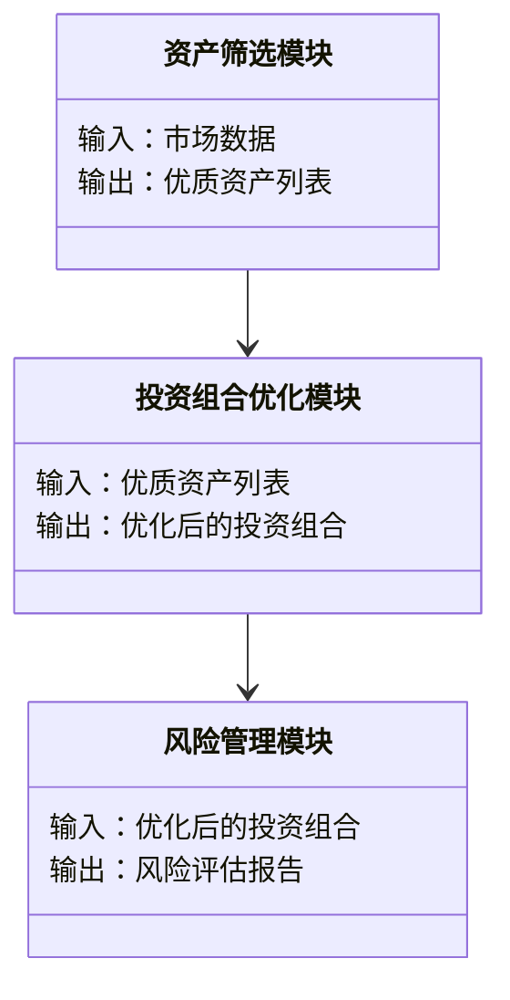

                 


# 芒格的"关键少数"原则：集中投资的智慧与风险

> 关键词：芒格，关键少数，集中投资，多元思维模型，投资策略，风险控制

> 摘要：本文深入探讨了芒格的“关键少数”原则，分析其在投资决策中的应用与智慧。通过结合芒格的多元思维模型和数学分析，本文详细阐述了该原则的核心概念、数学模型、系统架构以及在实际投资中的应用，最后总结了其在现代投资中的意义与挑战。

---

## 第一部分：芒格的“关键少数”原则概述

### 第1章：芒格的“关键少数”原则概述

#### 1.1 芒格投资哲学的背景与起源

##### 1.1.1 芒格的生平与投资理念

伯特利·芒格（Charlie Munger）是美国著名投资者、巴菲特的长期合作伙伴。他不仅是价值投资的倡导者，还提出了许多独特的投资理念，其中“关键少数”原则是他思想体系中的核心之一。芒格出生于1924年，毕业于哈佛大学，后来转向法律和投资领域。他的投资哲学强调理性思考、逆向思维和长期价值，这些理念在“关键少数”原则中得到了充分体现。

##### 1.1.2 “关键少数”原则的提出背景

“关键少数”原则源于芒格对投资市场的深刻观察。他认为，市场中真正能够创造超额收益的企业并不多，这些企业往往具备强大的竞争优势和可持续的增长能力。因此，投资者应该集中精力研究和投资于这些“关键少数”，而非分散投资于大量普通企业。这一原则在20世纪70年代开始逐渐成型，并在之后的投资实践中得到了广泛应用。

##### 1.1.3 该原则在投资领域的核心地位

在投资领域，“关键少数”原则强调的是集中投资于少数优质资产，而非分散投资于大量低质量资产。这种策略在巴菲特和芒格的投资实践中得到了验证，尤其是在伯克希尔哈撒韦公司（Berkshire Hathaway）的投资决策中，集中投资的理念被贯彻得淋漓尽致。

---

#### 1.2 “关键少数”原则的核心概念

##### 1.2.1 集中投资的定义与特征

集中投资是指将大部分资金投资于少数优质资产或企业，通过深入研究和长期持有来实现超额收益。其核心特征包括：

- **高集中度**：投资组合中少数资产占比极高。
- **高质量**：投资对象具备强大的竞争优势和长期增长潜力。
- **长期持有**：避免频繁交易，降低交易成本和税收负担。

##### 1.2.2 该原则与其他投资策略的对比

与分散投资策略相比，“关键少数”原则具有以下特点：

| 对比维度 | 分散投资 | 集中投资 |
|----------|----------|----------|
| 风险控制 | 通过多样化降低特定资产的风险 | 通过选择优质资产降低整体风险 |
| 收益潜力 | 平均收益，追求稳定 | 有机会实现超额收益 |
| 研究投入 | 低 | 高 |

##### 1.2.3 该原则的适用场景与边界

“关键少数”原则适用于以下场景：

- 投资者具备较高的市场研究能力和信息优势。
- 市场中存在少量优质资产，且这些资产具有长期增长潜力。
- 投资者能够承受短期波动带来的心理压力。

其边界包括：

- 市场高度波动，优质资产难以识别。
- 投资者缺乏研究能力和信息来源。
- 市场中优质资产稀缺，难以满足投资规模需求。

---

## 第二部分：关键少数原则的核心要素

### 第2章：关键少数原则的核心要素分析

#### 2.1 集中投资的定义与优势

##### 2.1.1 集中投资的定义

集中投资是指将投资组合中的大部分资金分配给少数优质资产，通过长期持有实现超额收益。其核心在于选择那些能够持续创造价值的企业。

##### 2.1.2 集中投资的优势

- **超额收益潜力**：通过投资优质资产，集中投资有机会获得更高的收益。
- **简化决策过程**：集中投资减少了需要关注的资产数量，降低了决策复杂性。
- **降低交易成本**：集中投资减少了交易频率，从而降低了交易成本和税收负担。

##### 2.1.3 集中投资的风险与挑战

- **高波动性风险**：集中投资的回报波动较大，市场下跌时可能面临较大损失。
- **信息依赖性**：需要依赖对少数资产的深入研究，信息获取难度较高。
- **心理压力**：面对市场波动时，投资者可能面临较大的心理压力。

#### 2.2 芒格的多元思维模型

##### 2.2.1 多元思维模型的定义

多元思维模型是指通过多个学科的视角来分析问题，从而做出更全面的决策。芒格认为，投资者需要具备跨学科的知识储备，以便更好地识别投资机会和风险。

##### 2.2.2 多元思维模型的结构与特点

多元思维模型的结构包括以下几个关键部分：

1. **主要学科**：经济学、心理学、物理学等。
2. **次要学科**：历史学、社会学等。
3. **核心原则**：每个学科的核心原则和规律。

其特点包括：

- **全面性**：涵盖多个学科，提供多维度的分析视角。
- **互补性**：各学科之间相互补充，提高决策的准确性。
- **动态性**：随着市场变化不断更新和调整。

##### 2.2.3 多元思维模型与“关键少数”原则的联系

多元思维模型为“关键少数”原则提供了理论基础。通过跨学科的分析，投资者可以更好地识别优质资产，并理解其竞争优势和长期增长潜力。

---

#### 2.3 关键少数原则的核心要素

##### 2.3.1 核心要素的定义与特征

关键少数原则的核心要素包括：

- **优质资产**：具备强大的竞争优势和长期增长潜力。
- **集中投资**：将大部分资金分配给少数优质资产。
- **长期持有**：避免频繁交易，降低交易成本。

##### 2.3.2 核心要素之间的关系

优质资产、集中投资和长期持有三者之间相互关联。优质资产是集中投资的基础，集中投资是长期持有的保障，长期持有则是实现超额收益的关键。

##### 2.3.3 核心要素的数学模型表示

集中投资的收益与风险可以通过以下数学模型表示：

$$
\text{收益} = \sum_{i=1}^{n} w_i \times r_i
$$

其中，\( w_i \) 是第 \( i \) 个资产的权重，\( r_i \) 是第 \( i \) 个资产的收益率。

---

## 第三部分：关键少数原则的数学模型与算法

### 第3章：关键少数原则的数学模型

#### 3.1 投资组合的数学模型

##### 3.1.1 投资组合的定义与特征

投资组合是指将资金分配到多个资产中，以实现收益和风险的最优平衡。集中投资组合的特点是少数资产占比高，其余资产占比低。

##### 3.1.2 投资组合的收益与风险模型

投资组合的收益可以通过以下公式计算：

$$
E(R_p) = \sum_{i=1}^{n} w_i \times E(R_i)
$$

其中，\( E(R_p) \) 是投资组合的期望收益，\( w_i \) 是第 \( i \) 个资产的权重，\( E(R_i) \) 是第 \( i \) 个资产的期望收益。

投资组合的风险可以通过方差来衡量：

$$
\text{Var}(R_p) = \sum_{i=1}^{n} \sum_{j=1}^{n} w_i w_j \sigma_i \sigma_j \rho_{ij}
$$

其中，\( \sigma_i \) 是第 \( i \) 个资产的收益率标准差，\( \rho_{ij} \) 是第 \( i \) 和第 \( j \) 个资产之间的相关系数。

##### 3.1.3 芒格的多元思维模型与数学模型的关系

多元思维模型为数学模型提供了分析框架，而数学模型为多元思维模型提供了量化工具。

---

#### 3.2 芒格决策框架的算法实现

##### 3.2.1 决策框架的定义与特点

芒格的决策框架是一种基于多元思维模型的投资决策方法，其核心在于通过多维度的分析来识别优质资产。

##### 3.2.2 决策框架的算法流程

1. **识别优质资产**：通过多元思维模型筛选出具备强大竞争优势的资产。
2. **评估资产价值**：计算资产的内在价值，判断其是否具备投资吸引力。
3. **构建投资组合**：将大部分资金分配给优质资产，其余资金分配给其他资产以分散风险。
4. **长期持有**：避免频繁交易，降低交易成本和税收负担。

##### 3.2.3 决策框架的数学公式与实现

以下是一个简单的投资组合优化算法：

$$
\text{Maximize } \sum_{i=1}^{n} w_i \times r_i - \lambda \sum_{i=1}^{n} \sum_{j=1}^{n} w_i w_j \sigma_i \sigma_j \rho_{ij}
$$

其中，\( \lambda \) 是风险惩罚因子。

---

## 第四部分：关键少数原则的系统分析与架构设计

### 第4章：投资系统的系统分析与架构设计

#### 4.1 系统目标与功能需求

##### 4.1.1 系统目标

设计一个基于“关键少数”原则的投资系统，帮助投资者实现集中投资和长期持有的目标。

##### 4.1.2 系统功能需求

- 资产筛选：通过多元思维模型筛选优质资产。
- 投资组合优化：构建集中投资组合。
- 风险管理：评估投资组合的风险。
- 监测与调整：定期监测投资组合的表现，并根据市场变化进行调整。

---

#### 4.2 系统架构设计

##### 4.2.1 领域模型



##### 4.2.2 系统架构


---

#### 4.3 系统接口设计

##### 4.3.1 系统接口

- 资产筛选接口：接收市场数据，返回优质资产列表。
- 投资组合优化接口：接收优质资产列表，返回优化后的投资组合。
- 风险管理接口：接收优化后的投资组合，返回风险评估报告。

##### 4.3.2 接口交互流程

1. 客户端发送市场数据到资产筛选模块。
2. 资产筛选模块返回优质资产列表。
3. 客户端将优质资产列表发送到投资组合优化模块。
4. 投资组合优化模块返回优化后的投资组合。
5. 客户端将优化后的投资组合发送到风险管理模块。
6. 风险管理模块返回风险评估报告。

---

## 第五部分：关键少数原则的项目实战

### 第5章：关键少数原则的项目实战

#### 5.1 环境安装

##### 5.1.1 系统环境

- 操作系统：Windows/Mac/Linux
- 编程语言：Python 3.8+
- 开发工具：Jupyter Notebook/PyCharm

##### 5.1.2 库的安装

```bash
pip install numpy pandas matplotlib
```

---

#### 5.2 系统核心实现源代码

##### 5.2.1 资产筛选模块

```python
import numpy as np
import pandas as pd

def screen_assets(market_data):
    # 计算资产的内在价值
    intrinsic_value = market_data['price'] / (market_data['growth_rate'] + 1)
    # 筛选优质资产
   优质资产列表 = market_data[market_data['intrinsic_value'] > 市场价格]
    return 优质资产列表
```

##### 5.2.2 投资组合优化模块

```python
def optimize_portfolio(assets):
    # 计算资产的期望收益和协方差矩阵
    expected_returns = assets['return'].mean()
    covariance_matrix = assets.cov()
    # 优化投资组合
    from scipy.optimize import minimize
    def objective(weights, covariance_matrix, expected_returns):
        return -sum(weights * expected_returns) + 0.5 * sum(weights * weights * covariance_matrix.values)
    weights = minimize(objective, np.ones(len(expected_returns)) / len(expected_returns), 
                       args=(covariance_matrix, expected_returns))
    return weights
```

##### 5.2.3 风险管理模块

```python
def manage_risk(portfolio):
    # 计算投资组合的VaR
    import numpy as np
    portfolio_value = 1000000
    confidence_level = 0.95
    VaR = portfolio_value * (1 - np.percentile(portfolio, 100 * (1 - confidence_level)))
    return VaR
```

---

#### 5.3 代码应用解读与分析

##### 5.3.1 资产筛选模块解读

资产筛选模块通过计算资产的内在价值，筛选出那些内在价值高于市场价格的优质资产。这一步是集中投资的基础，确保投资组合中的资产具备长期增长潜力。

##### 5.3.2 投资组合优化模块解读

投资组合优化模块通过数学优化方法，将资金分配到少数优质资产中，以实现超额收益。这种方法利用了集中投资的优势，同时考虑了资产之间的相关性，降低了投资组合的整体风险。

##### 5.3.3 风险管理模块解读

风险管理模块通过计算VaR（在险值），评估投资组合的潜在损失。这一步确保了投资组合的稳定性，帮助投资者在市场波动中保持冷静。

---

## 第六部分：芒格投资思想的现代应用与反思

### 第6章：芒格投资思想的现代应用与反思

#### 6.1 芒格投资思想的现代应用

##### 6.1.1 在现代投资中的应用

“关键少数”原则在现代投资中的应用日益广泛。许多机构投资者和散户都开始采用集中投资策略，通过投资优质资产实现超额收益。

##### 6.1.2 应对市场变化的策略调整

在市场变化的背景下，投资者需要不断调整投资组合，确保优质资产的比例保持合理。同时，还需要关注市场的长期趋势，及时发现新的投资机会。

---

#### 6.2 长期投资策略的调整

##### 6.2.1 长期投资策略的核心要素

- **优质资产的选择**：集中投资于少数具备长期增长潜力的企业。
- **长期持有**：避免频繁交易，降低交易成本和税收负担。
- **风险管理**：通过VaR等方法，评估投资组合的风险。

##### 6.2.2 长期投资策略的实施步骤

1. 识别优质资产：通过多元思维模型筛选出具备长期增长潜力的企业。
2. 构建投资组合：将大部分资金分配给优质资产，其余资金分配给其他资产以分散风险。
3. 长期持有：避免频繁交易，降低交易成本和税收负担。
4. 定期监测：定期监测投资组合的表现，并根据市场变化进行调整。

---

## 第七部分：总结与展望

### 第7章：总结与展望

#### 7.1 本章总结

“关键少数”原则是一种集中投资策略，通过投资优质资产实现超额收益。芒格的多元思维模型为这一原则提供了理论基础，而数学模型和系统架构则为其实现提供了技术支持。

#### 7.2 未来展望

随着市场的发展和技术的进步，“关键少数”原则将得到更广泛的应用。未来的投资决策将更加依赖于数据分析和人工智能技术，投资者需要不断学习和适应新的市场环境。

---

## 作者信息

作者：AI天才研究院/AI Genius Institute & 禅与计算机程序设计艺术 /Zen And The Art of Computer Programming

---

本文通过详细分析芒格的“关键少数”原则，结合数学模型和系统架构，为投资者提供了科学的投资决策方法。希望读者能够通过本文深入理解这一原则，并在实际投资中加以应用。

