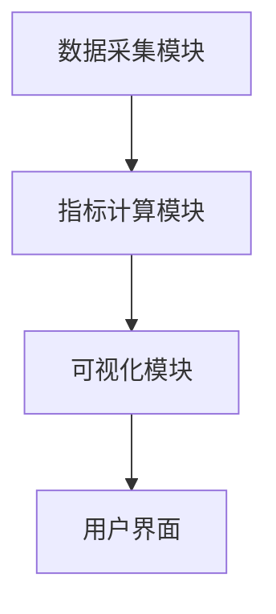

                 


# 《金融科技创新评估框架》

> 关键词：金融科技创新、评估框架、技术评估、业务创新、金融科技

> 摘要：  
本文系统地探讨了金融科技创新的评估框架，从背景、核心概念、评估指标到具体方法和系统架构，全面分析了金融科技创新的关键要素和评估维度。通过详细的理论分析和实际案例，本文提出了一个基于技术创新性、业务创新性、用户体验和社会经济效益的多维度评估体系，并结合具体的技术方法和工具，为金融科技创新的实践提供了系统的指导和参考。

---

# 第一部分: 金融科技创新评估背景与核心概念

---

## 第1章: 金融科技创新的背景与定义

### 1.1 金融科技创新的背景

#### 1.1.1 金融科技发展的历史演变
- **1.1.1.1 传统金融阶段**：金融创新主要集中在业务流程优化和产品创新，例如票据、银行贷款和保险产品。
- **1.1.1.2 互联网金融阶段**：以支付宝、微信支付为代表的第三方支付平台兴起，互联网技术开始渗透到金融领域。
- **1.1.1.3 金融科技（FinTech）阶段**：大数据、人工智能、区块链等技术的引入，推动金融从线上化向智能化发展。

#### 1.1.2 当前金融科技发展的主要驱动力
- **技术驱动**：大数据、人工智能、区块链、云计算等技术的快速发展。
- **政策支持**：各国政府出台政策支持金融科技发展，例如中国的“金融科技发展规划”。
- **市场需求**：用户对高效、便捷、个性化的金融服务需求不断增长。

#### 1.1.3 金融科技创新的核心问题与边界
- 核心问题：如何通过技术创新提升金融服务效率、降低风险、增强用户体验。
- 边界：金融科技创新必须在合规和风险可控的前提下进行，不能脱离金融本质。

---

### 1.2 金融科技创新的定义与特点

#### 1.2.1 金融科技创新的定义
- 金融科技创新是指利用新兴技术（如人工智能、区块链、大数据等）对金融服务模式、业务流程、产品设计等进行创新和优化。

#### 1.2.2 金融科技创新的核心要素
- **技术创新性**：采用新技术（如AI、区块链）实现金融服务的突破。
- **业务创新性**：通过技术手段实现新的业务模式或服务流程。
- **用户价值**：提升用户体验，满足用户需求。

#### 1.2.3 金融科技创新与传统金融创新的区别
| 属性 | 传统金融创新 | 金融科技创新 |
|------|--------------|--------------|
| 技术基础 | 依赖传统技术 | 依赖新兴技术 |
| 创新方向 | 业务流程优化 | 技术驱动的模式创新 |
| 风险特征 | 低技术风险 | 高技术风险 |

---

### 1.3 金融科技创新的分类与应用场景

#### 1.3.1 按技术类型分类
- **人工智能**：智能投顾、信用评估。
- **区块链**：跨境支付、供应链金融。
- **大数据**：精准营销、风险控制。

#### 1.3.2 按业务类型分类
- **支付与清算**：移动支付、跨境支付。
- **借贷与融资**：P2P借贷、供应链金融。
- **投资与理财**：智能投顾、量化投资。

#### 1.3.3 金融科技创新的主要应用场景
- **零售金融**：个性化金融服务、智能风控。
- **机构金融**：智能投顾、资产管理系统。
- **监管科技**：实时监控、合规管理。

---

### 1.4 金融科技创新的价值与挑战

#### 1.4.1 金融科技创新的价值体现
- 提升金融服务效率。
- 降低金融成本。
- 增强用户体验。

#### 1.4.2 金融科技创新的主要挑战
- **技术风险**：技术不稳定可能导致业务中断。
- **合规风险**：创新可能与现有监管框架冲突。
- **用户接受度**：新技术可能面临用户信任问题。

#### 1.4.3 金融科技创新的未来发展趋势
- 技术融合：AI与区块链的结合。
- 数据驱动：大数据在金融决策中的应用深化。
- 用户中心化：以用户需求为导向的创新。

---

## 1.5 本章小结
本章从背景、定义、特点、分类和应用场景等方面全面介绍了金融科技创新，分析了其价值和挑战，并展望了未来的发展趋势。

---

## 第2章: 金融科技创新评估的核心概念

---

### 2.1 金融科技创新评估的定义与目标

#### 2.1.1 评估的定义
- 金融科技创新评估是指通过一系列指标和方法，对金融科技创新的创新性、实用性、风险性等进行综合评价。

#### 2.1.2 评估的目标与意义
- 目标：识别优秀的金融科技创新，评估其价值和风险。
- 意义：为金融机构、投资者和监管机构提供决策依据。

---

### 2.2 金融科技创新评估的关键维度

#### 2.2.1 技术创新性
- 创新性：是否采用了新技术或实现了技术突破。
- 技术复杂度：技术实现的难度和复杂性。

#### 2.2.2 业务创新性
- 业务模式创新：是否实现了新的业务模式。
- 业务覆盖度：是否解决了实际问题。

#### 2.2.3 用户体验提升
- 用户满意度：用户对创新的满意度。
- 使用便捷性：创新是否提升了用户体验。

#### 2.2.4 社会经济效益
- 经济效益：是否提升了金融效率、降低了成本。
- 社会效益：是否促进了金融普惠。

---

### 2.3 金融科技创新评估的指标体系

#### 2.3.1 指标体系的设计原则
- **全面性**：覆盖技术创新、业务创新、用户体验和社会效益。
- **可量化性**：指标应可量化，便于评估和比较。
- **可操作性**：评估方法应易于实施。

#### 2.3.2 指标体系的具体构成
| 指标类别 | 指标名称 | 指标描述 |
|----------|----------|----------|
| 技术创新 | 技术复杂度 | 创新采用的技术的复杂性和难度 |
| 业务创新 | 业务覆盖度 | 创新对业务范围的覆盖程度 |
| 用户体验 | 用户满意度 | 用户对创新的满意度 |
| 社会效益 | 经济效益 | 创新带来的经济效益 |

#### 2.3.3 指标之间的关系与权重分配
- 技术创新和业务创新是基础，用户体验和社会效益是目标。
- 权重分配：技术创新（30%）、业务创新（30%）、用户体验（20%）、社会效益（20%）。

---

### 2.4 本章小结
本章详细阐述了金融科技创新评估的核心概念，提出了一个包含技术创新、业务创新、用户体验和社会效益的多维度指标体系。

---

# 第二部分: 金融科技创新评估方法与工具

---

## 第3章: 金融科技创新评估的指标与方法

---

### 3.1 评估指标的详细分析

#### 3.1.1 技术创新性指标
- 技术复杂度：采用的技术复杂性评分。
- 技术独特性：技术的创新性和独特性。

#### 3.1.2 业务创新性指标
- 业务模式创新性：是否实现了新的业务模式。
- 业务效率提升：是否提高了业务处理效率。

#### 3.1.3 用户体验指标
- 用户满意度：用户对创新的满意度评分。
- 使用便捷性：创新是否提升了用户体验。

---

### 3.2 评估方法与工具

#### 3.2.1 定性分析方法
- 专家评分法：邀请专家对创新进行评分。
- 案例分析法：通过实际案例分析创新的价值和风险。

#### 3.2.2 定量分析方法
- 层次分析法（AHP）：通过权重分配计算综合得分。
- 数据分析法：通过数据分析量化创新的效果。

---

## 3.3 金融科技创新评估工具

### 3.3.1 监管沙盒
- 定义：允许金融机构在监管机构的监督下测试创新产品和服务。
- 作用：降低创新风险，提供创新试验环境。

### 3.3.2 压力测试
- 定义：通过模拟极端市场条件，测试创新的稳定性和风险。
- 作用：评估创新在极端情况下的表现。

### 3.3.3 用户反馈工具
- 定义：通过用户调研、问卷等方式收集用户对创新的反馈。
- 作用：评估用户体验和满意度。

---

## 3.4 评估方法的实际应用

### 3.4.1 案例分析
- **案例1**：支付宝的移动支付创新。
  - 技术创新性：移动支付技术的实现。
  - 业务创新性：改变了支付方式。
  - 用户体验：提升了支付便捷性。
  - 社会效益：推动了普惠金融。

### 3.4.2 方法比较
- 层次分析法：适合多指标综合评估。
- 案例分析法：适合具体创新的深入分析。

---

## 3.5 本章小结
本章介绍了金融科技创新评估的主要指标和方法，并通过实际案例展示了如何应用这些方法进行评估。

---

# 第三部分: 金融科技创新评估系统架构与实现

---

## 第4章: 金融科技创新评估系统架构

---

### 4.1 评估系统的核心功能

#### 4.1.1 数据采集模块
- 功能：采集创新相关的数据，包括技术、业务、用户反馈等。
- 实现：通过API接口获取数据。

#### 4.1.2 指标计算模块
- 功能：根据指标体系计算创新的综合得分。
- 实现：基于层次分析法（AHP）进行计算。

#### 4.1.3 可视化模块
- 功能：将评估结果以图表形式展示。
- 实现：使用数据可视化工具（如Tableau）生成图表。

---

### 4.2 系统架构设计

#### 4.2.1 系统功能设计
- **数据采集**：收集创新相关数据。
- **指标计算**：计算创新的综合得分。
- **结果展示**：以图表形式展示评估结果。

#### 4.2.2 系统架构图


---

### 4.3 系统接口设计

#### 4.3.1 数据接口
- 输入：创新相关数据。
- 输出：指标计算结果。

#### 4.3.2 用户接口
- 输入：用户查询请求。
- 输出：评估结果展示。

---

## 4.4 系统实现

### 4.4.1 核心代码实现
```python
def calculate_score(criteria_weights, criteria_scores):
    # 假设criteria_weights是各指标的权重，criteria_scores是各指标的得分
    total_score = sum(criteria_weights[i] * criteria_scores[i] for i in range(len(criteria_weights)))
    return total_score
```

### 4.4.2 数据可视化实现
```python
import matplotlib.pyplot as plt

# 示例数据
categories = ['技术创新', '业务创新', '用户体验', '社会效益']
scores = [0.7, 0.6, 0.8, 0.5]

plt.bar(categories, scores)
plt.title('金融科技创新评估得分')
plt.show()
```

---

## 4.5 本章小结
本章详细设计了金融科技创新评估系统的架构，包括功能设计、接口设计和核心代码实现，并通过可视化工具展示了评估结果。

---

# 第四部分: 金融科技创新评估的项目实战

---

## 第5章: 金融科技创新评估的实战案例

---

### 5.1 项目背景与目标

#### 5.1.1 项目背景
- 某银行计划推出基于人工智能的智能投顾服务，需要对其创新性进行评估。

#### 5.1.2 项目目标
- 评估智能投顾服务的技术创新性、业务创新性和用户体验。

---

### 5.2 项目实施步骤

#### 5.2.1 环境安装
- **工具安装**：安装Python、Jupyter Notebook、Pandas等工具。
- **数据准备**：收集智能投顾相关数据，包括技术实现、用户反馈等。

#### 5.2.2 指标计算
- **技术创新性**：评分0.8。
- **业务创新性**：评分0.7。
- **用户体验**：评分0.85。
- **社会效益**：评分0.6。

#### 5.2.3 结果展示
- 使用层次分析法计算综合得分：0.8*0.3 + 0.7*0.3 + 0.85*0.2 + 0.6*0.2 = 0.73。

---

## 5.3 项目小结
本章通过一个实际案例展示了金融科技创新评估的实施过程，从环境安装到数据计算，再到结果展示，详细讲解了评估的全过程。

---

## 5.4 本章小结
本章通过一个实际案例展示了金融科技创新评估的实施过程，从环境安装到数据计算，再到结果展示，详细讲解了评估的全过程。

---

# 第五部分: 金融科技创新评估的未来展望与最佳实践

---

## 第6章: 金融科技创新评估的未来展望

---

### 6.1 评估框架的优化与拓展

#### 6.1.1 技术融合
- AI与区块链的结合：提升评估的准确性和全面性。

#### 6.1.2 数据驱动
- 利用大数据分析技术，进一步优化评估指标。

---

### 6.2 金融科技创新的未来发展趋势

#### 6.2.1 监管科技（RegTech）
- 利用技术手段提升监管效率，降低合规成本。

#### 6.2.2 绿色金融
- 通过技术创新推动绿色金融发展，支持可持续发展目标。

---

## 6.3 评估框架的未来发展方向

#### 6.3.1 智能化评估
- 利用AI技术实现自动化评估。

#### 6.3.2 全球化视角
- 跨国界评估金融科技创新的全球影响。

---

## 6.4 本章小结
本章展望了金融科技创新评估的未来发展趋势，并提出了优化评估框架的方向。

---

# 第六部分: 最佳实践与注意事项

---

## 6.5 评估过程中的注意事项

#### 6.5.1 技术风险
- 评估过程中需注意技术实现的稳定性和安全性。

#### 6.5.2 用户隐私
- 评估过程中需保护用户隐私，避免数据泄露。

#### 6.5.3 监管合规
- 评估需符合相关监管要求，避免合规风险。

---

## 6.6 最佳实践 Tips

#### 6.6.1 技术创新与业务创新相结合
- 在评估时，需综合考虑技术创新性和业务创新性。

#### 6.6.2 数据驱动决策
- 利用数据分析技术提高评估的准确性和科学性。

#### 6.6.3 用户为中心
- 在评估时，始终以用户需求和体验为核心。

---

## 6.7 本章小结
本章总结了金融科技创新评估中的注意事项，并提出了最佳实践建议。

---

# 结语

金融科技创新评估是推动金融科技发展的重要环节，本文通过系统化的分析和实际案例，提出了一个全面的评估框架，并展望了未来的发展方向。希望本文能为金融科技创新的实践和研究提供有价值的参考。

---

# 作者：AI天才研究院/AI Genius Institute & 禅与计算机程序设计艺术 /Zen And The Art of Computer Programming

---

**感谢您的耐心阅读！**

