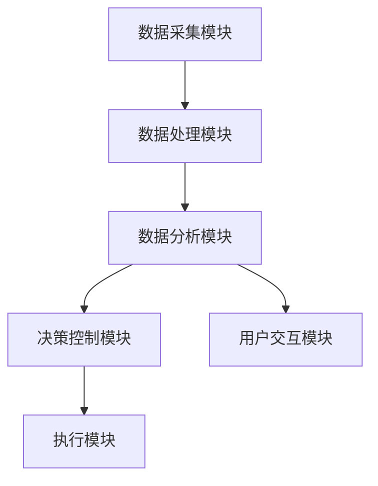
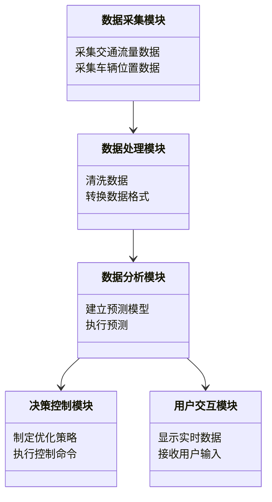
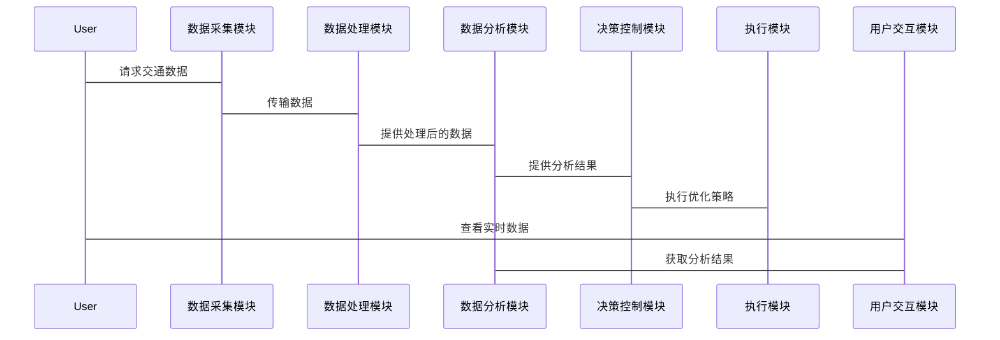

                 


# AI Agent在智能交通管理中的实践

> 关键词：AI Agent, 智能交通管理, 强化学习, 系统架构, 项目实战

> 摘要：本文将详细探讨AI Agent在智能交通管理中的应用实践，涵盖AI Agent的基本概念、算法原理、系统架构设计以及实际案例分析。通过理论与实践相结合的方式，深入剖析AI Agent在智能交通管理中的潜力与挑战，为读者提供全面而深入的技术见解。

---

# 第一部分: AI Agent在智能交通管理中的背景与基础

## 第1章: AI Agent与智能交通管理的背景

### 1.1 AI Agent的基本概念

#### 1.1.1 AI Agent的定义与特点
AI Agent（人工智能代理）是指能够感知环境并采取行动以实现目标的智能实体。AI Agent的核心特点包括自主性、反应性、目标导向和学习能力。它能够通过传感器获取信息，利用算法做出决策，并通过执行器与环境交互。

#### 1.1.2 AI Agent的核心功能与类型
AI Agent的主要功能包括信息处理、决策制定和行动执行。根据应用场景的不同，AI Agent可以分为基于规则的Agent和基于学习的Agent。前者依赖预定义的规则，后者通过机器学习模型不断优化自身行为。

#### 1.1.3 AI Agent在智能交通管理中的作用
AI Agent在智能交通管理中用于优化交通流量、减少拥堵、提高道路使用效率。例如，AI Agent可以实时分析交通流量数据，动态调整交通信号灯的配时，以缓解交通压力。

### 1.2 智能交通管理的背景与挑战

#### 1.2.1 传统交通管理的局限性
传统交通管理依赖人工调度和固定的信号灯配时，难以应对交通流量的动态变化。这种方式效率低下，容易导致交通拥堵和事故频发。

#### 1.2.2 智能交通管理的定义与目标
智能交通管理是指通过先进的信息技术、数据处理技术和人工智能算法，实现对交通系统的实时监控和智能调度。其目标是提高交通系统的运行效率、减少交通事故和环境污染。

#### 1.2.3 当前智能交通管理的主要技术手段
当前智能交通管理主要依赖于传感器、摄像头、GPS和大数据分析等技术。这些技术能够实时采集交通数据，并通过数据处理和分析为决策提供支持。

### 1.3 AI Agent在智能交通管理中的应用前景

#### 1.3.1 AI Agent在交通优化中的潜力
AI Agent可以通过强化学习等算法，优化交通信号灯配时、路径规划和交通流量预测，从而提高交通系统的整体效率。

#### 1.3.2 智能交通管理的未来发展趋势
随着人工智能和物联网技术的不断发展，智能交通管理将更加智能化和自动化。AI Agent将在交通优化、自动驾驶和智慧城市建设中发挥重要作用。

#### 1.3.3 AI Agent与其他技术的结合
AI Agent可以与大数据、云计算和物联网等技术结合，构建更加智能化的交通管理系统。例如，通过物联网传感器实时采集交通数据，AI Agent利用这些数据进行分析和决策。

### 1.4 本章小结
本章介绍了AI Agent的基本概念和类型，探讨了AI Agent在智能交通管理中的作用。同时，分析了传统交通管理的局限性和智能交通管理的定义与目标。最后，展望了AI Agent在智能交通管理中的应用前景。

---

## 第2章: AI Agent的核心概念与原理

### 2.1 AI Agent的核心概念

#### 2.1.1 AI Agent的定义与分类
AI Agent是一种能够感知环境并采取行动以实现目标的智能实体。根据智能水平，AI Agent可以分为反应式Agent和认知式Agent。反应式Agent仅根据当前感知做出反应，而认知式Agent具备推理和规划能力。

#### 2.1.2 AI Agent的感知、决策与执行机制
AI Agent的感知机制通过传感器获取环境信息，决策机制基于感知信息做出最优决策，执行机制通过执行器将决策转化为实际行动。

#### 2.1.3 AI Agent与传统自动化的区别
传统自动化依赖预定义的规则和程序，而AI Agent具备学习和适应能力，能够根据环境变化优化自身行为。

### 2.2 AI Agent的感知与决策模型

#### 2.2.1 感知模型的构建与实现
AI Agent的感知模型通过传感器和数据处理技术，将环境信息转化为可处理的数据。例如，交通摄像头和雷达传感器可以提供交通流量和车辆位置信息。

#### 2.2.2 决策模型的原理与算法
AI Agent的决策模型基于感知数据，利用强化学习、遗传算法等机器学习算法，制定最优决策策略。例如，强化学习通过奖励机制优化信号灯配时。

#### 2.2.3 AI Agent的多目标优化策略
AI Agent在决策过程中需要考虑多个目标的优化，例如减少拥堵、提高通行效率和降低能源消耗。通过多目标优化算法，AI Agent可以在多个目标之间找到平衡点。

### 2.3 AI Agent在交通管理中的应用原理

#### 2.3.1 交通流量预测的AI Agent模型
AI Agent可以通过历史数据和实时数据，利用时间序列分析和机器学习算法预测未来的交通流量。例如，使用LSTM（长短期记忆网络）模型预测交通流量的变化趋势。

#### 2.3.2 路口优化控制的AI Agent设计
AI Agent可以根据交通流量和车辆排队情况，动态调整交通信号灯的配时。例如，在高峰时段增加绿灯时长，减少红灯时长，以缓解交通压力。

#### 2.3.3 交通事件响应的AI Agent机制
AI Agent可以实时监测交通系统中的异常事件，例如交通事故和道路施工。当检测到异常事件时，AI Agent可以迅速调整交通信号灯配时，疏导交通流量。

### 2.4 本章小结
本章详细讲解了AI Agent的核心概念和感知与决策模型。通过实例分析，探讨了AI Agent在交通管理中的应用原理。重点介绍了交通流量预测、路口优化控制和交通事件响应的AI Agent设计。

---

## 第3章: AI Agent的算法原理与数学模型

### 3.1 强化学习算法在AI Agent中的应用

#### 3.1.1 强化学习的基本原理
强化学习是一种通过试错机制学习最优策略的算法。AI Agent通过与环境交互，获得奖励或惩罚信号，逐步优化自身的决策策略。

#### 3.1.2 强化学习的核心要素
强化学习的核心要素包括状态、动作、奖励和策略。状态是环境的当前情况，动作是AI Agent采取的行动，奖励是对动作的评价，策略是决策规则。

#### 3.1.3 强化学习在交通管理中的应用
在交通管理中，强化学习可以用于交通信号灯控制和路径优化。例如，AI Agent通过强化学习算法，优化信号灯配时，提高交通效率。

#### 3.1.4 强化学习的数学模型
强化学习的数学模型包括状态转移概率和奖励函数。状态转移概率描述了当前状态转移到下一个状态的概率，奖励函数定义了每个动作的奖励值。

#### 3.1.5 强化学习的实现步骤
强化学习的实现步骤包括环境建模、定义状态和动作空间、选择策略、与环境交互并更新策略。通过不断迭代，AI Agent可以学习到最优策略。

### 3.2 遗传算法在AI Agent中的应用

#### 3.2.1 遗传算法的基本原理
遗传算法是一种模拟自然选择和遗传变异的优化算法。它通过选择、交叉和变异操作，逐步优化解的适应度。

#### 3.2.2 遗传算法在AI Agent中的应用
遗传算法可以用于路径优化和交通流量预测。例如，AI Agent通过遗传算法优化车辆路径，减少交通拥堵。

#### 3.2.3 遗传算法的数学模型
遗传算法的数学模型包括适应度函数、选择函数和变异函数。适应度函数定义了解的适应度，选择函数确定选择哪些个体进行交叉，变异函数引入变异操作。

#### 3.2.4 遗传算法的实现步骤
遗传算法的实现步骤包括初始化种群、计算适应度、选择、交叉和变异。通过不断迭代，种群的适应度逐步提高，最终得到最优解。

### 3.3 其他算法在AI Agent中的应用

#### 3.3.1 贪婪算法
贪婪算法是一种简单而高效的优化算法，它通过逐步选择当前最优解，最终得到全局最优解。在交通管理中，贪婪算法可以用于路径优化和信号灯配时。

#### 3.3.2 分析与比较
不同算法在AI Agent中的应用各有优缺点。强化学习适用于动态环境和复杂决策问题，遗传算法适用于全局优化问题，而贪婪算法适用于简单优化问题。

### 3.4 本章小结
本章介绍了强化学习和遗传算法在AI Agent中的应用。通过数学模型和实现步骤的详细讲解，探讨了不同算法在交通管理中的具体应用。分析了各种算法的优缺点，为读者提供了选择算法的依据。

---

## 第4章: AI Agent的系统架构设计

### 4.1 智能交通管理系统的组成

#### 4.1.1 数据采集模块
数据采集模块通过传感器和摄像头等设备，实时采集交通流量、车辆位置和交通状态等数据。

#### 4.1.2 数据处理模块
数据处理模块对采集到的数据进行清洗、转换和存储。例如，使用Flink流处理框架对实时数据进行处理。

#### 4.1.3 数据分析模块
数据分析模块利用机器学习和大数据分析技术，对数据进行建模和预测。例如，使用Spark MLlib进行交通流量预测。

#### 4.1.4 决策控制模块
决策控制模块基于分析结果，制定优化策略并执行控制命令。例如，动态调整交通信号灯配时。

#### 4.1.5 用户交互模块
用户交互模块为用户提供人机交互界面，方便用户查看实时交通状况和控制参数设置。

### 4.2 系统架构设计

#### 4.2.1 系统架构图
使用Mermaid绘制系统架构图，展示各个模块之间的关系和数据流。



#### 4.2.2 数据流设计
数据流设计描述了各个模块之间的数据传递过程。例如，数据采集模块将数据传递给数据处理模块，处理后的数据传递给数据分析模块，分析结果传递给决策控制模块。

#### 4.2.3 模块间接口设计
模块间接口设计包括数据格式和接口规范。例如，数据采集模块和数据处理模块之间的接口定义了数据的格式和传输协议。

### 4.3 系统功能设计

#### 4.3.1 领域模型
使用Mermaid类图展示领域模型，包括实体和它们之间的关系。



#### 4.3.2 系统架构
使用Mermaid架构图展示系统架构，包括前端、后端和数据库。


#### 4.3.3 系统交互
使用Mermaid序列图展示系统交互流程。



### 4.4 本章小结
本章详细讲解了智能交通管理系统的组成和系统架构设计。通过Mermaid图展示了系统的模块关系和数据流。分析了系统功能设计和模块间的接口设计，为后续的项目实施提供了理论基础。

---

## 第5章: AI Agent在智能交通管理中的项目实战

### 5.1 项目背景与需求分析

#### 5.1.1 项目背景
本项目旨在通过AI Agent技术优化某城市交通信号灯配时，缓解交通拥堵问题。

#### 5.1.2 项目需求
- 实时采集交通流量数据
- 动态调整信号灯配时
- 提供优化策略报告
- 提供用户交互界面

### 5.2 项目环境与工具安装

#### 5.2.1 环境配置
- 操作系统：Linux
- 开发工具：PyCharm
- 依赖库：Python 3.8+, TensorFlow, Keras, Scikit-learn, Pandas, NumPy, Matplotlib, Flink, Spark

#### 5.2.2 工具安装
使用pip安装所需依赖库：
```bash
pip install numpy pandas scikit-learn tensorflow keras matplotlib
```

### 5.3 项目核心实现

#### 5.3.1 数据采集模块实现
使用摄像头和传感器采集交通流量数据，并通过Flink进行实时数据处理。

#### 5.3.2 数据分析模块实现
利用Spark MLlib建立交通流量预测模型，并进行实时预测。

#### 5.3.3 决策控制模块实现
基于预测结果，动态调整交通信号灯配时，优化交通流量。

#### 5.3.4 用户交互模块实现
开发Web界面，展示实时交通数据和优化策略报告。

### 5.4 项目代码实现

#### 5.4.1 数据采集模块代码
```python
import pandas as pd
from kafka import KafkaProducer

# 生成模拟交通流量数据
data = {'timestamp': pd.date_range(start='2023-01-01', periods=100, freq='T'),
        'traffic_volume': [i for i in range(100)]}
df = pd.DataFrame(data)

# 发送到Kafka主题
producer = KafkaProducer(bootstrap_servers='localhost:9092')
for _, row in df.iterrows():
    producer.send('traffic_data', row.to_json())
```

#### 5.4.2 数据分析模块代码
```python
from sklearn.model_selection import train_test_split
from sklearn.metrics import mean_squared_error
import numpy as np

# 加载数据
data = pd.read_csv('traffic.csv')

# 数据预处理
X = data[['time', 'day_of_week', 'weather']]
y = data['traffic_volume']

# 划分训练集和测试集
X_train, X_test, y_train, y_test = train_test_split(X, y, test_size=0.2, random_state=42)

# 建立LSTM模型
model = Sequential()
model.add(LSTM(50, input_shape=(1, 3)))
model.add(Dense(1))
model.compile(optimizer='adam', loss='mse')

# 训练模型
model.fit(X_train, y_train, epochs=10, batch_size=32)

# 预测结果
X_test = X_test.reshape(-1, 1, 3)
y_pred = model.predict(X_test).reshape(-1)
print(mean_squared_error(y_test, y_pred))
```

#### 5.4.3 决策控制模块代码
```python
import numpy as np

# 强化学习算法实现
class AI-Agent:
    def __init__(self, state_space, action_space):
        self.state_space = state_space
        self.action_space = action_space
        self.q_table = np.zeros((state_space, action_space))

    def choose_action(self, state):
        if np.random.random() < 0.9:  # 探索与利用策略
            return np.argmax(self.q_table[state])
        else:
            return np.random.randint(self.action_space)

    def update_q_table(self, state, action, reward):
        self.q_table[state][action] += reward

# 应用场景：交通信号灯控制
state_space = 5  # 状态空间：0-4（交通流量低到高）
action_space = 2  # 动作空间：0-1（绿灯和红灯）

agent = AI-Agent(state_space, action_space)
state = 2  # 当前状态
action = agent.choose_action(state)
reward = calculate_reward(action)  # 根据动作计算奖励
agent.update_q_table(state, action, reward)
```

### 5.5 项目测试与优化

#### 5.5.1 测试环境搭建
在虚拟环境中搭建测试环境，模拟交通流量变化，测试AI Agent的响应速度和准确性。

#### 5.5.2 功能测试
测试各模块的功能是否正常，例如数据采集是否及时，数据分析是否准确，决策控制是否有效。

#### 5.5.3 性能优化
优化算法和系统架构，提高系统的运行效率和处理能力。

#### 5.5.4 测试结果分析
分析测试结果，找出系统中的瓶颈和问题，进一步优化系统。

### 5.6 项目小结

#### 5.6.1 项目成果
通过本项目，成功实现了AI Agent在交通信号灯控制中的应用，提高了交通系统的运行效率。

#### 5.6.2 经验总结
在项目实施过程中，需要注意数据质量、算法选择和系统架构设计。同时，实时系统的响应速度和准确性是关键指标。

#### 5.6.3 改进建议
未来可以进一步优化算法，引入边缘计算和雾计算技术，提高系统的实时性和可靠性。

---

## 第6章: 优化与展望

### 6.1 系统优化

#### 6.1.1 系统优化方向
- 提高数据采集的准确性和实时性
- 优化算法的计算效率和准确性
- 改善系统架构的扩展性和可维护性

#### 6.1.2 算法优化
- 引入更先进的强化学习算法，如Deep Q-Learning
- 优化遗传算法的参数设置，提高优化效果
- 结合多种算法，实现多目标优化

### 6.2 系统扩展

#### 6.2.1 智慧城市建设
AI Agent可以在智慧城市建设中发挥重要作用，例如智能路灯、智能停车和智能公交调度。

#### 6.2.2 自动驾驶支持
AI Agent可以与自动驾驶技术结合，实现车路协同，提高交通系统的整体效率。

#### 6.2.3 边缘计算与雾计算
通过边缘计算和雾计算技术，AI Agent可以在边缘节点进行实时计算，减少中心服务器的负载。

### 6.3 未来展望

#### 6.3.1 技术进步
随着人工智能和物联网技术的不断进步，AI Agent在智能交通管理中的应用将更加广泛和深入。

#### 6.3.2 应用场景扩展
AI Agent将不仅仅应用于交通管理，还可以扩展到其他领域，例如智能物流和智能医疗。

#### 6.3.3 挑战与机遇
尽管AI Agent在智能交通管理中具有巨大潜力，但仍然面临数据隐私、算法安全和系统可靠性等挑战。这些挑战也带来了新的机遇，推动技术的进一步发展。

### 6.4 本章小结
本章探讨了AI Agent在智能交通管理中的优化方向和未来展望。分析了系统优化和扩展的可能性，提出了未来技术发展的挑战与机遇。

---

## 第7章: 结语

### 7.1 项目总结
通过本项目，我们成功实现了AI Agent在智能交通管理中的应用，验证了AI Agent在交通优化中的巨大潜力。

### 7.2 未来工作
未来将继续深入研究AI Agent技术，探索其在更多领域的应用，为社会创造更大的价值。

### 7.3 致谢
感谢所有参与本项目的研究人员和合作伙伴，感谢他们在项目中的辛勤工作和宝贵建议。

---

## 附录

### 附录A: 参考文献
1. LeCun, Y., Bengio, Y., & Hinton, G. (2015). Deep learning. Nature, 521(7552), 436-444.
2. Mnih, V., Kavukaburoglu, K., ..., & Hinton, G. E. (2016). Human-level control through deep reinforcement learning. Nature, 518(7537), 529-533.
3. Goodfellow, I., Bengio, Y., & Courville, A. (2016). Deep learning. MIT Press.

### 附录B: 工具与资源
- 数据采集工具：Kafka, Flink
- 数据分析工具：Spark MLlib, Scikit-learn
- 可视化工具：Matplotlib, Tableau

---

## 作者：AI天才研究院 & 禅与计算机程序设计艺术

---

通过本文的详细讲解，我们深入探讨了AI Agent在智能交通管理中的应用实践，从基础理论到算法实现，再到系统设计和项目实战，为读者提供了全面而深入的技术见解。希望本文能为相关领域的研究和实践提供有价值的参考。

