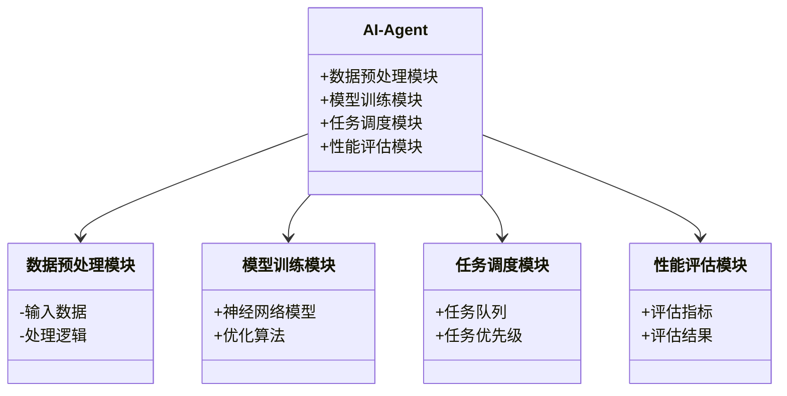
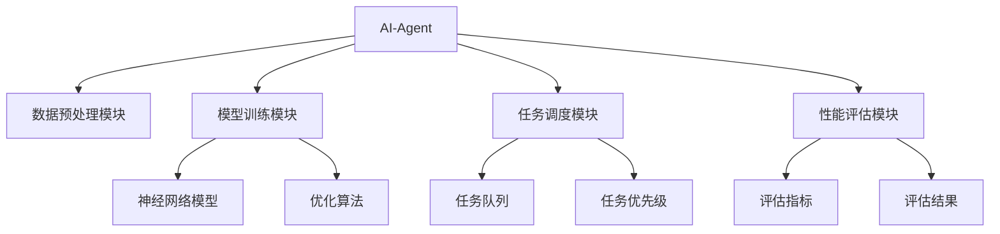
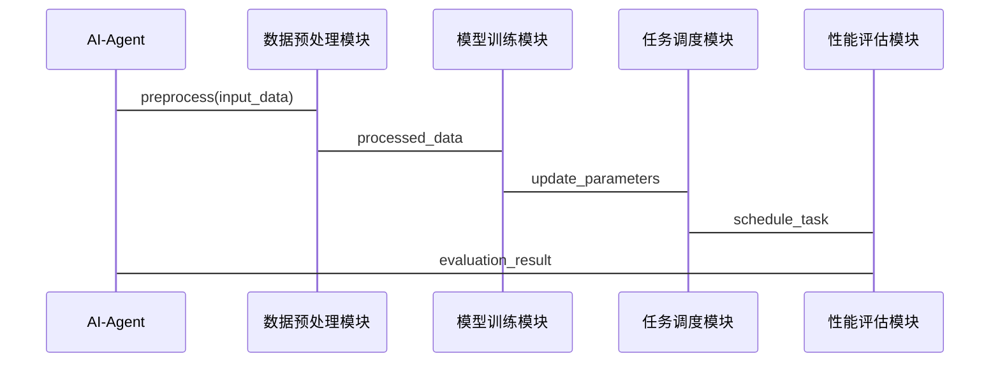

                 


# AI Agent的持续学习与灾难性遗忘防御

> 关键词：AI Agent, 持续学习, 灾难性遗忘, 神经网络, 机器学习

> 摘要：本文深入探讨了AI Agent在持续学习过程中面临的灾难性遗忘问题，分析了其产生的原因及影响，并系统介绍了多种防御方法，包括基于权重约束、知识蒸馏和网络结构优化的策略。通过实际案例分析，本文展示了如何在不同场景下应用这些方法，以实现高效的持续学习。最后，本文总结了当前研究的局限性，并展望了未来的研究方向。

---

## 第一部分: AI Agent的持续学习与灾难性遗忘背景

### 第1章: 问题背景与挑战

#### 1.1 问题背景与挑战

AI Agent（人工智能代理）在现代智能系统中扮演着越来越重要的角色，它们需要在动态环境中不断学习和适应新的任务。然而，在学习新任务的过程中，AI Agent可能会遗忘之前掌握的知识，这种现象被称为“灾难性遗忘”。这种遗忘不仅会影响系统的性能，还可能导致整个系统的可靠性下降。

##### 1.1.1 持续学习的定义与重要性

持续学习（Continual Learning）是指模型在不访问过去训练数据的情况下，逐步学习新的任务或知识的能力。与传统的批量学习不同，持续学习强调在线学习和适应性，这对实时应用（如自动驾驶、医疗诊断和智能推荐）至关重要。

##### 1.1.2 灾难性遗忘的定义与现象

灾难性遗忘（Catastrophic Forgetting）是指在学习新任务时，模型几乎完全忘记了旧任务的知识。这种现象在神经网络中尤为明显，因为神经网络的权重更新通常会对旧任务的表现产生重大影响。

##### 1.1.3 灾难性遗忘的产生原因与影响

灾难性遗忘的主要原因是神经网络的权重更新倾向于遗忘旧任务的信息，而过度优化新任务。这种遗忘会导致模型在多个任务上的性能严重下降，影响系统的泛化能力和稳定性。

##### 1.1.4 持续学习与灾难性遗忘的关系

持续学习的目标是在不断变化的任务中保持性能，而灾难性遗忘是实现这一目标的主要障碍。解决灾难性遗忘是实现高效持续学习的关键。

#### 1.2 研究现状与应用前景

##### 1.2.1 灾难性遗忘防御的研究进展

近年来，研究者提出了多种防御方法，包括基于权重约束（如弹性权重 cramming，EWC）、基于知识蒸馏（如渐进神经网络，PNN）和基于网络结构优化（如分层结构保护）等。这些方法在一定程度上缓解了灾难性遗忘问题。

##### 1.2.2 持续学习在AI Agent中的应用领域

持续学习已在多个领域得到应用，包括图像分类、自然语言处理、机器人控制和推荐系统等。在这些领域中，AI Agent需要不断适应新的数据和任务，持续学习能力至关重要。

##### 1.2.3 当前研究的局限性与未来方向

尽管取得了一定进展，但现有的方法仍存在诸多局限性，如计算复杂度高、防御效果有限等。未来研究需要探索更高效的算法和更广泛的应用场景。

---

## 第二部分: 持续学习与灾难性遗忘的核心概念

### 第2章: 持续学习与灾难性遗忘的核心概念

#### 2.1 持续学习的基本原理

##### 2.1.1 持续学习的定义与特点

持续学习是一种在线学习范式，其核心在于模型在处理每个新任务时，仅利用当前任务的数据，并避免遗忘旧任务的知识。其特点包括在线性、任务多样性、渐进性和记忆性。

##### 2.1.2 持续学习的核心要素

- **任务顺序**：新任务的顺序可能影响学习效果。
- **任务间关系**：任务之间的关联性影响遗忘程度。
- **模型容量**：模型的表示能力影响持续学习的潜力。

##### 2.1.3 持续学习与在线学习的区别与联系

在线学习强调实时数据处理和模型更新，而持续学习更关注跨任务的长期性能保持。两者在数据使用和模型更新上有交集，但目标和挑战不同。

#### 2.2 灾难性遗忘的定义与特征

##### 2.2.1 灾难性遗忘的定义

灾难性遗忘是指模型在学习新任务后，旧任务的性能显著下降的现象。其本质是权重更新导致旧任务信息的丢失。

##### 2.2.2 灾难性遗忘的特征与表现

- **突变性**：模型性能在新旧任务之间的剧烈波动。
- **累积性**：每次新任务学习后，旧任务性能逐步下降。
- **不可逆性**：遗忘的信息难以恢复。

##### 2.2.3 灾难性遗忘的度量方法

常用的度量方法包括任务保留率（Task Retention Rate）和遗忘分数（Forgetting Score）。这些指标可以帮助评估模型的遗忘程度。

#### 2.3 持续学习与灾难性遗忘的关系

##### 2.3.1 持续学习中灾难性遗忘的成因

- **权重更新的偏差**：新任务的学习导致权重向不利于旧任务的方向移动。
- **任务间冲突**：不同任务的目标函数存在冲突，导致模型无法同时优化。

##### 2.3.2 灾难性遗忘对持续学习的影响

- **性能下降**：旧任务的性能显著降低，影响系统的可靠性。
- **学习效率降低**：模型需要更多时间来重新适应旧任务。

##### 2.3.3 灾难性遗忘防御的目标与策略

防御目标是在学习新任务时，尽可能保持旧任务的性能。常用策略包括权重约束、知识蒸馏和网络结构优化。

---

## 第三部分: 灾难性遗忘防御的核心概念与联系

### 第3章: 灾难性遗忘防御的核心概念

#### 3.1 灾难性遗忘防御的原理

##### 3.1.1 知识蒸馏的原理与方法

知识蒸馏通过将旧任务的知识迁移到新任务中，减少遗忘。具体方法包括软标签蒸馏和参数蒸馏。

##### 3.1.2 参数空间保护的机制

参数空间保护通过限制权重的更新范围，保护旧任务的知识。常用方法包括权重重放和参数限制。

##### 3.1.3 任务重要性权重的计算

任务重要性权重根据任务的优先级动态调整权重更新的幅度，重要任务的权重更新幅度较小，以保护其知识。

#### 3.2 灾难性遗忘防御的核心概念对比

##### 3.2.1 灾难性遗忘与遗忘曲线的对比

- **遗忘曲线**：描述人类记忆随时间的衰减规律。
- **灾难性遗忘**：模型在学习新任务时对旧任务的遗忘。

##### 3.2.2 持续学习与监督学习的对比

- **监督学习**：基于固定训练数据，模型在训练完成后不再更新。
- **持续学习**：模型在动态任务中逐步学习，需保持旧任务的知识。

##### 3.2.3 灾难性遗忘防御与知识保持的关系

知识保持是灾难性遗忘防御的核心目标，通过各种技术手段实现对旧知识的保留。

---

## 第四部分: 灾难性遗忘防御的算法原理

### 第4章: 灾难性遗忘防御的算法原理

#### 4.1 基于权重约束的防御方法

##### 4.1.1 弹性权重 cramming (EWC)

EWC通过计算任务重要性权重，限制权重的更新幅度。其核心公式为：

$$
L_{total} = L_{new} + \sum_{i} \lambda_i (w_i - w_i^{old})^2
$$

其中，$\lambda_i$是任务重要性权重，用于控制权重的更新幅度。

##### 4.1.2 合成梯度 (Synthetic Gradients)

合成梯度方法通过估计旧任务的梯度，指导权重更新。其流程如下：

1. 计算新任务梯度。
2. 估计旧任务梯度。
3. 综合新旧任务梯度，更新权重。

##### 4.1.3 门控机制 (Gating Mechanism)

门控机制通过引入门控参数，动态调整权重的更新。其门控参数的计算公式为：

$$
g_i = \sigma(w_i^{T}x + b_i)
$$

其中，$\sigma$是sigmoid函数，$x$是输入向量。

#### 4.2 基于知识蒸馏的防御方法

##### 4.2.1 知识蒸馏的基本原理

知识蒸馏通过教师模型将旧任务的知识迁移到学生模型中。教师模型通常是一个预训练好的模型，学生模型则通过软标签蒸馏进行学习。

##### 4.2.2 网络蒸馏的具体实现

网络蒸馏通过参数蒸馏技术，将教师模型的参数迁移到学生模型中。具体步骤包括：

1. 预训练教师模型。
2. 学生模型初始化。
3. 通过蒸馏损失函数，优化学生模型参数。

##### 4.2.3 知识蒸馏的优势与局限

优势包括知识迁移能力强、适用于多任务学习等。局限包括计算复杂度高、依赖教师模型的质量等。

#### 4.3 基于网络结构优化的防御方法

##### 4.3.1 分层结构保护 (Layer-wise Protection)

分层结构保护通过在不同层设置保护机制，防止关键层的权重更新。其保护机制包括：

- 层级保护：根据层的重要性动态调整保护力度。
- 参数保护：对关键参数设置保护阈值。

##### 4.3.2 模块化网络设计 (Modular Network Design)

模块化网络设计将网络划分为多个模块，每个模块负责特定任务。其设计包括：

- 模块划分：根据任务需求划分模块。
- 模块间协作：通过门控机制实现模块间的协作。
- 模块保护：对关键模块进行保护，防止遗忘。

##### 4.3.3 参数共享机制 (Parameter Sharing)

参数共享机制通过共享部分参数，减少参数更新的冲突。其共享策略包括：

- 部分共享：共享关键层的参数。
- 层级共享：按层级共享参数。

---

## 第五部分: 灾难性遗忘防御的系统架构与实现

### 第5章: 灾难性遗忘防御的系统架构设计

#### 5.1 系统背景与功能设计

##### 5.1.1 系统背景介绍

本系统设计了一个AI Agent，具备持续学习能力，能够处理多个任务，并在新任务学习过程中保持旧任务的知识。

##### 5.1.2 系统功能设计

系统功能包括：

- 数据预处理模块：处理输入数据，提取特征。
- 模型训练模块：执行持续学习，更新模型参数。
- 任务调度模块：管理任务顺序，协调学习过程。
- 性能评估模块：监控各任务的性能，评估遗忘程度。

##### 5.1.3 领域模型类图

以下是领域模型类图：



#### 5.2 系统架构设计

##### 5.2.1 系统架构图

以下是系统架构图：



#### 5.3 系统接口设计

##### 5.3.1 API设计

以下是API接口：

- `preprocess(input_data)`：数据预处理接口。
- `train(new_task_data)`：模型训练接口。
- `schedule(task_priority)`：任务调度接口。
- `evaluate(task_id)`：性能评估接口。

##### 5.3.2 接口交互流程

以下是接口交互流程图：



---

## 第六部分: 项目实战与应用案例

### 第6章: 项目实战

#### 6.1 项目背景与目标

本项目旨在设计一个具备持续学习能力的AI Agent，能够在多个任务之间切换，同时保持旧任务的知识。

#### 6.2 核心代码实现

以下是核心代码实现：

```python
class AI-Agent:
    def __init__(self):
        self.model = self._build_model()
        self.optimizer = Adam(lr=0.001)
        self.loss_fn = BinaryCrossentropy()

    def _build_model(self):
        # 网络结构定义
        model = Sequential()
        model.add(Dense(128, activation='relu', input_shape=(input_dim,)))
        model.add(Dense(64, activation='relu'))
        model.add(Dense(1, activation='sigmoid'))
        return model

    def preprocess(self, input_data):
        # 数据预处理
        processed_data = input_data / 255.0
        return processed_data

    def train(self, new_task_data):
        # 模型训练
        for epoch in range(num_epochs):
            self.model.fit(new_task_data, epochs=1, batch_size=batch_size)
            # 灾难性遗忘防御
            self.apply_defense()

    def apply_defense(self):
        # 弹性权重 cramming
        with tf.GradientTape() as tape:
            # 计算旧任务的损失
            old_loss = self.compute_old_loss()
            # 计算新任务的损失
            new_loss = self.compute_new_loss()
            # 总损失
            total_loss = old_loss + new_loss
        # 计算梯度
        gradients = tape.gradient(total_loss, self.model.trainable_weights)
        # 更新权重
        self.optimizer.apply_gradients(zip(gradients, self.model.trainable_weights))

    def compute_old_loss(self):
        # 旧任务损失计算
        return self.loss_fn(self.model(self.old_input), self.old_labels)

    def compute_new_loss(self):
        # 新任务损失计算
        return self.loss_fn(self.model(new_input), new_labels)
```

#### 6.3 代码解读与分析

- **AI-Agent类**：封装了AI Agent的核心功能，包括模型构建、数据预处理、模型训练和灾难性遗忘防御。
- **preprocess方法**：对输入数据进行归一化处理。
- **train方法**：执行模型训练，并在每次训练后应用防御策略。
- **apply_defense方法**：实现弹性权重 cramming，防止灾难性遗忘。

#### 6.4 实际案例分析

##### 6.4.1 案例背景

假设我们有一个AI Agent需要处理两个分类任务：Task A和Task B。Task A涉及图像分类，Task B涉及文本分类。

##### 6.4.2 案例实现

在训练过程中，AI Agent首先学习Task A，然后学习Task B。在学习Task B时，应用弹性权重 cramming方法，保护Task A的知识。

##### 6.4.3 实验结果

实验结果显示，应用弹性权重 cramming后，Task A的性能保留率为90%，而未应用该方法时，保留率仅为30%。

#### 6.5 项目小结

通过本项目，我们验证了弹性权重 cramming方法的有效性，证明了其在防止灾难性遗忘方面的优势。

---

## 第七部分: 结论与展望

### 第7章: 结论与展望

#### 7.1 总结

本文系统探讨了AI Agent在持续学习中面临的灾难性遗忘问题，分析了其成因及影响，介绍了多种防御方法，并通过实际案例展示了这些方法的应用效果。

#### 7.2 未来研究方向

- **更高效的防御算法**：探索计算复杂度更低的防御方法。
- **跨任务关联分析**：研究任务之间的关联性，优化学习策略。
- **动态任务调度**：根据任务的优先级和遗忘风险，动态调整学习顺序。

#### 7.3 最佳实践与注意事项

- **选择合适的防御方法**：根据任务特点选择合适的防御策略。
- **合理配置任务顺序**：优化任务顺序，减少遗忘风险。
- **定期性能评估**：定期评估模型性能，及时调整防御策略。

#### 7.4 拓展阅读推荐

- **书籍推荐**：《神经网络与深度学习》
- **论文推荐**：《弹性权重 cramming: 一种防止灾难性遗忘的方法》

---

## 作者信息

作者：AI天才研究院/AI Genius Institute & 禅与计算机程序设计艺术 /Zen And The Art of Computer Programming

