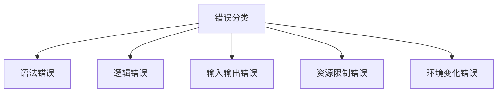
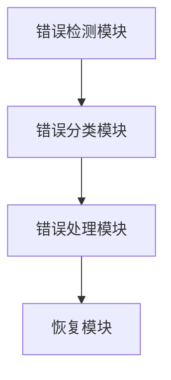
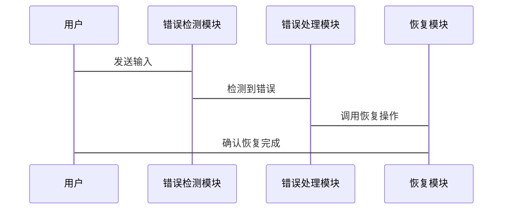

                 


# AI Agent的错误处理与恢复机制设计

## 关键词：AI Agent, 错误处理, 恢复机制, 系统架构, 算法原理

## 摘要：  
本文详细探讨了AI Agent在运行过程中可能遇到的错误类型、处理策略以及恢复机制的设计。通过分析错误检测、分类和处理的基本原理，结合实际应用场景，提出了基于概率和规则的错误检测算法，并通过系统架构设计和项目实战展示了如何实现高效的错误处理与恢复机制。文章还总结了最佳实践和未来研究方向，为AI Agent的可靠性设计提供了理论支持和实践指导。

---

# 第1章 AI Agent的错误处理与恢复机制概述

## 1.1 AI Agent的基本概念

### 1.1.1 AI Agent的定义与特点  
AI Agent（人工智能代理）是指能够感知环境、自主决策并执行任务的智能实体。AI Agent的核心特点包括：  
1. **自主性**：能够在没有外部干预的情况下独立运行。  
2. **反应性**：能够实时感知环境并做出反应。  
3. **目标导向**：具有明确的目标，通过行为实现目标。  
4. **学习能力**：能够通过经验或数据优化自身行为。  

### 1.1.2 AI Agent的类型与应用场景  
AI Agent可以分为以下几类：  
1. **简单反射型Agent**：基于当前输入做出反应，适用于简单的任务（如传感器节点）。  
2. **基于模型的反射型Agent**：维护环境模型，基于模型做出决策（如自动驾驶汽车）。  
3. **目标驱动型Agent**：以目标为导向，通过规划实现任务（如智能助手）。  
4. **效用驱动型Agent**：以最大化效用函数为目标，适用于复杂决策任务（如金融交易）。  

### 1.1.3 错误处理与恢复机制的重要性  
在AI Agent的运行过程中，错误是不可避免的。错误处理与恢复机制是确保AI Agent稳定运行的核心模块，其重要性体现在：  
1. **保证任务完成**：通过及时检测和修复错误，确保任务能够顺利完成。  
2. **提高系统可靠性**：通过降低错误发生概率，提高系统的整体可靠性。  
3. **提升用户体验**：通过快速恢复，减少用户感知到的错误影响。  

---

## 1.2 错误处理与恢复机制的基本原理

### 1.2.1 错误检测与分类  
错误检测是错误处理的第一步。常见的错误类型包括：  
1. **语法错误**：输入或输出不符合预期格式。  
2. **逻辑错误**：算法或逻辑推理出现偏差。  
3. **输入输出错误**：与外部系统交互时出现数据不一致。  
4. **资源限制错误**：由于资源不足导致任务无法完成。  
5. **环境变化错误**：环境动态变化导致策略失效。  

### 1.2.2 错误处理的基本策略  
错误处理的核心思想是“预防、检测、恢复”。  
1. **预防**：通过优化算法或系统架构，减少错误发生的概率。  
2. **检测**：通过实时监控和分析，快速发现错误。  
3. **恢复**：通过调整策略或调用备用机制，恢复系统正常运行。  

### 1.2.3 恢复机制的核心思想  
恢复机制的目标是将系统从错误状态带回正常状态。常见的恢复策略包括：  
1. **回滚**：将系统状态回滚到上一个稳定状态。  
2. **重试**：重新执行失败的操作，适用于暂时性错误。  
3. **切换到备用方案**：当主方案失败时，切换到备用方案继续执行。  

---

## 1.3 错误处理与恢复机制的挑战

### 1.3.1 错误检测的复杂性  
错误检测的复杂性主要来源于：  
1. **多模态输入**：AI Agent需要处理多种类型的数据输入，增加了错误检测的难度。  
2. **动态环境**：环境的动态变化可能导致错误类型多样且难以预测。  
3. **数据稀疏性**：某些错误类型可能在数据集中出现频率极低，导致检测算法难以训练。  

### 1.3.2 错误恢复的不确定性  
错误恢复的不确定性主要来源于：  
1. **因果关系的复杂性**：错误的根本原因可能涉及多个因素，难以快速定位。  
2. **决策风险**：恢复操作可能引入新的错误或风险，需要权衡利弊。  
3. **时间约束**：某些场景下，恢复操作需要在极短的时间内完成，增加了实现难度。  

### 1.3.3 系统复杂性与资源限制  
AI Agent的系统复杂性可能导致以下问题：  
1. **资源消耗**：错误处理与恢复机制可能需要额外的计算资源，增加了系统负载。  
2. **模块耦合**：系统的模块高度耦合，错误处理可能需要跨模块协作，增加了实现难度。  
3. **实时性要求**：某些场景下，错误处理必须在极短的时间内完成，增加了实现的难度。  

---

## 1.4 本章小结  
本章介绍了AI Agent的基本概念、错误处理与恢复机制的重要性，以及其实现的挑战。通过分析错误检测与恢复的基本原理，为后续章节的深入探讨奠定了基础。

---

# 第2章 AI Agent的错误检测与分类

## 2.1 错误检测的基本方法

### 2.1.1 基于概率的错误检测  
基于概率的错误检测方法通过计算事件发生的概率，判断是否出现错误。例如，使用贝叶斯定理对输入数据进行概率建模，判断其是否符合预期分布。  

**数学公式**：  
$$ P(\text{错误}|x) = \frac{P(x|\text{错误}) \cdot P(\text{错误})}{P(x)} $$  

### 2.1.2 基于规则的错误检测  
基于规则的错误检测方法通过预定义的规则，判断输入是否符合预期。例如，在自然语言处理中，可以通过语法检查工具检测句子结构是否正确。  

### 2.1.3 基于上下文的错误检测  
基于上下文的错误检测方法结合上下文信息，判断输入是否合理。例如，在对话系统中，可以根据对话历史判断当前输入是否合理。  

---

## 2.2 错误分类的理论框架

### 2.2.1 错误类型对比分析  
以下是对常见错误类型的对比分析：  

| 错误类型 | 描述 | 示例 |  
|----------|------|------|  
| 语法错误 | 输入或输出不符合语法规范 | “The cat sat on the mat” 是正确的语法，而 “The cat sat on the m” 是错误的。 |  
| 逻辑错误 | 逻辑推理或算法实现错误 | 在条件判断中，将“AND”误用为“OR”。 |  
| 输入输出错误 | 输入或输出数据不符合预期 | 接收到的输入数据格式与预期不一致。 |  
| 资源限制错误 | 由于资源不足导致任务失败 | 内存不足导致程序崩溃。 |  
| 环境变化错误 | 环境动态变化导致策略失效 | 天气突变导致自动驾驶系统无法识别道路标志。 |  

### 2.2.2 错误分类的特征对比  
以下是错误类型的主要特征对比：  

| 特征 | 语法错误 | 逻辑错误 | 输入输出错误 | 资源限制错误 | 环境变化错误 |  
|------|----------|----------|--------------|---------------|----------------|  
| 检测难度 | 较低 | 较高 | 中等 | 较高 | 极高 |  
| 恢复难度 | 较低 | 较高 | 中等 | 较高 | 极高 |  

### 2.2.3 错误分类的层次结构  
错误分类的层次结构可以用以下层次图表示：  



---

## 2.3 错误检测与分类的算法实现

### 2.3.1 基于概率的错误检测算法  
基于概率的错误检测算法可以通过训练分类器来实现。例如，使用朴素贝叶斯算法对输入数据进行分类，判断其是否为错误。  

**算法步骤**：  
1. 收集正常和错误数据样本。  
2. 训练分类器（如朴素贝叶斯）。  
3. 对输入数据进行分类，判断是否为错误。  

**代码示例**：  
```python
from sklearn.naive_bayes import GaussianNB
from sklearn.model_selection import train_test_split

# 数据准备
X = [[特征1, 特征2, ...], ...]
y = [0, 1, 0, ...]  # 0表示正常，1表示错误

# 划分训练集和测试集
X_train, X_test, y_train, y_test = train_test_split(X, y, test_size=0.2)

# 训练模型
clf = GaussianNB()
clf.fit(X_train, y_train)

# 预测
y_pred = clf.predict(X_test)
```

### 2.3.2 基于规则的错误检测算法  
基于规则的错误检测算法通过预定义的规则进行判断。例如，使用正则表达式检测输入数据中的语法错误。  

**代码示例**：  
```python
import re

# 定义规则
pattern = r'^[A-Za-z]+ [A-Za-z]+$'  # 检测是否为两个单词组成的句子

# 检测输入
input_str = "Hello world"
if re.match(pattern, input_str):
    print("正确")
else:
    print("错误")
```

### 2.3.3 基于上下文的错误检测算法  
基于上下文的错误检测算法结合上下文信息进行判断。例如，使用循环神经网络（RNN）对上下文进行建模，判断当前输入是否合理。  

**数学公式**：  
$$ P(x_t | x_{t-1}, x_{t-2}, ..., x_1) $$  

**代码示例**：  
```python
import tensorflow as tf
from tensorflow.keras import layers

# 定义模型
model = tf.keras.Sequential([
    layers.LSTM(64, input_shape=(None, input_dim)),
    layers.Dense(1, activation='sigmoid')
])

# 编译模型
model.compile(loss='binary_crossentropy', optimizer='adam', metrics=['accuracy'])
```

---

## 2.4 本章小结  
本章详细探讨了AI Agent中的错误检测与分类方法，介绍了基于概率、规则和上下文的错误检测算法，并通过对比分析和代码示例展示了不同方法的实现细节。

---

# 第3章 AI Agent的错误处理与恢复机制设计

## 3.1 错误处理的基本策略

### 3.1.1 基于冗余的错误处理  
基于冗余的错误处理方法通过冗余计算或冗余模块来检测和修复错误。例如，在分布式系统中，通过冗余节点实现容错。  

### 3.1.2 基于上下文的错误处理  
基于上下文的错误处理方法结合上下文信息，动态调整处理策略。例如，在自然语言处理中，根据上下文修复语法错误。  

### 3.1.3 基于自适应的错误处理  
基于自适应的错误处理方法通过动态调整参数或算法实现自适应恢复。例如，在推荐系统中，动态调整推荐策略以适应用户行为变化。  

---

## 3.2 错误恢复的核心算法

### 3.2.1 基于回滚的错误恢复  
基于回滚的错误恢复方法通过将系统状态回滚到上一个稳定状态来实现恢复。  

**数学公式**：  
$$ \text{恢复状态} = \text{历史状态}[t-1] $$  

### 3.2.2 基于重试的错误恢复  
基于重试的错误恢复方法通过重新执行失败的操作实现恢复。  

### 3.2.3 基于切换的错误恢复  
基于切换的错误恢复方法通过切换到备用方案实现恢复。  

---

## 3.3 系统架构设计

### 3.3.1 系统功能设计  
以下是AI Agent的错误处理与恢复系统的功能模块设计：  



### 3.3.2 系统交互设计  
以下是系统的交互流程：  



---

## 3.4 本章小结  
本章详细探讨了AI Agent的错误处理与恢复机制设计，介绍了基于冗余、上下文和自适应的错误处理策略，并通过系统架构设计展示了如何实现高效的错误恢复。

---

# 第4章 AI Agent的错误处理与恢复机制实现

## 4.1 环境配置

### 4.1.1 开发环境  
- **编程语言**：Python  
- **框架**：TensorFlow/PyTorch  
- **工具库**：scikit-learn, matplotlib  

### 4.1.2 数据集  
- **训练数据**：正常和错误数据样本。  
- **测试数据**：用于验证错误检测与恢复机制的性能。  

---

## 4.2 核心实现

### 4.2.1 错误检测模块实现  
```python
def detect_error(input_data):
    # 实现错误检测逻辑
    pass
```

### 4.2.2 错误分类模块实现  
```python
def classify_error(error_type):
    # 实现错误分类逻辑
    pass
```

### 4.2.3 错误处理模块实现  
```python
def handle_error(error_type):
    # 实现错误处理逻辑
    pass
```

### 4.2.4 恢复模块实现  
```python
def recover(error_type):
    # 实现恢复逻辑
    pass
```

---

## 4.3 项目实战

### 4.3.1 项目背景  
本项目旨在实现一个AI Agent的错误处理与恢复机制，以提高系统的可靠性和稳定性。

### 4.3.2 核心代码实现  
```python
import logging

class ErrorHandler:
    def __init__(self):
        self.error_log = []

    def detect_error(self, input_data):
        # 检测错误
        pass

    def classify_error(self, error_type):
        # 分类错误
        pass

    def handle_error(self, error_type):
        # 处理错误
        pass

    def recover(self, error_type):
        # 恢复
        pass

if __name__ == "__main__":
    handler = ErrorHandler()
    # 模拟错误检测与恢复流程
    handler.detect_error("invalid input")
    handler.classify_error("语法错误")
    handler.handle_error("语法错误")
    handler.recover("语法错误")
```

---

## 4.4 本章小结  
本章通过具体实现展示了AI Agent的错误处理与恢复机制设计，提供了从环境配置到核心实现的详细步骤，并通过项目实战验证了设计的可行性。

---

# 第5章 AI Agent的错误处理与恢复机制优化

## 5.1 错误处理与恢复机制的优化策略

### 5.1.1 增强错误检测能力  
通过引入多模态数据和上下文信息，提高错误检测的准确性。  

### 5.1.2 提高恢复的可靠性  
通过冗余设计和自适应调整，增强恢复的可靠性。  

### 5.1.3 优化系统架构  
通过模块化设计和松耦合架构，降低错误处理与恢复的复杂性。  

---

## 5.2 最佳实践

### 5.2.1 设计原则  
1. **模块化设计**：将错误处理与恢复机制独立设计，便于维护和优化。  
2. **容错性设计**：在系统设计阶段考虑容错性，降低错误发生的概率。  
3. **可恢复性设计**：确保系统在错误发生后能够快速恢复。  

### 5.2.2 注意事项  
1. **错误处理的优先级**：优先处理高风险错误，降低系统崩溃的可能性。  
2. **性能优化**：避免错误处理与恢复机制引入过多的计算开销。  
3. **日志与监控**：通过日志和监控工具，实时跟踪错误的发生和处理情况。  

### 5.2.3 拓展阅读  
1. **分布式系统容错技术**：研究分布式系统中的容错技术，如两阶段提交和三阶段提交。  
2. **自适应恢复机制**：探索基于自适应的恢复方法，提高系统的动态适应能力。  

---

## 5.3 本章小结  
本章总结了AI Agent的错误处理与恢复机制优化策略，并提出了最佳实践和未来研究方向，为读者提供了进一步研究的方向。

---

# 第6章 总结与展望

## 6.1 总结  
本文详细探讨了AI Agent的错误处理与恢复机制设计，从基本原理到具体实现，全面分析了AI Agent在运行过程中可能遇到的错误类型、处理策略以及恢复机制。通过系统的架构设计和项目实战，展示了如何实现高效的错误处理与恢复机制。

## 6.2 展望  
未来的研究可以进一步探索以下方向：  
1. **自适应恢复机制**：研究如何通过自适应调整策略实现更高效的恢复。  
2. **多模态错误检测**：结合多模态数据，提高错误检测的准确性和鲁棒性。  
3. **分布式系统容错技术**：研究在分布式系统中实现容错的高效方法。  

---

# 作者：AI天才研究院/AI Genius Institute & 禅与计算机程序设计艺术 /Zen And The Art of Computer Programming

