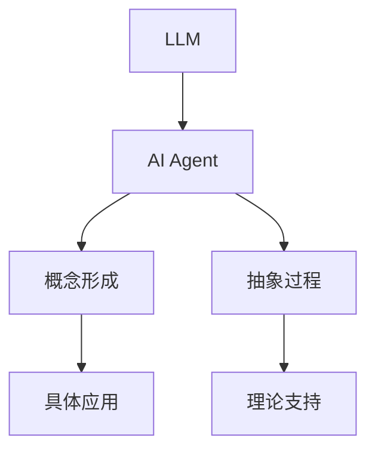
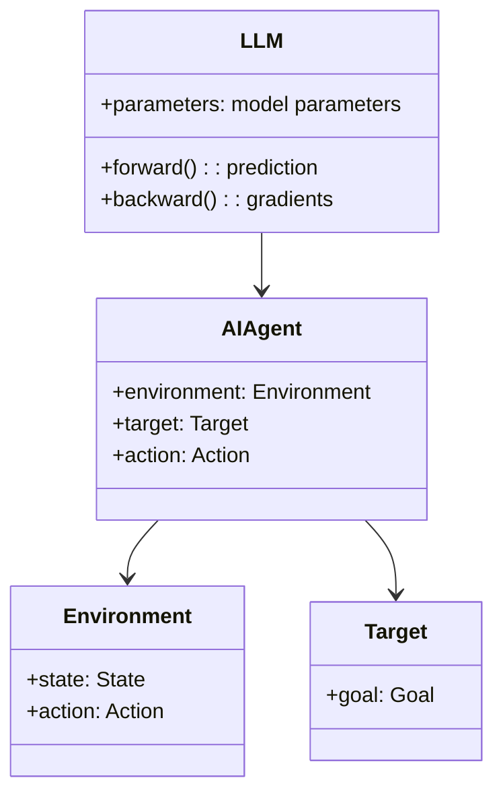
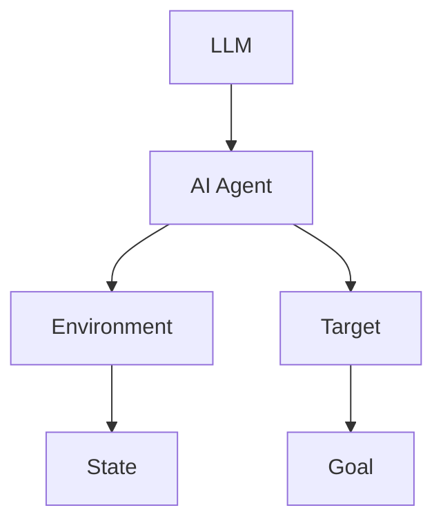
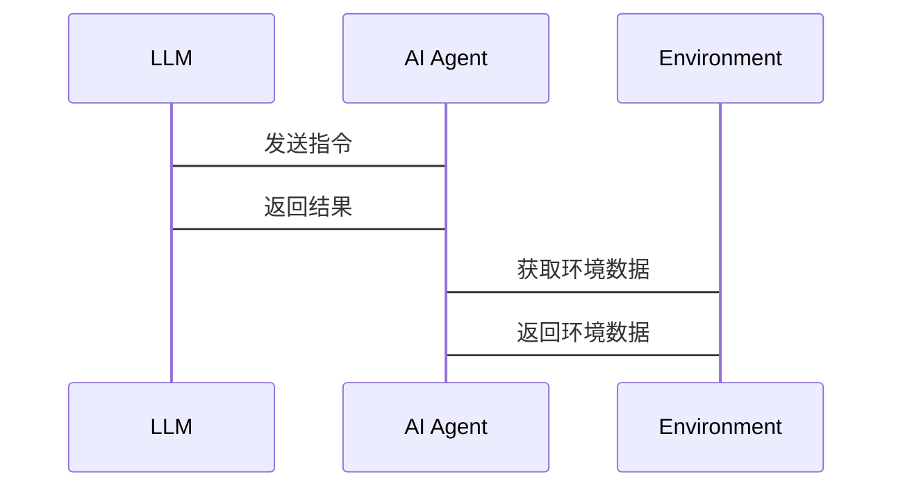

                 


# LLM在AI Agent概念形成与抽象中的作用

## 关键词
- LLM（大语言模型）
- AI Agent（人工智能代理）
- 概念形成
- 抽象
- 人工智能

## 摘要
本文探讨了大语言模型（LLM）在AI Agent概念形成与抽象中的作用。通过分析LLM的工作原理，详细阐述了其在AI Agent概念构建中的应用，结合实际案例，展示了LLM如何帮助AI Agent实现更高级的抽象能力。文章内容包括背景介绍、核心概念与联系、算法原理、系统设计、项目实战及最佳实践，为读者提供全面深入的技术解析。

---

# 第1章: 背景介绍

## 1.1 问题背景

### 1.1.1 LLM的定义与特点
大语言模型（LLM）是指基于大规模神经网络训练的自然语言处理模型，具有以下特点：
- **大规模训练数据**：通常使用万亿级别的参数进行训练。
- **上下文理解能力**：能够理解上下文，生成连贯的文本。
- **多任务能力**：可以执行多种NLP任务，如翻译、问答、文本摘要等。

### 1.1.2 AI Agent的定义与特点
AI Agent（人工智能代理）是指能够感知环境并采取行动以实现目标的智能体，具有以下特点：
- **自主性**：能够在没有外部干预的情况下运行。
- **反应性**：能够实时感知环境并做出反应。
- **目标导向**：具有明确的目标，并采取行动以实现目标。

### 1.1.3 LLM与AI Agent的结合背景
随着AI技术的快速发展，AI Agent的应用场景越来越广泛。然而，AI Agent的概念形成和抽象能力需要依赖于强大的语言处理能力。LLM作为一种强大的自然语言处理工具，能够帮助AI Agent更好地理解和处理复杂的问题。

## 1.2 问题描述

### 1.2.1 AI Agent概念形成中的问题
AI Agent的概念形成过程中，存在以下问题：
- **概念模糊**：AI Agent的概念在不同场景下有不同的定义，缺乏统一的标准。
- **复杂性**：AI Agent需要处理多方面的信息，概念形成过程复杂。

### 1.2.2 LLM在AI Agent抽象中的作用
LLM在AI Agent抽象中的作用主要体现在以下几个方面：
- **语言理解**：LLM能够理解自然语言，帮助AI Agent更好地理解问题。
- **知识表示**：LLM能够将知识以自然语言的形式表示，为AI Agent提供丰富的知识库。
- **推理与抽象**：LLM能够进行推理和抽象，帮助AI Agent形成更高级的概念。

### 1.2.3 问题解决的必要性
为了使AI Agent能够更好地理解和处理复杂的问题，解决其概念形成和抽象能力的不足是必要的。LLM作为一种强大的工具，能够为AI Agent提供必要的支持。

## 1.3 问题解决

### 1.3.1 LLM如何帮助AI Agent形成概念
LLM通过以下方式帮助AI Agent形成概念：
- **语言模型的支持**：LLM提供强大的语言处理能力，帮助AI Agent理解问题。
- **知识库的构建**：LLM可以通过大量的训练数据，构建丰富的知识库，为AI Agent提供支持。
- **推理与生成**：LLM能够进行推理和生成，帮助AI Agent形成概念。

### 1.3.2 LLM在AI Agent抽象中的具体应用
LLM在AI Agent抽象中的具体应用包括：
- **概念提取**：从大量数据中提取关键概念。
- **关系建模**：建立概念之间的关系模型。
- **语义理解**：理解概念的深层语义。

### 1.3.3 问题解决的实现路径
问题解决的实现路径包括：
1. 利用LLM进行概念提取和关系建模。
2. 基于LLM构建知识库，支持AI Agent的理解和推理。
3. 通过LLM的推理能力，帮助AI Agent形成高级概念。

## 1.4 边界与外延

### 1.4.1 LLM在AI Agent中的边界
LLM在AI Agent中的应用存在以下边界：
- **语言能力限制**：LLM的语言处理能力有限，无法处理所有类型的问题。
- **知识范围限制**：LLM的知识来源于训练数据，可能存在知识盲区。

### 1.4.2 AI Agent概念形成与抽象的外延
AI Agent概念形成与抽象的外延包括：
- **跨领域应用**：AI Agent的概念形成可以应用于多个领域。
- **动态适应**：AI Agent能够动态适应环境的变化，形成新的概念。

### 1.4.3 相关概念的对比与区分
相关概念的对比与区分包括：
- **AI Agent与传统智能体**：AI Agent具有更强的自主性和目标导向性。
- **LLM与传统NLP模型**：LLM具有更大的参数规模和更强的多任务能力。

## 1.5 概念结构与核心要素组成

### 1.5.1 AI Agent概念的层次结构
AI Agent概念的层次结构包括：
1. **基本概念**：如目标、行动、环境。
2. **高级概念**：如意图、策略、推理。

### 1.5.2 LLM在其中的作用
LLM在AI Agent概念结构中的作用包括：
- **支持概念提取**：LLM能够从数据中提取关键概念。
- **构建概念层次**：LLM能够帮助构建概念的层次结构。
- **支持概念推理**：LLM能够支持概念的推理过程。

### 1.5.3 核心要素组成与关系
核心要素组成与关系包括：
- **目标**：AI Agent的核心目标。
- **环境**：AI Agent所处的环境。
- **行动**：AI Agent采取的行动。

---

# 第2章: 核心概念与联系

## 2.1 核心概念原理

### 2.1.1 LLM的工作原理
LLM的工作原理包括：
1. **训练过程**：通过大量数据的训练，模型参数不断优化。
2. **编码器-解码器结构**：编码器将输入转换为向量，解码器将向量转换为输出文本。

### 2.1.2 AI Agent的概念形成机制
AI Agent的概念形成机制包括：
1. **感知环境**：通过传感器感知环境。
2. **目标设定**：根据感知结果设定目标。
3. **行动决策**：基于目标和环境信息做出决策。

### 2.1.3 LLM在AI Agent抽象中的具体原理
LLM在AI Agent抽象中的具体原理包括：
- **语言建模**：LLM通过语言建模理解文本。
- **知识表示**：LLM通过知识表示支持AI Agent的抽象。

## 2.2 概念属性特征对比

### 2.2.1 LLM与传统NLP模型的对比
以下是LLM与传统NLP模型的对比：

| 对比维度 | LLM | 传统NLP模型 |
|----------|-----|-------------|
| 参数规模 | 大规模（万亿级别） | 小规模（百万级别） |
| 多任务能力 | 强大的多任务能力 | 较弱的多任务能力 |
| 自然语言理解 | 更强的自然语言理解能力 | 较弱的自然语言理解能力 |

### 2.2.2 AI Agent与传统智能体的对比
以下是AI Agent与传统智能体的对比：

| 对比维度 | AI Agent | 传统智能体 |
|----------|----------|-------------|
| 自主性 | 高自主性 | 较低自主性 |
| 反应性 | 高反应性 | 较低反应性 |
| 目标导向 | 强目标导向 | 较弱目标导向 |

### 2.2.3 LLM在AI Agent中的独特属性
LLM在AI Agent中的独特属性包括：
- **强大的语言理解能力**：能够理解复杂的自然语言指令。
- **知识丰富性**：能够提供丰富的知识支持。
- **动态适应能力**：能够动态调整理解和推理过程。

## 2.3 ER实体关系图架构



---

# 第3章: 算法原理讲解

## 3.1 LLM的训练过程

### 3.1.1 输入数据预处理
输入数据预处理包括：
1. **分词**：将文本分割成词或短语。
2. **数据清洗**：去除噪声数据，如特殊字符、停用词等。

### 3.1.2 模型训练
模型训练包括：
1. **编码器训练**：将输入文本转换为向量表示。
2. **解码器训练**：将向量表示转换为输出文本。

### 3.1.3 损失函数计算
损失函数计算包括：
1. **交叉熵损失**：计算生成文本与真实文本的差异。
2. **优化器调整**：通过优化器调整模型参数，最小化损失函数。

### 3.1.4 模型优化
模型优化包括：
1. **超参数调整**：如学习率、批量大小等。
2. **模型剪枝**：去除冗余参数，优化模型结构。

### 3.1.5 模型评估
模型评估包括：
1. **准确率评估**：计算模型的准确率。
2. **困惑度评估**：评估模型生成文本的连贯性。

## 3.2 LLM的推理过程

### 3.2.1 解码器的工作流程
解码器的工作流程包括：
1. **初始化**：将输入文本转换为向量表示。
2. **生成候选词**：基于当前向量生成多个候选词。
3. **概率计算**：计算每个候选词的概率。
4. **选择最优词**：根据概率选择最优词，生成输出文本。

### 3.2.2 解码器的实现细节
解码器的实现细节包括：
1. **注意力机制**：计算输入文本中每个词的重要性。
2. **解码器网络结构**：如Transformer解码器。

### 3.2.3 生成结果的优化
生成结果的优化包括：
1. **平滑处理**：调整生成文本的语调，使其更加自然。
2. **后处理**：如去除重复词、调整句子结构等。

## 3.3 数学模型与公式

### 3.3.1 损失函数
交叉熵损失函数：
$$ \text{loss} = -\frac{1}{N}\sum_{i=1}^{N}\sum_{j=1}^{M} y_{ij}\log(p_{ij}) $$

### 3.3.2 概率分布
生成词的概率分布：
$$ P(w) = \frac{\exp(s_w)}{\sum_{w'}\exp(s_{w'})} $$

### 3.3.3 注意力机制
注意力机制的计算公式：
$$ \text{Attention}(Q, K, V) = \text{softmax}\left(\frac{QK^T}{\sqrt{d_k}}\right)V $$

---

# 第4章: 系统分析与架构设计

## 4.1 系统分析

### 4.1.1 问题场景介绍
问题场景介绍包括：
1. **AI Agent的目标设定**：根据用户指令设定目标。
2. **环境感知**：通过传感器感知环境。
3. **行动决策**：根据目标和环境信息做出决策。

### 4.1.2 系统介绍
系统介绍包括：
1. **系统目标**：帮助AI Agent更好地理解和处理问题。
2. **系统功能**：包括概念形成、抽象、推理等。

## 4.2 系统功能设计

### 4.2.1 领域模型（mermaid类图）
以下是领域模型的mermaid类图：



### 4.2.2 系统架构设计（mermaid架构图）
以下是系统架构设计的mermaid架构图：



### 4.2.3 接口设计
接口设计包括：
1. **LLM接口**：与AI Agent交互的接口，如API调用。
2. **环境接口**：与环境交互的接口，如传感器数据获取。

### 4.2.4 交互设计（mermaid序列图）
以下是交互设计的mermaid序列图：



---

# 第5章: 项目实战

## 5.1 项目实战介绍

### 5.1.1 环境安装
环境安装包括：
1. **Python环境配置**：安装Python 3.8及以上版本。
2. **依赖安装**：安装必要的库，如TensorFlow、PyTorch等。

### 5.1.2 核心代码实现

#### 5.1.2.1 LLM的实现
以下是LLM的实现代码：

```python
class LLM:
    def __init__(self, model_path):
        self.model = load_model(model_path)
    
    def forward(self, input):
        return self.model.encode(input)
    
    def backward(self, input, output):
        return self.model.train(input, output)
```

#### 5.1.2.2 AI Agent的实现
以下是AI Agent的实现代码：

```python
class AI_Agent:
    def __init__(self, llm):
        self.llm = llm
        self.environment = Environment()
    
    def form_concept(self, input):
        concept = self.llm.forward(input)
        return concept
    
    def abstract(self, concept):
        abstraction = self.llm.backward(concept)
        return abstraction
```

### 5.1.3 代码解读与分析
代码解读与分析包括：
1. **LLM类**：定义了LLM的前向和后向传播方法。
2. **AI_Agent类**：定义了AI Agent的概念形成和抽象方法。

### 5.1.4 案例分析
案例分析包括：
1. **概念形成**：AI Agent通过LLM形成概念。
2. **抽象过程**：AI Agent通过LLM进行抽象。

## 5.2 项目小结
项目小结包括：
1. **项目目标的实现**：通过代码实现了AI Agent的概念形成与抽象。
2. **项目成果**：展示了LLM在AI Agent中的具体应用。

---

# 第6章: 最佳实践与小结

## 6.1 最佳实践

### 6.1.1 LLM的优化
LLM的优化包括：
1. **参数调整**：如学习率、批量大小等。
2. **模型剪枝**：去除冗余参数，优化模型结构。

### 6.1.2 AI Agent的训练
AI Agent的训练包括：
1. **数据准备**：收集和整理训练数据。
2. **模型训练**：通过大量数据训练模型。

## 6.2 小结
本文详细探讨了LLM在AI Agent概念形成与抽象中的作用，通过理论分析和实际案例，展示了LLM在AI Agent中的具体应用。

## 6.3 注意事项
注意事项包括：
1. **模型局限性**：LLM存在语言理解和知识范围的局限性。
2. **数据隐私**：在实际应用中需要注意数据隐私问题。

## 6.4 拓展阅读
拓展阅读包括：
1. **大语言模型的最新研究**：如GPT-4、PaLM等。
2. **人工智能代理的前沿技术**：如强化学习、多智能体协作等。

---

# 作者：AI天才研究院/AI Genius Institute & 禅与计算机程序设计艺术 /Zen And The Art of Computer Programming

