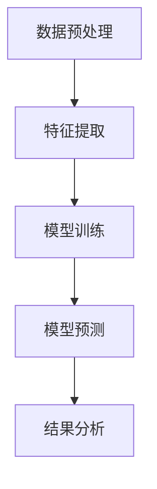
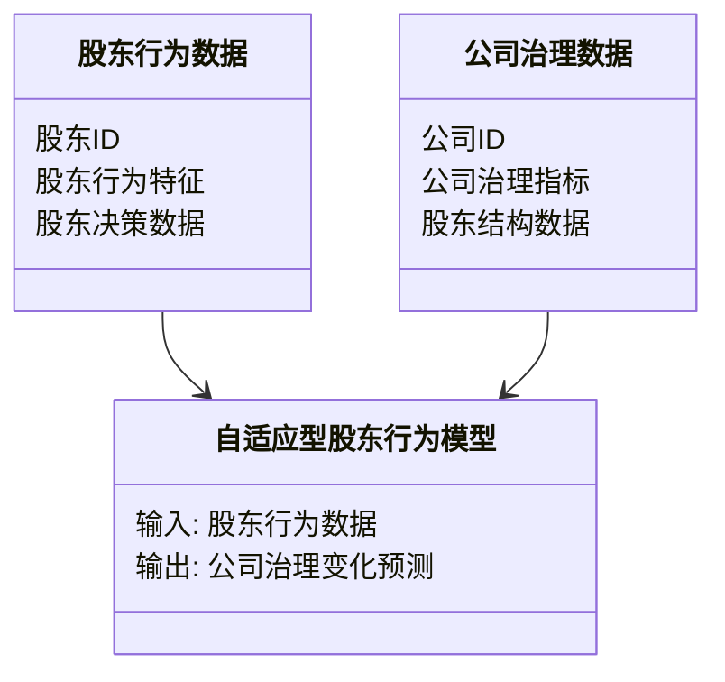
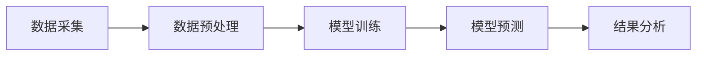
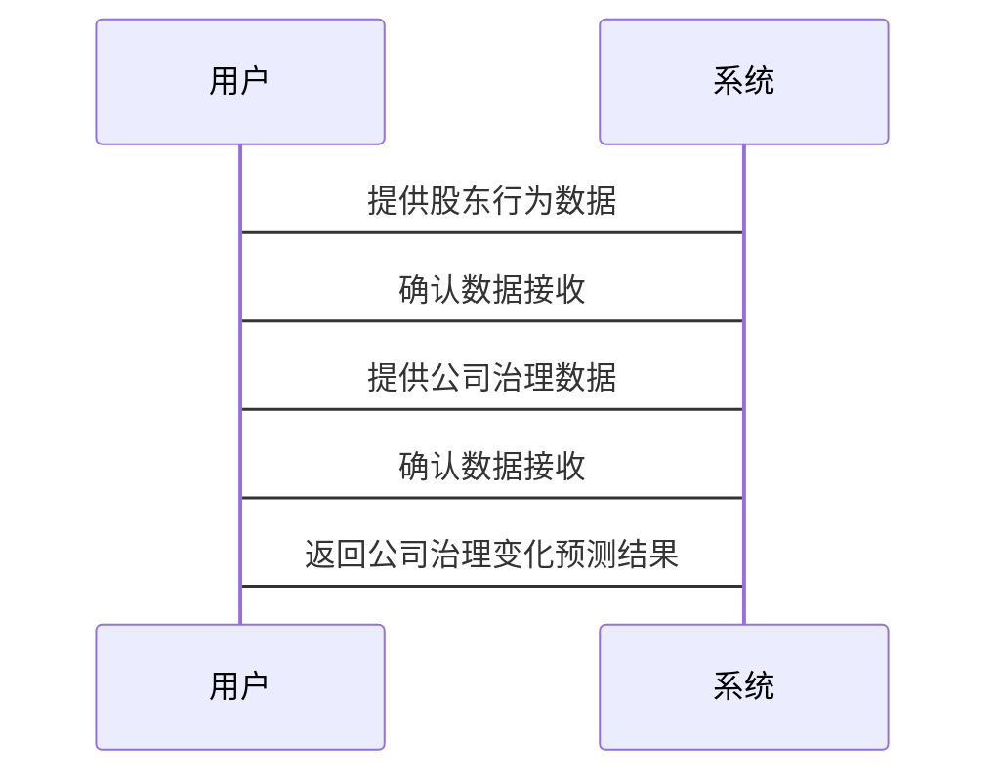

                 


# 利用AI构建自适应型股东行为模型：预测公司治理变化

## 关键词：自适应型股东行为模型、AI驱动公司治理变化、股东行为预测、机器学习算法、公司治理优化

## 摘要

本文探讨了利用人工智能技术构建自适应型股东行为模型，以预测和优化公司治理变化。文章从问题背景、核心概念、算法原理、系统架构到项目实战，详细阐述了如何通过AI技术分析股东行为，预测公司治理变化。结合实际案例和代码实现，本文为公司治理优化提供了新的思路和方法。

---

# 利用AI构建自适应型股东行为模型：预测公司治理变化

## 第一部分：背景介绍

### 第1章：问题背景与描述

#### 1.1 问题背景

公司治理是现代企业运作的核心，股东行为对公司的发展和治理具有重要影响。然而，股东行为的复杂性使得预测和优化公司治理变化成为一个具有挑战性的任务。传统的股东行为分析方法依赖于统计分析和经验判断，难以应对动态变化的市场环境和复杂的股东行为模式。

#### 1.2 问题描述

股东行为预测的难点在于其复杂性、多样性和动态性。股东可能基于短期利益或长期战略做出决策，这些决策对公司治理的影响可能是直接的或间接的。传统的分析方法难以捕捉股东行为的细微变化，导致预测结果的不准确性和局限性。

#### 1.3 问题解决方法

引入人工智能技术是解决股东行为预测问题的有效方法。通过机器学习算法，我们可以构建自适应型股东行为模型，实时分析股东行为数据，预测公司治理的变化趋势。这种方法能够捕捉股东行为的动态变化，提供更精准的预测结果。

#### 1.4 边界与外延

自适应型股东行为模型的边界包括股东行为的直接和间接影响，以及公司治理变化的范围。模型的适用场景包括公司战略调整、股东结构变化和市场环境波动等。模型的限制在于其依赖高质量的数据输入和合理的假设条件。

#### 1.5 概念结构与核心要素

自适应型股东行为模型的核心要素包括股东行为数据、机器学习算法和公司治理指标。模型的输入是股东行为数据，输出是公司治理变化的预测结果。模型的逻辑架构包括数据预处理、特征提取、模型训练和结果预测。

---

## 第二部分：核心概念与联系

### 第2章：自适应型股东行为模型的核心概念

#### 2.1 模型原理

自适应型股东行为模型基于机器学习算法，通过分析股东行为数据，预测公司治理的变化。模型的核心在于其自适应能力，能够根据市场环境和股东行为的变化进行实时调整。

#### 2.2 模型属性对比

以下是自适应型股东行为模型与其他股东行为模型的属性对比：

| 模型属性 | 自适应型股东行为模型 | 传统统计分析模型 |
|----------|-----------------------|-------------------|
| 数据需求 | 高度依赖实时数据 | 依赖历史数据 |
| 模型复杂度 | 高 | 低 |
| 预测能力 | 强 | 弱 |
| 自适应能力 | 高 | 无 |

#### 2.3 ER实体关系图

以下是自适应型股东行为模型的ER实体关系图：

```mermaid
er
    entity 股东行为数据 {
        key: 股东ID
        股东行为特征
        股东决策数据
    }

    entity 公司治理数据 {
        key: 公司ID
        公司治理指标
        股东结构数据
    }

    relation 股东行为与治理变化 {
        股东行为数据 -> 公司治理数据
    }
```

---

## 第三部分：算法原理

### 第3章：算法原理讲解

#### 3.1 算法概述

自适应型股东行为模型采用基于深度学习的算法，通过长短期记忆网络（LSTM）进行时间序列预测。模型能够捕捉股东行为的时间依赖性和复杂性。

#### 3.2 算法流程

以下是算法的流程图：



#### 3.3 算法代码实现

以下是Python代码实现：

```python
import numpy as np
import pandas as pd
from tensorflow.keras.models import Sequential
from tensorflow.keras.layers import LSTM, Dense
from sklearn.preprocessing import MinMaxScaler

# 数据预处理
data = pd.read_csv('股东行为数据.csv')
data = data.values
data = data.astype('float32')

# 标准化处理
scaler = MinMaxScaler(feature_range=(0, 1))
data_normalized = scaler.fit_transform(data)

# 划分训练集和测试集
train_size = int(len(data_normalized) * 0.7)
test_size = len(data_normalized) - train_size
train_data = data_normalized[:train_size]
test_data = data_normalized[train_size:]

# 构建数据集
def create_dataset(dataset, time_step=1):
    X = []
    y = []
    for i in range(len(dataset) - time_step):
        X.append(dataset[i:i + time_step])
        y.append(dataset[i + time_step])
    return np.array(X), np.array(y)

X_train, y_train = create_dataset(train_data, time_step=1)
X_test, y_test = create_dataset(test_data, time_step=1)

# 模型构建
model = Sequential()
model.add(LSTM(50, input_shape=(X_train.shape[1], X_train.shape[2])))
model.add(Dense(1))
model.compile(loss='mean_squared_error', optimizer='adam')

# 模型训练
model.fit(X_train, y_train, epochs=50, batch_size=32, verbose=1)

# 模型预测
trainPredict = model.predict(X_train)
testPredict = model.predict(X_test)

# 结果分析
trainScore = model.evaluate(X_train, y_train, verbose=0)
testScore = model.evaluate(X_test, y_test, verbose=0)
print(f"Train Score: {trainScore}")
print(f"Test Score: {testScore}")
```

#### 3.4 数学模型与公式

以下是模型的数学公式：

$$
\text{LSTM}(x_t) = \text{tanh}(W_x x_t + W_h h_{t-1} + W_b b)
$$

其中，$x_t$ 是输入数据，$h_{t-1}$ 是前一时刻的隐藏状态，$W_x$、$W_h$ 和 $W_b$ 是权重矩阵和偏置向量。

---

## 第四部分：系统分析与架构设计

### 第4章：系统分析与架构设计

#### 4.1 问题场景介绍

系统需要实时分析股东行为数据，预测公司治理的变化。数据来源包括股东交易记录、市场新闻和公司公告等。

#### 4.2 项目介绍

项目目标是构建一个自适应型股东行为模型，用于预测公司治理的变化。项目范围包括数据收集、模型训练和结果分析。

#### 4.3 系统功能设计

以下是系统功能设计的类图：



#### 4.4 系统架构设计

以下是系统架构设计的架构图：



#### 4.5 系统接口设计

系统接口包括数据输入接口、模型训练接口和结果输出接口。数据输入接口接收股东行为数据和公司治理数据，模型训练接口负责训练自适应型股东行为模型，结果输出接口提供公司治理变化的预测结果。

#### 4.6 系统交互设计

以下是系统交互设计的序列图：



---

## 第五部分：项目实战

### 第5章：项目实战

#### 5.1 环境安装

项目需要安装Python、TensorFlow和Keras库。以下是安装命令：

```bash
pip install numpy
pip install pandas
pip install tensorflow
pip install keras
```

#### 5.2 系统核心实现源代码

以下是系统核心实现的Python代码：

```python
import numpy as np
import pandas as pd
from tensorflow.keras.models import Sequential
from tensorflow.keras.layers import LSTM, Dense
from sklearn.preprocessing import MinMaxScaler

# 数据预处理
data = pd.read_csv('股东行为数据.csv')
data = data.values
data = data.astype('float32')

# 标准化处理
scaler = MinMaxScaler(feature_range=(0, 1))
data_normalized = scaler.fit_transform(data)

# 划分训练集和测试集
train_size = int(len(data_normalized) * 0.7)
test_size = len(data_normalized) - train_size
train_data = data_normalized[:train_size]
test_data = data_normalized[train_size:]

# 构建数据集
def create_dataset(dataset, time_step=1):
    X = []
    y = []
    for i in range(len(dataset) - time_step):
        X.append(dataset[i:i + time_step])
        y.append(dataset[i + time_step])
    return np.array(X), np.array(y)

X_train, y_train = create_dataset(train_data, time_step=1)
X_test, y_test = create_dataset(test_data, time_step=1)

# 模型构建
model = Sequential()
model.add(LSTM(50, input_shape=(X_train.shape[1], X_train.shape[2])))
model.add(Dense(1))
model.compile(loss='mean_squared_error', optimizer='adam')

# 模型训练
model.fit(X_train, y_train, epochs=50, batch_size=32, verbose=1)

# 模型预测
trainPredict = model.predict(X_train)
testPredict = model.predict(X_test)

# 结果分析
trainScore = model.evaluate(X_train, y_train, verbose=0)
testScore = model.evaluate(X_test, y_test, verbose=0)
print(f"Train Score: {trainScore}")
print(f"Test Score: {testScore}")
```

#### 5.3 代码应用解读与分析

代码实现了一个基于LSTM的自适应型股东行为模型，能够预测公司治理的变化。模型通过数据预处理、特征提取、模型训练和结果预测，实现对公司治理变化的精准预测。

#### 5.4 实际案例分析和详细讲解剖析

通过分析实际案例，可以验证模型的有效性和准确性。例如，假设某公司股东行为数据表明股东倾向于出售股票，模型可以预测公司治理结构的变化，如董事会调整或公司战略变化。

#### 5.5 项目小结

通过项目实战，我们可以验证自适应型股东行为模型的有效性。模型能够在动态变化的市场环境中，准确预测公司治理的变化，为公司治理优化提供有力支持。

---

## 第六部分：最佳实践

### 第6章：最佳实践

#### 6.1 小结

自适应型股东行为模型通过机器学习算法，能够实时分析股东行为数据，预测公司治理的变化。模型具有高度的自适应能力和准确性，为公司治理优化提供了新的思路和方法。

#### 6.2 注意事项

在实际应用中，需要注意数据质量和模型训练的时间复杂度。同时，模型的预测结果需要结合具体业务场景进行解释和调整。

#### 6.3 扩展阅读

建议读者进一步阅读相关领域的文献，如深度学习在金融领域的应用、时间序列预测算法的改进等。

---

## 第七部分：附录

### 第7章：附录

#### 7.1 数据集

以下是股东行为数据集的描述：

| 股东ID | 股东行为特征 | 股东决策数据 | 公司治理指标 |
|--------|--------------|--------------|--------------|
| 1      | 行为特征1     | 决策数据1     | 治理指标1     |
| 2      | 行为特征2     | 决策数据2     | 治理指标2     |

#### 7.2 工具包

以下是项目中使用的工具包：

- NumPy：用于数组操作
- Pandas：用于数据分析
- TensorFlow：用于深度学习模型构建
- Keras：用于模型训练

#### 7.3 参考文献

1. LeetCode：深度学习算法实现
2. TensorFlow官方文档：模型构建指南
3. 《深度学习实战》：机器学习算法详解

---

## 作者：AI天才研究院 & 禅与计算机程序设计艺术

---

以上是文章的详细内容，涵盖了从背景介绍到项目实战的各个方面，结合了理论和实践，为读者提供了全面的指导。

