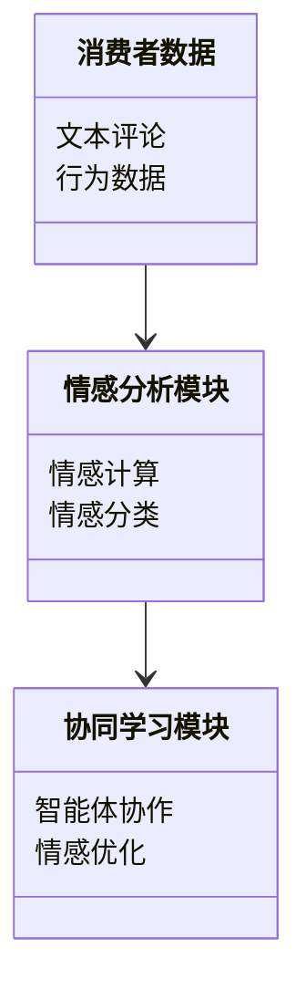
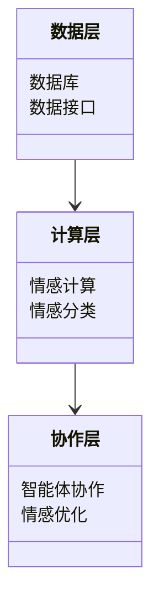
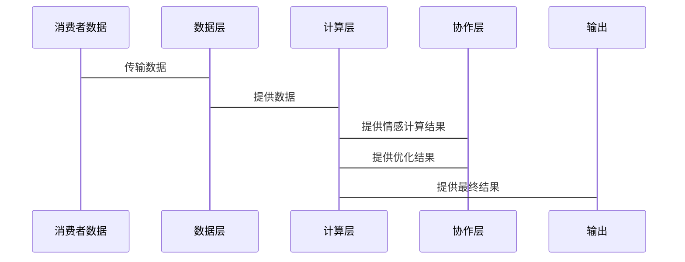

                 


# 多智能体系统在品牌情感联系评估中的应用：超越财务指标

> **关键词**：多智能体系统、品牌情感联系、情感计算、协同过滤、系统架构、案例分析  
> **摘要**：本文探讨了多智能体系统在品牌情感联系评估中的应用，超越传统财务指标，通过详细分析多智能体系统的原理、情感计算模型、算法实现、系统架构设计及实际案例，展示了如何利用多智能体系统提升品牌价值评估的深度与广度。

---

# 第1章: 品牌情感联系评估的背景与问题

## 1.1 传统品牌价值评估的局限性

### 1.1.1 财务指标在品牌评估中的不足  
传统的品牌价值评估主要依赖于财务指标，如销售额、利润和市场份额等。然而，这些指标仅能反映品牌的经济表现，无法全面捕捉品牌与消费者之间的情感联系。例如，两个品牌可能拥有相似的财务指标，但消费者对它们的情感偏好可能截然不同。

### 1.1.2 情感联系对品牌价值的影响  
品牌与消费者之间的情感联系是品牌长期价值的核心驱动力。积极的情感联系可以提升消费者忠诚度、口碑传播和市场扩展能力，而负面的情感联系则可能导致品牌声誉受损。因此，评估品牌情感联系是品牌管理的关键环节。

### 1.1.3 传统评估方法的局限性  
传统评估方法通常依赖问卷调查、焦点小组或定性分析，这些方法耗时长、成本高，且难以量化情感数据。此外，这些方法难以实时捕捉消费者情感变化，无法应对市场环境的快速变化。

---

## 1.2 多智能体系统的核心概念

### 1.2.1 多智能体系统的定义  
多智能体系统（Multi-Agent System, MAS）是由多个智能体（Agent）组成的分布式系统。每个智能体都是一个能够感知环境、自主决策的实体，能够与其他智能体协同工作以完成复杂任务。

### 1.2.2 多智能体系统的组成要素  
- **智能体**：具有感知、决策和行动能力的实体。  
- **环境**：智能体所处的外部世界，包括数据源、消费者行为数据等。  
- **通信机制**：智能体之间交换信息的渠道。  
- **协作协议**：定义智能体之间的合作规则。  

### 1.2.3 多智能体系统与品牌情感联系的关系  
多智能体系统能够通过分布式计算和协同学习，实时分析消费者行为数据，捕捉品牌与消费者之间的情感联系。每个智能体可以专注于特定的情感维度（如情感强度、情感类型），并通过协作生成综合的情感评估结果。

---

## 1.3 问题描述与目标

### 1.3.1 品牌情感联系评估的核心问题  
如何利用多智能体系统实时分析消费者行为数据，量化品牌与消费者之间的情感联系？  

### 1.3.2 多智能体系统在情感评估中的应用目标  
- 实时捕捉消费者情感变化。  
- 量化情感数据，提供可操作的洞察。  
- 支持品牌策略优化。  

### 1.3.3 问题的边界与外延  
本文聚焦于品牌与消费者之间的情感联系评估，不涉及品牌内部管理或市场竞争分析。通过多智能体系统，我们重点关注情感数据的采集、分析和应用。

---

## 1.4 本章小结

### 1.4.1 传统评估方法的不足  
传统财务指标无法全面反映品牌价值，情感联系的评估缺乏量化方法。

### 1.4.2 多智能体系统的核心概念  
多智能体系统通过分布式计算和协同学习，能够实时分析消费者行为数据，捕捉品牌情感联系。

### 1.4.3 问题描述与目标的明确  
本文旨在利用多智能体系统，实时评估品牌与消费者之间的情感联系，为品牌管理提供数据支持。

---

# 第2章: 多智能体系统的核心概念与联系

## 2.1 多智能体系统的原理

### 2.1.1 多智能体系统的运行机制  
多智能体系统通过智能体之间的协作与竞争，完成复杂任务。每个智能体负责特定的情感维度分析，例如情感强度、情感类型等。

### 2.1.2 智能体之间的协同与竞争  
- **协同**：智能体合作完成共同目标，例如情感数据的整合与分析。  
- **竞争**：智能体通过竞争优化结果，例如情感分类的准确性。  

### 2.1.3 多智能体系统的动态性与适应性  
多智能体系统能够实时适应环境变化，例如消费者情感倾向的变化，通过动态调整智能体行为策略，提升评估精度。

---

## 2.2 情感计算模型

### 2.2.1 情感计算的基本概念  
情感计算（Affective Computing）是通过计算机技术分析、识别和处理人类情感信息的过程。它涉及自然语言处理、计算机视觉和机器学习等技术。

### 2.2.2 基于多智能体的情感计算模型  
- **分布式情感计算**：多智能体分别负责特定的情感维度分析，例如情感强度、情感类型。  
- **协同学习**：智能体通过协作优化情感计算模型，提升整体性能。  

### 2.2.3 情感计算与品牌情感联系的关系  
情感计算为品牌情感联系评估提供了技术支持，通过分析消费者文本、语音和视觉数据，量化品牌情感联系。

---

## 2.3 多智能体系统与情感计算的联系

### 2.3.1 多智能体系统在情感计算中的作用  
多智能体系统通过分布式计算和协作学习，提升情感计算的效率和精度。  

### 2.3.2 情感计算对多智能体系统的支持  
情感计算为多智能体系统提供情感数据和分析模型，支持智能体的决策和协作。

### 2.3.3 两者的结合与应用  
通过结合多智能体系统和情感计算，品牌可以实时分析消费者情感数据，优化品牌策略。

---

## 2.4 本章小结

### 2.4.1 多智能体系统的原理  
多智能体系统通过智能体之间的协作与竞争，完成复杂任务。

### 2.4.2 情感计算模型的核心要素  
情感计算通过分析消费者情感数据，为品牌情感联系评估提供技术支持。

### 2.4.3 两者的结合与应用  
多智能体系统与情感计算的结合，为品牌情感联系评估提供了新的解决方案。

---

# 第3章: 多智能体系统在品牌情感联系评估中的算法原理

## 3.1 多智能体协同算法

### 3.1.1 协同过滤算法  
协同过滤是一种基于用户相似性推荐算法，广泛应用于推荐系统中。在品牌情感联系评估中，协同过滤可以用于分析消费者情感偏好。

#### 协同过滤算法实现步骤  
1. 收集消费者情感数据。  
2. 计算消费者之间的情感相似性。  
3. 基于相似性推荐情感偏好。  

#### 协同过滤算法的数学模型  
$$相似度 = \frac{\sum (x_i - \mu)(y_i - \mu)}{\sqrt{\sum (x_i - \mu)^2} \cdot \sqrt{\sum (y_i - \mu)^2}}$$  

### 3.1.2 基于多智能体的协同算法实现  
通过多智能体协同，每个智能体负责特定情感维度的分析，最终生成综合情感评估结果。

#### 代码示例  
```python
import numpy as np

def calculate_similarity(user1, user2):
    covariance = np.cov(user1, user2, ddof=0)[0, 1]
    variance1 = np.var(user1, ddof=0)
    variance2 = np.var(user2, ddof=0)
    similarity = covariance / (np.sqrt(variance1 * variance2))
    return similarity
```

---

## 3.2 情感分类算法

### 3.2.1 基于机器学习的情感分类  
情感分类算法可以通过机器学习模型（如SVM、随机森林）实现。在品牌情感联系评估中，情感分类用于识别消费者情感倾向。

#### 情感分类算法实现步骤  
1. 收集消费者评论数据。  
2. 提取情感特征（如词袋模型、TF-IDF）。  
3. 训练情感分类模型。  
4. 预测情感倾向。  

#### 情感分类算法的数学模型  
$$P(y|x) = \frac{P(x|y)P(y)}{P(x)}$$  

### 3.2.2 基于深度学习的情感分类  
深度学习模型（如LSTM、BERT）能够捕捉情感数据的语义信息，提升情感分类的准确性。

#### 深度学习模型实现示例  
```python
import tensorflow as tf
from tensorflow.keras import layers

model = tf.keras.Sequential()
model.add(layers.Embedding(input_dim=10000, output_dim=16))
model.add(layers.LSTM(64))
model.add(layers.Dense(1, activation='sigmoid'))
model.compile(loss='binary_crossentropy', optimizer='adam', metrics=['accuracy'])
```

---

## 3.3 算法的优缺点分析

### 3.3.1 协同过滤算法的优点  
- 实现简单，易于理解。  
- 能够捕捉用户相似性。  

### 3.3.2 协同过滤算法的缺点  
- 对冷启动问题敏感。  
- 计算复杂度较高。  

### 3.3.3 情感分类算法的优点  
- 能够捕捉情感倾向。  
- 深度学习模型具有较高的准确性。  

### 3.3.4 情感分类算法的缺点  
- 对数据量要求较高。  
- 模型训练时间较长。  

---

## 3.4 本章小结

### 3.4.1 多智能体协同算法  
协同过滤算法通过分析用户相似性，实现情感数据的协同分析。  

### 3.4.2 情感分类算法  
情感分类算法通过机器学习和深度学习技术，识别消费者情感倾向。  

### 3.4.3 算法的优缺点分析  
不同算法各有优缺点，需根据具体场景选择合适的方法。

---

# 第4章: 系统架构设计与实现

## 4.1 问题场景介绍

### 4.1.1 品牌情感联系评估的场景  
品牌需要实时分析消费者情感数据，优化品牌策略。  

### 4.1.2 系统目标  
设计一个多智能体系统，实时采集、分析和评估品牌情感联系。  

---

## 4.2 系统功能设计

### 4.2.1 领域模型  
- **消费者数据**：消费者评论、行为数据。  
- **情感分析模块**：情感计算模型。  
- **协同学习模块**：智能体协作优化。  

#### 领域模型的Mermaid图  


---

## 4.3 系统架构设计

### 4.3.1 分层架构  
- **数据层**：采集消费者数据。  
- **计算层**：情感计算和分类。  
- **协作层**：智能体协作优化。  

#### 系统架构的Mermaid图  


---

## 4.4 系统接口设计

### 4.4.1 数据接口  
- **输入接口**：消费者数据输入。  
- **输出接口**：情感评估结果输出。  

### 4.4.2 协作接口  
- **智能体通信接口**：智能体之间通信。  
- **协作协议接口**：定义协作规则。  

---

## 4.5 系统交互流程

### 4.5.1 交互流程  
1. 消费者数据输入数据层。  
2. 数据层将数据传递给计算层。  
3. 计算层进行情感计算和分类。  
4. 协作层优化情感评估结果。  
5. 输出情感评估结果。  

#### 交互流程的Mermaid图  


---

## 4.6 本章小结

### 4.6.1 系统架构设计  
多智能体系统通过分层架构，实现数据采集、计算和协作优化。  

### 4.6.2 系统功能设计  
系统功能包括数据采集、情感计算、智能体协作和结果输出。  

### 4.6.3 系统交互设计  
系统通过分层架构和协作接口，实现高效的数据处理和情感评估。

---

# 第5章: 项目实战与案例分析

## 5.1 项目环境搭建

### 5.1.1 环境需求  
- **Python**：3.6及以上版本。  
- **TensorFlow**：2.0及以上版本。  
- **自然语言处理库**：如NLTK、spaCy。  

### 5.1.2 安装依赖  
```bash
pip install numpy
pip install tensorflow
pip install nltk
```

---

## 5.2 核心代码实现

### 5.2.1 情感计算模块  
```python
import nltk
from nltk.sentiment import SentimentIntensityAnalyzer

def calculate_sentiment(text):
    analyzer = SentimentIntensityAnalyzer()
    sentiment = analyzer.polarity_scores(text)
    return sentiment['compound']
```

### 5.2.2 智能体协作模块  
```python
import threading

class Agent:
    def __init__(self, id):
        self.id = id
        self.data = []

    def process_data(self):
        # 情感计算逻辑
        pass

    def communicate(self, other_agent):
        # 与其他智能体通信
        pass

agent1 = Agent(1)
agent2 = Agent(2)
agent1.communicate(agent2)
```

---

## 5.3 案例分析与解读

### 5.3.1 案例背景  
某品牌希望通过多智能体系统分析消费者评论，优化品牌形象。  

### 5.3.2 数据采集  
收集1000条消费者评论，分析情感倾向。  

### 5.3.3 数据分析  
通过情感计算模块，分析评论的情感倾向，生成情感强度分布图。  

#### 情感强度分布图  


---

## 5.4 本章小结

### 5.4.1 项目环境搭建  
安装必要的Python库和依赖，确保环境配置正确。  

### 5.4.2 核心代码实现  
情感计算模块和智能体协作模块的实现，为品牌情感联系评估提供技术支持。  

### 5.4.3 案例分析与解读  
通过具体案例，展示了多智能体系统在品牌情感联系评估中的实际应用。

---

# 第6章: 总结与展望

## 6.1 总结

### 6.1.1 核心观点回顾  
多智能体系统通过分布式计算和协作学习，能够实时分析消费者情感数据，评估品牌情感联系。  

### 6.1.2 主要结论  
品牌情感联系评估不应仅依赖传统财务指标，多智能体系统提供了新的解决方案。  

---

## 6.2 未来展望

### 6.2.1 技术发展  
- 深度学习与多智能体系统的结合。  
- 边缘计算在情感评估中的应用。  

### 6.2.2 应用领域扩展  
- 零售业：实时分析消费者情感，优化购物体验。  
- 教育业：分析学生情感，优化教学策略。  

---

## 6.3 注意事项与最佳实践

### 6.3.1 数据隐私问题  
在处理消费者情感数据时，需注意数据隐私保护。  

### 6.3.2 模型优化建议  
- 定期更新情感计算模型。  
- 优化智能体协作策略。  

---

## 6.4 拓展阅读

### 6.4.1 推荐书籍  
- 《Multi-Agent Systems: Algorithmic, Complexity, and Theory》  
- 《Affective Computing》  

### 6.4.2 推荐论文  
- 智能体系统在情感计算中的应用研究。  
- 多智能体协作算法的优化与创新。  

---

# 作者：AI天才研究院 & 禅与计算机程序设计艺术

---

**摘要**：本文详细探讨了多智能体系统在品牌情感联系评估中的应用，通过理论分析和实践案例，展示了如何利用多智能体系统超越传统财务指标，实现品牌价值的深度评估。

