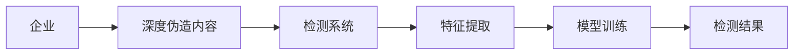
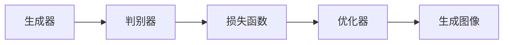
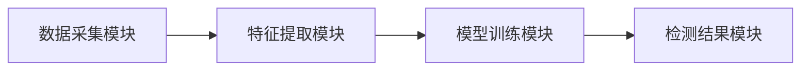
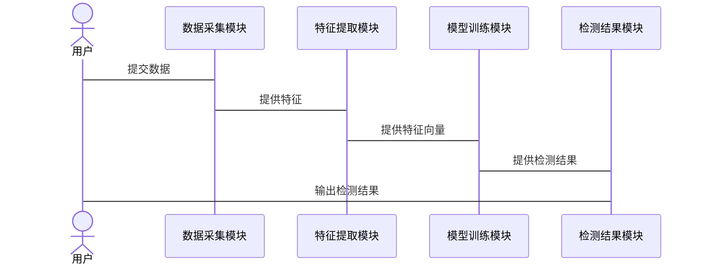

                 


# 如何识别企业的深度伪造检测技术优势

## 关键词：深度伪造检测，企业技术优势，生成对抗网络，检测算法，数据安全

## 摘要：深度伪造技术的快速发展对企业信息安全和品牌形象构成了严峻挑战。本文将从技术原理、算法设计、系统架构等多个维度，详细解析企业深度伪造检测技术的核心优势，并通过实际案例分析，为企业选择和优化深度伪造检测方案提供有价值的参考和指导。

---

# 第一部分: 深度伪造检测技术背景与概念

## 第1章: 深度伪造技术的背景与问题描述

### 1.1 深度伪造技术的背景
#### 1.1.1 什么是深度伪造技术
深度伪造（Deepfake）是一种利用生成对抗网络（GAN）等人工智能技术生成逼真假媒体内容的技术。它可以通过训练模型将一个人的脸替换到视频或图像中的另一个角色，或者生成虚假的语音、视频等。

#### 1.1.2 深度伪造技术的发展历程
深度伪造技术起源于2017年的“FaceSwap”项目，随后在2018年被广泛应用于社交媒体和网络内容中。随着技术的进步，深度伪造已经从简单的图像替换发展到生成高质量的视频和语音。

#### 1.1.3 深度伪造技术对企业的影响
- **企业声誉风险**：虚假内容可能导致企业形象受损，例如虚假的高管发言或产品宣传。
- **数据安全威胁**：深度伪造可能被用于窃取企业机密或进行社会工程攻击。
- **法律风险**：生成的虚假内容可能违反版权法或隐私法，导致法律纠纷。

### 1.2 深度伪造检测技术的必要性
#### 1.2.1 提高企业数据的真实性
深度伪造检测技术可以帮助企业识别和过滤虚假内容，确保数据的真实性和可靠性。

#### 1.2.2 保护企业品牌形象
通过检测深度伪造内容，企业可以防止虚假信息的传播，维护品牌形象和公众信任。

#### 1.2.3 维护企业利益相关者的信任
深度伪造检测技术能够帮助企业在供应链、合作伙伴和客户中建立信任，避免因虚假信息导致的合作中断或客户流失。

### 1.3 企业深度伪造检测技术的优势
#### 1.3.1 提高企业数据的真实性
深度伪造检测技术可以通过算法分析图像、视频和音频中的异常特征，识别深度伪造内容。

#### 1.3.2 保护企业品牌形象
通过及时识别和删除深度伪造内容，企业可以避免虚假信息对品牌形象的损害。

#### 1.3.3 维护企业利益相关者的信任
深度伪造检测技术能够帮助企业在内部和外部建立信任机制，确保信息的真实性和透明度。

### 1.4 本章小结
本章介绍了深度伪造技术的背景、问题描述以及企业深度伪造检测技术的必要性和优势。通过理解这些内容，企业可以更好地认识到深度伪造检测技术的重要性，并采取相应的措施来保护自身利益。

---

## 第2章: 深度伪造检测技术的核心概念

### 2.1 深度伪造技术的基本原理
#### 2.1.1 生成对抗网络（GAN）的原理
生成对抗网络由生成器和判别器两部分组成。生成器的目标是生成逼真的假数据，而判别器的目标是区分真实数据和生成数据。通过交替训练，生成器和判别器不断优化，最终生成高质量的深度伪造内容。

#### 2.1.2 深度伪造技术的传播方式
深度伪造内容可以通过社交媒体、电子邮件、视频会议等多种渠道传播，对企业造成潜在威胁。

#### 2.1.3 深度伪造技术的识别特征
深度伪造内容通常具有以下特征：
- **面部表情异常**：生成的内容可能出现不自然的面部表情或动作。
- **光照不一致**：生成的图像或视频中可能存在光照不一致的问题。
- **音频失真**：生成的语音可能缺乏自然的语调和情感变化。

### 2.2 深度伪造检测技术的关键特征
#### 2.2.1 基于特征提取的检测方法
基于特征提取的检测方法通过分析图像或视频中的特征，如纹理、颜色和深度信息，来识别深度伪造内容。

#### 2.2.2 基于生成对抗网络的检测方法
基于生成对抗网络的检测方法利用生成器生成假数据，并通过判别器检测数据的真实性。

#### 2.2.3 基于内容分析的检测方法
基于内容分析的检测方法通过分析内容的上下文和逻辑关系，识别深度伪造内容。

### 2.3 深度伪造检测技术的实体关系图


### 2.4 本章小结
本章详细介绍了深度伪造技术的基本原理、传播方式和识别特征，以及深度伪造检测技术的关键特征。通过理解这些内容，读者可以更好地掌握深度伪造检测技术的核心概念。

---

## 第3章: 深度伪造检测技术的算法原理

### 3.1 深度伪造生成模型的原理
#### 3.1.1 基于生成对抗网络的深度伪造生成

生成对抗网络通过交替优化生成器和判别器的损失函数，生成逼真的假数据。

#### 3.1.2 深度伪造生成的数学模型
生成器的损失函数可以表示为：
$$ \text{生成器损失函数} = \mathbb{E}_{z \sim p(z)}[\mathcal{L}(G(z), x)] $$
其中，$G(z)$ 是生成器生成的数据，$x$ 是真实数据，$\mathcal{L}$ 是损失函数。

判别器的损失函数可以表示为：
$$ \text{判别器损失函数} = \mathbb{E}_{x \sim p(x)}[\log D(x)] + \mathbb{E}_{z \sim p(z)}[\log (1 - D(G(z)))] $$
其中，$D(x)$ 是判别器输出的概率，表示输入数据是真实数据的概率。

#### 3.1.3 深度伪造生成的代码实现
以下是基于PyTorch实现的生成对抗网络的代码示例：
```python
import torch
import torch.nn as nn

class Generator(nn.Module):
    def __init__(self, latent_dim, img_size):
        super(Generator, self).__init__()
        self.latent_dim = latent_dim
        self.img_size = img_size
        self.model = nn.Sequential(
            nn.Linear(latent_dim, 256),
            nn.LeakyReLU(0.2),
            nn.Linear(256, 512),
            nn.LeakyReLU(0.2),
            nn.Linear(512, img_size),
            nn.Tanh()
        )
    
    def forward(self, z):
        return self.model(z)

class Discriminator(nn.Module):
    def __init__(self, img_size):
        super(Discriminator, self).__init__()
        self.model = nn.Sequential(
            nn.Linear(img_size, 512),
            nn.LeakyReLU(0.2),
            nn.Linear(512, 256),
            nn.LeakyReLU(0.2),
            nn.Linear(256, 1),
            nn.Sigmoid()
        )
    
    def forward(self, x):
        return self.model(x)

# 初始化模型和优化器
latent_dim = 100
img_size = 256
generator = Generator(latent_dim, img_size)
discriminator = Discriminator(img_size)
```

### 3.2 深度伪造检测模型的原理
#### 3.2.1 基于特征提取的检测方法
基于特征提取的检测方法通过提取图像或视频中的特征，如纹理、颜色和深度信息，来识别深度伪造内容。

#### 3.2.2 基于生成对抗网络的检测方法
基于生成对抗网络的检测方法利用生成器生成假数据，并通过判别器检测数据的真实性。

#### 3.2.3 深度伪造检测的数学模型
检测模型的损失函数可以表示为：
$$ \text{检测损失函数} = \mathbb{E}_{x \sim p(x)}[\log D(x)] + \mathbb{E}_{z \sim p(z)}[\log (1 - D(G(z)))] $$
其中，$D(x)$ 是检测器输出的概率，表示输入数据是真实数据的概率。

#### 3.2.4 深度伪造检测的代码实现
以下是基于PyTorch实现的深度伪造检测模型的代码示例：
```python
import torch
import torch.nn as nn

class Discriminator(nn.Module):
    def __init__(self, img_size):
        super(Discriminator, self).__init__()
        self.model = nn.Sequential(
            nn.Linear(img_size, 512),
            nn.LeakyReLU(0.2),
            nn.Linear(512, 256),
            nn.LeakyReLU(0.2),
            nn.Linear(256, 1),
            nn.Sigmoid()
        )
    
    def forward(self, x):
        return self.model(x)

# 初始化模型和优化器
img_size = 256
discriminator = Discriminator(img_size)
```

### 3.3 本章小结
本章详细介绍了深度伪造生成模型和检测模型的原理、数学模型和代码实现。通过理解这些内容，读者可以更好地掌握深度伪造检测技术的算法原理。

---

## 第4章: 深度伪造检测技术的系统分析与架构设计方案

### 4.1 问题场景介绍
企业可能面临以下问题场景：
- **虚假内容传播**：深度伪造内容可能通过社交媒体或电子邮件传播，对企业造成声誉损失。
- **数据篡改**：深度伪造技术可能被用于篡改企业数据，导致决策失误。
- **社会工程攻击**：深度伪造技术可能被用于进行社会工程攻击，例如伪造高管语音进行诈骗。

### 4.2 系统功能设计
#### 4.2.1 数据采集模块
数据采集模块负责采集企业内外部的数据，包括图像、视频和音频。

#### 4.2.2 特征提取模块
特征提取模块通过提取图像、视频和音频的特征，生成可用于检测的特征向量。

#### 4.2.3 模型训练模块
模型训练模块负责训练深度伪造检测模型，优化模型参数以提高检测准确率。

#### 4.2.4 检测结果模块
检测结果模块负责输出检测结果，包括检测到的深度伪造内容和置信度。

### 4.3 系统架构设计


### 4.4 系统接口设计
系统接口设计包括：
- **输入接口**：接收图像、视频和音频数据。
- **输出接口**：输出检测结果，包括检测到的深度伪造内容和置信度。

### 4.5 系统交互设计


### 4.6 本章小结
本章详细介绍了深度伪造检测系统的功能设计、架构设计和交互设计。通过理解这些内容，读者可以更好地掌握深度伪造检测技术的系统实现。

---

## 第5章: 深度伪造检测技术的项目实战

### 5.1 环境安装
安装必要的软件和库，例如：
- **Python**：版本3.6或更高。
- **PyTorch**：用于深度学习模型的训练和推理。
- **Mermaid**：用于绘制流程图和架构图。
- **OpenCV**：用于图像和视频处理。

### 5.2 核心代码实现
#### 5.2.1 数据采集模块
```python
import cv2

def capture_video(cap, output_path):
    while True:
        ret, frame = cap.read()
        if not ret:
            break
        cv2.imwrite(output_path, frame)
```

#### 5.2.2 特征提取模块
```python
import torch
import torch.nn as nn

class FeatureExtractor(nn.Module):
    def __init__(self):
        super(FeatureExtractor, self).__init__()
        self.model = nn.Sequential(
            nn.Conv2d(3, 64, 3, padding=1),
            nn.ReLU(),
            nn.Conv2d(64, 128, 3, padding=1),
            nn.ReLU(),
            nn.Flatten(),
            nn.Linear(128*64*64, 512),
            nn.ReLU(),
            nn.Linear(512, 256)
        )
    
    def forward(self, x):
        return self.model(x)
```

#### 5.2.3 模型训练模块
```python
import torch
import torch.optim as optim

def train_model(model, criterion, optimizer, dataloader, num_epochs):
    for epoch in range(num_epochs):
        for inputs, labels in dataloader:
            outputs = model(inputs)
            loss = criterion(outputs, labels)
            optimizer.zero_grad()
            loss.backward()
            optimizer.step()
    return model
```

#### 5.2.4 检测结果模块
```python
import cv2

def detect_deepfake(model, video_path):
    cap = cv2.VideoCapture(video_path)
    while True:
        ret, frame = cap.read()
        if not ret:
            break
        features = extract_features(frame)
        result = model.predict(features)
        print("检测结果:", result)
```

### 5.3 代码应用解读与分析
通过上述代码，我们可以实现一个完整的深度伪造检测系统。数据采集模块负责采集图像或视频数据，特征提取模块提取数据的特征向量，模型训练模块训练深度伪造检测模型，检测结果模块输出检测结果。

### 5.4 实际案例分析
以检测一段深度伪造视频为例：
1. **数据采集**：采集一段深度伪造视频。
2. **特征提取**：提取视频的特征向量。
3. **模型训练**：训练深度伪造检测模型。
4. **检测结果**：输出检测结果，判断视频是否为深度伪造。

### 5.5 本章小结
本章通过实际案例分析和代码实现，详细介绍了深度伪造检测技术的项目实战。通过理解这些内容，读者可以更好地掌握深度伪造检测技术的实现方法。

---

## 第6章: 深度伪造检测技术的最佳实践

### 6.1 小结
深度伪造检测技术是一种重要的企业安全技术，能够帮助企业识别和防止深度伪造内容的传播。

### 6.2 注意事项
- **数据隐私**：在处理企业数据时，需要注意数据隐私和合规性。
- **模型优化**：需要不断优化模型，提高检测准确率和效率。
- **技术更新**：深度伪造技术不断进步，企业需要及时更新检测技术。

### 6.3 拓展阅读
- **生成对抗网络**：学习生成对抗网络的原理和应用。
- **深度伪造检测算法**：研究最新的深度伪造检测算法和技术。

### 6.4 本章小结
本章总结了深度伪造检测技术的最佳实践，包括小结、注意事项和拓展阅读等内容。通过理解这些内容，读者可以更好地掌握深度伪造检测技术的应用和优化方法。

---

## 作者：AI天才研究院/AI Genius Institute & 禅与计算机程序设计艺术 /Zen And The Art of Computer Programming

---

通过以上内容，我们可以全面了解深度伪造检测技术的核心概念、算法原理、系统架构和项目实战，帮助企业识别和优化深度伪造检测技术的优势，提升企业的数据安全和品牌形象。

