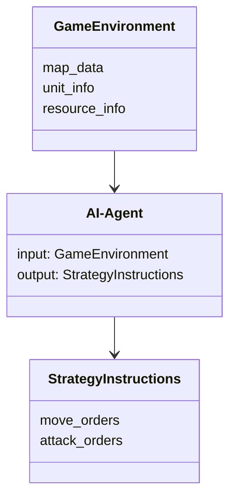

                 


# 《实时策略AI Agent：LLM在游戏AI中的应用》

> 关键词：实时策略AI，大语言模型，LLM，游戏AI，策略决策，机器学习，AI Agent

> 摘要：本文详细探讨了实时策略AI Agent在游戏AI中的应用，重点分析了如何利用大语言模型（LLM）提升游戏AI的策略决策能力。文章从实时策略AI Agent的背景、核心概念、LLM的原理与实现、游戏AI的实时策略需求分析、系统架构与实现方案、项目实战以及优化与调优等多个方面展开论述，结合数学模型、Mermaid图和Python代码示例，深入剖析了实时策略AI Agent的实现细节与实际应用。

---

## 第1章: 实时策略AI Agent的背景与概念

### 1.1 问题背景与描述

#### 1.1.1 游戏AI的发展历程
游戏AI作为人工智能领域的重要分支，经历了从简单规则驱动到复杂深度学习模型的演变。早期的游戏AI主要基于规则引擎和有限状态机，而近年来，随着深度学习技术的快速发展，游戏AI逐渐向基于学习的模型（如强化学习和大语言模型）转变。

#### 1.1.2 实时策略游戏的特点与需求
实时策略游戏（Real-Time Strategy，RTS）是一种以策略为核心，要求玩家在实时动态环境中做出快速决策的游戏类型。这类游戏对AI的要求极高，需要AI能够实时感知环境、分析局势并做出最优决策。然而，传统的基于规则的AI在处理复杂策略任务时往往显得力不从心。

#### 1.1.3 LLM在实时策略中的应用潜力
大语言模型（LLM）凭借其强大的自然语言处理能力和通用性，在实时策略游戏中展现出巨大潜力。LLM可以用于分析游戏环境、制定策略、预测对手行为，甚至可以生成复杂的策略指令。通过结合实时环境信息，LLM能够显著提升游戏AI的决策能力。

### 1.2 核心问题与解决思路

#### 1.2.1 实时策略AI的核心挑战
实时策略AI的核心挑战在于如何在动态变化的环境中快速做出高质量的决策。传统的基于规则的方法难以应对复杂多变的游戏场景，而基于深度学习的方法则面临计算资源不足和实时性要求高等问题。

#### 1.2.2 LLM在策略决策中的优势
LLM的优势在于其强大的上下文理解和生成能力。通过将游戏环境信息输入LLM，可以快速生成策略指令，帮助AI做出更接近人类水平的决策。此外，LLM还可以通过在线训练不断优化其策略能力。

#### 1.2.3 问题解决的边界与外延
实时策略AI Agent的应用边界主要在于计算资源限制和模型泛化能力。由于实时策略游戏的动态性极强，AI Agent需要在有限的计算资源下快速做出决策。同时，模型的泛化能力决定了其在不同游戏场景中的适用性。

### 1.3 核心概念与联系

#### 1.3.1 实时策略AI Agent的定义与属性
实时策略AI Agent是一种能够在实时动态环境中感知环境、分析局势并做出最优决策的智能体。其核心属性包括实时性、动态性和策略性。

| 核心概念 | 定义 | 属性 |
|----------|------|------|
| 实时策略AI Agent | 在动态环境中实时决策的智能体 | 实时性、动态性、策略性 |
| LLM      | 大语言模型 | 强大的自然语言处理能力、上下文理解能力 |

#### 1.3.2 LLM的原理与特征对比表
通过对比LLM与传统AI方法，可以看出LLM在策略决策中的独特优势。

| 特性         | LLM特征 | 传统AI特征 |
|--------------|----------|------------|
| 决策方式     | 基于上下文生成 | 基于规则或状态机 |
| 训练方式     | 数据驱动 | 规则驱动 |
| 灵活性       | 高 | 低 |
| 实时性       | 较低（依赖计算资源） | 较高 |

#### 1.3.3 ER实体关系图与Mermaid流程图

```mermaid
erDiagram
    actor Player
    actor Opponent
    actor AI-Agent
    gameEnvironment --{> "实时策略环境信息"}
    AI-Agent --{> "策略指令生成"}
    gameEnvironment --{> "状态更新"}
    Player --> AI-Agent: "指令输入"
    AI-Agent --> Opponent: "策略分析"
```

---

## 第2章: LLM的原理与数学模型

### 2.1 LLM的核心原理

#### 2.1.1 大语言模型的架构
大语言模型通常基于Transformer架构，包括编码器和解码器两部分。编码器负责将输入的文本信息转换为向量表示，解码器则根据编码器的输出生成目标文本。

#### 2.1.2 注意力机制与Transformer模型
注意力机制是Transformer模型的核心，通过计算输入序列中每个位置的重要性，模型可以更好地捕捉上下文信息。

#### 2.1.3 梯度下降与损失函数
模型的训练过程通过梯度下降优化，目标是最小化损失函数值。常用的损失函数包括交叉熵损失。

### 2.2 数学模型与公式

#### 2.2.1 Transformer模型的数学表达
$$\text{Encoder层：} \quad Q = W_q x, K = W_k x, V = W_v x$$
$$\text{Decoder层：} \quad Q = W_q x, K = W_k x, V = W_v x$$

#### 2.2.2 注意力机制的计算公式
$$\text{Attention}(Q, K, V) = \text{softmax}\left(\frac{QK^T}{\sqrt{d_k}}\right)V$$

### 2.3 代码实现与案例分析

#### 2.3.1 基于PyTorch的LLM实现

```python
import torch
import torch.nn as nn
import torch.optim as optim

class Transformer(nn.Module):
    def __init__(self, input_dim, hidden_dim):
        super(Transformer, self).__init__()
        self.encoder = nn.Sequential(
            nn.Linear(input_dim, hidden_dim),
            nn.ReLU(),
            nn.Linear(hidden_dim, hidden_dim),
            nn.ReLU()
        )
        self.decoder = nn.Sequential(
            nn.Linear(hidden_dim, hidden_dim),
            nn.ReLU(),
            nn.Linear(hidden_dim, input_dim),
            nn.ReLU()
        )

    def forward(self, x):
        encoded = self.encoder(x)
        decoded = self.decoder(encoded)
        return decoded

# 示例输入
input_dim = 10
hidden_dim = 20
model = Transformer(input_dim, hidden_dim)
input_data = torch.randn(1, input_dim)
output = model(input_data)
print(output)
```

#### 2.3.2 案例：简单的文本生成模型

```python
import torch
import torch.nn as nn
import torch.optim as optim

class TextGenerator(nn.Module):
    def __init__(self, vocab_size, embedding_dim, hidden_dim):
        super(TextGenerator, self).__init__()
        self.embedding = nn.Embedding(vocab_size, embedding_dim)
        self.lstm = nn.LSTM(embedding_dim, hidden_dim)
        self.fc = nn.Linear(hidden_dim, vocab_size)

    def forward(self, input, hidden):
        embedded = self.embedding(input)
        output, hidden = self.lstm(embedded, hidden)
        output = self.fc(output)
        return output, hidden

# 示例训练
vocab_size = 100
embedding_dim = 256
hidden_dim = 256
model = TextGenerator(vocab_size, embedding_dim, hidden_dim)
criterion = nn.CrossEntropyLoss()
optimizer = optim.Adam(model.parameters(), lr=0.001)
```

---

## 第3章: 游戏AI的实时策略需求分析

### 3.1 游戏AI的特点与挑战

#### 3.1.1 游戏AI的动态性和不确定性
实时策略游戏的动态性极强，环境信息不断变化，对手行为难以预测。

#### 3.1.2 实时策略的核心要素
实时策略的核心要素包括资源管理、单位控制、地形利用和对手分析。

### 3.2 LLM在实时策略中的应用场景

#### 3.2.1 信息处理与决策支持
LLM可以帮助AI快速分析游戏环境信息，生成策略指令。

#### 3.2.2 动作规划与路径优化
通过LLM生成的策略指令，AI可以做出更高效的单位动作规划。

### 3.3 需求分析与系统架构

#### 3.3.1 问题场景介绍
实时策略游戏中的AI需要实时处理来自多个传感器的信息，并做出快速决策。

#### 3.3.2 领域模型设计与Mermaid类图



---

## 第4章: 系统架构与实现方案

### 4.1 系统架构设计

#### 4.1.1 整体架构概述与Mermaid架构图


#### 4.1.2 模块划分与功能描述
系统主要包括环境感知模块、LLM处理模块和策略执行模块。

### 4.2 实现方案

#### 4.2.1 系统功能设计与Mermaid用例图

```mermaid
usecase
    actor GameAgent
    usecase ReadGameInfo
    usecase GenerateStrategy
    usecase ExecuteStrategy
    GameAgent --> ReadGameInfo
    ReadGameInfo --> GenerateStrategy
    GenerateStrategy --> ExecuteStrategy
```

#### 4.2.2 接口设计与交互流程
系统需要设计清晰的接口，确保各模块之间的通信顺畅。

### 4.3 代码实现与流程分析

#### 4.3.1 核心代码实现与解读
展示LLM与游戏AI的集成代码。

#### 4.3.2 代码流程分析与优化建议
分析代码运行流程，提出优化建议。

---

## 第5章: 项目实战

### 5.1 环境安装与配置

#### 5.1.1 开发环境搭建与工具安装
安装Python、PyTorch、 transformers等工具。

#### 5.1.2 数据集准备与预处理
准备游戏环境数据，进行清洗和标注。

### 5.2 代码实现与解读

#### 5.2.1 实时策略AI Agent的实现
展示AI Agent的核心代码。

#### 5.2.2 LLM的集成与调用
展示如何将LLM集成到AI Agent中。

### 5.3 案例分析与优化

#### 5.3.1 具体案例分析与效果展示
分析实际案例，展示优化效果。

#### 5.3.2 系统优化与性能提升
提出优化策略，提升系统性能。

---

## 第6章: 优化与调优

### 6.1 模型优化策略

#### 6.1.1 参数调整与超参数优化
通过网格搜索或随机搜索优化模型参数。

#### 6.1.2 模型压缩与轻量化设计
采用模型剪枝和知识蒸馏等技术，降低模型复杂度。

### 6.2 推理优化技巧

#### 6.2.1 并行计算与加速方法
利用多线程或分布式计算加速推理过程。

#### 6.2.2 内存优化与资源管理
优化内存使用，减少资源浪费。

### 6.3 性能监控与评估

#### 6.3.1 性能指标与评估标准
定义合适的性能评估指标。

#### 6.3.2 监控工具与日志分析
使用监控工具实时监控系统性能。

---

## 第7章: 总结与展望

### 7.1 全文总结

#### 7.1.1 主要内容回顾
总结全文内容，强调LLM在实时策略AI中的应用价值。

#### 7.1.2 研究成果与实际应用价值
分析研究成果，并探讨其在实际游戏开发中的应用前景。

### 7.2 未来展望

#### 7.2.1 技术发展趋势
预测实时策略AI Agent和LLM技术的发展方向。

#### 7.2.2 潜在挑战与解决思路
分析未来可能面临的挑战，并提出解决思路。

---

## 作者：AI天才研究院/AI Genius Institute & 禅与计算机程序设计艺术 /Zen And The Art of Computer Programming

