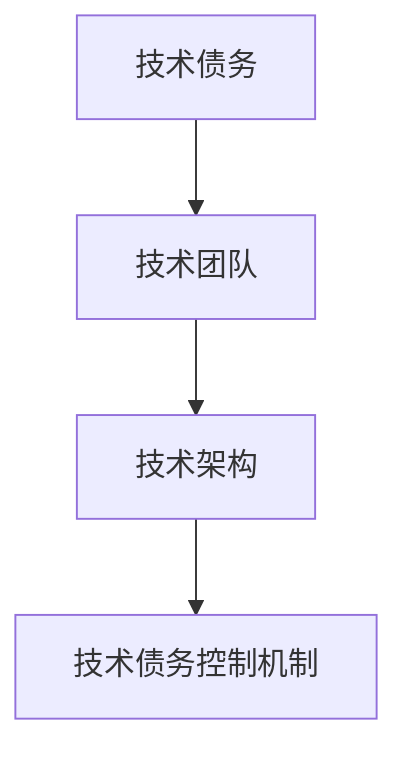

                 


# 彼得林奇对公司技术债务管理能力的评估

> 关键词：技术债务管理，彼得·林奇，投资评估，企业技术债务，技术债务管理能力

> 摘要：本文从彼得·林奇的投资理念出发，探讨技术债务管理能力的评估方法。通过定义技术债务，分析其影响，引入彼得·林奇的投资理念，建立技术债务管理能力的评估框架，并结合实际案例进行详细分析，最后总结最佳实践。

---

# 第一部分: 技术债务管理与投资评估的背景与概念

# 第1章: 技术债务的定义与影响

## 1.1 技术债务的定义与特征

### 1.1.1 技术债务的核心概念

技术债务（Technical Debt）是指在软件开发过程中，为了追求快速交付或简化实现而采用的临时解决方案所积累的潜在成本。这种成本会在未来以维护、重构或性能问题的形式体现。

- 技术债务的本质是“现在欠未来的时间”。
- 技术债务的积累通常源于以下几个方面：
  1. **快速交付压力**：为了满足短期业务需求，采用简化或权宜之计。
  2. **知识不足**：开发团队对技术的不熟悉导致的选择错误。
  3. **架构设计缺陷**：在设计阶段未能充分考虑扩展性、可维护性等因素。
  4. **资源限制**：团队资源有限，无法投入足够的时间进行优化。

### 1.1.2 技术债务的分类与特征

技术债务可以按其来源、影响和紧急程度进行分类：

#### 按来源分类
1. **代码层面**：由于代码质量问题导致的维护成本。
2. **架构层面**：由于架构设计不合理导致的扩展性问题。
3. **团队能力**：由于团队技术水平不足导致的解决方案不优。

#### 按影响分类
1. **低风险**：对当前业务影响较小，可以通过小范围重构解决。
2. **中风险**：对当前业务有一定影响，需要优先处理。
3. **高风险**：对业务运行造成严重威胁，必须立即解决。

### 1.1.3 技术债务对项目的影响

技术债务对项目的影响是多方面的，包括：
- **维护成本增加**：技术债务会导致维护成本上升，因为需要额外的工作量来修复问题。
- **开发效率下降**：技术债务会降低团队的开发效率，因为团队需要花费更多时间处理旧债。
- **项目进度延误**：技术债务可能导致项目进度延误，因为重构和修复需要时间。
- **团队士气低落**：长期积累的技术债务会导致团队士气低落，影响团队的整体表现。

## 1.2 技术债务管理的重要性

### 1.2.1 技术债务管理的目标

技术债务管理的目标是：
1. **最小化技术债务的积累**：通过合理的开发和设计，减少技术债务的产生。
2. **优化技术债务的偿还顺序**：根据债务的风险和影响程度，优先偿还高风险的技术债务。
3. **建立技术债务的预警机制**：通过监控和评估，及时发现潜在的技术债务问题。

### 1.2.2 技术债务管理的必要性

技术债务管理的必要性体现在以下几个方面：
- **保障业务连续性**：通过管理技术债务，确保业务系统的稳定运行。
- **提高开发效率**：通过减少技术债务，提高团队的开发效率。
- **降低维护成本**：通过优化技术债务的偿还策略，降低未来的维护成本。

### 1.2.3 技术债务管理的边界与外延

技术债务管理的边界包括：
1. **技术债务的识别**：如何准确识别技术债务。
2. **技术债务的评估**：如何评估技术债务的影响和风险。
3. **技术债务的偿还**：如何制定和执行技术债务的偿还计划。

技术债务管理的外延包括：
1. **技术团队的能力提升**：通过培训和学习，提高团队的技术能力，减少技术债务的产生。
2. **技术架构的优化**：通过优化架构设计，降低技术债务的风险。
3. **技术债务的监控与预警**：通过建立监控机制，及时发现和预警技术债务问题。

## 1.3 彼得·林奇投资理念的引入

### 1.3.1 彼得·林奇投资理念的核心思想

彼得·林奇是美国著名投资家，他提出了一系列投资理念，包括：
1. **长期投资**：关注企业的长期发展潜力。
2. **价值投资**：寻找被市场低估的企业。
3. **风险管理**：通过分散投资和严格的风险控制，降低投资风险。

### 1.3.2 技术债务管理与投资评估的联系

技术债务管理与投资评估的联系体现在以下几个方面：
- **风险控制**：技术债务管理类似于投资中的风险管理，通过控制技术债务的风险，保障业务的稳定运行。
- **价值评估**：技术债务管理需要对技术债务进行评估，类似于投资中的企业估值。
- **长期规划**：技术债务管理需要制定长期的偿还计划，类似于投资中的长期规划。

### 1.3.3 企业技术债务管理能力的评估框架

企业技术债务管理能力的评估框架包括以下几个方面：
1. **技术团队的能力**：团队的技术能力和经验直接影响技术债务的积累和偿还。
2. **技术架构的设计**：合理的架构设计可以减少技术债务的风险。
3. **技术债务的控制机制**：企业需要建立有效的技术债务控制机制，包括债务的识别、评估和偿还。

## 1.4 本章小结

本章主要介绍了技术债务的定义、分类和影响，以及彼得·林奇投资理念的核心思想，并探讨了技术债务管理与投资评估的联系。通过这些内容，我们可以理解技术债务管理的重要性，并为后续的技术债务管理能力的评估奠定基础。

---

# 第2章: 技术债务管理能力的核心要素与评估模型

## 2.1 技术债务管理能力的核心要素

### 2.1.1 技术债务的识别与量化

技术债务的识别与量化是技术债务管理的第一步。识别技术债务需要从代码、架构、团队等多个方面进行分析，量化则需要通过数学模型来计算技术债务的规模和风险。

### 2.1.2 技术债务的优先级评估

技术债务的优先级评估是技术债务管理的关键步骤。根据技术债务的风险和影响程度，制定偿还的优先级，确保高风险的技术债务优先偿还。

### 2.1.3 技术债务的偿还策略

技术债务的偿还策略需要根据企业的实际情况制定，包括短期和长期的偿还计划，以及具体的实施步骤。

### 2.2 技术债务管理能力的评估维度

技术债务管理能力的评估维度包括：
1. **技术团队的能力**：团队的技术能力和经验。
2. **技术架构的设计**：架构的合理性和可扩展性。
3. **技术债务的控制机制**：债务的识别、评估和偿还机制。

---

## 2.2 技术债务管理能力的评估维度

### 2.2.1 技术团队的能力评估

技术团队的能力评估包括以下几个方面：
1. **团队的技术能力**：团队成员的技术能力和经验。
2. **团队的协作能力**：团队成员之间的协作能力和沟通效率。
3. **团队的创新能力**：团队在技术创新和问题解决方面的表现。

### 2.2.2 技术架构的合理性评估

技术架构的合理性评估包括以下几个方面：
1. **架构的可扩展性**：架构是否能够支持业务的扩展。
2. **架构的可维护性**：架构是否容易维护和修改。
3. **架构的可移植性**：架构是否能够迁移到其他平台或技术栈。

### 2.2.3 技术债务的控制机制评估

技术债务的控制机制评估包括以下几个方面：
1. **债务的识别机制**：企业是否有有效的机制来识别技术债务。
2. **债务的评估机制**：企业是否有有效的机制来评估技术债务的风险和影响。
3. **债务的偿还机制**：企业是否有有效的机制来制定和执行技术债务的偿还计划。

---

## 2.3 核心概念对比分析

### 2.3.1 技术债务与财务债务的对比

技术债务与财务债务的对比：

| 属性                | 技术债务                     | 财务债务                     |
|---------------------|-----------------------------|-----------------------------|
| 定义                | 由于技术问题或设计缺陷导致的未来成本 | 由于借贷活动产生的未来还款义务 |
| 形成原因            | 快速开发、设计缺陷、团队能力不足 | 经营活动中借入资金           |
| 影响                | 影响企业技术创新和竞争力     | 影响企业的财务健康和信用评级 |
| 处理方式            | 技术重构、架构优化、团队培训 | 偿还债务、调整借贷结构       |

### 2.3.2 企业技术债务管理能力的属性特征对比

企业技术债务管理能力的属性特征对比：

| 属性                | 强特征                     | 弱特征                     |
|---------------------|---------------------------|---------------------------|
| 技术团队能力        | 高                        | 低                        |
| 技术架构合理性      | 高                        | 低                        |
| 技术债务控制机制    | 高                        | 低                        |

### 2.3.3 技术债务管理能力的ER实体关系图

技术债务管理能力的ER实体关系图（Mermaid流程图）：



---

## 2.4 技术债务管理能力的评估模型

### 2.4.1 评估框架的设计目标

技术债务管理能力的评估模型的设计目标是：
1. **量化技术债务的风险**：通过数学模型量化技术债务的风险和影响。
2. **评估技术债务管理能力**：通过评估模型评估企业的技术债务管理能力。
3. **制定优化策略**：根据评估结果制定优化策略，降低技术债务的风险。

### 2.4.2 评估框架的核心要素

评估框架的核心要素包括：
1. **技术团队的能力**：团队的技术能力和经验。
2. **技术架构的设计**：架构的合理性和可扩展性。
3. **技术债务的控制机制**：债务的识别、评估和偿还机制。

### 2.4.3 评估框架的实施步骤

评估框架的实施步骤包括：
1. **识别技术债务**：通过代码审查、架构分析等方式识别技术债务。
2. **评估技术债务**：根据技术债务的风险和影响进行评估，确定偿还的优先级。
3. **制定偿还计划**：根据评估结果制定技术债务的偿还计划，包括短期和长期计划。
4. **实施偿还计划**：执行技术债务的偿还计划，优化技术架构和团队能力。
5. **监控与预警**：建立监控机制，及时发现和预警新的技术债务问题。

---

## 2.5 技术债务管理能力的评估模型

### 2.5.1 技术债务评估的数学模型

技术债务评估的数学模型包括：
1. **权重分配**：根据评估维度的重要程度分配权重。
   $$权重分配公式：w_i = \frac{1}{n}$$
2. **综合评分**：根据各维度的评分和权重计算综合评分。
   $$综合评分公式：S = \sum_{i=1}^{n} w_i \cdot s_i$$
   其中，$s_i$为各评估维度的评分，$w_i$为各维度的权重。

---

## 2.6 技术债务管理能力的评估算法

### 2.6.1 层次分析法（AHP）的应用

层次分析法（AHP）是一种常用的决策分析方法，可以用于技术债务管理能力的评估。

1. **构建层次分析模型**：
   - 目标层：技术债务管理能力评估。
   - 准则层：技术团队能力、技术架构设计、技术债务控制机制。
   - 方案层：具体的技术债务管理能力评估结果。

2. **计算权重**：
   - 通过专家评分法计算各层次的权重。

3. **计算综合评分**：
   - 根据各层次的权重和评分，计算综合评分。

---

## 2.7 技术债务管理能力的评估系统设计

### 2.7.1 系统功能设计

技术债务管理能力的评估系统功能设计包括：
1. **债务识别模块**：通过代码审查、架构分析等方式识别技术债务。
2. **债务评估模块**：根据技术债务的风险和影响进行评估，确定偿还的优先级。
3. **偿还计划模块**：根据评估结果制定技术债务的偿还计划。
4. **监控与预警模块**：建立监控机制，及时发现和预警新的技术债务问题。

### 2.7.2 系统架构设计

技术债务管理能力的评估系统架构设计包括：
1. **数据层**：存储技术债务相关的数据，如代码、架构设计、团队信息等。
2. **业务逻辑层**：实现技术债务的识别、评估、计划制定等功能。
3. **用户界面层**：提供友好的用户界面，供用户进行操作和查询。

---

## 2.8 本章小结

本章主要介绍了技术债务管理能力的核心要素与评估模型，包括技术债务的识别与量化、优先级评估、偿还策略，以及技术债务管理能力的评估维度。通过层次分析法（AHP）的应用，我们建立了一个技术债务管理能力的评估模型，并提出了系统的功能和架构设计。

---

# 第3章: 技术债务管理能力的系统分析与架构设计

## 3.1 技术债务管理系统的功能设计

### 3.1.1 系统功能模块划分

技术债务管理系统的功能模块划分包括：
1. **债务识别模块**：识别技术债务。
2. **债务评估模块**：评估技术债务的风险和影响。
3. **偿还计划模块**：制定技术债务的偿还计划。
4. **监控与预警模块**：监控技术债务的变化，预警潜在风险。

### 3.1.2 系统功能流程图

技术债务管理系统的功能流程图（Mermaid）：


---

## 3.2 技术债务管理系统的架构设计

### 3.2.1 系统架构设计

技术债务管理系统的架构设计包括：
1. **数据层**：存储技术债务相关的数据。
2. **业务逻辑层**：实现技术债务的识别、评估、计划制定等功能。
3. **用户界面层**：提供友好的用户界面，供用户进行操作和查询。

### 3.2.2 系统架构图

技术债务管理系统的架构图（Mermaid）：


---

## 3.3 技术债务管理系统的接口设计

### 3.3.1 系统接口设计

技术债务管理系统的接口设计包括：
1. **用户输入接口**：用户输入技术债务相关信息。
2. **系统输出接口**：系统输出技术债务评估结果和偿还计划。

### 3.3.2 系统交互流程图

技术债务管理系统的交互流程图（Mermaid）：


---

## 3.4 本章小结

本章主要介绍了技术债务管理系统的功能设计、架构设计和接口设计。通过系统的功能模块划分和架构设计，我们能够更好地理解和管理技术债务，从而提升企业的技术债务管理能力。

---

# 第4章: 技术债务管理能力的项目实战

## 4.1 项目背景与目标

### 4.1.1 项目背景

假设我们有一个电子商务平台，由于快速迭代和团队能力不足，积累了一定的技术债务。我们需要评估技术债务管理能力，并制定偿还计划。

### 4.1.2 项目目标

1. **识别技术债务**：通过代码审查和架构分析，识别系统中的技术债务。
2. **评估技术债务**：根据技术债务的风险和影响，评估技术债务的优先级。
3. **制定偿还计划**：根据评估结果，制定技术债务的偿还计划。

---

## 4.2 项目实施步骤

### 4.2.1 环境安装

1. **安装开发工具**：安装IDE（如IntelliJ IDEA、Eclipse）和版本控制系统（如Git）。
2. **安装代码审查工具**：安装代码审查工具（如SonarQube、Checkmarx）。
3. **安装架构分析工具**：安装架构分析工具（如架构设计工具、代码依赖分析工具）。

### 4.2.2 核心实现代码

1. **代码审查**：
   ```python
   def identify_debt(code):
       # 代码审查逻辑
       pass
   ```
2. **架构分析**：
   ```python
   def analyze_architecture(code):
       # 架构分析逻辑
       pass
   ```
3. **债务评估**：
   ```python
   def assess_debt(debt):
       # 债务评估逻辑
       pass
   ```
4. **偿还计划制定**：
   ```python
   def create_repayment_plan(debt):
       # 偿还计划制定逻辑
       pass
   ```

---

## 4.3 项目实战分析

### 4.3.1 技术债务识别与评估

通过代码审查和架构分析，我们识别了系统中的技术债务，并评估了其风险和影响。

### 4.3.2 技术债务偿还计划

根据评估结果，我们制定了技术债务的偿还计划，包括短期和长期计划。

### 4.3.3 项目小结

通过项目的实施，我们成功识别和评估了技术债务，并制定了偿还计划，提升了企业的技术债务管理能力。

---

## 4.4 本章小结

本章通过一个实际项目，详细讲解了技术债务管理能力的项目实战。通过环境安装、核心代码实现和项目分析，我们能够更好地理解和应用技术债务管理能力的评估方法。

---

# 第5章: 技术债务管理能力的总结与展望

## 5.1 总结

技术债务管理能力的总结包括：
1. **技术债务的定义与影响**：技术债务是企业技术创新和竞争力的潜在障碍。
2. **技术债务管理能力的评估框架**：通过层次分析法（AHP）建立评估模型，量化技术债务的风险和影响。
3. **技术债务管理能力的系统设计**：通过系统的功能设计和架构设计，提升企业的技术债务管理能力。

## 5.2 最佳实践

### 5.2.1 关键点总结

1. **建立技术债务管理机制**：企业需要建立技术债务管理机制，包括债务的识别、评估和偿还。
2. **优化技术架构设计**：通过优化技术架构设计，降低技术债务的风险。
3. **提升技术团队能力**：通过培训和学习，提升技术团队的能力，减少技术债务的产生。

### 5.2.2 注意事项

1. **技术债务管理的持续性**：技术债务管理是一个持续的过程，需要长期关注和优化。
2. **技术债务管理的动态性**：技术债务管理需要根据企业的实际情况动态调整。

### 5.2.3 拓展阅读

1. **《技术债务: 创新者的窘境》**：探讨技术债务与企业创新之间的关系。
2. **《彼得·林奇投资经典》**：学习彼得·林奇的投资理念，借鉴其风险管理方法。

---

## 5.3 本章小结

本章总结了技术债务管理能力的评估方法和系统设计，并提出了最佳实践建议。通过持续的技术债务管理，企业可以降低技术债务的风险，提升技术竞争力，保障业务的稳定发展。

---

# 作者：AI天才研究院/AI Genius Institute & 禅与计算机程序设计艺术/Zen And The Art of Computer Programming

