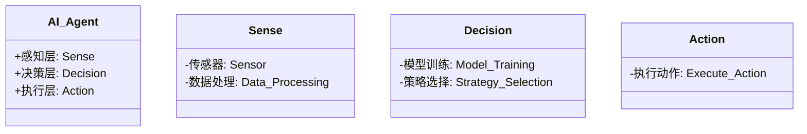
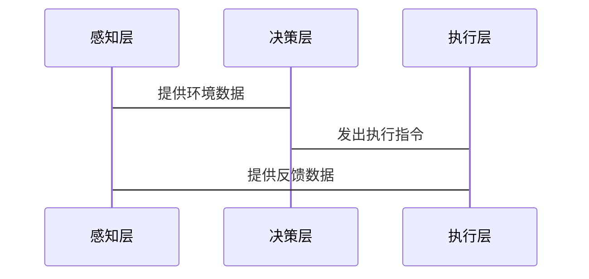

                 


# 《构建具有终身学习能力的AI Agent》

---

## 关键词：AI Agent，终身学习，机器学习，深度学习，强化学习，元学习，迁移学习

---

## 摘要：

本文深入探讨了构建具有终身学习能力的AI Agent的核心原理、算法实现和系统设计。从AI Agent的基本概念到终身学习的理论基础，再到具体的算法实现和系统架构设计，本文为读者提供了一个全面而系统的视角。通过实际项目案例和最佳实践，本文帮助读者理解如何设计和实现能够持续学习和适应的新一代AI Agent。

---

## 第一部分: AI Agent与终身学习基础

---

### 第1章: AI Agent的基本概念

#### 1.1 AI Agent的定义与特点

**1.1.1 AI Agent的定义**

AI Agent（智能代理）是一种能够感知环境、自主决策并采取行动以实现目标的智能系统。与传统的程序不同，AI Agent具备自主性和适应性，能够在动态环境中完成复杂任务。

**1.1.2 AI Agent的核心特点**

- **自主性**：AI Agent能够自主决策，无需外部干预。
- **反应性**：能够实时感知环境并做出反应。
- **学习能力**：通过学习不断优化自身的知识和技能。
- **社交能力**：能够与其他AI Agent或人类进行交互和协作。

**1.1.3 AI Agent与传统程序的区别**

| 特性         | AI Agent                          | 传统程序                          |
|--------------|-----------------------------------|-----------------------------------|
| 自主性       | 高                                | 低                                |
| 学习能力     | 强                                | 弱                                |
| 适应性       | 强                                | 低                                |
| 交互能力     | 强                                | 有限                              |

**本章小结**

本章介绍了AI Agent的基本概念及其与传统程序的区别，为后续内容奠定了基础。

---

### 第2章: 终身学习的理论基础

#### 2.1 机器学习与深度学习基础

**2.1.1 机器学习的基本原理**

机器学习是一种通过数据训练模型，使其能够从数据中学习并做出预测的技术。其核心是通过优化目标函数来调整模型参数。

**公式：**

$$ \text{损失函数} = \sum_{i=1}^{n} (y_i - \hat{y_i})^2 $$

其中，\( y_i \) 是真实值，\( \hat{y_i} \) 是预测值。

**2.1.2 深度学习的核心概念**

深度学习是机器学习的一种，通过多层神经网络来模拟人类大脑的学习机制。其核心是通过多层非线性变换提取数据特征。

**2.1.3 机器学习与深度学习的区别**

| 特性         | 机器学习                        | 深度学习                        |
|--------------|---------------------------------|---------------------------------|
| 特征工程     | 需要手动提取特征                | 自动提取特征                    |
| 模型复杂度   | 模型简单，易于解释              | 模型复杂，难于解释              |
| 数据需求     | 数据量较小                     | 数据量较大                     |

**2.2 强化学习与自适应学习**

**2.2.1 强化学习的基本原理**

强化学习是一种通过智能体与环境交互，通过试错机制学习策略的技术。智能体通过与环境交互获得奖励或惩罚，从而优化其行为策略。

**公式：**

$$ Q(s, a) = r + \gamma \max_{a'} Q(s', a') $$

其中，\( Q(s, a) \) 是状态 \( s \) 下动作 \( a \) 的价值函数，\( r \) 是奖励，\( \gamma \) 是折扣因子，\( Q(s', a') \) 是下一状态下的价值函数。

**2.2.2 自适应学习的核心机制**

自适应学习是一种能够根据环境变化动态调整学习策略的技术。其核心是通过在线学习不断优化模型参数。

**2.2.3 强化学习与自适应学习的结合**

| 特性         | 强化学习                        | 自适应学习                      |
|--------------|---------------------------------|---------------------------------|
| 环境交互     | 需要与环境交互                  | 需要与环境交互                  |
| 模型更新     | 基于奖励更新策略                | 基于反馈更新模型                |

**2.3 元学习与迁移学习**

**2.3.1 元学习的定义与特点**

元学习是一种通过学习如何学习的技术，其核心是通过元学习器（Meta-Learner）快速适应新任务。

**2.3.2 迁移学习的核心原理**

迁移学习是一种通过将已学习的知识应用到新任务的技术，其核心是通过共享特征或参数实现知识转移。

**2.3.3 元学习与迁移学习的对比**

| 特性         | 元学习                          | 迁移学习                        |
|--------------|---------------------------------|---------------------------------|
| 知识复用     | 基于元学习器复用知识            | 基于特征或参数复用知识          |
| 适应速度     | 快速适应新任务                  | 较慢适应新任务                  |

**本章小结**

本章详细讲解了机器学习、深度学习、强化学习、元学习和迁移学习的基本原理及其在终身学习中的应用。

---

### 第3章: 构建AI Agent的核心算法

#### 3.1 模型压缩与轻量化算法

**3.1.1 模型压缩的基本原理**

模型压缩是一种通过减少模型参数数量或降低模型复杂度的技术，以提高模型的运行效率。

**3.1.2 轻量化算法的设计思路**

轻量化算法通过简化模型结构或采用低精度计算等技术，降低模型的计算需求。

**3.1.3 模型压缩与轻量化算法的对比**

| 特性         | 模型压缩                        | 轻量化算法                      |
|--------------|---------------------------------|---------------------------------|
| 参数数量     | 显著减少                        | 显著减少                        |
| 计算复杂度   | 降低                            | 降低                            |
| 模型性能     | 可能降低                        | 可能降低                        |

**3.2 知识表示与推理算法**

**3.2.1 知识表示的基本方法**

知识表示是将知识以某种形式存储的技术，常见的方法包括符号表示和向量表示。

**3.2.2 推理算法的核心原理**

推理算法通过逻辑推理或概率推理，从已知知识中推导出新的知识。

**3.2.3 知识表示与推理算法的结合**

| 特性         | 知识表示                        | 推理算法                        |
|--------------|---------------------------------|---------------------------------|
| 知识存储     | 符号或向量形式                  | 基于知识表示                    |
| 推理方式     | 基于逻辑或概率                 | 基于逻辑或概率                 |

**3.3 自适应学习与在线学习算法**

**3.3.1 自适应学习的基本原理**

自适应学习是一种通过在线学习动态调整模型参数的技术。

**3.3.2 在线学习的核心机制**

在线学习是一种在数据流不断变化的情况下，实时更新模型的技术。

**3.3.3 自适应学习与在线学习的对比**

| 特性         | 自适应学习                      | 在线学习                        |
|--------------|---------------------------------|---------------------------------|
| 模型更新     | 动态调整模型参数                | 实时更新模型参数                |
| 数据需求     | 小规模数据                     | 大规模数据                     |

**本章小结**

本章详细讲解了模型压缩、知识表示和自适应学习的核心算法及其在构建AI Agent中的应用。

---

### 第4章: 终身学习的算法实现

#### 4.1 终身学习的算法流程

**4.1.1 算法流程的总体框架**

1. 初始化模型参数。
2. 采集环境数据。
3. 更新模型参数。
4. 输出决策结果。

**4.1.2 各阶段的具体实现**

- **数据采集**：通过传感器或API获取环境数据。
- **模型更新**：基于新数据更新模型参数。
- **决策输出**：根据更新后的模型参数做出决策。

**4.1.3 算法流程的优化建议**

- 使用分布式计算加速模型更新。
- 采用增量学习减少计算开销。

**4.2 终身学习的数学模型**

**4.2.1 数学模型的基本构成**

$$ \theta_{t+1} = \theta_t + \eta (y_t - \hat{y}_t) $$

其中，\( \theta \) 是模型参数，\( \eta \) 是学习率，\( y_t \) 是真实值，\( \hat{y}_t \) 是预测值。

**4.2.2 各变量的定义与作用**

| 变量         | 定义                           | 作用                           |
|--------------|--------------------------------|--------------------------------|
| \( \theta \)  | 模型参数                       | 用于生成预测值                 |
| \( \eta \)    | 学习率                         | 控制参数更新步长               |
| \( y_t \)     | 真实值                         | 用于计算损失                   |
| \( \hat{y}_t \) | 预测值                         | 用于计算预测误差               |

**4.2.3 数学模型的公式推导**

通过最小化损失函数 \( L \)，更新模型参数 \( \theta \)：

$$ \theta_{t+1} = \theta_t - \eta \frac{\partial L}{\partial \theta} $$

**4.3 算法实现的Python代码示例**

```python
import numpy as np

def update_parameters(theta, y_true, y_pred, learning_rate):
    gradient = 2 * np.mean((y_pred - y_true) * theta)
    theta_new = theta - learning_rate * gradient
    return theta_new

# 初始化参数
theta = np.random.randn(10, 1)
learning_rate = 0.01

# 数据准备
X = np.random.randn(100, 10)
y_true = np.random.randn(100, 1)

# 更新参数
theta_updated = update_parameters(theta, y_true, np.dot(X, theta), learning_rate)
```

**4.4 本章小结**

本章详细讲解了终身学习的算法流程及其数学模型，并通过Python代码示例展示了算法实现的具体步骤。

---

### 第5章: 系统架构与设计

#### 5.1 系统架构设计

**5.1.1 系统功能设计**

- **感知层**：负责数据采集和环境感知。
- **决策层**：负责模型训练和策略选择。
- **执行层**：负责根据决策层的指令执行动作。

**5.1.2 系统架构的mermaid类图**



**5.1.3 系统架构的mermaid架构图**


**5.2 系统接口设计**

- **输入接口**：接收环境数据和用户指令。
- **输出接口**：输出决策结果和执行指令。

**5.3 系统交互的mermaid序列图**



**5.4 本章小结**

本章详细讲解了AI Agent的系统架构设计及其各部分的交互关系。

---

### 第6章: 项目实战

#### 6.1 环境安装与配置

**6.1.1 安装依赖**

```bash
pip install numpy matplotlib scikit-learn
```

**6.1.2 配置环境**

```bash
export PATH=/path/to/python:$PATH
```

#### 6.2 核心算法实现

**6.2.1 数据准备**

```python
import numpy as np

X = np.random.randn(100, 10)
y_true = np.random.randn(100, 1)
```

**6.2.2 模型训练**

```python
def train_model(X, y_true, learning_rate=0.01, epochs=100):
    theta = np.random.randn(10, 1)
    for _ in range(epochs):
        y_pred = np.dot(X, theta)
        loss = np.mean((y_pred - y_true)**2)
        gradient = 2 * np.dot(X.T, y_pred - y_true)
        theta -= learning_rate * gradient
    return theta

theta_trained = train_model(X, y_true)
```

**6.2.3 模型评估**

```python
from sklearn.metrics import mean_squared_error

y_pred = np.dot(X, theta_trained)
mse = mean_squared_error(y_true, y_pred)
print(f"均方误差: {mse}")
```

#### 6.3 项目小结

通过本章的项目实战，读者可以掌握AI Agent的核心算法实现及其在实际应用中的具体操作。

---

## 第六章: 总结与展望

---

### 6.1 总结

本文详细讲解了构建具有终身学习能力的AI Agent的核心原理、算法实现和系统设计。通过理论与实践相结合的方式，为读者提供了一个全面而系统的视角。

---

### 6.2 最佳实践 tips

- **持续学习**：定期更新模型参数，保持AI Agent的适应性。
- **数据质量**：确保数据的多样性和代表性，提高模型的泛化能力。
- **系统优化**：采用分布式计算和轻量化算法，提高系统的运行效率。

---

### 6.3 未来展望

随着AI技术的不断发展，终身学习AI Agent将在更多领域得到应用。未来的研究方向包括更高效的模型压缩技术、更智能的知识表示方法以及更强大的自适应学习算法。

---

## 作者：AI天才研究院（AI Genius Institute） & 禅与计算机程序设计艺术（Zen And The Art of Computer Programming）

---

**附录：**

- 附录A：常用算法的详细代码实现
- 附录B：系统架构设计的详细说明
- 附录C：数学公式的详细推导

---

**参考文献：**

1. LeCun, Y., Bengio, Y., & Hinton, G. (2015). Deep learning.
2. Sutton, R. S., & Barto, A. G. (2018). Reinforcement learning: An introduction.
3. Pan, S. J., & Yang, Q. (2010). A survey on transfer learning.

--- 

通过本文，读者可以全面了解构建具有终身学习能力的AI Agent的各个方面，并能够将其应用到实际项目中。

