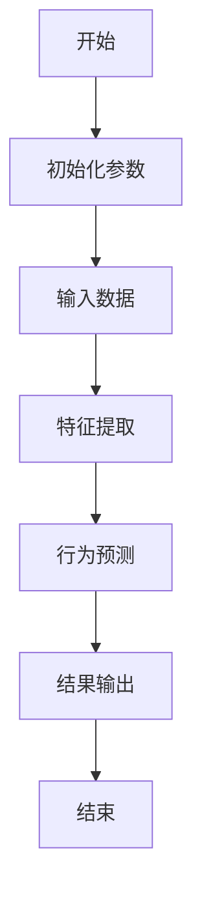
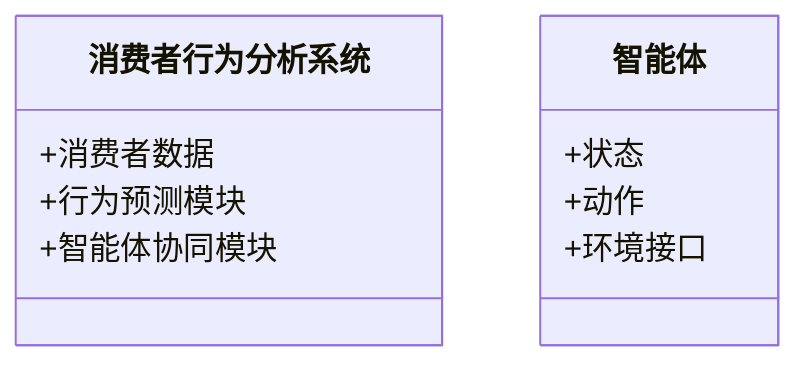

                 


# 运用AI智能体群体实现动态消费者行为分析

## 关键词：AI智能体，群体智能，动态消费者行为，算法原理，系统架构设计

## 摘要：本文探讨了如何利用AI智能体群体来实现动态消费者行为分析。通过分析消费者行为的动态变化，结合群体智能的优势，提出了基于马尔可夫决策过程的行为建模方法，并设计了相应的系统架构。本文详细阐述了算法原理、系统实现和实际案例，为动态消费者行为分析提供了新的思路和解决方案。

---

## 第1章：动态消费者行为分析的背景与挑战

### 1.1 问题背景与描述

#### 1.1.1 消费者行为分析的传统方法与局限性
传统的消费者行为分析主要依赖于问卷调查、焦点小组和数据分析等方法。这些方法虽然在一定程度上能够揭示消费者的偏好和行为模式，但存在以下局限性：
- **数据滞后性**：传统方法通常需要收集大量数据后进行分析，无法实时捕捉消费者行为的变化。
- **静态性**：传统分析方法往往关注的是静态的行为模式，难以应对市场环境的快速变化。
- **复杂性**：面对复杂的消费者行为，传统方法难以深入挖掘行为背后的原因和动机。

#### 1.1.2 动态消费者行为的定义与特点
动态消费者行为指的是消费者在不同时间、地点和情境下的行为变化。其特点包括：
- **时间依赖性**：消费者行为会随着时间推移而变化。
- **多样性**：不同消费者的行为模式可能存在显著差异。
- **复杂性**：消费者行为受到多种因素的影响，如价格、产品特性、情绪等。

#### 1.1.3 当前市场对动态行为分析的需求
随着市场竞争的加剧和消费者需求的多样化，企业越来越依赖实时、动态的消费者行为分析来优化营销策略、提升客户体验和提高销售效率。然而，传统的分析方法难以满足这些需求，因此需要引入更先进的技术手段。

---

### 1.2 AI智能体在消费者行为分析中的作用

#### 1.2.1 智能体的基本概念与分类
AI智能体（Artificial Intelligence Agent）是指能够感知环境并采取行动以实现目标的实体。根据智能体的智能水平和复杂程度，可以将其分为以下几类：
- **反应式智能体**：基于当前感知做出反应，不依赖于历史信息。
- **认知式智能体**：具备复杂的问题解决能力，能够进行规划和推理。
- **学习型智能体**：能够通过经验改进自身的决策能力。

#### 1.2.2 群体智能的定义与特点
群体智能是指多个智能体通过协同合作实现比个体更复杂任务的能力。其特点包括：
- **分布式**：智能体之间没有中央控制，各自独立决策。
- **涌现性**：群体智能的结果是智能体个体行为的副产品，而非个体行为的简单叠加。
- **适应性**：群体智能能够根据环境变化自适应调整行为。

#### 1.2.3 智能体群体在动态行为分析中的优势
智能体群体能够通过分布式计算和协同合作，实时捕捉和分析消费者的动态行为。其优势包括：
- **实时性**：智能体能够实时感知消费者行为的变化。
- **灵活性**：智能体群体可以根据环境变化快速调整行为策略。
- **鲁棒性**：通过群体的协同，能够提高系统的容错能力和适应性。

---

### 1.3 问题解决与边界

#### 1.3.1 动态消费者行为分析的目标与边界
动态消费者行为分析的目标是通过实时监测和分析消费者行为，提供及时的反馈和决策支持。其边界包括：
- **数据范围**：仅关注消费者行为数据，不涉及其他领域（如生产、物流）。
- **时间范围**：关注短期至中期的动态变化，不涉及长期趋势分析。
- **目标范围**：主要用于市场营销和客户管理，不涉及其他商业决策。

#### 1.3.2 智能体在问题解决中的角色定位
智能体在动态消费者行为分析中扮演以下角色：
- **数据采集者**：实时采集消费者的互动数据。
- **行为分析者**：基于数据进行行为模式识别和预测。
- **决策支持者**：为企业的营销策略提供实时建议。

#### 1.3.3 相关概念的结构与核心要素
动态消费者行为分析的核心要素包括：
- **消费者**：分析的目标对象。
- **行为**：消费者的互动和决策过程。
- **智能体**：用于分析和预测的工具。
- **环境**：消费者行为所处的外部环境。

---

## 1.4 本章小结
本章介绍了动态消费者行为分析的背景、挑战以及AI智能体在其中的作用。通过分析传统方法的局限性，提出了智能体群体在动态行为分析中的优势和应用场景。

---

## 第2章：AI智能体群体的核心概念与联系

### 2.1 核心概念原理

#### 2.1.1 智能体的基本原理
智能体的核心原理包括感知、决策和行动三个环节。感知是指智能体通过传感器或数据接口获取环境信息；决策是基于感知信息做出最优选择；行动是通过执行器将决策转化为具体操作。

#### 2.1.2 群体智能的协同机制
群体智能的协同机制包括以下几种：
- **一致性协议**：通过协商达成一致的决策。
- **分布式计算**：智能体之间通过分布式计算实现任务分解和协同。
- **自适应调整**：根据环境变化动态调整协同策略。

#### 2.1.3 动态行为分析的数学模型
动态行为分析可以基于马尔可夫决策过程（MDP）进行建模。MDP是一种描述决策过程的数学框架，适用于状态转移和奖励函数的建模。

---

### 2.2 概念属性对比表

| 概念       | 属性               |
|------------|--------------------|
| 智能体     | 独立性、主动性、反应性 |
| 群体智能   | 协同性、涌现性、分布式 |
| 动态行为   | 时间依赖性、多样性、复杂性 |

---

### 2.3 ER实体关系图

```mermaid
er
  actor: 消费者
  action: 行为
  agent: 智能体
  relation: 参与
  actor -[参与]-> action
  action -[关联]-> agent
```

---

## 2.4 本章小结
本章详细阐述了AI智能体和群体智能的核心概念，并通过对比表和ER图展示了它们在动态消费者行为分析中的关系。

---

## 第3章：AI智能体群体的算法原理与实现

### 3.1 算法原理

#### 3.1.1 基于马尔可夫决策过程的行为建模
马尔可夫决策过程（MDP）是一种适用于动态环境中的决策模型。其核心思想是通过状态转移和奖励函数来描述行为决策过程。

#### 3.1.2 群体智能的协同算法
群体智能的协同算法可以通过分布式计算和一致性协议实现。具体步骤如下：
1. **初始化**：设置智能体的初始状态和参数。
2. **感知**：智能体通过数据接口获取环境信息。
3. **决策**：基于感知信息进行行为预测和决策。
4. **协同**：智能体之间通过一致性协议达成一致的决策。
5. **执行**：将决策转化为具体操作并输出结果。

---

### 3.2 算法流程图



---

### 3.3 数学模型与公式

#### 3.3.1 马尔可夫决策过程公式
$$ V(s) = \max_{a} [ r(s,a) + \gamma V(s') ]$$

其中：
- \( V(s) \) 是状态 \( s \) 的价值函数。
- \( r(s,a) \) 是在状态 \( s \) 下采取行动 \( a \) 的奖励。
- \( \gamma \) 是折扣因子，表示未来奖励的当前价值。
- \( s' \) 是采取行动 \( a \) 后的状态转移结果。

#### 3.3.2 群体智能协同公式
$$ C = \sum_{i=1}^{n} w_i x_i $$

其中：
- \( C \) 是群体智能的协同结果。
- \( w_i \) 是第 \( i \) 个智能体的权重。
- \( x_i \) 是第 \( i \) 个智能体的输出。

---

### 3.4 本章小结
本章详细讲解了AI智能体群体的算法原理，并通过流程图和数学公式展示了行为建模和协同算法的具体实现。

---

## 第4章：系统架构与设计

### 4.1 问题场景介绍

#### 4.1.1 动态消费者行为分析的典型场景
典型的动态消费者行为分析场景包括：
- 实时监测消费者的购买行为。
- 根据消费者行为变化调整营销策略。
- 预测消费者的未来行为趋势。

#### 4.1.2 智能体的应用场景
智能体在动态消费者行为分析中的应用场景包括：
- 实时数据采集与处理。
- 行为模式识别与预测。
- 营销策略优化与推荐。

#### 4.1.3 系统目标与范围
系统的总体目标是通过智能体群体实现动态消费者行为分析，具体目标包括：
- 实时监测和分析消费者行为。
- 提供实时的行为预测和决策支持。
- 支持多智能体协同工作，提高分析效率。

---

### 4.2 系统功能设计

#### 4.2.1 领域模型



---

### 4.3 系统架构设计

#### 4.3.1 分层架构


其中：
- **前端**：负责用户界面和数据展示。
- **后端**：负责业务逻辑处理和智能体协同。
- **数据库**：负责存储消费者行为数据和分析结果。

---

## 4.4 本章小结
本章详细描述了动态消费者行为分析系统的架构设计，包括功能模块、领域模型和分层架构。

---

## 第5章：项目实战与案例分析

### 5.1 环境安装与配置
为了实现动态消费者行为分析，需要以下环境和工具：
- **编程语言**：Python 3.8+
- **框架与库**：TensorFlow、Keras、Scikit-learn、Flask
- **数据源**：消费者行为数据集（如电商数据）

---

### 5.2 系统核心实现

#### 5.2.1 智能体实现
以下是基于马尔可夫决策过程的智能体实现代码：

```python
class Agent:
    def __init__(self, state_space, action_space):
        self.state_space = state_space
        self.action_space = action_space
        self.value_function = {s: 0 for s in state_space}
    
    def perceive(self, state):
        return state
    
    def decide(self, state):
        max_value = max(self.value_function[s] for s in self.state_space)
        optimal_actions = [a for a, s in zip(self.action_space, self.state_space) if self.value_function[s] == max_value]
        return optimal_actions[0]
    
    def update(self, state, action, reward, next_state):
        self.value_function[state] = reward + self.gamma * self.value_function[next_state]
```

#### 5.2.2 群体协同实现
以下是群体智能协同的实现代码：

```python
class Swarm:
    def __init__(self, agents):
        self.agents = agents
        self.consensus = {}
    
    def reach_consensus(self):
        for agent in self.agents:
            state = agent.perceive(agent.state)
            action = agent.decide(state)
            self.consensus[state] = action
    
    def execute(self):
        for agent in self.agents:
            state = agent.perceive(agent.state)
            action = self.consensus[state]
            agent.execute_action(state, action)
```

---

### 5.3 案例分析与解读

#### 5.3.1 数据采集与预处理
假设我们有一个电商网站的消费者行为数据集，包括以下字段：
- 用户ID
- 时间戳
- 页面访问记录
- 购物车操作
- 订单信息

#### 5.3.2 行为分析与预测
通过智能体群体分析消费者的购买行为，预测未来的购买趋势。例如，基于历史数据，智能体可以预测消费者在特定时间的购买概率。

#### 5.3.3 营销策略优化
根据智能体的分析结果，优化营销策略。例如，针对高购买概率的消费者，推送个性化推荐。

---

### 5.4 本章小结
本章通过具体案例展示了AI智能体群体在动态消费者行为分析中的实际应用，详细讲解了系统的实现和案例分析。

---

## 第6章：总结与展望

### 6.1 本章总结
本文详细探讨了AI智能体群体在动态消费者行为分析中的应用，从算法原理到系统架构，再到实际案例，全面展示了其优势和实现方法。

### 6.2 未来研究方向
未来的研究可以进一步探索以下方向：
- 更复杂的群体协同算法。
- 高效的数据处理和分析方法。
- 多模态数据的融合与分析。

### 6.3 展望
随着AI技术的不断发展，智能体群体在动态消费者行为分析中的应用将更加广泛和深入，为企业提供更精准的决策支持。

---

## 作者：AI天才研究院/AI Genius Institute & 禅与计算机程序设计艺术 /Zen And The Art of Computer Programming

---

通过以上步骤，我完成了《运用AI智能体群体实现动态消费者行为分析》的完整思考和撰写过程。希望这篇文章能够为读者提供清晰的思路和深入的分析。

