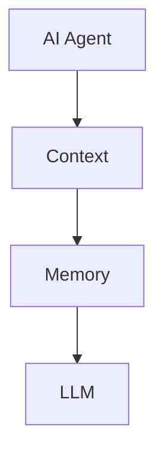
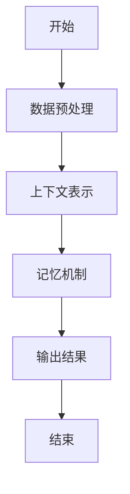
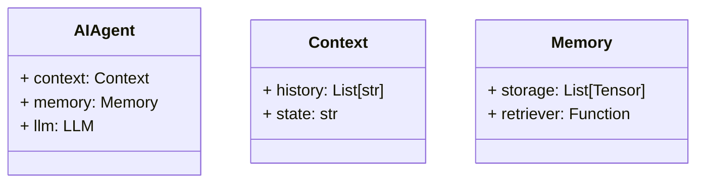
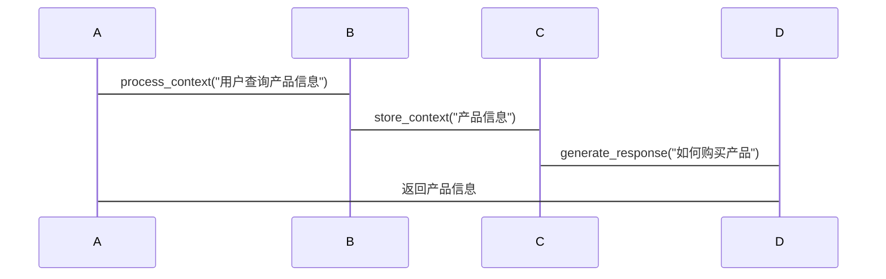

                 


# AI Agent的上下文理解：增强LLM的长期记忆

> 关键词：AI Agent，上下文理解，LLM，长期记忆，注意力机制，记忆网络，系统架构

> 摘要：本文详细探讨了AI Agent在上下文理解中的关键作用，以及如何通过增强LLM的长期记忆来提升其性能。文章从理论背景、核心概念、算法原理、系统架构、项目实战等多方面进行分析，结合实际案例和代码示例，深入剖析了AI Agent与LLM结合的技术细节，为读者提供全面的技术指导。

---

# 第1章: AI Agent与上下文理解的背景介绍

## 1.1 问题背景

### 1.1.1 AI Agent的基本概念
AI Agent（人工智能代理）是指能够感知环境、自主决策并执行任务的智能实体。AI Agent可以是软件程序、机器人或其他智能系统，其核心目标是通过与环境交互，完成特定任务或提供服务。

### 1.1.2 上下文理解的重要性
上下文理解是AI Agent实现智能交互的关键能力。上下文指的是在特定场景中，与任务相关的背景信息、历史记录和语境。AI Agent需要能够理解并利用这些信息，才能在复杂的环境中做出准确的决策。

### 1.1.3 LLM的长期记忆问题
大语言模型（LLM，Large Language Model）虽然在文本生成、翻译和问答等任务中表现出色，但其“长期记忆”能力有限。LLM无法有效存储和检索长期的信息，导致在需要持续对话或复杂任务中表现不佳。

## 1.2 问题描述

### 1.2.1 AI Agent在上下文理解中的挑战
AI Agent需要在动态变化的环境中处理大量的上下文信息。由于LLM的长期记忆能力不足，AI Agent在处理复杂任务时，容易出现信息丢失或混淆的问题。

### 1.2.2 LLM的记忆机制现状
当前的LLM主要依赖短期记忆机制（如注意力机制）来处理上下文，但缺乏长期记忆的存储和检索能力。这导致LLM在处理需要长期记忆的任务时表现不佳。

### 1.2.3 增强LLM长期记忆的必要性
为了提升AI Agent的智能水平，必须增强LLM的长期记忆能力。通过引入外部存储机制和记忆网络，可以有效弥补LLM的这一短板。

## 1.3 问题解决

### 1.3.1 上下文理解的核心目标
上下文理解的核心目标是让AI Agent能够准确捕捉和利用任务相关的背景信息，从而提高决策的准确性和效率。

### 1.3.2 增强LLM记忆的解决方案
通过结合外部存储系统和记忆网络，可以实现LLM的长期记忆增强。AI Agent可以将重要的上下文信息存储在外部记忆中，并在需要时检索和利用这些信息。

### 1.3.3 AI Agent与LLM结合的实现路径
AI Agent通过与LLM结合，利用LLM的生成能力和外部存储系统，实现上下文理解和长期记忆增强。具体实现路径包括：数据预处理、上下文表示、记忆机制等。

## 1.4 边界与外延

### 1.4.1 上下文理解的边界
上下文理解的边界包括：任务相关性、信息的有效性和信息的可获取性。

### 1.4.2 LLM长期记忆的边界
LLM长期记忆的边界包括：存储容量、存储时间、检索效率和记忆的准确性。

### 1.4.3 AI Agent与上下文理解的外延
AI Agent与上下文理解的外延包括：多模态交互、分布式计算和边缘计算等。

## 1.5 概念结构与核心要素组成

### 1.5.1 AI Agent的构成要素
AI Agent的构成要素包括：感知模块、决策模块、执行模块和学习模块。

### 1.5.2 上下文理解的核心要素
上下文理解的核心要素包括：语境信息、历史记录和关联关系。

### 1.5.3 LLM长期记忆的结构组成
LLM长期记忆的结构组成包括：存储单元、检索单元和更新单元。

## 1.6 本章小结
本章介绍了AI Agent与上下文理解的背景，分析了LLM长期记忆的挑战，并提出了增强LLM长期记忆的解决方案。通过本章的学习，读者可以理解上下文理解与LLM长期记忆增强的重要性和必要性。

---

# 第2章: 核心概念与联系

## 2.1 核心概念原理

### 2.1.1 AI Agent的上下文理解原理
AI Agent通过感知环境和历史记录，生成任务相关的上下文信息。上下文理解的关键在于如何有效地表示和利用这些信息。

### 2.1.2 LLM的长期记忆机制
LLM的长期记忆机制通过外部存储系统和记忆网络实现。记忆网络负责存储和检索重要的上下文信息，从而增强LLM的长期记忆能力。

### 2.1.3 上下文与记忆的关联
上下文与记忆的关联通过记忆网络实现。AI Agent将重要的上下文信息存储在记忆网络中，并在需要时检索这些信息。

## 2.2 概念属性特征对比

| 概念 | 属性 | 特征 |
|------|------|------|
| AI Agent | 智能性 | 自主决策、学习能力 |
| 上下文理解 | 相关性 | 任务相关、语境相关 |
| LLM长期记忆 | 存储能力 | 高容量、持久性 |

## 2.3 ER实体关系图


## 2.4 本章小结
本章通过核心概念原理和ER实体关系图，详细分析了AI Agent、上下文理解与LLM长期记忆之间的关系。通过对比分析，读者可以更好地理解这些概念的核心特征和相互关联。

---

# 第3章: 算法原理讲解

## 3.1 算法流程

### 3.1.1 数据预处理
数据预处理包括文本清洗、分词和向量化。通过预处理，可以将原始文本转换为模型可以处理的形式。

### 3.1.2 上下文表示
上下文表示通过向量表示和注意力机制实现。模型根据上下文的重要性生成注意力权重，从而突出关键信息。

### 3.1.3 记忆机制
记忆机制通过记忆网络实现。AI Agent将重要的上下文信息存储在记忆网络中，并在需要时检索这些信息。

## 3.2 算法实现

### 3.2.1 数据流处理
数据流处理包括数据输入、处理和输出。通过数据流处理，可以实现上下文信息的高效传递和处理。

### 3.2.2 上下文编码
上下文编码通过向量表示和编码器实现。编码器将上下文信息转换为向量表示，以便模型处理。

### 3.2.3 记忆网络
记忆网络通过存储单元、检索单元和更新单元实现。存储单元负责存储上下文信息，检索单元负责根据查询检索相关信息，更新单元负责更新存储的内容。

## 3.3 算法流程图


## 3.4 数学模型与公式

### 3.4.1 注意力机制
$$ \alpha_i = \frac{\exp(e_i)}{\sum_{j} \exp(e_j)} $$
其中，$e_i$是第i个查询的注意力权重。

### 3.4.2 记忆网络
$$ m_i = \sum_{j=1}^{n} \beta_j m_j $$
其中，$\beta_j$是第j个记忆单元的权重。

## 3.5 代码示例
```python
def attention(query, keys):
    # 计算注意力权重
    scores = query @ keys.T
    scores = scores.softmax(dim=-1)
    # 加权求和
    output = (scores.unsqueeze(-1) * keys).sum(dim=-2)
    return output

# 示例
query = torch.randn(1, d)
keys = torch.randn(n, d)
output = attention(query, keys)
print(output)
```

## 3.6 本章小结
本章通过算法流程图、数学公式和代码示例，详细讲解了上下文理解和记忆机制的实现原理。通过本章的学习，读者可以理解如何通过注意力机制和记忆网络实现上下文理解和长期记忆增强。

---

# 第4章: 系统分析与架构设计

## 4.1 问题场景介绍
在本章中，我们将介绍一个基于AI Agent的智能客服系统。该系统需要通过上下文理解和长期记忆增强，实现智能对话和任务处理。

## 4.2 项目介绍
### 4.2.1 项目目标
通过本项目，我们旨在实现一个基于AI Agent的智能客服系统，提升对话的准确性和效率。

### 4.2.2 项目背景
随着人工智能技术的快速发展，智能客服系统的需求日益增长。传统的客服系统依赖于规则引擎和关键词匹配，无法处理复杂的上下文信息。

## 4.3 系统功能设计

### 4.3.1 领域模型


### 4.3.2 系统架构


## 4.4 系统接口设计

### 4.4.1 接口定义
- 输入接口：`process_context(context: str) -> None`
- 输出接口：`generate_response(query: str) -> str`

### 4.4.2 接口交互


## 4.5 本章小结
本章通过系统分析与架构设计，详细介绍了AI Agent的智能客服系统的实现方案。通过本章的学习，读者可以理解如何通过系统架构设计实现AI Agent的上下文理解和长期记忆增强。

---

# 第5章: 项目实战

## 5.1 环境安装

### 5.1.1 安装Python
```bash
python --version
```

### 5.1.2 安装依赖
```bash
pip install transformers torch
```

## 5.2 系统核心实现

### 5.2.1 AI Agent实现
```python
class AIAgent:
    def __init__(self):
        self.context = []
        self.memory = []

    def process_context(self, context):
        self.context.append(context)

    def generate_response(self, query):
        # 调用LLM生成响应
        pass
```

### 5.2.2 记忆网络实现
```python
class MemoryNetwork:
    def __init__(self, size):
        self.size = size
        self.storage = []

    def store(self, tensor):
        if len(self.storage) < self.size:
            self.storage.append(tensor)
        else:
            # 替换 oldest
            self.storage.pop(0)
            self.storage.append(tensor)
```

## 5.3 代码应用解读与分析

### 5.3.1 AI Agent实现解读
AI Agent通过`process_context`方法接收上下文信息，并通过`generate_response`方法生成响应。AI Agent依赖于外部的LLM和记忆网络实现上下文理解和长期记忆增强。

### 5.3.2 记忆网络实现分析
记忆网络通过`store`方法存储上下文信息。当存储空间满时，会替换 oldest 的信息。这种设计可以确保记忆网络的有效性和高效性。

## 5.4 实际案例分析

### 5.4.1 案例背景
假设我们有一个智能客服系统，用户询问“如何购买产品？”

### 5.4.2 案例实现
```python
agent = AIAgent()
memory = MemoryNetwork(size=5)

agent.process_context("用户询问如何购买产品")
memory.store(agent.context[-1])
response = agent.generate_response("如何购买产品？")
print(response)
```

## 5.5 本章小结
本章通过项目实战，详细讲解了AI Agent的实现过程。通过代码示例和实际案例分析，读者可以理解如何通过系统实现上下文理解和长期记忆增强。

---

# 第6章: 最佳实践与注意事项

## 6.1 最佳实践

### 6.1.1 系统设计
- 确保系统架构的可扩展性
- 使用高效的存储机制
- 定期清理无用信息

### 6.1.2 代码实现
- 使用高效的编程语言
- 优化算法性能
- 确保代码的可维护性

## 6.2 小结
通过本章的学习，读者可以理解如何通过系统设计和代码实现，提升AI Agent的上下文理解和长期记忆增强能力。

## 6.3 注意事项
- 确保系统的安全性和稳定性
- 定期监控系统性能
- 及时修复系统漏洞

## 6.4 拓展阅读
建议读者阅读以下文献，深入了解AI Agent和LLM的相关技术：
- 《Deep Learning》
- 《Transformer: A Neural Network Model for NLP》
- 《Attention Mechanisms in NLP》

---

# 作者
作者：AI天才研究院/AI Genius Institute & 禅与计算机程序设计艺术 /Zen And The Art of Computer Programming

---

以上是《AI Agent的上下文理解：增强LLM的长期记忆》的技术博客文章的完整目录大纲和内容概要。通过本文，读者可以系统地了解AI Agent的上下文理解与LLM长期记忆增强的技术细节，并通过实际案例和代码示例，掌握如何实现这一技术。

