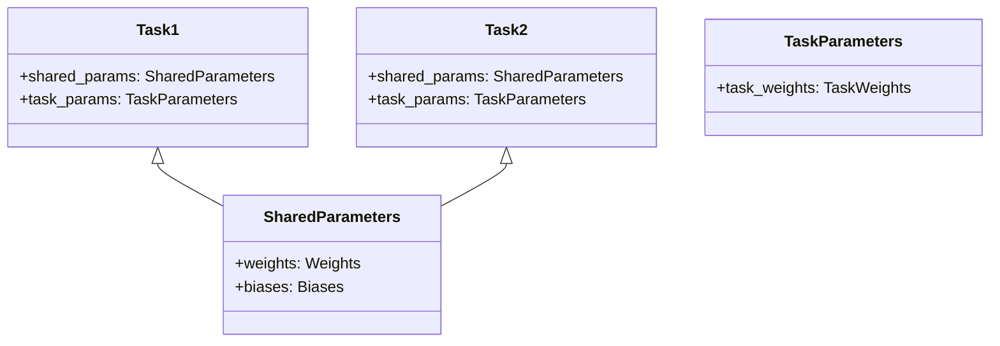
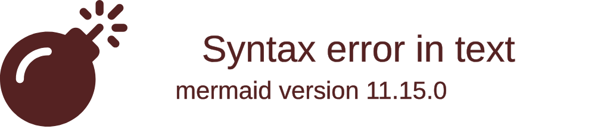
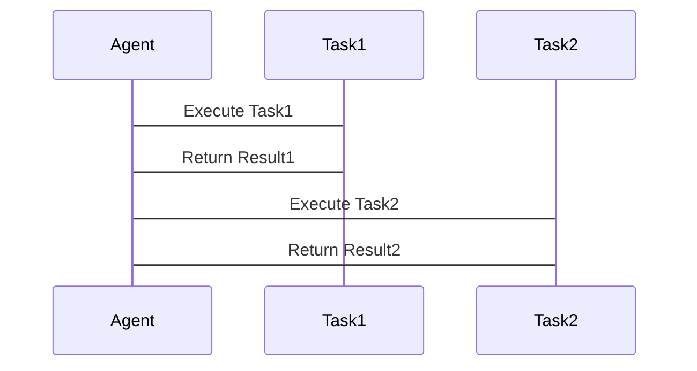

                 


# AI Agent的多任务学习能力：一专多能

## 关键词：AI Agent, 多任务学习, 一专多能, 任务共享, 模型优化, 算法原理, 系统架构

## 摘要：  
AI Agent的多任务学习能力是实现“一专多能”的关键。通过多任务学习，AI Agent能够在单个模型中同时掌握多种任务，从而提升效率和性能。本文从多任务学习的基本原理、算法实现、系统设计等方面展开，深入分析AI Agent如何通过多任务学习实现“一专多能”。通过实际案例和代码实现，帮助读者理解多任务学习在AI Agent中的应用，并探讨未来的发展方向。

---

# 第1章: AI Agent与多任务学习的背景

## 1.1 AI Agent的基本概念  
### 1.1.1 什么是AI Agent  
AI Agent（人工智能代理）是一种能够感知环境、自主决策并执行任务的智能实体。它可以是一个软件程序、机器人或其他智能系统，具备以下核心特征：  
- **自主性**：能够自主决策，无需外部干预。  
- **反应性**：能够实时感知环境并做出响应。  
- **目标导向**：以特定目标为导向，执行任务。  
- **学习能力**：通过数据和经验不断优化自身能力。  

### 1.1.2 AI Agent的核心特征  
AI Agent的核心特征包括：  
1. **感知能力**：通过传感器或数据输入感知环境。  
2. **决策能力**：基于感知信息做出决策。  
3. **执行能力**：通过执行机构或输出模块完成任务。  
4. **学习能力**：通过机器学习算法不断优化性能。  

### 1.1.3 AI Agent的分类与应用场景  
AI Agent可以根据功能和应用场景分为以下几类：  
- **简单反射型Agent**：基于规则的简单响应，适用于低复杂度任务。  
- **基于模型的反射型Agent**：基于内部模型进行决策，适用于复杂任务。  
- **目标驱动型Agent**：以特定目标为导向，主动规划和执行任务。  
- **实用驱动型Agent**：以效用最大化为目标，适用于多目标优化场景。  

应用场景包括：智能助手、自动驾驶、智能客服、机器人控制等。  

---

## 1.2 多任务学习的背景与意义  
### 1.2.1 多任务学习的定义  
多任务学习（Multi-Task Learning, MTL）是指在一个模型中同时学习多个相关任务，通过共享模型参数来提升模型的泛化能力和效率。  

### 1.2.2 多任务学习的必要性  
在传统单任务学习中，每个任务都需要独立训练一个模型，这会导致计算资源浪费和训练时间增加。而多任务学习通过共享模型参数，能够在单个模型中同时处理多个任务，显著提升效率。  

### 1.2.3 多任务学习在AI Agent中的作用  
在AI Agent中，多任务学习可以帮助其在执行单一任务时，同时掌握其他相关任务的能力。例如，一个智能助手可以同时处理自然语言理解、任务规划和用户交互等多种任务。  

---

## 1.3 "一专多能"的概念与目标  
### 1.3.1 "一专多能"的定义  
"一专多能"是指AI Agent在专注于一个核心任务的同时，具备执行多种相关任务的能力。这种能力通过多任务学习实现，使得AI Agent能够更加灵活和高效地应对复杂场景。  

### 1.3.2 "一专多能"在AI Agent中的实现目标  
- 提升AI Agent的通用性和适应性。  
- 减少模型训练的时间和计算资源消耗。  
- 提高AI Agent在复杂场景中的任务处理能力。  

### 1.3.3 "一专多能"与传统AI Agent的区别  
传统AI Agent通常专注于单一任务，而“一专多能”的AI Agent能够在执行核心任务的同时，处理多种相关任务，具备更强的综合能力。  

---

## 1.4 本章小结  
本章介绍了AI Agent的基本概念、核心特征、分类与应用场景，以及多任务学习的背景与意义。通过“一专多能”的概念，我们理解了多任务学习在AI Agent中的重要性，为后续章节的深入分析奠定了基础。

---

# 第2章: 多任务学习的核心概念与原理  

## 2.1 多任务学习的基本原理  
### 2.1.1 多任务学习的定义与特点  
多任务学习通过共享模型参数，同时优化多个任务的损失函数，实现多个任务的联合优化。其特点包括：  
- **共享性**：多个任务共享模型参数，减少参数量。  
- **联合优化**：通过同时优化多个任务的损失函数，提升模型的泛化能力。  

### 2.1.2 多任务学习的共享机制  
多任务学习的共享机制包括：  
1. **参数共享**：多个任务共享部分或全部模型参数。  
2. **损失函数共享**：多个任务共享相同的损失函数。  
3. **特征共享**：多个任务共享输入特征的表示。  

### 2.1.3 多任务学习的挑战与解决方案  
多任务学习的主要挑战包括任务之间的干扰和模型的过参数化。解决方案包括：  
- **任务权重调节**：通过调整任务权重，平衡不同任务的重要性。  
- **任务分组**：将相关任务分组，减少任务之间的干扰。  

---

## 2.2 多任务学习的核心要素  
### 2.2.1 任务之间的关系  
任务之间的关系可以分为以下几类：  
- **相关任务**：任务之间存在相关性，可以共享模型参数。  
- **无关任务**：任务之间无相关性，无法共享模型参数。  

### 2.2.2 任务的独立性与共享性  
任务的独立性与共享性是多任务学习的核心要素。  
- **独立性**：任务之间没有共享性，需要独立模型。  
- **共享性**：任务之间存在共享性，可以通过多任务学习优化。  

### 2.2.3 多任务学习的优化目标  
多任务学习的优化目标是通过共享模型参数，最小化所有任务的联合损失函数。  

---

## 2.3 多任务学习与AI Agent的结合  
### 2.3.1 多任务学习在AI Agent中的应用  
多任务学习可以应用于AI Agent的感知、决策和执行等多个环节。例如，一个智能助手可以同时处理自然语言理解、任务规划和用户交互任务。  

### 2.3.2 多任务学习如何提升AI Agent的能力  
通过多任务学习，AI Agent可以在执行核心任务的同时，提升其他相关任务的能力，实现“一专多能”。  

### 2.3.3 多任务学习的边界与外延  
多任务学习的边界在于任务之间的相关性和共享性。外延则包括任务分组、任务权重调节等优化方法。  

---

## 2.4 本章小结  
本章详细讲解了多任务学习的核心概念与原理，分析了任务之间的关系和共享机制，并探讨了多任务学习在AI Agent中的应用。通过理解这些内容，我们可以更好地设计和优化AI Agent的多任务学习能力。

---

# 第3章: 多任务学习的算法原理  

## 3.1 多任务学习的主流算法  
### 3.1.1 基于参数共享的多任务学习（MTL）  
MTL是一种经典的多任务学习算法，通过共享模型参数实现多个任务的联合优化。  

### 3.1.2 基于任务分组的多任务学习（Heterogeneous MTL）  
HMTL将任务分为不同的组别，每组任务共享不同的参数。  

### 3.1.3 基于动态权重的多任务学习（D-MTL）  
D-MTL通过动态调整任务权重，平衡不同任务的重要性。  

---

## 3.2 多任务学习的数学模型  
### 3.2.1 多任务学习的损失函数  
多任务学习的损失函数可以表示为：  
$$ L = \sum_{i=1}^{n} \lambda_i L_i $$  
其中，$\lambda_i$是任务$i$的权重，$L_i$是任务$i$的损失函数。  

### 3.2.2 参数共享机制的数学表达  
参数共享机制可以通过以下方式表示：  
$$ \theta = \{\theta_1, \theta_2, ..., \theta_n\} $$  
其中，$\theta_i$是任务$i$的共享参数。  

---

## 3.3 多任务学习的实现步骤  
### 3.3.1 确定任务目标  
根据AI Agent的需求，确定需要学习的任务。  

### 3.3.2 设计模型架构  
设计一个多任务学习模型，确定任务之间的共享和独立部分。  

### 3.3.3 定义损失函数  
根据任务目标，定义多任务学习的损失函数，并确定任务权重。  

### 3.3.4 模型训练  
使用多任务数据集进行模型训练，优化模型参数。  

---

## 3.4 本章小结  
本章详细讲解了多任务学习的主流算法和数学模型，并给出了实现步骤。通过理解这些内容，我们可以更好地设计和优化AI Agent的多任务学习能力。

---

# 第4章: 多任务学习的系统分析与架构设计  

## 4.1 系统功能设计  
### 4.1.1 领域模型设计  
领域模型可以通过Mermaid类图表示：  



### 4.1.2 系统架构设计  
系统架构可以通过Mermaid架构图表示：  



### 4.1.3 接口设计  
系统接口设计可以通过Mermaid序列图表示：  



---

## 4.2 本章小结  
本章通过系统功能设计和架构设计，详细分析了多任务学习在AI Agent中的实现方式，为后续章节的项目实战奠定了基础。

---

# 第5章: 多任务学习的项目实战  

## 5.1 项目背景与需求分析  
本项目旨在通过多任务学习，实现一个具备“一专多能”能力的AI Agent。  

## 5.2 环境搭建  
### 5.2.1 安装依赖  
安装Python和深度学习框架（如TensorFlow或PyTorch）。  

### 5.2.2 数据准备  
准备多任务数据集，包括多个任务的输入和标签。  

---

## 5.3 核心代码实现  
### 5.3.1 模型定义  
定义一个多任务学习模型，共享部分参数：  

```python
import tensorflow as tf

class MultiTaskModel(tf.keras.Model):
    def __init__(self):
        super(MultiTaskModel, self).__init__()
        self.shared_layer = tf.keras.layers.Dense(64, activation='relu')
        self.task1_layer = tf.keras.layers.Dense(10, activation='softmax')
        self.task2_layer = tf.keras.layers.Dense(5, activation='sigmoid')
    
    def call(self, inputs):
        x = self.shared_layer(inputs)
        output1 = self.task1_layer(x)
        output2 = self.task2_layer(x)
        return output1, output2
```

### 5.3.2 损失函数定义  
定义多任务学习的损失函数：  

```python
def multi_task_loss(y_true, y_pred, weights):
    loss1 = tf.keras.losses.sparse_categorical_crossentropy(y_true[0], y_pred[0])
    loss2 = tf.keras.losses.binary_crossentropy(y_true[1], y_pred[1])
    total_loss = weights[0] * loss1 + weights[1] * loss2
    return total_loss
```

### 5.3.3 模型训练  
使用多任务数据集进行模型训练：  

```python
model = MultiTaskModel()
model.compile(optimizer='adam', loss=[sparse_categorical_crossentropy, binary_crossentropy], loss_weights=[0.5, 0.5])
model.fit(x_train, [y_train1, y_train2], epochs=10, batch_size=32)
```

---

## 5.4 案例分析与结果解读  
通过训练后的模型，分析其在多个任务上的表现，并进行结果解读。  

## 5.5 项目小结  
本章通过项目实战，详细讲解了多任务学习的实现过程，帮助读者理解多任务学习在AI Agent中的应用。

---

# 第6章: 总结与展望  

## 6.1 本章总结  
本文详细讲解了AI Agent的多任务学习能力，分析了多任务学习的核心概念、算法原理和系统设计，并通过项目实战展示了其应用。  

## 6.2 未来展望  
未来，随着深度学习技术的不断发展，多任务学习将在AI Agent中发挥更重要的作用。研究方向包括更高效的参数共享机制、任务权重动态调整等。  

---

## 6.3 最佳实践 Tips  
- 在设计多任务学习模型时，需根据任务之间的相关性选择合适的共享机制。  
- 通过调整任务权重，平衡不同任务的重要性。  
- 在实际应用中，需根据具体场景选择合适的算法和模型架构。  

---

## 6.4 注意事项  
- 多任务学习可能导致模型过参数化，需注意模型的复杂度。  
- 任务之间的干扰可能影响模型性能，需合理设计任务分组。  

---

## 6.5 拓展阅读  
- "Multi-Task Learning: A Review and Future Directions"  
- "Deep Multi-Task Learning for Joint Recognition and Detection"  

---

# 作者：AI天才研究院/AI Genius Institute & 禅与计算机程序设计艺术 /Zen And The Art of Computer Programming

