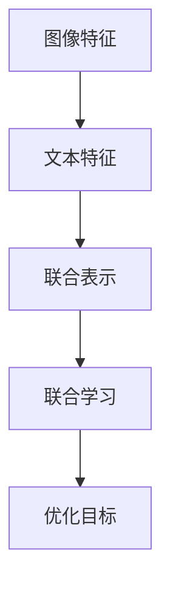
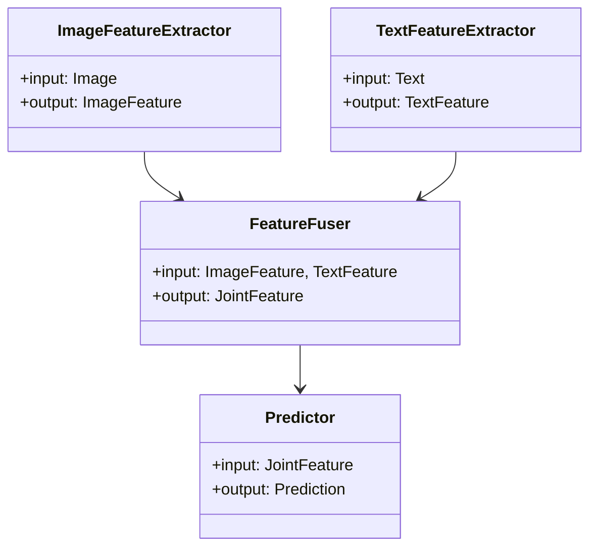
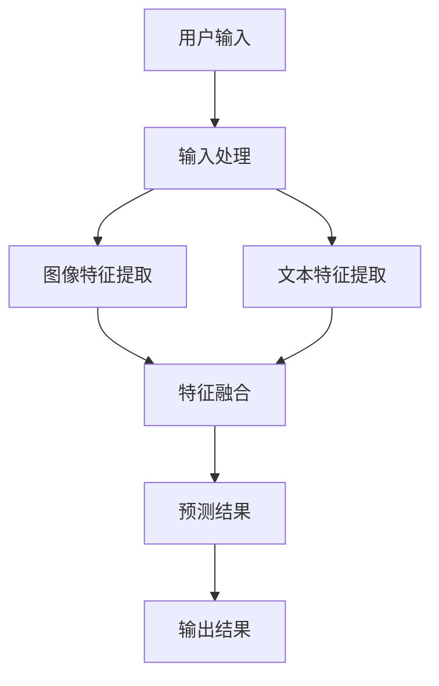
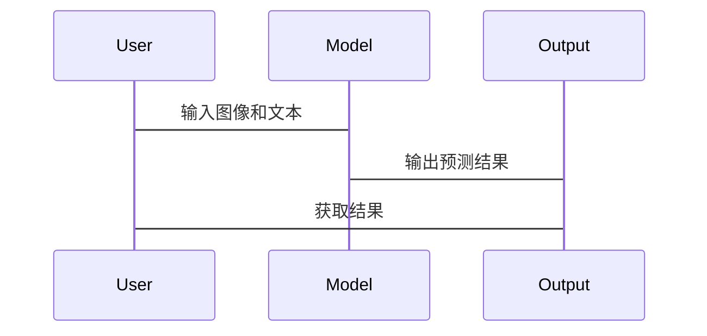

                 


# AI Agent的视觉-语言联合学习实现

> 关键词：AI Agent，视觉-语言联合学习，多模态学习，自注意力机制，深度学习，跨模态交互

> 摘要：本文系统地探讨了AI Agent的视觉-语言联合学习实现，从理论基础到算法实现，再到实际应用，全面分析了这一领域的核心问题。通过详细阐述多模态学习的原理、视觉与语言模态的特征提取与融合方法，以及基于自注意力机制的联合学习算法，本文为读者提供了一条从基础概念到实际应用的学习路径。文章还结合具体案例，展示了如何通过深度学习技术实现视觉-语言联合学习，并对当前技术的发展趋势和未来研究方向进行了展望。

---

# 第一部分: AI Agent的视觉-语言联合学习背景与基础

# 第1章: AI Agent与视觉-语言联合学习概述

## 1.1 AI Agent的基本概念

### 1.1.1 AI Agent的定义

AI Agent（人工智能代理）是指能够感知环境、自主决策并采取行动的智能实体。它可以是一个软件程序、机器人或其他智能系统，其核心目标是通过与环境的交互来实现特定任务。AI Agent具有以下几个核心特征：

1. **自主性**：能够在没有外部干预的情况下独立运作。
2. **反应性**：能够感知环境并实时做出响应。
3. **目标导向性**：通过设定目标来指导行为和决策。
4. **学习能力**：能够通过经验改进自身的性能。

### 1.1.2 AI Agent的核心特征

AI Agent的核心特征包括：

1. **感知能力**：通过传感器或数据输入接口感知环境信息。
2. **决策能力**：基于感知信息做出最优或近似最优的决策。
3. **执行能力**：通过执行机构或输出接口将决策转化为具体行动。
4. **学习能力**：通过机器学习算法不断优化自身的感知、决策和执行能力。

### 1.1.3 AI Agent的应用场景

AI Agent广泛应用于多个领域，包括：

1. **智能助手**：如Siri、Alexa等，能够通过语音交互帮助用户完成日常任务。
2. **自动驾驶**：如特斯拉的Autopilot系统，能够感知环境并自主驾驶。
3. **智能客服**：通过自然语言处理技术为用户提供个性化的服务支持。
4. **机器人控制**：在工业自动化和家庭服务机器人中，AI Agent负责协调和控制机器人的动作。

## 1.2 视觉-语言联合学习的背景

### 1.2.1 多模态学习的定义

多模态学习是指同时利用多种类型的数据（如文本、图像、语音等）进行学习的过程。与单模态学习相比，多模态学习能够更好地捕捉数据的丰富信息，提高模型的泛化能力和实用性。

### 1.2.2 视觉与语言联合学习的意义

视觉-语言联合学习旨在通过结合视觉和语言信息，实现更强大的AI Agent能力。具体来说，这种联合学习能够：

1. **提升语义理解**：通过结合图像和文本信息，模型能够更准确地理解语言的上下文含义。
2. **增强视觉识别**：通过语言信息的辅助，模型能够更好地理解和定位图像中的目标。
3. **实现跨模态交互**：用户可以通过自然语言与AI Agent进行交互，同时AI Agent能够通过视觉信息提供更精准的服务。

### 1.2.3 当前技术发展现状

近年来，随着深度学习技术的快速发展，视觉-语言联合学习取得了显著进展。主流的研究方向包括：

1. **图像描述生成**：通过视觉信息生成对应的文本描述。
2. **视觉问答（VQA）**：基于图像回答用户的问题。
3. **图像文本匹配**：通过对比图像和文本的信息，判断两者是否相关。

## 1.3 问题背景与目标

### 1.3.1 问题背景分析

在实际应用中，AI Agent需要处理多种类型的数据，包括图像、文本、语音等。然而，由于不同模态的数据具有不同的特征和表示方式，如何有效地将它们结合起来进行联合学习是一个具有挑战性的任务。

### 1.3.2 问题描述与解决思路

视觉-语言联合学习的核心问题在于如何实现跨模态信息的有效融合。具体来说，我们需要解决以下问题：

1. **模态特征提取**：如何从图像和文本中提取具有区分度的特征。
2. **模态间关联**：如何建立图像和文本之间的语义关联。
3. **联合学习机制**：如何设计有效的算法实现图像和文本的联合优化。

### 1.3.3 视觉-语言联合学习的目标

视觉-语言联合学习的目标是通过深度学习技术，实现图像和文本信息的联合表示，从而提高AI Agent的感知、理解和交互能力。具体目标包括：

1. **提升语义理解能力**：通过结合图像和文本信息，提高模型对语言的理解能力。
2. **增强视觉识别能力**：通过语言信息的辅助，提高图像识别的准确率。
3. **实现跨模态交互**：通过自然语言与图像信息的结合，实现更流畅的用户交互。

## 1.4 核心概念与边界

### 1.4.1 核心概念的构成

视觉-语言联合学习的核心概念包括：

1. **多模态数据**：包括图像、文本等多种类型的数据。
2. **模态特征提取**：从图像和文本中提取特征表示。
3. **模态融合**：将不同模态的特征进行融合，形成联合表示。
4. **联合学习算法**：基于联合表示设计的学习算法。

### 1.4.2 相关概念的对比

以下是对视觉-语言联合学习与相关概念的对比分析：

| 概念 | 描述 |
|------|------|
| 单模态学习 | 仅利用一种类型的数据进行学习。 |
| 多模态学习 | 利用多种类型的数据进行学习。 |
| 跨模态交互 | 不同模态之间的信息交互与协同。 |

### 1.4.3 问题的边界与外延

视觉-语言联合学习的边界主要体现在以下几个方面：

1. **数据类型限制**：主要针对图像和文本两种模态，其他模态（如语音、视频）不在当前讨论范围内。
2. **应用场景限制**：主要应用于AI Agent的视觉和语言交互任务，不涉及其他类型的任务。
3. **模型结构限制**：当前主要关注基于深度学习的联合学习方法，不涉及传统的机器学习方法。

## 1.5 本章小结

本章从AI Agent的基本概念出发，详细介绍了视觉-语言联合学习的背景、意义和技术现状。通过分析多模态学习的核心问题和目标，为后续的算法实现奠定了理论基础。接下来的章节将深入探讨视觉-语言联合学习的核心概念、算法原理和实际应用。

---

# 第二部分: 视觉-语言联合学习的核心概念与联系

# 第2章: 多模态学习的原理与方法

## 2.1 多模态学习的原理

### 2.1.1 多模态数据的特征提取

多模态数据的特征提取是多模态学习的核心步骤之一。对于图像和文本数据，常用的特征提取方法包括：

1. **图像特征提取**：通过卷积神经网络（CNN）提取图像的空间特征和语义特征。
2. **文本特征提取**：通过词嵌入（如Word2Vec）或 transformer 模型提取文本的语义特征。

### 2.1.2 跨模态信息融合机制

跨模态信息融合的核心目标是将不同模态的特征表示进行有效融合。常用的融合方法包括：

1. **早期融合**：在特征提取的早期阶段对不同模态的特征进行融合。
2. **晚期融合**：在特征提取的后期阶段对不同模态的特征进行融合。
3. **自适应融合**：根据任务需求动态调整融合策略。

### 2.1.3 多模态学习的挑战

多模态学习面临的主要挑战包括：

1. **模态间特征差异**：不同模态的特征具有不同的分布和尺度。
2. **模态间关联性**：如何建立不同模态之间的语义关联。
3. **计算复杂度**：多模态数据的处理通常需要较高的计算资源。

## 2.2 视觉与语言的联合学习

### 2.2.1 视觉模态的处理方法

视觉模态的处理方法主要包括图像特征提取和图像语义理解。常用的图像特征提取方法包括：

1. **CNN网络**：如VGG、ResNet等，用于提取图像的空间特征。
2. **区域建议网络（RPN）**：用于定位和提取图像中的目标区域。

### 2.2.2 语言模态的处理方法

语言模态的处理方法主要包括文本特征提取和文本语义理解。常用的文本特征提取方法包括：

1. **词嵌入**：如Word2Vec、GloVe等，用于将单词映射为低维向量。
2. **transformer模型**：如BERT、GPT等，用于提取文本的上下文语义特征。

### 2.2.3 联合学习的实现方式

联合学习的实现方式包括：

1. **联合特征表示**：将图像和文本的特征表示进行融合，形成联合特征向量。
2. **联合损失函数**：设计联合损失函数，用于同时优化图像和文本的表示。
3. **跨模态注意力机制**：通过注意力机制实现不同模态之间的信息交互。

## 2.3 核心概念的对比分析

### 2.3.1 视觉与语言的特征对比

以下是对视觉和语言特征的对比分析：

| 特征维度 | 视觉特征 | 语言特征 |
|----------|----------|----------|
| 表示方式 | 图像像素值 | 文本序列 |
| 语义信息 | 图像中的物体、场景等 | 文本中的语义、情感等 |
| 规模 | 高维（如2048维） | 高维（如词向量维度） |

### 2.3.2 联合学习与其他多模态方法的对比

以下是对联合学习与其他多模态方法的对比分析：

| 方法 | 描述 |
|------|------|
| 单模态学习 | 仅利用一种模态的数据进行学习。 |
| 多模态融合 | 利用多种模态的数据进行融合学习。 |
| 联合学习 | 在多模态融合的基础上，通过联合优化实现跨模态信息的协同学习。 |

### 2.3.3 实体关系图的构建与分析

（此处插入 Mermaid 实体关系图）



---

# 第三部分: 视觉-语言联合学习的算法原理

# 第3章: 模型结构与算法实现

## 3.1 编码器-解码器结构

### 3.1.1 编码器的设计原理

编码器的设计目标是将图像和文本的特征表示转化为统一的语义空间。常用的编码器结构包括：

1. **视觉编码器**：如ResNet、ViT等，用于提取图像的特征表示。
2. **语言编码器**：如BERT、transformer等，用于提取文本的特征表示。

### 3.1.2 解码器的设计原理

解码器的设计目标是将编码器输出的联合表示转化为具体的输出形式，如文本描述或图像重建。常用的解码器结构包括：

1. **全连接层**：用于将编码器输出的特征向量映射到目标输出空间。
2. **自注意力机制**：用于捕捉序列中的长程依赖关系。

### 3.1.3 编码器与解码器的协同工作

编码器和解码器的协同工作流程如下：

1. **编码器提取特征**：分别从图像和文本中提取特征表示。
2. **特征融合**：将图像和文本的特征表示进行融合，形成联合特征向量。
3. **解码器生成输出**：基于联合特征向量生成最终的输出结果。

## 3.2 自注意力机制

### 3.2.1 自注意力机制的原理

自注意力机制是一种通过计算序列中每个位置与其他位置的注意力权重，来捕捉序列中长程依赖关系的方法。其计算公式如下：

$$
\text{Attention}(Q, K, V) = \text{softmax}\left(\frac{QK^T}{\sqrt{d_k}}\right)V
$$

其中，\( Q \) 是查询向量，\( K \) 是键向量，\( V \) 是值向量，\( d_k \) 是向量的维度。

### 3.2.2 多模态自注意力的实现

多模态自注意力机制通过同时考虑不同模态的特征表示，实现跨模态信息的协同学习。其计算公式如下：

$$
\text{Multi-Modal Attention}(X, Y) = \text{softmax}\left(\frac{XY^T}{\sqrt{d_k}}\right)Y
$$

其中，\( X \) 和 \( Y \) 分别表示不同模态的特征向量。

### 3.2.3 自注意力机制的优化方法

自注意力机制的优化方法包括：

1. **位置编码**：通过引入位置编码，增强模型对序列位置信息的捕捉能力。
2. **层规范化**：在自注意力计算前后进行层规范化，防止梯度消失或爆炸。
3. **残差连接**：通过残差连接增强模型的表达能力，同时缓解训练过程中的梯度消失问题。

## 3.3 损失函数与优化

### 3.3.1 分类损失函数

分类损失函数用于衡量模型输出与真实标签之间的差异。常用的分类损失函数包括：

1. **交叉熵损失函数**：用于分类任务，公式如下：

$$
\mathcal{L}_{\text{CE}} = -\sum_{i=1}^{N} \sum_{j=1}^{C} y_{ij} \log p_{ij}
$$

其中，\( y_{ij} \) 是真实标签，\( p_{ij} \) 是模型输出的概率。

2. **焦点损失函数**：用于缓解类别不平衡问题，公式如下：

$$
\mathcal{L}_{\text{FL}} = -\sum_{i=1}^{N} \alpha_{i} (1 - p_{i})^{\gamma} \log p_{i}
$$

其中，\( \alpha_{i} \) 是类别权重，\( \gamma \) 是焦点系数。

### 3.3.2 回归损失函数

回归损失函数用于衡量模型输出与真实值之间的差异。常用的回归损失函数包括：

1. **均方误差（MSE）**：用于回归任务，公式如下：

$$
\mathcal{L}_{\text{MSE}} = \frac{1}{N}\sum_{i=1}^{N}(y_i - \hat{y}_i)^2
$$

其中，\( y_i \) 是真实值，\( \hat{y}_i \) 是模型输出的估计值。

2. **均方根误差（RMSE）**：MSE的平方根，公式如下：

$$
\mathcal{L}_{\text{RMSE}} = \sqrt{\frac{1}{N}\sum_{i=1}^{N}(y_i - \hat{y}_i)^2}
$$

### 3.3.3 多模态损失函数

多模态损失函数用于同时优化不同模态的特征表示。常用的多模态损失函数包括：

1. **对比损失函数**：用于衡量不同模态特征之间的相似性，公式如下：

$$
\mathcal{L}_{\text{Contrastive}} = -\log \frac{\exp(s)}{1 + \exp(s)}
$$

其中，\( s \) 是不同模态特征的相似性得分。

2. **联合损失函数**：用于同时优化多个任务的损失，公式如下：

$$
\mathcal{L}_{\text{Joint}} = \lambda_1 \mathcal{L}_1 + \lambda_2 \mathcal{L}_2
$$

其中，\( \lambda_1 \) 和 \( \lambda_2 \) 是权重系数。

---

## 3.4 算法实现与优化

### 3.4.1 算法实现步骤

1. **特征提取**：分别从图像和文本中提取特征表示。
2. **特征融合**：将图像和文本的特征表示进行融合，形成联合特征向量。
3. **自注意力计算**：通过自注意力机制实现跨模态信息的协同学习。
4. **损失计算**：根据具体的任务需求，选择合适的损失函数进行计算。
5. **优化**：通过梯度下降等优化算法，更新模型参数。

### 3.4.2 算法优化策略

1. **学习率调整**：通过学习率衰减策略，逐步降低学习率，防止模型过拟合。
2. **批量归一化**：在每层网络中引入批量归一化层，加速训练过程，提高模型的泛化能力。
3. **早停法**：在验证集上监控模型的性能，防止过拟合。

---

# 第四部分: 视觉-语言联合学习的系统分析与架构设计

## 4.1 系统功能设计

### 4.1.1 领域模型设计

以下是一个简单的领域模型设计：



### 4.1.2 系统架构设计



### 4.1.3 系统接口设计

1. **输入接口**：接收用户的输入，包括图像和文本。
2. **输出接口**：输出模型的预测结果，包括文本描述、图像重建等。
3. **训练接口**：接收训练数据，训练模型参数。
4. **推理接口**：接收推理请求，返回推理结果。

### 4.1.4 交互流程设计

以下是一个简单的交互流程图：



---

# 第五部分: 视觉-语言联合学习的项目实战

## 5.1 项目环境安装

### 5.1.1 安装Python环境

```bash
python --version
pip install --upgrade pip
```

### 5.1.2 安装深度学习框架

```bash
pip install tensorflow==2.5.0
pip install keras==2.5.0
pip install numpy==1.21.0
pip install matplotlib==3.5.1
pip install transformers==4.15.0
```

### 5.1.3 安装其他依赖

```bash
pip install scikit-learn
pip install pillow
pip install opencv-python
```

## 5.2 核心代码实现

### 5.2.1 图像特征提取代码

```python
import tensorflow as tf
from tensorflow.keras.applications import ResNet50
from tensorflow.keras.applications.resnet50 import preprocess_input, decode_predictions

def extract_image_features(image_path):
    model = ResNet50(weights='imagenet', include_top=False)
    image = tf.keras.preprocessing.image.load_img(image_path, target_size=(224, 224))
    image_array = tf.keras.preprocessing.image.img_to_array(image)
    image_array = np.expand_dims(image_array, axis=0)
    image_array = preprocess_input(image_array)
    features = model.predict(image_array)
    return features
```

### 5.2.2 文本特征提取代码

```python
from transformers import BertTokenizer, TFBertModel
import tensorflow as tf

def extract_text_features(text):
    tokenizer = BertTokenizer.from_pretrained('bert-base-uncased')
    model = TFBertModel.from_pretrained('bert-base-uncased')
    inputs = tokenizer(text, return_tensors='tf')
    outputs = model(inputs.input_ids, inputs.attention_mask)
    features = outputs.last_hidden_state[:, 0, :]
    return features
```

### 5.2.3 特征融合代码

```python
import tensorflow as tf
import numpy as np

def fuse_features(image_features, text_features):
    image_features = tf.keras.layers.Dense(256, activation='relu')(image_features)
    text_features = tf.keras.layers.Dense(256, activation='relu')(text_features)
    fused_features = tf.keras.layers.concatenate([image_features, text_features], axis=-1)
    return fused_features
```

### 5.2.4 自注意力机制代码

```python
def self_attention(inputs):
    query = tf.keras.layers.Dense(256, activation='linear')(inputs)
    key = tf.keras.layers.Dense(256, activation='linear')(inputs)
    value = tf.keras.layers.Dense(256, activation='linear')(inputs)
    attention_weights = tf.keras.layers.Softmax()(tf.keras.layers.Dot(axes=[2, 2])([query, key]))
    output = tf.keras.layers.Dot(axes=[2, 2])([attention_weights, value])
    return output
```

### 5.2.5 损失函数与优化代码

```python
def contrastive_loss(y_true, y_pred, margin=1.0):
    similarity = tf.reduce_sum(y_pred * y_true, axis=-1)
    loss = tf.maximum(0.0, margin - similarity)
    return tf.reduce_mean(loss)

model.compile(optimizer='adam', loss=contrastive_loss, metrics=['accuracy'])
```

## 5.3 案例分析与代码解读

### 5.3.1 案例分析

以下是一个简单的图像描述生成案例：

```python
image_path = 'image.jpg'
text = 'a cat sitting on a chair'

image_features = extract_image_features(image_path)
text_features = extract_text_features(text)
fused_features = fuse_features(image_features, text_features)
output = self_attention(fused_features)
```

### 5.3.2 代码解读

1. **图像特征提取**：使用ResNet50模型提取图像的特征表示。
2. **文本特征提取**：使用BERT模型提取文本的语义特征。
3. **特征融合**：将图像和文本的特征向量进行融合，形成联合特征向量。
4. **自注意力机制**：通过自注意力机制实现跨模态信息的协同学习。

## 5.4 项目总结

通过上述代码实现，我们可以看到视觉-语言联合学习的核心流程包括图像特征提取、文本特征提取、特征融合、自注意力机制和损失函数优化。实际应用中，还需要根据具体任务需求，对模型进行进一步的优化和调整。

---

# 第六部分: 视觉-语言联合学习的总结与展望

## 6.1 本章总结

本文系统地探讨了AI Agent的视觉-语言联合学习实现，从理论基础到算法实现，再到实际应用，全面分析了这一领域的核心问题。通过详细阐述多模态学习的原理、视觉与语言模态的特征提取与融合方法，以及基于自注意力机制的联合学习算法，本文为读者提供了一条从基础概念到实际应用的学习路径。

## 6.2 最佳实践 tips

1. **数据预处理**：在实际应用中，需要对图像和文本数据进行预处理，如图像归一化、文本分词等。
2. **模型优化**：通过学习率调整、批量归一化等方法，优化模型的训练效果。
3. **跨模态交互**：在实际应用中，需要注意不同模态数据的特征差异，合理设计融合策略。

## 6.3 未来研究方向

1. **多模态数据的联合学习**：探索如何更有效地融合更多模态的数据，如语音、视频等。
2. **模型的可解释性**：研究如何提高模型的可解释性，增强用户对模型的信任。
3. **实时性优化**：探索如何在保证模型性能的同时，提高模型的实时性，适用于实时交互场景。

---

# 作者：AI天才研究院/AI Genius Institute & 禅与计算机程序设计艺术 /Zen And The Art of Computer Programming

