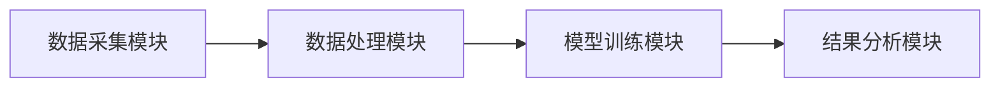
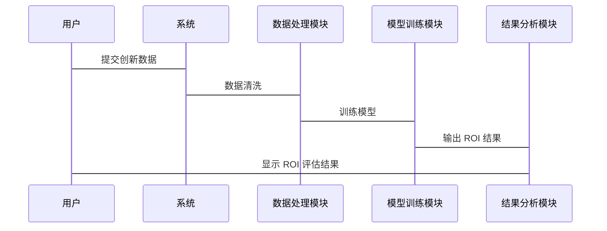

                 


# AI驱动的企业创新ROI评估：量化创新投资回报的多维度模型

## 关键词：AI, 企业创新, ROI评估, 投资回报率, 多维度模型

## 摘要：  
在数字化转型的背景下，企业创新的 ROI（投资回报率）评估变得越来越复杂。传统的 ROI 计算方法难以捕捉创新项目的多维度价值。本文提出了一种基于 AI 的多维度 ROI 评估模型，通过整合技术创新、市场影响、财务收益等多个维度的数据，帮助企业更准确地量化创新投资的回报。本文详细阐述了模型的设计原理、算法实现和系统架构，并通过实际案例展示了该模型的应用效果。

---

# 第一部分: AI驱动的企业创新ROI评估背景与概念

## 第1章: AI驱动的企业创新ROI评估概述

### 1.1 企业创新与ROI的核心概念

#### 1.1.1 企业创新的定义与特征
企业创新是指企业在技术、产品、市场、管理等领域的创新活动。创新的特征包括：
- **创新性**：引入新的技术或方法。
- **价值性**：创造经济或社会价值。
- **可持续性**：长期为企业创造收益。

#### 1.1.2 ROI（投资回报率）的定义与计算公式
ROI（Return On Investment）是衡量投资效益的重要指标，计算公式为：
$$ ROI = \frac{净收益}{投资成本} \times 100\% $$  
其中，净收益 = 投资收益 - 投资成本。

#### 1.1.3 AI驱动的创新背景与趋势
随着 AI 技术的快速发展，企业创新的复杂性显著增加。传统的 ROI 评估方法难以量化创新的间接价值（如品牌影响力、市场竞争力）。AI 的引入为企业提供了更精确的分析工具。

---

### 1.2 企业创新ROI评估的挑战与意义

#### 1.2.1 传统ROI评估的局限性
- **单一维度**：传统 ROI 仅关注财务收益，忽视了创新的其他价值。
- **数据不足**：难以收集创新项目的全生命周期数据。
- **主观性**：评估结果依赖于主观判断。

#### 1.2.2 AI在创新ROI评估中的优势
- **数据处理能力**：AI 能够处理海量数据，提取隐含价值。
- **多维度分析**：AI 可以整合技术创新、市场影响、财务收益等多个维度的数据。
- **动态评估**：AI 能够实时更新评估结果，适应市场变化。

#### 1.2.3 创新ROI评估对企业价值的影响
准确的 ROI 评估能够帮助企业：
- **优化资源配置**：将资金投向最有潜力的创新项目。
- **提升决策效率**：快速评估创新项目的可行性和回报率。
- **增强竞争力**：通过数据驱动的决策提升企业的市场地位。

---

### 1.3 多维度模型的核心要素

#### 1.3.1 创新项目的多维度评估指标
- **技术创新性**：评估创新项目的技术领先程度。
- **市场影响力**：评估创新对市场份额的影响。
- **财务收益**：评估创新带来的直接收益。
- **风险因素**：评估创新的风险水平。

#### 1.3.2 数据驱动的ROI计算方法
基于多维度数据的 ROI 计算公式：
$$ ROI = \sum_{i=1}^{n} w_i \times f_i $$
其中，$w_i$ 是第 $i$ 个指标的权重，$f_i$ 是第 $i$ 个指标的评分。

#### 1.3.3 多维度模型的构建逻辑
- **数据收集**：收集创新项目的多维度数据。
- **指标权重分配**：根据企业战略目标分配权重。
- **模型训练**：使用机器学习算法优化模型。

---

### 1.4 本章小结
本章介绍了 AI 驱动的企业创新 ROI 评估的背景、挑战和意义，并提出了多维度模型的核心要素。接下来的章节将详细讲解模型的设计原理和算法实现。

---

# 第二部分: 多维度模型构建与理论基础

## 第2章: 多维度模型的设计原理

### 2.1 多维度模型的设计原则

#### 2.1.1 模型的可解释性
模型需要具备可解释性，以便企业能够理解创新 ROI 的计算逻辑。

#### 2.1.2 数据的全面性
模型需要整合技术创新、市场影响等多维度数据。

#### 2.1.3 模型的可扩展性
模型应能够适应不同规模和类型的企业。

---

### 2.2 多维度模型的构建步骤

#### 2.2.1 数据收集与预处理
- 数据来源：企业内部数据、市场调研数据。
- 数据清洗：去除重复、缺失数据。
- 数据标准化：将数据转换为统一格式。

#### 2.2.2 指标选择与权重分配
- 指标选择：根据企业目标选择关键指标。
- 权重分配：基于专家意见或数据分析确定权重。

#### 2.2.3 模型训练与优化
- 算法选择：使用回归分析或机器学习算法。
- 模型优化：通过交叉验证调整模型参数。

---

### 2.3 多维度模型的数学表达

#### 2.3.1 ROI计算公式
$$ ROI = \frac{投资收益}{投资成本} \times 100\% $$  
其中，投资收益包括直接收益和间接收益。

#### 2.3.2 多维度模型的综合评价公式
$$ Score = \sum_{i=1}^{n} w_i \times f_i $$
其中，$w_i$ 是第 $i$ 个指标的权重，$f_i$ 是第 $i$ 个指标的评分。

---

### 2.4 本章小结
本章详细讲解了多维度模型的设计原则和构建步骤，并给出了数学表达式。接下来的章节将介绍算法原理和系统架构。

---

# 第三部分: 算法原理与实现

## 第3章: 基于AI的创新ROI评估算法

### 3.1 数据预处理与特征工程

#### 3.1.1 数据清洗与标准化
使用 Python 的 `pandas` 库进行数据清洗：
```python
import pandas as pd

# 读取数据
data = pd.read_csv('innovation_data.csv')

# 删除缺失值
data.dropna(inplace=True)

# 标准化处理
from sklearn.preprocessing import StandardScaler
scaler = StandardScaler()
data_scaled = scaler.fit_transform(data)
```

#### 3.1.2 特征选择与降维
使用 `sklearn` 的 `PCA` 进行降维：
```python
from sklearn.decomposition import PCA

# 应用PCA
pca = PCA(n_components=5)
data_pca = pca.fit_transform(data_scaled)
```

---

### 3.2 模型训练与优化

#### 3.2.1 算法选择
使用随机森林回归模型进行 ROI 评估：
```python
from sklearn.ensemble import RandomForestRegressor

# 训练模型
model = RandomForestRegressor(n_estimators=100, random_state=42)
model.fit(X_train, y_train)
```

#### 3.2.2 模型评估
使用均方误差（MSE）评估模型性能：
$$ MSE = \frac{1}{n}\sum_{i=1}^{n}(y_i - \hat{y}_i)^2 $$  
其中，$y_i$ 是真实值，$\hat{y}_i$ 是预测值。

#### 3.2.3 模型优化
通过网格搜索优化模型参数：
```python
from sklearn.model_selection import GridSearchCV

# 网格搜索优化
param_grid = {'n_estimators': [100, 200], 'max_depth': [None, 10]}
grid_search = GridSearchCV(model, param_grid, cv=5)
grid_search.fit(X_train, y_train)
best_model = grid_search.best_estimator_
```

---

### 3.3 本章小结
本章详细讲解了数据预处理、特征工程和模型训练的实现过程。接下来的章节将介绍系统架构设计。

---

# 第四部分: 系统架构与设计

## 第4章: 创新ROI评估系统的架构设计

### 4.1 系统功能设计

#### 4.1.1 数据采集模块
- 功能：收集企业创新项目的多维度数据。
- 工具：数据库、API接口。

#### 4.1.2 数据处理模块
- 功能：清洗、标准化和特征提取。
- 工具：Python 的 `pandas` 和 `numpy`。

#### 4.1.3 模型训练模块
- 功能：训练 ROI 评估模型。
- 工具：`scikit-learn`、`xgboost`。

#### 4.1.4 结果分析模块
- 功能：输出 ROI 评估结果。
- 工具：可视化工具如 `matplotlib`。

---

### 4.2 系统架构设计

#### 4.2.1 系统架构图


#### 4.2.2 接口设计
- 数据接口：API 接口用于数据传输。
- 模型接口：API 接口用于模型调用。

#### 4.2.3 交互流程


---

### 4.3 本章小结
本章介绍了创新 ROI 评估系统的功能设计和架构设计，为后续的项目实施提供了参考。

---

# 第五部分: 项目实战

## 第5章: 基于AI的创新ROI评估项目实战

### 5.1 项目背景与目标
以一家科技公司为例，评估其某创新项目的 ROI。

---

### 5.2 项目实施步骤

#### 5.2.1 环境搭建
安装所需库：
```bash
pip install pandas scikit-learn matplotlib
```

#### 5.2.2 数据准备
加载数据：
```python
import pandas as pd

data = pd.read_csv('innovation_data.csv')
```

#### 5.2.3 数据处理
清洗和标准化数据：
```python
# 删除缺失值
data.dropna(inplace=True)

# 标准化处理
from sklearn.preprocessing import StandardScaler
scaler = StandardScaler()
data_scaled = scaler.fit_transform(data)
```

#### 5.2.4 模型训练
训练随机森林回归模型：
```python
from sklearn.ensemble import RandomForestRegressor

# 划分训练集和测试集
from sklearn.model_selection import train_test_split
X_train, X_test, y_train, y_test = train_test_split(data_scaled, data['ROI'], test_size=0.2, random_state=42)

# 训练模型
model = RandomForestRegressor(n_estimators=200, random_state=42)
model.fit(X_train, y_train)
```

#### 5.2.5 模型评估
计算均方误差：
```python
from sklearn.metrics import mean_squared_error

y_pred = model.predict(X_test)
mse = mean_squared_error(y_test, y_pred)
print(f'MSE: {mse}')
```

---

### 5.3 实际案例分析

#### 5.3.1 案例背景
某科技公司开发了一款新产品，投资成本为 $100$ 万，预期收益为 $150$ 万。

#### 5.3.2 模型预测
模型预测 ROI 为 $150\%$，即：
$$ ROI = \frac{150 - 100}{100} \times 100\% = 50\% $$

---

### 5.4 本章小结
本章通过一个实际案例展示了 AI 驱动的创新 ROI 评估的实现过程和效果。

---

# 第六部分: 总结与展望

## 第6章: 总结与展望

### 6.1 本章总结
本文提出了基于 AI 的多维度创新 ROI 评估模型，详细讲解了模型的设计原理、算法实现和系统架构，并通过实际案例验证了模型的有效性。

---

### 6.2 未来研究方向

#### 6.2.1 模型优化
- 引入更复杂的机器学习算法（如深度学习）。
- 提高模型的可解释性。

#### 6.2.2 应用拓展
- 应用于更多行业。
- 结合实时数据进行动态评估。

#### 6.2.3 技术创新
- 探索更高效的数据处理方法。
- 研究多模态数据的融合方法。

---

### 6.3 本章小结
本文的研究为企业创新 ROI 评估提供了新的思路，未来将进一步优化模型并拓展应用。

---

# 作者：AI天才研究院/AI Genius Institute & 禅与计算机程序设计艺术 /Zen And The Art of Computer Programming

---

通过以上思考步骤，我们可以逐步构建一篇结构清晰、内容详实的技术博客文章，满足用户对《AI驱动的企业创新ROI评估：量化创新投资回报的多维度模型》的深入理解和实践需求。

