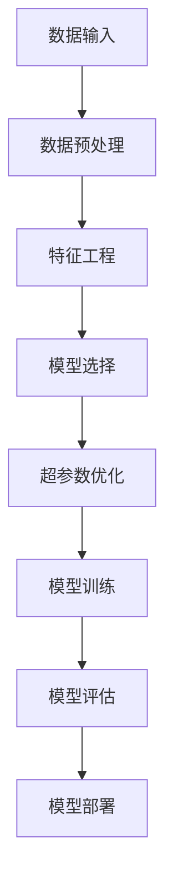
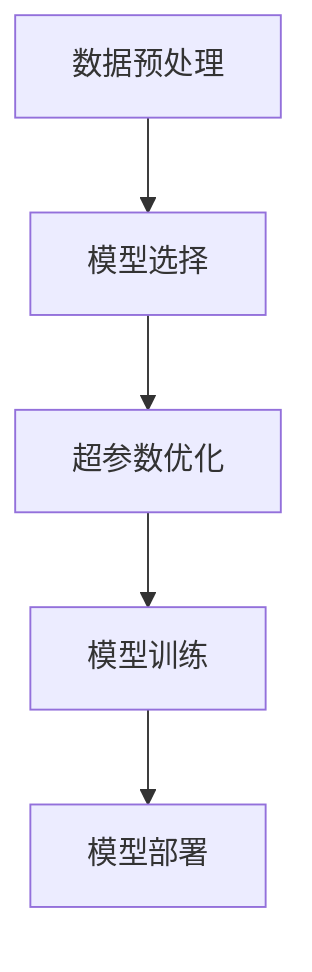
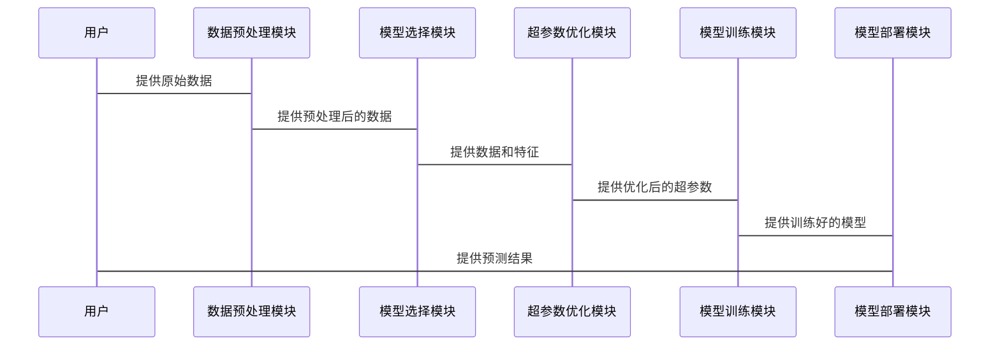

                 


# AutoML：自动化AI Agent的模型选择与优化

> 关键词：AutoML，自动化机器学习，AI代理，模型选择，优化算法

> 摘要：AutoML（自动化机器学习）是一种通过自动化技术简化机器学习流程的方法，能够帮助不具备机器学习专业知识的用户快速构建高效模型。本文将深入探讨AutoML的核心概念、模型选择与优化的理论基础、核心算法与实现、系统架构与设计，以及项目实战。通过详细的分析与实例，帮助读者全面理解AutoML在AI Agent中的应用，掌握其背后的原理与技术细节。

---

## 第1章: 引言

### 1.1 AutoML的背景与重要性
在人工智能快速发展的今天，机器学习技术在各个领域得到了广泛应用。然而，机器学习模型的构建过程复杂且耗时，需要专业知识和经验。AutoML（Automated Machine Learning）应运而生，它通过自动化技术简化了机器学习的整个流程，使得非专业人员也能轻松构建高效模型。

#### 1.1.1 机器学习的复杂性与挑战
- **数据预处理**：数据清洗、特征工程等步骤需要专业知识。
- **模型选择**：选择合适的算法和超参数需要大量实验。
- **计算资源**：复杂的模型训练需要高性能计算资源。
- **迭代优化**：模型调优过程繁琐且耗时。

#### 1.1.2 AutoML的定义与目标
- **定义**：AutoML是一种技术，通过自动化工具和算法，自动完成数据预处理、模型选择、超参数优化等机器学习流程。
- **目标**：降低机器学习的门槛，提高模型构建的效率和效果。

#### 1.1.3 AutoML的应用场景与优势
- **应用场景**：
  - 数据科学家：快速尝试多种模型，加速实验过程。
  - 业务人员：无需专业知识，快速构建预测模型。
  - 初学者：降低学习曲线，快速上手机器学习。
- **优势**：
  - 提高效率：自动化处理繁琐的流程。
  - 优化结果：通过多次实验找到最优模型。
  - 降低门槛：让更多人能够使用机器学习技术。

---

### 1.2 AutoML的核心概念
AutoML的核心在于自动化处理机器学习的各个步骤，从数据预处理到模型部署，实现端到端的自动化流程。

#### 1.2.1 自动化机器学习的基本流程
1. **数据预处理**：清洗数据，处理缺失值，标准化/归一化等。
2. **特征工程**：提取特征，选择重要特征，降维等。
3. **模型选择**：自动选择合适的算法，并进行超参数优化。
4. **模型训练与评估**：训练模型，并通过交叉验证评估性能。
5. **模型部署与监控**：部署模型，并实时监控性能，进行自动优化。

#### 1.2.2 模型选择与优化的核心要素
- **模型选择**：根据数据特点选择合适的算法，例如线性回归、随机森林、神经网络等。
- **超参数优化**：通过网格搜索、随机搜索或贝叶斯优化等方法，找到最优的超参数组合。
- **性能评估**：通过准确率、召回率、F1分数等指标评估模型性能。

#### 1.2.3 AutoML与传统机器学习的区别
| 特性 | AutoML | 传统机器学习 |
|------|---------|---------------|
| 数据预处理 | 自动化处理 | 手动处理       |
| 模型选择 | 自动选择最佳算法 | 手动选择       |
| 超参数优化 | 自动优化 | 手动优化       |
| 可用性 | 无需专业知识 | 需要专业知识     |

---

### 1.3 AutoML的核心流程
AutoML的核心流程包括数据输入、模型选择与优化、模型训练与部署。下图展示了AutoML的基本流程：



---

## 第2章: 模型选择与优化的理论基础

### 2.1 机器学习基础
机器学习的基本概念，包括监督学习、无监督学习、回归、分类等。

#### 2.1.1 监督学习
- **定义**：给定标注数据，学习一个函数，预测新的数据点。
- **常见算法**：线性回归、支持向量机（SVM）、随机森林、神经网络等。

#### 2.1.2 无监督学习
- **定义**：在无标注数据上，发现数据中的结构或分组。
- **常见算法**：聚类（K-means）、主成分分析（PCA）等。

#### 2.1.3 回归与分类
- **回归**：预测连续型变量（如房价预测）。
- **分类**：预测离散型变量（如垃圾邮件分类）。

### 2.2 模型评估与选择
模型选择的关键在于评估不同模型的性能，并选择最优模型。

#### 2.2.1 评估指标
- **回归任务**：均方误差（MSE）、均方根误差（RMSE）、R平方值（R²）。
- **分类任务**：准确率、召回率、F1分数、AUC-ROC曲线。

#### 2.2.2 模型选择的策略
- **网格搜索**：遍历所有可能的超参数组合，选择最优模型。
- **随机搜索**：随机选择超参数组合，适用于参数空间较大的情况。
- **贝叶斯优化**：基于概率模型，智能选择最优超参数。

### 2.3 超参数优化
超参数优化是AutoML的核心任务之一，常用的方法包括网格搜索、随机搜索和贝叶斯优化。

#### 2.3.1 网格搜索
- **定义**：遍历所有可能的超参数组合，评估每个组合的性能，选择最优的组合。
- **优点**：简单易实现。
- **缺点**：计算量大，尤其是参数空间较大时。

#### 2.3.2 随机搜索
- **定义**：随机选择超参数组合，评估性能，选择最优的组合。
- **优点**：计算量较小，适合参数空间较大的情况。
- **缺点**：可能无法找到全局最优解。

#### 2.3.3 贝叶斯优化
- **定义**：基于概率模型（如高斯过程回归），智能选择最优的超参数组合。
- **优点**：计算效率高，能够快速收敛到最优解。
- **缺点**：实现复杂，需要较高的计算资源。

---

## 第3章: AutoML的核心算法与实现

### 3.1 贝叶斯优化算法
贝叶斯优化是一种常用的超参数优化方法，通过构建概率模型，逐步缩小搜索空间。

#### 3.1.1 贝叶斯优化的原理
1. 初始化：选择一部分超参数组合，评估性能。
2. 构建概率模型：基于初始数据，构建高斯过程回归模型。
3. 选择下一个评估点：根据概率模型，选择最有潜力的超参数组合。
4. 更新概率模型：将新评估的数据加入模型，更新概率分布。
5. 重复步骤2-4，直到达到预设的迭代次数或满足收敛条件。

#### 3.1.2 贝叶斯优化的实现
以下是贝叶斯优化的Python实现示例：

```python
import numpy as np
from sklearn.gaussian_process import GaussianProcessRegressor
from sklearn.gaussian_process.kernels import RBF

def bayesian_optimization(X, y, bounds, iterations=10):
    kernel = RBF(length_scale=1.0)
    model = GaussianProcessRegressor(kernel=kernel)
    
    X_sample = []
    Y_sample = []
    
    for _ in range(iterations):
        model.fit(X_sample, Y_sample)
        # 找出最有潜力的点
        X_new, _ = get_optimal(X_sample, model, bounds)
        Y_new = evaluate_model(X_new)
        X_sample.append(X_new)
        Y_sample.append(Y_new)
    
    return X_sample, Y_sample
```

#### 3.1.3 贝叶斯优化的数学模型
贝叶斯优化的核心是高斯过程回归，其数学模型如下：

$$ y = f(x) + \epsilon $$

其中，$f(x)$ 是高斯过程回归模型，$\epsilon$ 是噪声项。

---

### 3.2 遗传算法
遗传算法是一种基于生物进化论的优化算法，适用于复杂的超参数优化问题。

#### 3.2.1 遗传算法的原理
1. 初始化：随机生成一组超参数组合。
2. 适应度评估：评估每个组合的性能。
3. 选择：根据适应度值，选择优秀的组合进行繁殖。
4. 交叉与变异：生成新的组合。
5. 重复步骤2-4，直到达到预设的迭代次数或满足收敛条件。

#### 3.2.2 遗传算法的实现
以下是遗传算法的Python实现示例：

```python
def genetic_algorithm(population_size, bounds, iterations=10):
    population = initialize_population(population_size, bounds)
    for _ in range(iterations):
        # 适应度评估
        fitness = [evaluate_model(individual) for individual in population]
        # 选择
        selected = select_parents(population, fitness)
        # 交叉与变异
        new_population = crossover_and_mutate(selected, bounds)
        population = new_population
    return population, fitness
```

---

## 第4章: 系统分析与架构设计

### 4.1 AutoML系统的整体架构
AutoML系统的整体架构包括数据预处理模块、模型选择模块、超参数优化模块、模型训练模块和模型部署模块。

#### 4.1.1 数据预处理模块
- **功能**：清洗数据，处理缺失值，标准化/归一化等。
- **接口**：接收原始数据，输出预处理后的数据。

#### 4.1.2 模型选择模块
- **功能**：根据数据特点选择合适的算法。
- **接口**：接收数据和特征，输出选择的模型。

#### 4.1.3 超参数优化模块
- **功能**：自动优化模型的超参数。
- **接口**：接收模型和超参数范围，输出最优超参数。

#### 4.1.4 模型训练模块
- **功能**：训练模型，并评估性能。
- **接口**：接收模型和超参数，输出训练好的模型和评估结果。

#### 4.1.5 模型部署模块
- **功能**：将模型部署到生产环境，并监控性能。
- **接口**：接收模型，输出预测结果。

#### 4.1.6 AutoML系统的架构图


---

### 4.2 系统接口设计
- **输入接口**：接收原始数据和任务类型。
- **输出接口**：输出训练好的模型和预测结果。
- **内部接口**：模块之间的数据传递接口。

### 4.3 系统交互流程


---

## 第5章: 项目实战

### 5.1 环境安装与配置
- **安装依赖**：安装所需的Python库，例如`scikit-learn`、`numpy`、`scipy`等。
- **配置开发环境**：配置IDE，确保环境能够运行Python代码。

### 5.2 核心实现

#### 5.2.1 数据预处理
```python
import pandas as pd
import numpy as np

# 读取数据
data = pd.read_csv('data.csv')

# 处理缺失值
data = data.dropna()

# 标准化处理
from sklearn.preprocessing import StandardScaler
scaler = StandardScaler()
data_scaled = scaler.fit_transform(data)
```

#### 5.2.2 模型选择与优化
```python
from sklearn.model_selection import GridSearchCV
from sklearn.svm import SVC

# 定义参数网格
param_grid = {'C': [1, 10, 100], 'gamma': [0.1, 0.01, 0.001]}

# 网格搜索
grid_search = GridSearchCV(SVC(), param_grid, cv=5)
grid_search.fit(data_scaled, labels)

# 输出最优参数
print(grid_search.best_params_)
```

#### 5.2.3 模型训练与部署
```python
# 训练最优模型
best_model = grid_search.best_estimator_
best_model.fit(data_scaled, labels)

# 预测新数据
new_data = np.array([[...]])
print(best_model.predict(new_data))
```

### 5.3 实际案例分析
以一个分类任务为例，展示AutoML如何在实际项目中应用。

---

## 第6章: 总结与展望

### 6.1 总结
本文详细介绍了AutoML的核心概念、算法实现和系统架构，通过实际案例展示了AutoML的应用过程。AutoML通过自动化技术，简化了机器学习的流程，使得更多人能够轻松构建高效模型。

### 6.2 当前挑战与未来展望
尽管AutoML技术已经取得了一定的进展，但仍面临一些挑战，例如如何处理复杂的模型架构优化、如何提高算法的计算效率等。未来，随着计算能力的提升和算法的改进，AutoML将更加智能化和高效化。

### 6.3 最佳实践与学习建议
- **最佳实践**：选择适合任务的AutoML工具，合理配置超参数，持续监控模型性能。
- **学习建议**：深入学习机器学习基础，掌握AutoML的核心算法，关注最新的研究进展。

---

## 作者：AI天才研究院/AI Genius Institute & 禅与计算机程序设计艺术 /Zen And The Art of Computer Programming

