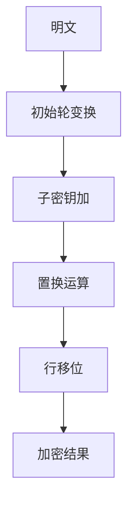
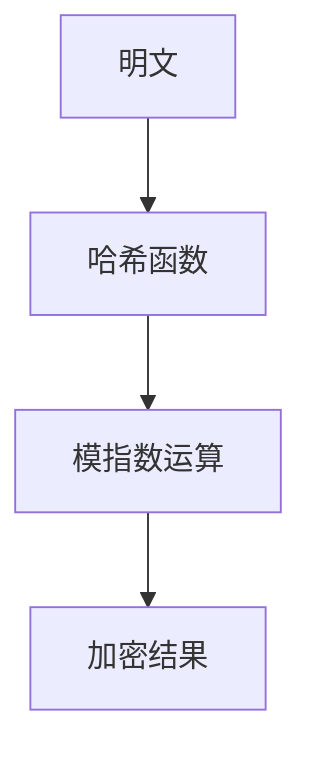
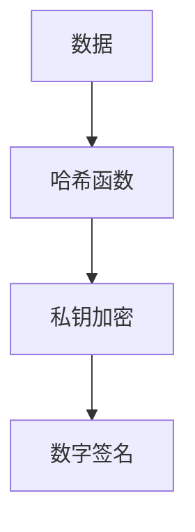
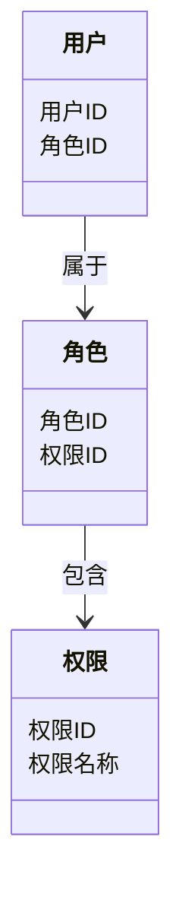
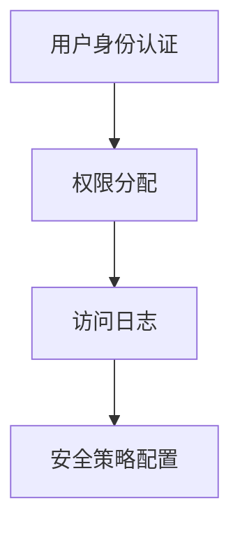
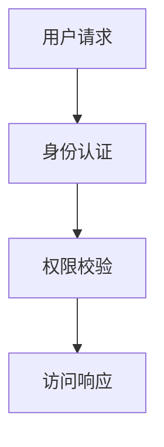
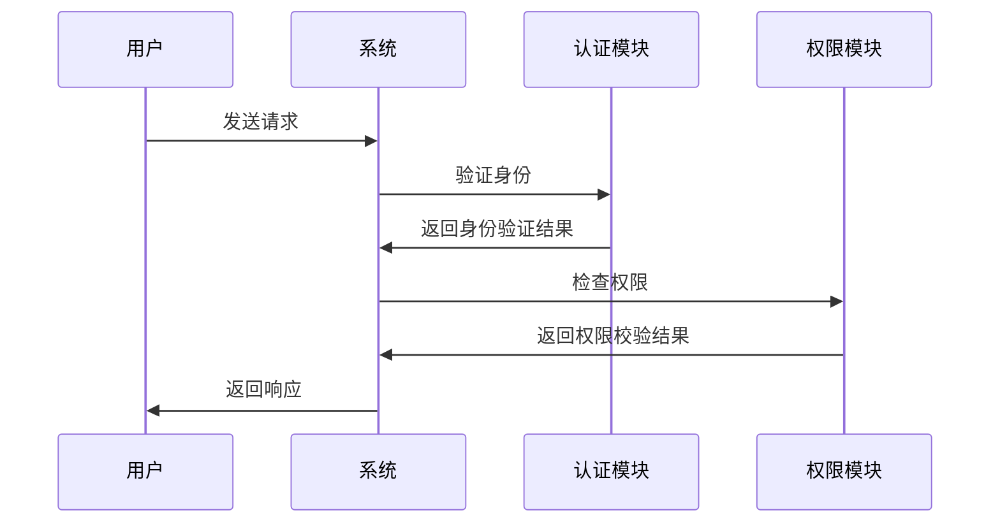
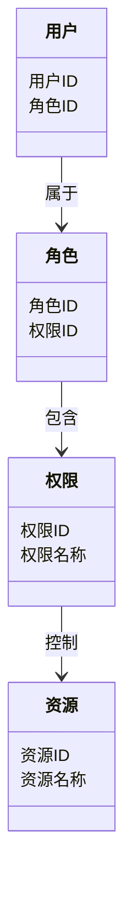
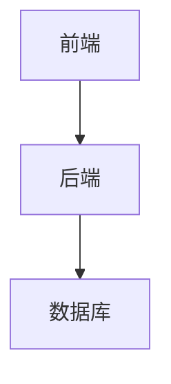

                 


# 企业AI Agent的多维安全防护：数据加密与访问控制

---

**关键词**：  
企业AI Agent，数据加密，访问控制，多维安全，算法原理，系统架构，安全策略

---

**摘要**：  
随着企业AI Agent的广泛应用，数据安全问题日益突出。本文从数据加密与访问控制两个核心方面，详细探讨企业AI Agent的多维安全防护策略。通过分析数据加密算法的原理与实现，结合访问控制的系统架构设计，提出一套完整的安全防护方案。同时，本文还结合实际案例，展示了如何在企业环境中实现数据加密与访问控制的最佳实践，确保企业AI Agent的安全运行。

---

# 第1章：企业AI Agent与数据安全概述

## 1.1 企业AI Agent的基本概念

### 1.1.1 AI Agent的定义与特点

企业AI Agent（Artificial Intelligence Agent）是指在企业环境中运行的智能代理系统，能够感知环境、自主决策并执行任务。AI Agent的核心特点包括：

1. **自主性**：能够独立决策和执行任务。
2. **反应性**：能够实时感知环境变化并做出响应。
3. **社会性**：能够与其他系统或用户进行交互。
4. **学习性**：能够通过数据学习和优化自身行为。

### 1.1.2 企业AI Agent的应用场景

企业AI Agent的应用场景广泛，包括：

1. **智能客服**：通过自然语言处理技术为用户提供24/7的智能客服支持。
2. **自动化运维**：自动监控系统运行状态并执行故障修复。
3. **智能推荐**：基于用户行为数据推荐个性化的产品或服务。
4. **风险管理**：实时监控企业风险点并制定应对策略。

### 1.1.3 数据安全在AI Agent中的重要性

AI Agent的核心功能依赖于数据的采集、处理和分析。因此，数据安全是AI Agent正常运行的基础。数据加密与访问控制是保障数据安全的两大核心手段。

---

## 1.2 数据安全的多维防护需求

### 1.2.1 数据加密的基本原理

数据加密通过将明文转换为密文，防止数据在传输或存储过程中被未授权访问。常见的加密方式包括：

1. **对称加密**：加密和解密使用相同的密钥，效率高，适用于大规模数据加密。
2. **非对称加密**：加密和解密使用不同的密钥，安全性高，适用于身份验证和数字签名。
3. **哈希加密**：将数据映射为固定长度的哈希值，常用于验证数据完整性。

### 1.2.2 访问控制的核心机制

访问控制通过限制用户或系统的访问权限，确保数据只能被授权主体访问。常见的访问控制机制包括：

1. **基于角色的访问控制（RBAC）**：根据用户角色分配权限。
2. **基于属性的访问控制（ABAC）**：根据用户属性和上下文动态分配权限。
3. **基于规则的访问控制（RBAC）**：根据预定义的规则控制访问。

### 1.2.3 多维安全防护的必要性

为了应对日益复杂的网络安全威胁，企业需要采取多维安全防护策略。数据加密和访问控制是其中的两大核心措施，能够有效防范数据泄露和非法访问。

---

## 1.3 本章小结

本章介绍了企业AI Agent的基本概念及其应用场景，并重点分析了数据安全在AI Agent中的重要性。通过阐述数据加密和访问控制的基本原理，为后续章节的深入分析奠定了基础。

---

# 第2章：数据加密算法原理

## 2.1 对称加密算法

### 2.1.1 AES算法的工作原理

AES（高级加密标准）是一种广泛使用的对称加密算法，支持128、192和256位密钥长度。其加密过程包括以下几个步骤：

1. **初始轮**：将明文划分为块，进行初始变换。
2. **多轮加密**：每轮包括子密钥加、置换运算和行移位操作。
3. **最终轮**：省略子密钥加步骤，直接进行置换运算和行移位。

**AES加密流程图（Mermaid）**：



### 2.1.2 加密与解密的数学模型

AES算法的加密过程可以用数学模型表示为：

$$
E_k(m) = c
$$

其中，\( E_k \) 表示加密函数，\( m \) 表示明文，\( c \) 表示密文。

解密过程可以表示为：

$$
D_k(c) = m
$$

其中，\( D_k \) 表示解密函数。

### 2.1.3 AES算法的分组加密流程

AES算法采用分组加密方式，每组数据长度为128位。加密过程中，每组数据会被划分为多个子块，分别进行变换操作。

---

## 2.2 非对称加密算法

### 2.2.1 RSA算法的原理与应用

RSA（ Rivest–Shamir–Adleman）是一种基于大整数分解的非对称加密算法，常用于数字签名和密钥交换。

**RSA加密流程图（Mermaid）**：



### 2.2.2 公钥与私钥的生成过程

RSA算法通过大质数生成公钥和私钥。公钥用于加密，私钥用于解密。生成过程包括以下几个步骤：

1. 随机生成两个大质数 \( p \) 和 \( q \)。
2. 计算 \( n = p \times q \)。
3. 选择一个与 \( n \) 互质的整数 \( e \)。
4. 计算 \( d \)，使得 \( d \times e \equiv 1 \mod \phi(n) \)，其中 \( \phi(n) \) 是欧拉函数。

### 2.2.3 非对称加密的安全性分析

非对称加密的安全性基于数学难题（如大整数分解和离散对数问题）。目前，RSA算法的安全性得到了广泛认可，但随着计算能力的提升，需要不断增大密钥长度以提高安全性。

---

## 2.3 哈希函数与数字签名

### 2.3.1 哈希函数的基本原理

哈希函数将任意长度的输入映射为固定长度的输出，常用于数据完整性验证。

**哈希函数示例（Python代码）**：

```python
import hashlib

def compute_hash(data):
    # 创建哈希对象
    hash_object = hashlib.sha256(data.encode())
    # 计算哈希值
    hex_dig = hash_object.hexdigest()
    return hex_dig

# 示例数据
data = "Hello, World!"
print(compute_hash(data))  # 输出哈希值
```

### 2.3.2 数字签名的实现流程

数字签名通过哈希函数和非对称加密算法实现，确保数据的完整性和真实性。

**数字签名流程图（Mermaid）**：



### 2.3.3 哈希碰撞与安全性

哈希碰撞是指不同的输入生成相同的哈希值。为了提高安全性，需要选择优秀的哈希算法（如SHA-256）并定期更新密钥。

---

## 2.4 数据加密的数学模型与公式

### 加密算法的数学表达式

加密过程可以用以下公式表示：

$$
E_k(m) = c
$$

解密过程可以表示为：

$$
D_k(c) = m
$$

其中，\( k \) 表示密钥，\( m \) 表示明文，\( c \) 表示密文。

---

## 2.5 本章小结

本章详细讲解了对称加密和非对称加密算法的原理与实现，分析了哈希函数与数字签名的应用场景。通过对AES和RSA算法的数学模型和流程图分析，为后续章节的系统设计奠定了基础。

---

# 第3章：访问控制的核心机制

## 3.1 访问控制的实现原理

### 3.1.1 基于角色的访问控制（RBAC）

RBAC通过定义用户角色和权限，实现细粒度的访问控制。例如，企业中的“财务主管”角色可以访问财务数据，而普通员工只能访问自己的数据。

**RBAC模型类图（Mermaid）**：



### 3.1.2 基于属性的访问控制（ABAC）

ABAC根据用户属性（如部门、职位）和上下文（如时间、地点）动态分配权限。例如，销售部门的员工在特定时间可以访问销售数据。

### 3.1.3 基于规则的访问控制（RBAC）

RBAC通过预定义的规则控制访问，规则可以基于用户、资源和操作进行组合。

---

## 3.2 访问控制的系统架构设计

### 3.2.1 系统功能设计

企业AI Agent的访问控制系统需要实现以下功能：

1. 用户身份认证
2. 权限分配与管理
3. 访问日志记录
4. 安全策略配置

**系统功能模块图（Mermaid）**：



### 3.2.2 系统架构设计

企业AI Agent的访问控制系统可以采用分层架构：

1. **数据层**：存储用户、角色、权限等信息。
2. **业务逻辑层**：实现身份认证、权限校验等功能。
3. **用户界面层**：提供用户交互界面。

**系统架构图（Mermaid）**：



### 3.2.3 系统接口设计

系统接口设计需要考虑以下几点：

1. **身份认证接口**：用于验证用户身份。
2. **权限校验接口**：用于检查用户权限。
3. **日志记录接口**：用于记录用户操作。

**系统接口序列图（Mermaid）**：



---

## 3.3 本章小结

本章详细分析了访问控制的核心机制，包括RBAC、ABAC和RBAC三种模型，并设计了企业AI Agent的访问控制系统架构。通过接口设计和序列图分析，明确了系统的实现流程。

---

# 第4章：系统分析与架构设计方案

## 4.1 问题场景介绍

企业AI Agent的运行环境复杂，面临以下安全挑战：

1. **数据泄露**：未授权访问可能导致敏感数据泄露。
2. **权限滥用**：用户或系统可能超出权限范围操作。
3. **攻击威胁**：恶意攻击可能导致系统崩溃或数据损坏。

## 4.2 系统功能设计

### 4.2.1 领域模型类图

企业AI Agent的领域模型包括用户、角色、权限和资源四个核心实体。

**领域模型类图（Mermaid）**：



### 4.2.2 系统架构图

企业AI Agent的系统架构包括前端、后端和数据库三个部分。

**系统架构图（Mermaid）**：



### 4.2.3 接口设计

系统需要实现以下接口：

1. **用户身份认证接口**：用于验证用户身份。
2. **权限校验接口**：用于检查用户权限。
3. **数据加密接口**：用于加密敏感数据。

---

## 4.3 本章小结

本章通过问题场景分析，设计了企业AI Agent的系统功能和架构。通过类图和序列图的绘制，明确了系统的实现流程和接口设计。

---

# 第5章：项目实战

## 5.1 环境安装与配置

### 5.1.1 安装Python与相关库

安装Python和必要的库（如Django、PyJWT）：

```bash
pip install python-jose[cryptography]
```

### 5.1.2 安装Django框架

安装Django框架：

```bash
pip install django
```

---

## 5.2 核心代码实现

### 5.2.1 用户身份认证模块

实现用户身份认证模块的代码：

```python
from jose import JWTError, jwt
from datetime import datetime, timedelta
from fastapi import Depends, HTTPException
from fastapi.security import OAuth2PasswordBearer

# 定义OAuth2密码流式方案
oauth2_scheme = OAuth2PasswordBearer(tokenUrl="token")

# 加密密钥
SECRET_KEY = "your-secret-key"
ALGORITHM = "HS256"
ACCESS_TOKEN_EXPIRE_MINUTES = 30

def create_access_token(data: dict, expires_delta: timedelta):
    to_encode = data.copy()
    if expires_delta:
        expire = datetime.utcnow() + expires_delta
    else:
        expire = datetime.utcnow() + timedelta(minutes=15)
    to_encode.update({"exp": expire})
    encoded_jwt = jwt.encode(to_encode, SECRET_KEY, algorithm=ALGORITHM)
    return encoded_jwt

async def get_current_user(token: str = Depends(oauth2_scheme)):
    credentials_exception = HTTPException(
        status_code=401,
        detail="Could not validate credentials",
    )
    try:
        payload = jwt.decode(token, SECRET_KEY, algorithms=[ALGORITHM])
        username: str = payload.get("sub")
        if username is None:
            raise credentials_exception
    except JWTError:
        raise credentials_exception
    return username
```

### 5.2.2 权限校验模块

实现权限校验模块的代码：

```python
from fastapi import APIRouter, Depends, HTTPException
from fastapi.security import HTTPBearer, HTTPAuthorizationCredentials
from fastapi.security.utils import get_authorization_scheme_param

security = HTTPBearer()
router = APIRouter()

@router.post("/api/v1/data", dependencies=[Depends(security)])
async def protected_route(credentials: HTTPAuthorizationCredentials = Depends(security)):
    try:
        # 解析token并获取用户信息
        # 这里可以添加权限校验逻辑
        return {"message": "Access granted"}
    except Exception as e:
        raise HTTPException(status_code=403, detail="Permission denied")
```

### 5.2.3 数据加密模块

实现数据加密模块的代码：

```python
import hashlib

def encrypt_data(data: str):
    # 创建哈希对象
    hash_object = hashlib.sha256(data.encode())
    # 生成十六进制哈希值
    hex_dig = hash_object.hexdigest()
    return hex_dig
```

---

## 5.3 代码应用解读与分析

### 5.3.1 用户身份认证模块

上述代码实现了基于JWT的用户身份认证。通过OAuth2密码流式方案，用户可以登录并获取访问令牌。令牌的有效期为30分钟，过期后需要重新登录。

### 5.3.2 权限校验模块

上述代码实现了基于HTTPBearer的权限校验。通过在路由上添加依赖项，确保只有授权用户才能访问受保护的接口。

### 5.3.3 数据加密模块

上述代码实现了基于SHA-256的哈希加密。通过将明文转换为固定长度的哈希值，确保数据在存储和传输过程中的安全性。

---

## 5.4 实际案例分析

假设我们有一个企业AI Agent系统，需要实现以下功能：

1. 用户登录并获取访问令牌。
2. 根据用户角色分配权限。
3. 加密敏感数据（如用户密码）。

通过上述代码，我们可以实现：

1. 用户登录时，系统生成并返回JWT令牌。
2. 用户访问受保护接口时，系统校验令牌并获取用户信息。
3. 用户数据在存储时，系统对敏感字段进行哈希加密。

---

## 5.5 本章小结

本章通过实际案例分析，展示了如何在企业AI Agent中实现数据加密与访问控制。通过Python代码实现用户身份认证、权限校验和数据加密功能，确保系统的安全性。

---

# 第6章：安全策略与最佳实践

## 6.1 数据分类与分级管理

### 6.1.1 数据分类标准

企业需要根据数据的重要性进行分类，例如：

1. **机密数据**：如用户密码、财务数据。
2. **敏感数据**：如用户个人信息、订单数据。
3. **公开数据**：如产品介绍、公司公告。

### 6.1.2 数据分级管理

根据数据的重要性，制定相应的访问控制策略。例如，机密数据只能被授权人员访问，敏感数据可以被特定部门访问。

---

## 6.2 最小权限原则

### 6.2.1 最小权限原则的定义

最小权限原则要求每个用户或系统仅拥有完成其任务所需的最小权限。

### 6.2.2 实现最小权限原则的步骤

1. **分析业务需求**：明确每个用户或系统需要的权限。
2. **分配最小权限**：仅授予完成任务所需的权限。
3. **定期审计**：检查权限是否符合最小原则。

---

## 6.3 访问控制策略设计

### 6.3.1 基于角色的访问控制（RBAC）

通过定义用户角色和权限，实现细粒度的访问控制。

### 6.3.2 基于属性的访问控制（ABAC）

根据用户属性和上下文动态分配权限。

### 6.3.3 基于规则的访问控制（RBAC）

通过预定义的规则控制访问。

---

## 6.4 本章小结

本章通过数据分类、最小权限原则和访问控制策略的设计，提出了企业AI Agent的安全策略最佳实践。通过合理分配权限和定期审计，确保系统的安全性。

---

# 第7章：法律与合规

## 7.1 数据保护的法律要求

### 7.1.1 GDPR（通用数据保护条例）

GDPR是欧盟的数据保护法律，要求企业对用户数据进行严格保护，包括数据加密和访问控制。

### 7.1.2 CCPA（加利福尼亚州消费者隐私法案）

CCPA是美国加利福尼亚州的数据保护法律，要求企业向用户披露数据收集和使用情况。

---

## 7.2 数据保护的合规性设计

### 7.2.1 数据生命周期管理

企业需要对数据的整个生命周期进行管理，包括数据生成、传输、存储和销毁。

### 7.2.2 日志与审计

企业需要记录用户操作日志，并定期审计，确保符合法律要求。

---

## 7.3 本章小结

本章分析了数据保护的法律要求，并提出了合规性设计的建议。通过数据生命周期管理和日志审计，确保企业AI Agent的运行符合相关法律。

---

# 第8章：总结与展望

## 8.1 本章总结

本文详细探讨了企业AI Agent的多维安全防护策略，包括数据加密与访问控制的核心原理和实现方案。通过实际案例分析和系统设计，提出了完整的安全防护方案。

---

## 8.2 未来展望

随着AI技术的不断发展，企业AI Agent的安全防护需求也将不断增加。未来，我们需要进一步研究更先进的加密算法和访问控制技术，以应对日益复杂的网络安全威胁。

---

# 作者：AI天才研究院/AI Genius Institute & 禅与计算机程序设计艺术/Zen And The Art of Computer Programming

---

**End of Article**

