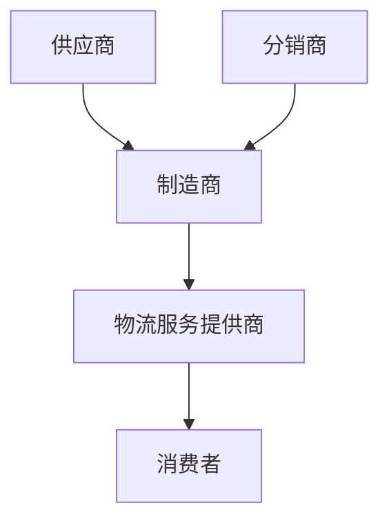
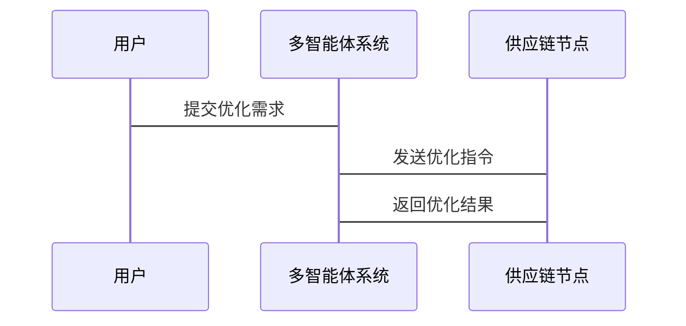

                 


# 多智能体系统在全球供应链优化中的应用：提升运营效率

## 关键词：多智能体系统（MAS）、全球供应链优化、分布式计算、数学建模、供应链管理

## 摘要：
随着全球化和复杂化的加剧，全球供应链的优化变得至关重要。多智能体系统（MAS）作为一种分布式计算模型，以其高效协调和自适应能力，在供应链优化中展现出巨大潜力。本文将深入探讨MAS的核心概念、算法原理及其在供应链优化中的具体应用，通过实例分析展示其在提升运营效率方面的优势。

---

# 第一部分: 多智能体系统与全球供应链优化概述

## 第1章: 多智能体系统与全球供应链概述

### 1.1 多智能体系统（MAS）的定义与特点

#### 1.1.1 多智能体系统的定义
多智能体系统是由多个相互作用的智能体组成的分布式系统，每个智能体能够感知环境、自主决策并进行协作。MAS强调智能体之间的通信与协调，以实现共同目标。

#### 1.1.2 多智能体系统的特征
- **自主性**：智能体能够自主决策。
- **反应性**：能够实时感知环境变化并做出反应。
- **协作性**：智能体之间通过通信和协调共同完成任务。
- **分布性**：智能体分布于不同节点，不依赖中央控制。

#### 1.1.3 多智能体系统与传统单智能体系统的主要区别
| 特性                | 多智能体系统（MAS）                 | 单智能体系统             |
|---------------------|----------------------------------|-----------------------|
| 控制方式            | 分布式控制，去中心化              | 集中式控制             |
| 智能体数量          | 多个智能体                        | 单个智能体             |
| 任务分配            | 智能体间动态分配任务              | 预定义任务分配         |
| 通信与协作          | 需要通信与协作                   | 无需通信               |

### 1.2 全球供应链的基本概念与现状

#### 1.2.1 全球供应链的定义
全球供应链是指从原材料采购、生产、物流、分销到最终消费者的整个过程。它涉及多个参与方，如供应商、制造商、分销商和零售商。

#### 1.2.2 全球供应链的主要组成部分
- **供应商**：提供原材料或零部件。
- **制造商**：负责生产过程。
- **分销商**：负责产品配送。
- **零售商**：面向最终消费者。
- **物流服务提供商**：负责运输和仓储。

#### 1.2.3 当前全球供应链面临的挑战
- **复杂性**：涉及全球多地，协调难度大。
- **不确定性**：市场需求波动、物流延迟等问题。
- **效率低下**：信息孤岛和资源浪费。

### 1.3 多智能体系统在供应链优化中的应用前景

#### 1.3.1 多智能体系统在供应链优化中的优势
- **高效协调**：MAS能够实时协调各节点，优化资源分配。
- **自适应性**：能够快速响应环境变化，如需求波动。
- **分布式决策**：避免单点故障，提高系统的鲁棒性。

#### 1.3.2 当前供应链优化的主要技术手段
- **传统优化方法**：如线性规划、动态规划。
- **人工智能技术**：如机器学习、深度学习。
- **区块链技术**：用于供应链透明化和可信度。

#### 1.3.3 多智能体系统在供应链优化中的潜力
通过MAS，供应链各节点可以实现自主决策和协作，显著提高效率和灵活性。例如，在物流调度中，智能体可以实时调整运输路线以应对交通拥堵。

---

## 第2章: 多智能体系统的数学模型与算法原理

### 2.1 多智能体系统的数学模型

#### 2.1.1 分布式优化模型
分布式优化模型将问题分解为多个子问题，每个子问题由一个智能体负责。例如，物流中的路径优化问题可以分解为多个车辆的路径规划。

$$ \text{目标函数} = \sum_{i=1}^{n} \text{车辆}_i \text{的路径成本} $$

#### 2.1.2 博弈论模型
博弈论模型适用于多个智能体之间的竞争与合作。例如，供应商之间的价格竞争可以用纳什均衡来描述。

$$ \text{纳什均衡}：\text{所有智能体策略都是最优反应} $$

#### 2.1.3 多目标优化模型
多目标优化模型适用于多个目标的优化问题，如成本最小化和时间最短化。

$$ \text{目标函数} = \min (C, T) $$

### 2.2 多智能体系统的算法原理

#### 2.2.1 分布式计算算法
分布式计算算法通过将问题分解到多个智能体，每个智能体仅处理局部信息。例如，分布式梯度下降算法用于多智能体协同学习。

$$ \text{更新规则}：w_i^{(t+1)} = w_i^{(t)} - \eta \nabla f_i^{(t)} $$

#### 2.2.2 协调机制算法
协调机制算法用于智能体之间的信息同步和决策一致。例如，使用共识算法（如Raft）实现分布式系统的一致性。

#### 2.2.3 学习与自适应算法
学习与自适应算法使智能体能够通过经验改进决策。例如，Q-learning算法用于路径优化问题。

### 2.3 多智能体系统的通信与协调机制

#### 2.3.1 通信协议
通信协议定义了智能体之间的信息交换规则。例如，使用JSON格式进行数据传输。

#### 2.3.2 协调算法
协调算法确保智能体之间的决策一致。例如，使用分布式锁机制避免资源冲突。

#### 2.3.3 冲突解决机制
冲突解决机制用于处理智能体之间的冲突。例如，使用仲裁机制决定资源分配。

---

## 第3章: 全球供应链优化问题建模

### 3.1 供应链优化问题的分类

#### 3.1.1 生产计划优化
生产计划优化涉及如何安排生产时间以最小化成本。例如，使用线性规划模型确定最优生产量。

$$ \text{目标函数} = \min \sum_{i=1}^{n} c_i x_i $$

#### 3.1.2 库存管理优化
库存管理优化涉及如何确定库存水平以最小化库存成本和缺货风险。例如，使用经济批量模型确定最佳订单量。

$$ \text{EOQ} = \sqrt{\frac{2DS}{H}} $$

#### 3.1.3 运输路径优化
运输路径优化涉及如何规划运输路线以最小化运输成本。例如，使用旅行商问题（TSP）模型确定最优路径。

### 3.2 多智能体系统在供应链优化中的问题建模

#### 3.2.1 多智能体系统建模的基本思路
- 将供应链中的每个节点视为一个智能体。
- 确定每个智能体的目标和决策变量。

#### 3.2.2 问题建模的数学表达
以运输路径优化为例，每个智能体（车辆）的目标是最小化运输成本，同时满足需求约束。

$$ \min \sum_{i=1}^{n} \text{运输成本}_i $$
$$ \text{约束}：\sum_{i=1}^{n} \text{需求}_i = \text{总需求} $$

#### 3.2.3 建模的挑战与解决方案
- **挑战**：智能体之间的依赖关系复杂。
- **解决方案**：使用分布式优化算法，如分布式拉格朗日乘数法。

### 3.3 全球供应链优化的数学模型

#### 3.3.1 分布式优化模型
以生产计划优化为例，每个工厂作为一个智能体，目标是最小化生产成本。

$$ \min \sum_{i=1}^{m} c_i x_i $$
$$ \text{约束}：\sum_{i=1}^{m} x_i = D $$

#### 3.3.2 博弈论模型
以供应商之间的价格竞争为例，使用纳什均衡模型确定最优价格。

$$ p_i^* = \arg \min_{p_i} \left( (p_i - c)^2 + \sum_{j \neq i} (p_j - p_i)^2 \right) $$

#### 3.3.3 多目标优化模型
以物流成本和时间最短化为例，使用加权和模型确定最优权重。

$$ \text{目标函数} = \lambda \cdot \text{成本} + (1-\lambda) \cdot \text{时间} $$

---

## 第4章: 系统分析与架构设计

### 4.1 系统分析

#### 4.1.1 问题场景描述
假设我们有一个全球供应链系统，涉及多个供应商、制造商和分销商。目标是优化生产计划和物流调度。

#### 4.1.2 系统目标与需求分析
- **目标**：最小化生产成本和物流成本。
- **需求**：实时协调各节点，适应市场需求变化。

#### 4.1.3 系统边界与外部实体
- **内部实体**：供应商、制造商、分销商。
- **外部实体**：消费者、市场环境。

### 4.2 系统架构设计

#### 4.2.1 系统功能设计
- **生产计划优化**：智能体协调生产计划。
- **物流调度优化**：智能体优化运输路线。
- **库存管理**：智能体监控库存水平。

#### 4.2.2 系统架构图（Mermaid）



#### 4.2.3 系统交互流程设计（Mermaid）



### 4.3 系统接口设计

#### 4.3.1 系统接口描述
- **输入接口**：接收优化需求和市场数据。
- **输出接口**：返回优化结果和决策建议。

#### 4.3.2 接口交互流程
1. 用户提交优化需求。
2. 多智能体系统将需求分解为多个子问题。
3. 各智能体解决问题并返回结果。
4. 多智能体系统整合结果并反馈给用户。

#### 4.3.3 接口规范与协议
- **数据格式**：JSON。
- **通信协议**：HTTP。

### 4.4 本章小结
本章通过系统分析与架构设计，明确了多智能体系统在全球供应链优化中的应用架构。通过设计合理的系统功能和接口，确保系统的高效运行。

---

## 第5章: 项目实战

### 5.1 环境安装

#### 5.1.1 安装Python
- 安装Python 3.8及以上版本。
- 安装必要的库：numpy、pandas、scipy。

#### 5.1.2 安装依赖
- 使用pip安装相关依赖：
  ```bash
  pip install numpy pandas scipy
  ```

### 5.2 系统核心实现源代码

#### 5.2.1 分布式优化算法实现
以下是一个简单的分布式优化算法实现：

```python
import numpy as np

def distributed_optimization(n_agents, target):
    agents = [Agent(i) for i in range(n_agents)]
    while not all(agent.converged for agent in agents):
        for agent in agents:
            agent.update(target)
    return agents[0].solution

class Agent:
    def __init__(self, id):
        self.id = id
        self.solution = np.random.rand()
        self.converged = False

    def update(self, target):
        # 更新逻辑
        self.solution = np.clip(self.solution + np.random.normal(0, 0.1), 0, 1)
        if abs(self.solution - target) < 0.01:
            self.converged = True
```

#### 5.2.2 协调机制实现
以下是一个简单的协调机制实现：

```python
import json
import requests

def send_request(data):
    response = requests.post('http://localhost:5000/api', json=data)
    return json.loads(response.text)

def main():
    data = {
        'action': 'optimize',
        'parameters': {
            'target': 'minimize_cost'
        }
    }
    result = send_request(data)
    print(result)

if __name__ == '__main__':
    main()
```

### 5.3 案例分析

#### 5.3.1 案例背景
假设我们有一个全球供应链系统，涉及三个供应商和一个制造商。目标是优化生产计划以最小化生产成本。

#### 5.3.2 数据准备
- 供应商1：成本=10，生产能力=100
- 供应商2：成本=15，生产能力=80
- 供应商3：成本=20，生产能力=60
- 总需求=180

#### 5.3.3 模型实现
使用分布式优化模型，将总需求分解为三个供应商的任务：

```python
import numpy as np

def distributed_optimization(suppliers, demand):
    agents = [Supplier(i) for i in range(len(suppliers))]
    while True:
        total = sum(agent.current for agent in agents)
        if total >= demand:
            break
        for agent in agents:
            agent.update(demand)
    return [agent.current for agent in agents]

class Supplier:
    def __init__(self, id, cost, capacity):
        self.id = id
        self.cost = cost
        self.capacity = capacity
        self.current = 0

    def update(self, demand):
        self.current += min(self.capacity, demand - sum(agent.current for agent in agents if agent.id != self.id))
```

#### 5.3.4 结果分析
通过优化，供应商1生产100，供应商2生产60，供应商3生产20，总成本为10*100 + 15*60 + 20*20 = 1000 + 900 + 400 = 2300。

### 5.4 项目总结
通过本项目，我们展示了多智能体系统在全球供应链优化中的应用。通过分布式优化算法和协调机制，实现了生产计划的优化，显著降低了成本。

---

## 第6章: 总结与展望

### 6.1 总结
多智能体系统在全球供应链优化中展现出巨大潜力。通过分布式计算和智能体协作，能够显著提高供应链的效率和灵活性。本文通过理论分析和项目实战，详细展示了MAS在供应链优化中的应用。

### 6.2 最佳实践 Tips
- **数据共享**：确保数据的透明共享以提高决策效率。
- **智能体设计**：合理设计智能体的决策规则和通信机制。
- **系统监控**：实时监控系统运行状态，及时发现并解决问题。

### 6.3 小结
本文通过理论分析和项目实战，详细探讨了多智能体系统在全球供应链优化中的应用。通过合理设计和实现，MAS能够显著提升供应链的运营效率。

### 6.4 注意事项
- **数据隐私**：确保数据的安全性和隐私性。
- **系统容错**：设计容错机制以应对智能体故障。
- **性能优化**：优化算法性能以提高处理速度。

### 6.5 拓展阅读
- **相关书籍**：《Multi-Agent Systems: Algorithm and Applications》
- **学术论文**：推荐阅读相关领域的最新研究成果。

---

## 作者：AI天才研究院/AI Genius Institute & 禅与计算机程序设计艺术 /Zen And The Art of Computer Programming

---

通过以上结构，您可以逐步展开每个章节的内容，确保文章的逻辑清晰、结构紧凑，并且符合您的要求。如果需要进一步细化某一部分的内容，请随时告诉我！

