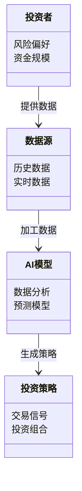
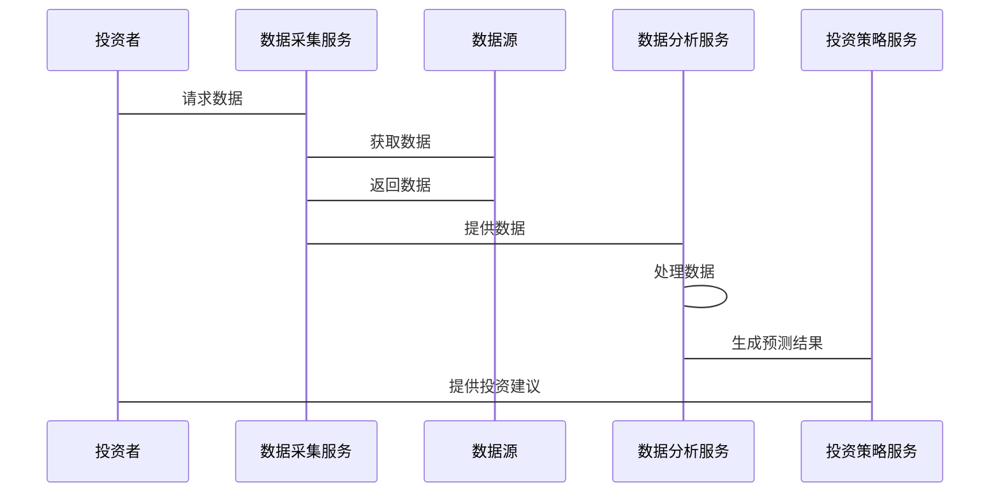

                 


# 巴菲特如何看待人工智能在金融服务中的应用

> 关键词：巴菲特，人工智能，金融服务，投资策略，风险管理，机器学习，深度学习

> 摘要：本文深入探讨了巴菲特对人工智能在金融服务中的应用的看法。通过分析巴菲特的投资理念与人工智能技术的结合，揭示了人工智能在金融数据分析、风险管理、交易策略优化等方面的重要作用。文章详细讲解了机器学习、强化学习和深度学习等人工智能算法在金融中的应用，并结合实际案例分析了这些技术如何帮助投资者做出更明智的决策。最后，总结了巴菲特对人工智能的评价以及对未来的展望。

---

# 第一部分：背景介绍

## 第1章：巴菲特的投资理念与人工智能的结合

### 1.1 巴菲特的投资理念概述

#### 1.1.1 巴菲特的价值投资理论

巴菲特的价值投资理论强调长期投资、注重企业基本面分析以及安全边际。他认为，投资的本质是寻找具有持续竞争优势的企业，并以合理的价格买入并长期持有。这种投资策略的核心在于对企业的深入研究和对市场波动的长期忽视。

**关键概念对比表：**

| 投资策略 | 描述 |
|----------|------|
| 价值投资 | 基于企业的内在价值，寻找市场价格低于内在价值的投资机会 |
| 股价波动 | 忽略短期市场波动，关注长期价值 |

#### 1.1.2 巴菲特对长期投资的坚持

巴菲特始终坚持长期投资的理念，认为短期市场的波动并不会影响企业的内在价值。他强调，投资者应关注企业的长期盈利能力，而不是市场的短期情绪。

#### 1.1.3 巴菲特对市场波动的看法

巴菲特认为，市场波动是不可避免的，但投资者应避免被短期波动所干扰。他提出“市场先生”的概念，认为市场先生的情绪波动为理性投资者提供了套利机会。

### 1.2 人工智能的基本概念与技术特点

#### 1.2.1 人工智能的定义与技术原理

人工智能（Artificial Intelligence, AI）是指计算机系统模拟人类智能的能力，包括学习、推理、自我修正等。AI的核心技术包括机器学习、自然语言处理、计算机视觉和强化学习等。

#### 1.2.2 机器学习的核心算法

机器学习是人工智能的重要分支，主要通过数据训练模型，使其能够从数据中学习并做出预测或分类。常用算法包括线性回归、支持向量机（SVM）、随机森林和神经网络等。

#### 1.2.3 人工智能在金融领域的应用潜力

人工智能在金融领域的应用潜力巨大，尤其是在数据分析、风险评估、交易策略优化等方面。通过AI技术，投资者可以更高效地处理大量数据，发现潜在的投资机会。

### 1.3 巴菲特与人工智能的结合背景

#### 1.3.1 人工智能在金融行业的兴起

随着大数据和计算能力的提升，人工智能在金融行业的应用逐渐兴起。金融机构开始利用AI技术进行数据分析、客户画像构建和风险评估。

#### 1.3.2 巴菲特对技术进步的态度

尽管巴菲特本人并不是技术专家，但他对技术进步持开放态度。他认为，技术进步可以为金融服务带来新的可能性，但同时也需要谨慎评估其实际效果。

#### 1.3.3 人工智能如何改变金融服务模式

人工智能通过自动化和智能化的方式，改变了金融服务的传统模式。例如，AI可以自动化处理交易、实时监控市场动态，并为投资者提供个性化的投资建议。

---

## 第2章：人工智能在金融服务中的核心应用

### 2.1 数据分析与预测

#### 2.1.1 人工智能在金融数据分析中的作用

AI通过处理海量数据，帮助投资者发现潜在的市场趋势和投资机会。例如，通过自然语言处理技术，AI可以分析新闻和社交媒体数据，预测市场情绪。

#### 2.1.2 机器学习算法在预测中的应用

机器学习算法可以通过历史数据训练模型，预测股票价格的走势。例如，使用线性回归模型预测股票价格的变化趋势。

#### 2.1.3 通过AI优化投资组合

AI可以根据市场动态和投资者的风险偏好，优化投资组合的配置。例如，使用均值-方差优化模型，AI可以在风险可控的前提下，最大化投资收益。

### 2.2 风险管理与控制

#### 2.2.1 人工智能在风险评估中的应用

AI可以通过分析企业的财务数据和市场信息，评估企业的信用风险和市场风险。例如，使用支持向量机（SVM）模型进行信用评分。

#### 2.2.2 AI如何帮助识别市场风险

AI可以通过实时监控市场数据，识别潜在的市场风险。例如，使用异常检测算法，AI可以发现市场中的异常波动，并及时发出预警。

#### 2.2.3 通过AI实现动态风险管理

AI可以根据市场变化动态调整风险管理策略。例如，使用强化学习算法，AI可以在动态环境中优化风险控制策略。

### 2.3 交易策略与自动化

#### 2.3.1 人工智能在量化交易中的应用

量化交易通过算法自动执行交易策略。AI可以通过分析市场数据，生成交易信号，并自动执行交易。例如，使用K线图数据，AI可以训练一个强化学习模型，模拟交易决策过程。

#### 2.3.2 AI如何优化交易策略

AI可以通过回测历史数据，优化交易策略。例如，使用遗传算法，AI可以搜索最优的交易参数组合。

#### 2.3.3 自动化交易系统的设计与实现

自动化交易系统通常包括数据采集、信号生成、订单执行和风险管理四个模块。AI技术可以优化信号生成和风险管理模块，提高交易效率和收益。

---

## 第3章：巴菲特对人工智能在金融中的看法

### 3.1 巴菲特对AI技术的评价

#### 3.1.1 巴菲特对AI技术的肯定

巴菲特对人工智能技术在数据分析和预测方面的潜力表示肯定。他认为，AI技术可以帮助投资者更高效地处理数据，发现潜在的投资机会。

#### 3.1.2 巴菲特对AI技术的担忧

巴菲特对AI技术的过度依赖表示担忧。他认为，AI技术可能会导致投资者忽视企业的基本面分析，仅依赖于数据预测，从而增加投资风险。

#### 3.1.3 巴菲特对AI技术的中立态度

总体来看，巴菲特对AI技术持中立态度。他认为，AI技术可以作为辅助工具，但不能完全取代人类的判断。

### 3.2 巴菲特对AI在金融中的应用前景

#### 3.2.1 AI在金融领域的潜在价值

AI在金融领域的潜在价值巨大。例如，AI可以通过分析非结构化数据（如新闻、社交媒体），提供更全面的市场分析。

#### 3.2.2 巴菲特对AI取代人类投资的思考

巴菲特认为，AI技术可以提高投资效率，但无法完全取代人类的投资决策。他强调，投资的本质是理解企业，而不仅仅是数据预测。

#### 3.2.3 AI在金融中的长期发展趋势

随着技术的进步，AI在金融中的应用将越来越广泛。例如，AI可以通过实时数据分析，提供个性化的投资建议，并动态调整投资策略。

### 3.3 巴菲特对AI与人类决策的结合

#### 3.3.1 人类决策与AI决策的优缺点对比

| 决策方式 | 优点 | 缺点 |
|----------|------|------|
| 人类决策 | 考虑企业基本面，注重长期价值 | 易受情绪影响，决策效率低 |
| AI决策 | 数据处理能力强，决策效率高 | 依赖数据，忽视企业基本面 |

#### 3.3.2 AI如何辅助人类决策

AI可以通过数据预测和风险评估，辅助人类投资者做出更明智的决策。例如，AI可以提供市场趋势分析和投资组合优化建议。

#### 3.3.3 人类与AI在金融决策中的协同作用

人类与AI可以在金融决策中实现协同作用。例如，AI负责数据分析和预测，而人类负责制定投资策略和评估企业基本面。

---

## 第4章：人工智能在金融中的算法原理

### 4.1 机器学习算法在金融中的应用

#### 4.1.1 线性回归与金融预测

线性回归是一种简单而有效的回归分析方法，常用于金融预测。例如，使用线性回归模型预测股票价格的变化趋势。

#### 4.1.2 支持向量机在金融分类中的应用

支持向量机（SVM）是一种强大的分类算法，常用于金融分类问题。例如，使用SVM模型对股票进行涨跌分类。

#### 4.1.3 随机森林在金融数据分析中的应用

随机森林是一种基于决策树的集成算法，常用于金融数据分析。例如，使用随机森林模型进行信用评分和风险评估。

### 4.2 强化学习在金融交易中的应用

#### 4.2.1 强化学习的基本原理

强化学习是一种通过试错学习的方法，常用于动态环境中的决策问题。例如，使用强化学习算法优化交易策略。

#### 4.2.2 强化学习在量化交易中的实现

强化学习可以通过模拟交易环境，训练一个智能体，使其在市场中做出最优的交易决策。

#### 4.2.3 强化学习在投资决策中的应用

强化学习可以应用于投资组合优化和风险控制。例如，使用强化学习模型动态调整投资组合，以应对市场变化。

### 4.3 深度学习在金融中的应用

#### 4.3.1 卷积神经网络在金融图像识别中的应用

卷积神经网络（CNN）常用于图像识别任务，可以应用于金融领域的图像识别，例如识别股票K线图中的模式。

#### 4.3.2 循环神经网络在金融时间序列分析中的应用

循环神经网络（RNN）常用于时间序列分析，可以应用于金融市场的趋势预测。

#### 4.3.3 Transformer在金融文本分析中的应用

Transformer是一种基于注意力机制的深度学习模型，常用于文本分析任务。例如，使用Transformer模型分析新闻和社交媒体数据，预测市场情绪。

---

## 第5章：系统分析与架构设计方案

### 5.1 问题场景介绍

在金融领域，投资者需要面对复杂的市场环境和大量数据。传统的投资方法依赖于人工分析，效率低下且容易受到情绪影响。AI技术的引入可以帮助投资者更高效地处理数据，优化投资策略。

### 5.2 系统功能设计

#### 5.2.1 领域模型（mermaid类图）



### 5.3 系统架构设计（mermaid架构图）


### 5.4 系统接口设计

系统接口设计包括数据采集接口、数据分析接口和投资策略接口。例如，数据采集接口负责获取历史和实时数据，数据分析接口负责处理数据并生成预测结果，投资策略接口负责根据预测结果生成交易信号。

### 5.5 系统交互设计（mermaid序列图）



---

## 第6章：项目实战

### 6.1 环境安装

为了实现基于机器学习的股票价格预测系统，首先需要安装以下环境：

- Python 3.8+
- Jupyter Notebook
- scikit-learn
- pandas
- numpy
- matplotlib
- yfinance（数据获取库）

### 6.2 系统核心实现源代码

以下是一个简单的股票价格预测系统的代码示例：

```python
# 导入必要的库
import pandas as pd
import numpy as np
from sklearn.model_selection import train_test_split
from sklearn.linear_model import LinearRegression
import matplotlib.pyplot as plt
import yfinance as yf

# 下载数据
data = yf.download('AAPL', start='2020-01-01', end='2023-01-01')

# 数据预处理
features = data[['Open', 'High', 'Low', 'Volume']]
target = data['Close']

# 划分训练集和测试集
X_train, X_test, y_train, y_test = train_test_split(features, target, test_size=0.2, random_state=42)

# 训练模型
model = LinearRegression()
model.fit(X_train, y_train)

# 预测
y_pred = model.predict(X_test)

# 可视化
plt.scatter(y_test, y_pred)
plt.xlabel('Actual Price')
plt.ylabel('Predicted Price')
plt.title('Linear Regression Model')
plt.show()
```

### 6.3 代码应用解读与分析

上述代码实现了一个简单的线性回归模型，用于预测苹果股票的价格。通过使用yfinance库获取数据，进行数据预处理，训练模型，并进行预测。最后，通过可视化结果，评估模型的预测效果。

### 6.4 实际案例分析

以苹果公司（AAPL）为例，使用上述代码进行股票价格预测。通过分析预测结果与实际价格的差异，评估模型的准确性。例如，如果模型预测价格与实际价格差异较小，则说明模型具有较高的预测能力。

### 6.5 项目小结

通过本项目，我们了解了如何使用机器学习技术进行股票价格预测。尽管模型的预测效果可能不够理想，但通过不断优化模型和特征选择，可以提高预测的准确性。

---

## 第7章：总结与展望

### 7.1 总结

人工智能在金融服务中的应用潜力巨大。通过数据分析、预测和优化，AI技术可以帮助投资者做出更明智的决策。然而，AI技术的过度依赖也可能导致投资者忽视企业的基本面分析，增加投资风险。

### 7.2 注意事项

在使用AI技术进行投资决策时，投资者应结合企业的基本面分析，避免单纯依赖数据预测。同时，应定期监控和评估AI模型的性能，及时调整投资策略。

### 7.3 未来展望

随着技术的进步，AI在金融中的应用将越来越广泛。例如，AI可以通过实时数据分析，提供个性化的投资建议，并动态调整投资策略。此外，AI技术还可以应用于金融监管和风险控制，帮助监管机构更好地维护市场秩序。

---

# 作者：AI天才研究院/AI Genius Institute & 禅与计算机程序设计艺术 /Zen And The Art of Computer Programming

---

通过以上结构，我们可以看到，巴菲特对人工智能在金融服务中的应用持开放态度，认为AI技术可以作为辅助工具，帮助投资者更高效地处理数据，优化投资策略。然而，他也提醒投资者不应完全依赖AI技术，而应结合企业的基本面分析，做出更明智的投资决策。

