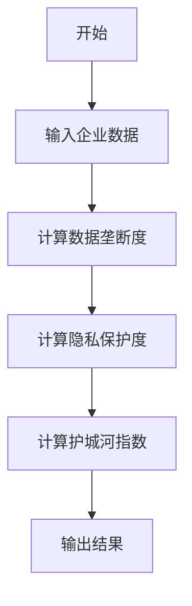
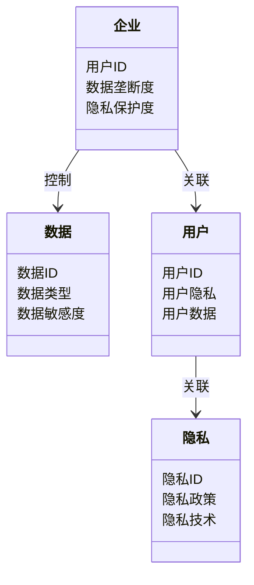
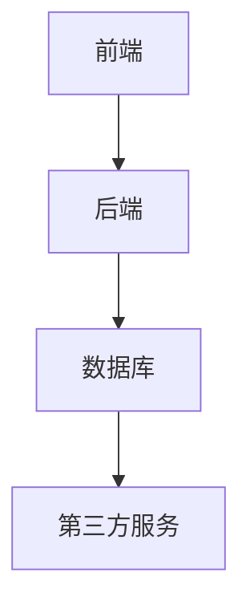
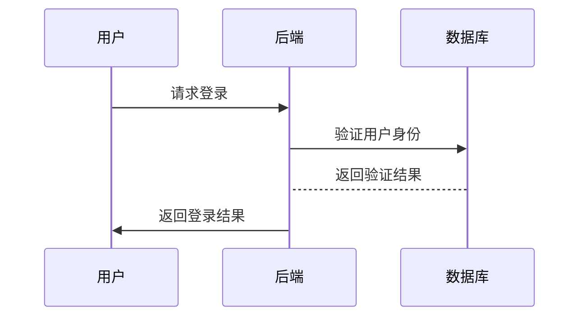
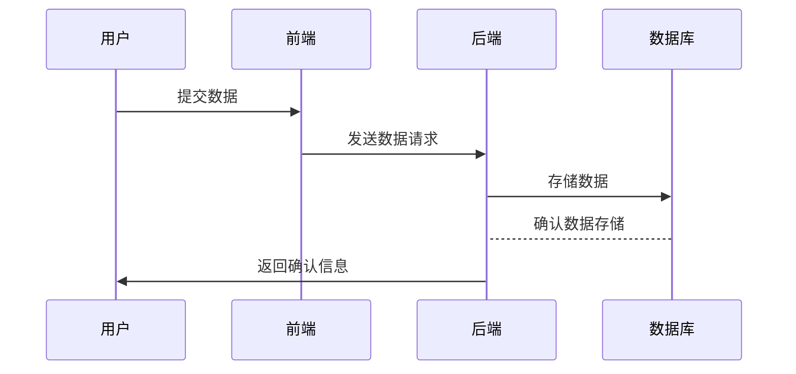

                 


# 巴菲特的护城河理论4.0：数据垄断与隐私保护的平衡

> 关键词：巴菲特护城河理论，数据垄断，隐私保护，数据安全，企业竞争策略

> 摘要：本文深入分析巴菲特护城河理论的第四代发展，重点探讨数据垄断与隐私保护的平衡。通过技术角度解析数据垄断的经济价值、隐私保护的法律与伦理挑战，以及如何在两者之间找到平衡点。结合算法原理、系统架构设计和实际案例，本文为企业在数字化时代构建可持续的竞争优势提供指导。

---

# 第一部分: 巴菲特护城河理论4.0概述

## 第1章: 巴菲特护城河理论的背景与发展

### 1.1 护城河理论的起源与演变

#### 1.1.1 巴菲特护城河理论的起源  
巴菲特护城河理论起源于投资领域，强调企业通过建立独特的竞争优势（如品牌、技术、市场准入等）形成“护城河”，以抵御竞争对手的侵蚀。最初的护城河理论注重企业的结构性优势，如成本优势、规模效应和独特的商业模式。

#### 1.1.2 护城河理论从1.0到4.0的演变  
随着信息技术的发展，特别是进入数字化时代后，护城河理论逐步演变为：  
- **1.0版本**：基于传统经济的结构性优势（成本、规模、品牌）。  
- **2.0版本**：引入了技术创新和知识产权作为核心竞争力。  
- **3.0版本**：开始关注数据驱动的竞争优势。  
- **4.0版本**：数据垄断与隐私保护成为核心要素，强调在数据驱动经济中平衡数据控制与用户隐私。

#### 1.1.3 护城河理论4.0的核心变化  
4.0版本的核心变化是将数据垄断与隐私保护纳入护城河的构建逻辑中。数据垄断不再是单纯的资源控制，而是需要在法律、伦理和技术的框架下，找到数据利用与隐私保护的平衡点。

---

## 第2章: 护城河理论4.0的核心概念

### 2.1 数据垄断与隐私保护的定义

#### 2.1.1 数据垄断的定义与特征  
数据垄断是指企业通过获取、控制和利用数据资源，形成对市场的支配地位。其特征包括：  
- 数据独占性：企业通过技术或市场手段获取 exclusive 数据资源。  
- 数据规模效应：通过海量数据的积累形成竞争优势。  
- 数据驱动决策：利用数据进行精准营销、风险控制和产品优化。

#### 2.1.2 隐私保护的定义与特征  
隐私保护是指在数据收集、存储和使用过程中，保护个人隐私不被滥用。其特征包括：  
- 数据匿名化：通过技术手段确保数据无法直接关联到个人身份。  
- 数据最小化：仅收集实现特定目的所需的最小数据集。  
- 数据安全：通过加密、访问控制等技术手段防止数据泄露。

#### 2.1.3 数据垄断与隐私保护的关系  
数据垄断与隐私保护是矛盾统一的关系。数据垄断为企业创造竞争优势，但过度的数据控制可能侵犯用户隐私，引发法律和道德风险。因此，平衡是关键。

---

### 2.2 护城河理论4.0的核心要素

#### 2.2.1 数据垄断的核心要素  
- 数据来源：企业通过多种渠道获取数据（如用户行为数据、市场调研数据）。  
- 数据处理能力：利用大数据技术（如机器学习、AI）分析数据，提取价值。  
- 数据应用：通过数据驱动决策，优化产品、服务和商业模式。

#### 2.2.2 隐私保护的核心要素  
- 数据收集：遵循 GDPR 等隐私保护法规，明确数据收集的目的和范围。  
- 数据存储：采用加密存储、分布式存储等技术，降低数据泄露风险。  
- 数据使用：通过隐私计算（如联邦学习、差分隐私）技术，在保护隐私的前提下利用数据。

#### 2.2.3 两者之间的平衡机制  
- 技术创新：通过隐私计算、数据脱敏等技术，在数据利用与隐私保护之间找到平衡。  
- 政策法规：遵循 GDPR、CCPA 等隐私保护法规，确保数据垄断的合法性。  
- 企业责任：企业需要在追求数据垄断的同时，承担保护用户隐私的社会责任。

---

## 第3章: 数据垄断与隐私保护的平衡

### 3.1 数据垄断对企业的价值

#### 3.1.1 数据垄断的经济价值  
- 数据垄断可以提高企业的市场准入门槛，形成竞争壁垒。  
- 数据垄断能够支持企业进行精准营销，提高转化率和用户粘性。  
- 数据垄断为企业提供数据驱动的决策支持，降低经营风险。

#### 3.1.2 数据垄断的竞争优势  
- 数据垄断使企业能够通过数据分析优化产品和服务。  
- 数据垄断为企业在新兴市场中占据先发优势。  
- 数据垄断可以增强企业与竞争对手的差异化竞争能力。

#### 3.1.3 数据垄断的可持续性  
- 数据垄断需要持续的技术投入和数据积累。  
- 数据垄断的可持续性依赖于企业的创新能力和服务质量。  
- 数据垄断的合法性依赖于政策法规的合规性。

---

### 3.2 隐私保护的法律与伦理挑战

#### 3.2.1 隐私保护的法律框架  
- GDPR（通用数据保护条例）：规定了个人数据的收集、存储和使用原则。  
- CCPA（加州消费者隐私法案）：赋予用户对其数据的知情权、访问权和删除权。  
- 数据保护法：各国纷纷出台数据保护法规，要求企业保护用户隐私。

#### 3.2.2 隐私保护的伦理问题  
- 数据使用中的透明性：用户需要了解企业如何使用其数据。  
- 数据滥用的风险：企业可能利用数据进行不当行为（如价格歧视）。  
- 数据安全：数据泄露可能导致用户的隐私和财务损失。

#### 3.2.3 隐私保护的技术手段  
- 数据加密：通过加密技术保护数据在传输和存储中的安全。  
- 数据匿名化：通过技术手段脱敏数据，使其无法关联到具体个人。  
- 差分隐私：在数据发布中添加噪声，保护个体隐私。

---

### 3.3 平衡数据垄断与隐私保护的策略

#### 3.3.1 数据使用与隐私保护的权衡  
- 在数据使用中，企业需要明确数据的用途，并遵守隐私保护法规。  
- 数据的最小化原则：只收集实现目标所需的最小数据集。  
- 数据的匿名化处理：在不影响数据分析的前提下，保护用户隐私。

#### 3.3.2 数据共享的隐私保护机制  
- 联邦学习（Federated Learning）：在不分享原始数据的情况下，通过模型更新实现数据协作。  
- 差分隐私（Differential Privacy）：在数据发布中添加噪声，保护个体隐私。  
- 数据脱敏：通过技术手段将敏感数据转化为匿名数据。

#### 3.3.3 技术创新在平衡中的作用  
- 隐私计算技术：通过技术创新实现数据的隐私利用。  
- 区块链技术：通过区块链的不可篡改性，确保数据的透明性和安全性。  
- 人工智能技术：通过 AI 分析数据，同时保护用户隐私。

---

# 第二部分: 核心概念与联系

## 第4章: 核心概念对比分析

### 4.1 数据垄断与隐私保护的对比

| **对比维度** | **数据垄断** | **隐私保护** |
|--------------|--------------|--------------|
| **定义** | 数据垄断是指企业通过获取、控制和利用数据资源，形成对市场的支配地位。 | 隐私保护是指在数据收集、存储和使用过程中，保护个人隐私不被滥用。 |
| **特征** | 数据独占性、数据规模效应、数据驱动决策 | 数据匿名化、数据最小化、数据安全 |
| **优势** | 提高市场竞争力、优化产品和服务、降低经营风险 | 避免数据泄露、保护用户隐私、合规性 |
| **劣势** | 可能引发反垄断风险、用户隐私问题 | 技术实现复杂、合规成本高 |
| **应用场景** | 电商、金融、科技企业 | 所有涉及数据处理的行业 |

---

## 第5章: ER实体关系图

### 5.1 数据垄断与隐私保护的实体关系

```mermaid
er
    entity 企业 {
        key 用户ID
        attribute 数据垄断度
        attribute 隐私保护度
    }
    entity 数据 {
        key 数据ID
        attribute 数据类型
        attribute 数据敏感度
    }
    entity 用户 {
        key 用户ID
        attribute 用户隐私
        attribute 用户数据
    }
    entity 隐私 {
        key 隐私ID
        attribute 隐私政策
        attribute 隐私技术
    }
    relationship 企业-数据 {
        role 企业控制的数据
        cardinality 1:N
    }
    relationship 用户-隐私 {
        role 用户隐私关联
        cardinality 1:N
    }
```

---

## 第6章: 算法原理讲解

### 6.1 护城河指数的计算模型

#### 6.1.1 护城河指数的定义  
护城河指数是一个量化指标，用于衡量企业在数据垄断与隐私保护之间的平衡能力。其计算公式如下：

$$ \text{护城河指数} = \alpha \times \text{数据垄断度} + \beta \times \text{隐私保护度} $$

其中，$\alpha$ 和 $\beta$ 是权重系数，$\alpha + \beta = 1$。

#### 6.1.2 数据垄断度的计算  
数据垄断度主要通过以下指标进行评估：  
- 数据市场规模占比（Market Share）  
- 数据独占性（Data Exclusivity）  
- 数据处理能力（Data Processing Capability）  

数据垄断度的计算公式如下：

$$ \text{数据垄断度} = \frac{\text{企业数据规模} + \text{数据独占性} + \text{数据处理能力}}{3} $$

#### 6.1.3 隐私保护度的计算  
隐私保护度主要通过以下指标进行评估：  
- 数据加密强度（Encryption Strength）  
- 数据匿名化程度（Data Anonymization）  
- 数据安全合规性（Security Compliance）  

隐私保护度的计算公式如下：

$$ \text{隐私保护度} = \frac{\text{数据加密强度} + \text{数据匿名化程度} + \text{数据安全合规性}}{3} $$

---

### 6.2 护城河指数的计算流程



---

## 第7章: 系统分析与架构设计方案

### 7.1 问题场景介绍

#### 7.1.1 问题背景  
随着数字化转型的推进，企业对数据的依赖程度不断提高。如何在数据垄断与隐私保护之间找到平衡，成为企业构建护城河的关键挑战。

#### 7.1.2 问题描述  
企业在数据垄断过程中可能面临以下问题：  
- 数据垄断可能导致市场垄断，引发反垄断风险。  
- 数据使用不当可能侵犯用户隐私，引发法律问题。  
- 数据保护技术不足，可能导致数据泄露。  

#### 7.1.3 问题解决  
通过技术创新和制度建设，在数据垄断与隐私保护之间找到平衡点。

---

### 7.2 系统功能设计

#### 7.2.1 领域模型设计



---

### 7.3 系统架构设计



---

### 7.4 接口与交互设计

#### 7.4.1 用户登录流程



#### 7.4.2 数据采集流程



---

## 第8章: 项目实战

### 8.1 环境安装

#### 8.1.1 安装Python与相关库  
```bash
pip install numpy pandas scikit-learn matplotlib
```

---

### 8.2 核心代码实现

#### 8.2.1 护城河指数计算代码

```python
import numpy as np
import pandas as pd

def calculate_hospitality_index(data_monopoly, privacy_protection):
    alpha = 0.5
    beta = 0.5
    return alpha * data_monopoly + beta * privacy_protection

# 示例数据
data_monopoly = 0.8
privacy_protection = 0.7

# 计算护城河指数
h_index = calculate_hospitality_index(data_monopoly, privacy_protection)
print(f"护城河指数: {h_index}")
```

---

## 第9章: 最佳实践与小结

### 9.1 最佳实践

#### 9.1.1 数据收集透明化  
企业在收集数据时，应明确告知用户数据的用途和范围。

#### 9.1.2 隐私保护技术选型  
优先采用联邦学习、差分隐私等隐私保护技术，确保数据利用的合法性。

#### 9.1.3 动态调整策略  
根据政策法规的变化和技术进步，动态调整数据垄断与隐私保护的平衡策略。

---

### 9.2 小结

护城河理论4.0为企业在数据垄断与隐私保护之间找到了新的平衡点。通过技术创新和制度建设，企业可以在追求数据垄断优势的同时，保护用户隐私，实现可持续的竞争优势。

---

### 9.3 注意事项

- 数据垄断与隐私保护的平衡需要企业在技术、法律和伦理层面综合考虑。  
- 企业需要持续关注政策法规的变化，及时调整数据保护策略。  
- 数据保护技术的选择需要结合企业的实际需求和预算。

---

### 9.4 拓展阅读

- GDPR 相关法规解读  
- 隐私计算技术（联邦学习、差分隐私）的研究进展  
- 数据垄断与反垄断法的交叉研究

---

## 作者

作者：AI天才研究院/AI Genius Institute & 禅与计算机程序设计艺术 /Zen And The Art of Computer Programming

