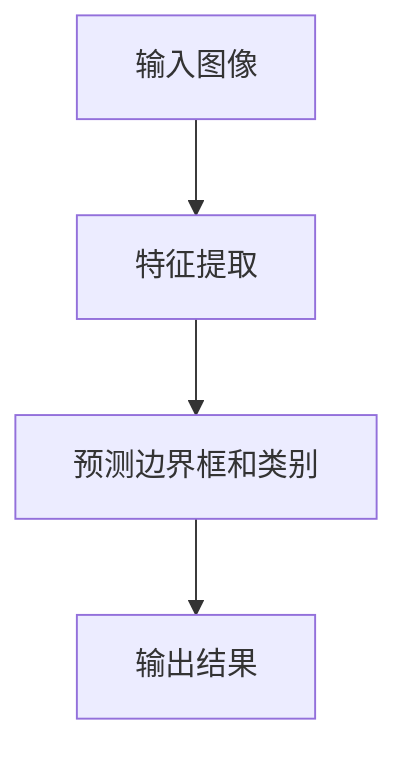
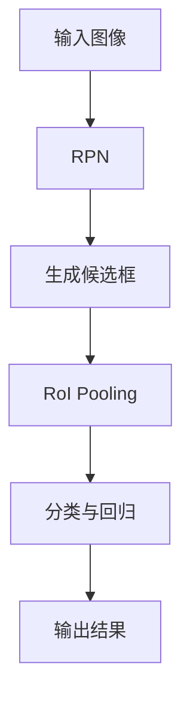
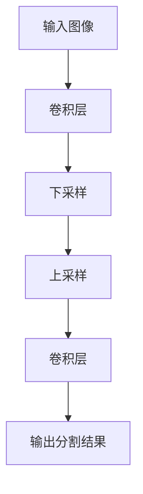
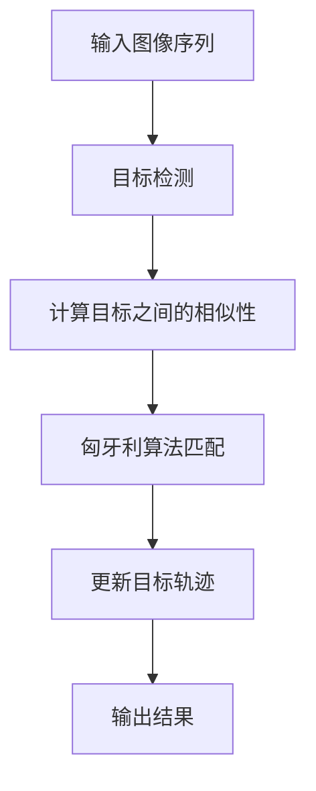
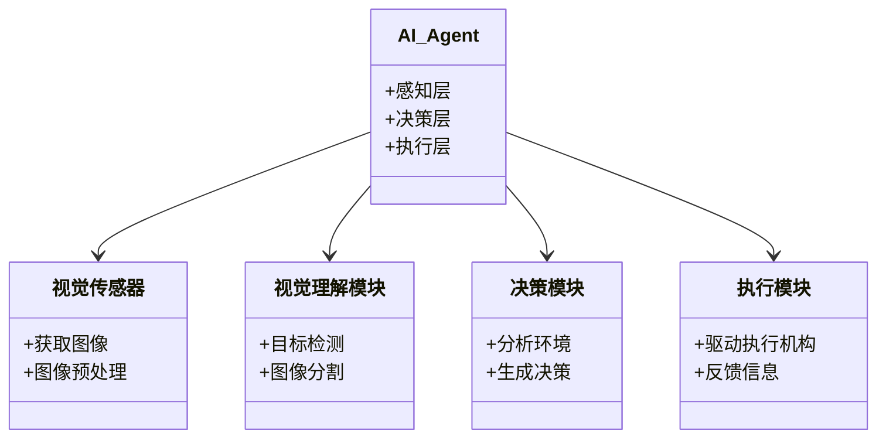
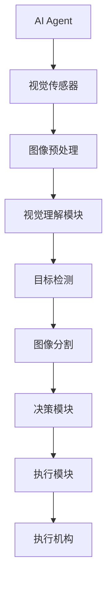
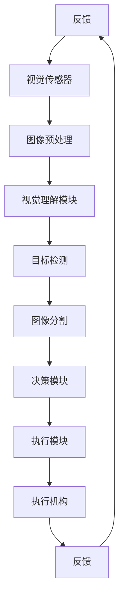

                 


# 开发具有视觉理解能力的AI Agent

> 关键词：AI Agent, 视觉理解, 计算机视觉, 深度学习, 目标检测

> 摘要：本文系统地探讨了开发具有视觉理解能力的AI Agent所需的关键技术和方法。从AI Agent的基本概念到视觉理解的核心技术，从算法原理到系统架构设计，再到实际项目实战，全面分析了开发具有视觉理解能力的AI Agent的全过程。通过详细的技术分析和实例演示，帮助读者掌握从理论到实践的完整开发流程。

---

# 第2章: AI Agent的发展背景

## 2.1 AI Agent的历史与发展

### 2.1.1 AI Agent的定义与分类
AI Agent（人工智能代理）是指在计算机系统中，能够感知环境、自主决策并执行任务的智能体。根据智能体的复杂性和应用场景，AI Agent可以分为简单反射式Agent、基于模型的反射式Agent、目标驱动的Agent、效用驱动的Agent以及基于强化学习的Agent等。

### 2.1.2 AI Agent的核心特征
- **自主性**：能够在没有外部干预的情况下自主运行。
- **反应性**：能够感知环境并实时响应。
- **目标驱动**：基于明确的目标执行任务。
- **学习能力**：通过数据和经验不断优化自身的性能。

### 2.1.3 AI Agent的发展历程
AI Agent的概念起源于20世纪60年代的专家系统研究。随着计算能力的提升和数据量的爆炸式增长，AI Agent从早期的规则驱动逐步向数据驱动和模型驱动方向发展。近年来，随着深度学习和大模型的兴起，AI Agent的能力得到了显著提升。

---

## 2.2 视觉理解技术的背景

### 2.2.1 计算机视觉的定义与应用领域
计算机视觉（Computer Vision）是指计算机能够通过算法处理图像或视频数据，理解图像中的内容并生成相应的描述或决策。计算机视觉技术广泛应用于图像识别、目标检测、图像分割、姿态估计等领域。

### 2.2.2 视觉理解的关键技术
- **目标检测**：识别图像中的目标物体及其位置。
- **图像分割**：将图像分割为多个区域，每个区域对应不同的语义信息。
- **目标跟踪**：在视频流中跟踪目标物体的运动轨迹。
- **图像生成**：通过生成对抗网络（GAN）生成逼真的图像。

### 2.2.3 视觉理解在AI Agent中的作用
视觉理解能力是AI Agent在复杂环境中完成任务的核心能力之一。通过视觉理解，AI Agent能够感知环境中的物体、场景和事件，从而做出更智能的决策和行动。

---

## 2.3 AI Agent与视觉理解的结合

### 2.3.1 结合的必要性与优势
- **必要性**：AI Agent需要通过视觉感知环境，理解场景信息，从而完成复杂的任务。
- **优势**：结合视觉理解能力后，AI Agent能够更准确地识别环境中的物体和场景，从而提高任务执行的效率和准确性。

### 2.3.2 当前研究现状
目前，AI Agent与视觉理解的结合主要集中在自动驾驶、智能机器人、智能安防等领域。这些领域的研究已经取得了一定的成果，但仍存在诸多挑战，如复杂场景下的实时性、多模态数据的融合等。

### 2.3.3 未来发展趋势
未来，随着深度学习技术的不断进步，AI Agent的视觉理解能力将更加智能化和多样化。同时，多模态数据的融合（如视觉、听觉、嗅觉等）将成为研究的重点，进一步提升AI Agent的感知能力。

---

## 2.4 本章小结
本章从AI Agent的基本概念和发展历程出发，详细介绍了视觉理解技术的背景及其在AI Agent中的作用。通过分析AI Agent与视觉理解的结合，揭示了当前的研究现状和未来的发展趋势。这些内容为后续章节的深入分析奠定了基础。

---

# 第3章: AI Agent的核心概念

## 3.1 AI Agent的基本原理

### 3.1.1 AI Agent的感知层
感知层是AI Agent获取环境信息的首要环节。通过传感器或摄像头等设备，AI Agent可以采集环境中的图像、声音、温度等数据。

### 3.1.2 AI Agent的决策层
决策层是AI Agent的核心，负责对感知层获取的信息进行分析和处理，生成相应的决策策略。

### 3.1.3 AI Agent的执行层
执行层负责根据决策层的决策指令，驱动执行机构（如机械臂、轮子等）完成具体的动作。

---

## 3.2 视觉理解的关键技术

### 3.2.1 目标检测
目标检测是计算机视觉中的一个核心任务，旨在检测图像中目标物体的位置和类别。常用的算法包括YOLO、Faster R-CNN等。

### 3.2.2 图像分割
图像分割将图像分割为多个区域，每个区域对应不同的语义信息。常用的算法包括U-Net、Mask R-CNN等。

### 3.2.3 目标跟踪
目标跟踪是在视频流中跟踪目标物体的运动轨迹。常用的算法包括SORT、FairMOT等。

---

## 3.3 AI Agent与视觉理解的结合

### 3.3.1 视觉信息的输入与处理
AI Agent通过摄像头或其他传感器获取视觉信息，并通过视觉理解技术对这些信息进行处理和分析。

### 3.3.2 视觉信息的决策与执行
AI Agent根据处理后的视觉信息生成决策指令，并驱动执行机构完成具体的动作。

### 3.3.3 视觉信息的反馈与优化
AI Agent通过反馈机制不断优化自身的视觉理解和决策能力，从而提高任务执行的效率和准确性。

---

## 3.4 本章小结
本章详细介绍了AI Agent的核心概念及其与视觉理解技术的结合方式。通过对感知层、决策层和执行层的分析，揭示了AI Agent的基本原理。同时，通过介绍视觉理解的关键技术，进一步探讨了AI Agent如何通过视觉信息实现更高级的智能行为。

---

# 第4章: 视觉理解技术的核心算法

## 4.1 目标检测算法

### 4.1.1 YOLO算法
YOLO（You Only Look Once）是一种单阶段的目标检测算法，具有速度快、精度高的特点。

#### YOLO的流程图


#### YOLO的Python实现代码
```python
import torch
from torch import nn
import numpy as np

# 定义YOLO模型
class YOLO(nn.Module):
    def __init__(self, num_classes):
        super(YOLO, self).__init__()
        self.num_classes = num_classes
        self.conv1 = nn.Conv2d(3, 32, kernel_size=3, stride=1, padding=1)
        self.conv2 = nn.Conv2d(32, 64, kernel_size=3, stride=1, padding=1)
        self.conv3 = nn.Conv2d(64, 128, kernel_size=3, stride=1, padding=1)
        self.conv4 = nn.Conv2d(128, 256, kernel_size=3, stride=1, padding=1)
        self.conv5 = nn.Conv2d(256, 512, kernel_size=3, stride=1, padding=1)
        self.conv6 = nn.Conv2d(512, 1024, kernel_size=3, stride=1, padding=1)
        self.conv7 = nn.Conv2d(1024, 512, kernel_size=1, stride=1, padding=0)
        self.conv8 = nn.Conv2d(512, 256, kernel_size=1, stride=1, padding=0)
        self.conv9 = nn.Conv2d(256, self.num_classes * 5, kernel_size=1, stride=1, padding=0)
        
    def forward(self, x):
        x = torch.relu(self.conv1(x))
        x = torch.relu(self.conv2(x))
        x = torch.relu(self.conv3(x))
        x = torch.relu(self.conv4(x))
        x = torch.relu(self.conv5(x))
        x = torch.relu(self.conv6(x))
        x = torch.relu(self.conv7(x))
        x = torch.relu(self.conv8(x))
        x = self.conv9(x)
        return x

# 初始化模型
model = YOLO(num_classes=80)
# 定义损失函数
criterion = nn.MSELoss()
# 定义优化器
optimizer = torch.optim.Adam(model.parameters(), lr=0.001)
```

#### YOLO的数学模型
YOLO的目标检测模型基于卷积神经网络（CNN），通过在最后一个卷积层输出边界框和类别概率分布。

$$
\text{输入图像} \rightarrow \text{特征提取} \rightarrow \text{预测边界框和类别概率分布}
$$

### 4.1.2 Faster R-CNN算法
Faster R-CNN是一种两阶段的目标检测算法，通过区域建议网络（RPN）生成候选框，再通过RoI Pooling提取特征并进行分类和回归。

#### Faster R-CNN的流程图


---

## 4.2 图像分割算法

### 4.2.1 U-Net算法
U-Net是一种广泛应用于医学图像分割的卷积神经网络。

#### U-Net的流程图


#### U-Net的Python实现代码
```python
import torch
from torch import nn

class UNet(nn.Module):
    def __init__(self, num_classes):
        super(UNet, self).__init__()
        self.conv1 = nn.Conv2d(3, 64, kernel_size=3, stride=1, padding=1)
        self.conv2 = nn.Conv2d(64, 128, kernel_size=3, stride=1, padding=1)
        self.conv3 = nn.Conv2d(128, 256, kernel_size=3, stride=1, padding=1)
        self.conv4 = nn.Conv2d(256, 512, kernel_size=3, stride=1, padding=1)
        self.conv5 = nn.Conv2d(512, 1024, kernel_size=3, stride=1, padding=1)
        self.upconv5 = nn.ConvTranspose2d(1024, 512, kernel_size=2, stride=2, padding=0)
        self.upconv4 = nn.ConvTranspose2d(512, 256, kernel_size=2, stride=2, padding=0)
        self.upconv3 = nn.ConvTranspose2d(256, 128, kernel_size=2, stride=2, padding=0)
        self.upconv2 = nn.ConvTranspose2d(128, 64, kernel_size=2, stride=2, padding=0)
        self.conv6 = nn.Conv2d(64, num_classes, kernel_size=1, stride=1, padding=0)
        
    def forward(self, x):
        x1 = torch.relu(self.conv1(x))
        x2 = torch.relu(self.conv2(x1))
        x3 = torch.relu(self.conv3(x2))
        x4 = torch.relu(self.conv4(x3))
        x5 = torch.relu(self.conv5(x4))
        x6 = torch.relu(self.upconv5(x5))
        x7 = torch.relu(self.upconv4(x6))
        x8 = torch.relu(self.upconv3(x7))
        x9 = torch.relu(self.upconv2(x8))
        x10 = self.conv6(x9)
        return x10

# 初始化模型
model = UNet(num_classes=2)
```

#### U-Net的数学模型
U-Net通过下采样和上采样操作，结合跳跃连接，实现对图像的精细分割。

$$
\text{输入图像} \rightarrow \text{下采样} \rightarrow \text{上采样} \rightarrow \text{输出分割结果}
$$

---

## 4.3 目标跟踪算法

### 4.3.1 SORT算法
SORT（Simple Online and Realtime Tracking）是一种基于匈牙利算法的目标跟踪方法。

#### SORT的流程图


#### SORT的Python实现代码
```python
import numpy as np

def sort_tracker(frame_idx, bbox):
    # 这里只是一个简单的示例，实际实现需要考虑更多细节
    if frame_idx == 0:
        return [0]  # 假设只有一个目标
    else:
        # 假设 bbox 是当前帧的目标检测结果
        # 这里需要实现匈牙利算法进行目标匹配
        pass

# 示例使用
bbox = (100, 200, 300, 400)
result = sort_tracker(1, bbox)
print(result)
```

---

## 4.4 本章小结
本章详细介绍了视觉理解技术中的核心算法，包括目标检测、图像分割和目标跟踪。通过流程图和代码示例，展示了这些算法的基本原理和实现方式。这些算法为AI Agent的视觉理解能力提供了坚实的技术基础。

---

# 第5章: 系统架构设计

## 5.1 项目介绍
本项目旨在开发一个具有视觉理解能力的AI Agent，能够通过摄像头采集图像信息，并通过视觉理解技术识别图像中的物体，进而做出相应的决策和行动。

---

## 5.2 系统功能设计

### 5.2.1 领域模型设计


---

## 5.3 系统架构设计

### 5.3.1 系统架构图


---

## 5.4 接口设计

### 5.4.1 视觉传感器接口
- **输入接口**：摄像头图像数据
- **输出接口**：预处理后的图像数据

### 5.4.2 视觉理解模块接口
- **输入接口**：预处理后的图像数据
- **输出接口**：目标检测结果、图像分割结果

### 5.4.3 决策模块接口
- **输入接口**：目标检测结果、图像分割结果
- **输出接口**：决策指令

---

## 5.5 交互流程设计

### 5.5.1 交互流程图


---

## 5.6 本章小结
本章通过领域模型和系统架构图，详细描述了具有视觉理解能力的AI Agent的系统设计。通过接口设计和交互流程图，展示了系统各模块之间的协作关系。

---

# 第6章: 项目实战

## 6.1 环境安装

### 6.1.1 安装Python
```bash
# 安装Python
sudo apt-get install python3 python3-dev
```

### 6.1.2 安装深度学习框架
```bash
# 安装TensorFlow或PyTorch
pip install tensorflow
# 或
pip install torch torchvision torchaudio
```

---

## 6.2 系统核心实现

### 6.2.1 视觉传感器实现
```python
import cv2

def get_image():
    # 假设使用摄像头0
    cap = cv2.VideoCapture(0)
    while True:
        ret, frame = cap.read()
        if not ret:
            break
        yield frame
    cap.release()
```

### 6.2.2 视觉理解模块实现
```python
import torch
from torchvision import transforms

def preprocess_image(image):
    # 图像预处理
    transform = transforms.Compose([
        transforms.Resize(256),
        transforms.CenterCrop(224),
        transforms.ToTensor(),
        transforms.Normalize(mean=[0.485, 0.456, 0.406], std=[0.229, 0.224, 0.225]),
    ])
    input_tensor = transform(image)
    return input_tensor

def perform_inference(model, input_tensor):
    with torch.no_grad():
        output = model(input_tensor)
        return output
```

### 6.2.3 决策模块实现
```python
def make_decision(output):
    # 假设输出是一个概率分布
    probabilities = output.softmax(dim=1)
    max_prob, predicted_class = torch.max(probabilities, dim=1)
    return predicted_class.item()
```

### 6.2.4 执行模块实现
```python
def execute_action(action):
    # 假设执行机构是一个机械臂
    print(f"执行动作：{action}")
```

---

## 6.3 代码应用解读与分析
通过上述代码，我们可以看到AI Agent的基本实现流程：通过视觉传感器获取图像信息，通过视觉理解模块对图像进行预处理和分析，通过决策模块生成决策指令，最后通过执行模块完成具体的动作。

---

## 6.4 实际案例分析
以自动驾驶为例，AI Agent通过摄像头获取道路图像信息，通过视觉理解模块识别道路上的车辆、行人和交通标志，通过决策模块做出转向和加速/减速的决策，最后通过执行模块控制方向盘和油门。

---

## 6.5 项目小结
本章通过实际项目实战，详细展示了具有视觉理解能力的AI Agent的开发过程。从环境安装到系统实现，再到实际案例分析，帮助读者掌握从理论到实践的完整开发流程。

---

# 第7章: 总结与展望

## 7.1 本章小结
本文系统地探讨了开发具有视觉理解能力的AI Agent所需的关键技术和方法。从AI Agent的基本概念到视觉理解的核心技术，从算法原理到系统架构设计，再到实际项目实战，全面分析了开发具有视觉理解能力的AI Agent的全过程。

---

## 7.2 本书的核心要点
- AI Agent的核心概念和基本原理
- 视觉理解技术的关键算法和实现方式
- 系统架构设计的方法和技巧
- 项目实战中的具体实现细节

---

## 7.3 注意事项
- 在实际开发中，需要注意模型的实时性和准确性之间的平衡。
- 数据的多样性和质量对模型的性能有重要影响，需要进行充分的数据预处理和增强。
- 系统的可扩展性和可维护性需要在设计阶段充分考虑。

---

## 7.4 未来展望
随着深度学习技术的不断进步，AI Agent的视觉理解能力将更加智能化和多样化。同时，多模态数据的融合（如视觉、听觉、嗅觉等）将成为研究的重点，进一步提升AI Agent的感知能力。

---

# 作者：AI天才研究院 & 禅与计算机程序设计艺术

