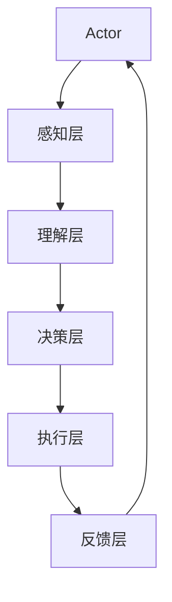
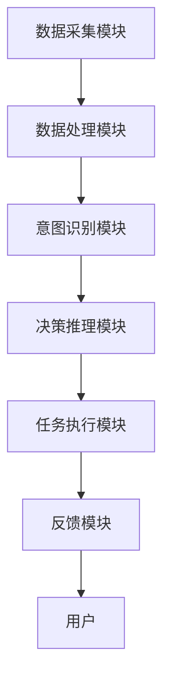
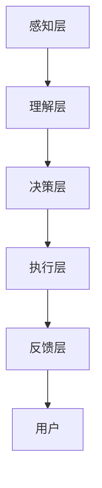
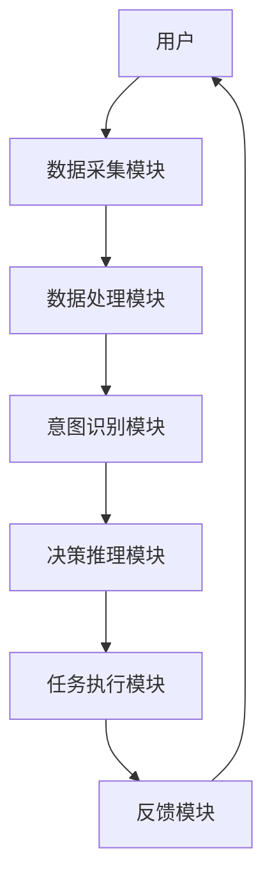

                 


# 开发多模态交互的AI Agent系统

> 关键词：多模态交互，AI Agent，系统架构，算法原理，项目实战

> 摘要：本文详细探讨了开发多模态交互的AI Agent系统的各个方面，从核心概念到算法原理，再到系统架构设计和项目实战。文章首先介绍了多模态交互和AI Agent的基本概念及其重要性，然后深入分析了它们的核心原理和相互关系。接着，文章详细讲解了实现多模态交互与AI Agent的算法原理，包括数据处理、融合方法和模型训练策略。随后，通过系统架构设计，展示了如何构建一个高效稳定的多模态交互AI Agent系统。最后，通过一个具体的项目实战案例，详细介绍了从环境搭建到代码实现、功能测试和优化的全过程，为读者提供了宝贵的实战经验。本文内容丰富，结构清晰，适合AI工程师、系统架构师及相关领域研究者阅读和参考。

---

# 第1章: 多模态交互与AI Agent系统背景介绍

## 1.1 多模态交互的概念与特点

### 1.1.1 多模态交互的定义

多模态交互是指通过多种信息载体（如文本、语音、图像、视频、手势等）进行信息传递和反馈的交互方式。与单模态交互（仅依赖单一信息载体）相比，多模态交互能够更全面地捕捉和理解用户的意图和情感，提供更自然、更智能的交互体验。

### 1.1.2 多模态交互的核心要素

多模态交互的核心要素包括：

1. **输入模态**：用户通过多种模态（如文本输入、语音输入、图像输入等）向系统发送信息。
2. **输出模态**：系统通过多种模态（如文本输出、语音输出、图像输出等）向用户反馈信息。
3. **模态融合**：将不同模态的数据进行整合和分析，以提高交互的准确性和智能性。

### 1.1.3 多模态交互的发展趋势

随着人工智能技术的快速发展，多模态交互正朝着以下方向发展：

1. **智能化**：通过深度学习等技术，实现对多模态数据的智能理解和分析。
2. **个性化**：根据用户的偏好和行为，提供个性化的交互体验。
3. **实时化**：实现低延迟、高实时性的多模态交互，满足用户对实时反馈的需求。

## 1.2 AI Agent系统的定义与特点

### 1.2.1 AI Agent的定义

AI Agent（人工智能代理）是指能够感知环境、自主决策并执行任务的智能实体。AI Agent可以是软件程序，也可以是硬件设备，其核心目标是通过智能算法实现特定任务。

### 1.2.2 AI Agent的核心功能

AI Agent的核心功能包括：

1. **感知环境**：通过传感器、摄像头、麦克风等设备获取环境信息。
2. **理解意图**：通过自然语言处理、计算机视觉等技术理解用户的意图和需求。
3. **决策与推理**：基于获取的信息，进行推理和决策，选择最优的行动方案。
4. **执行任务**：根据决策结果，执行具体的任务，如发送消息、调整设备参数等。
5. **学习与优化**：通过机器学习技术不断优化自身的决策和执行能力。

### 1.2.3 AI Agent与传统AI的区别

AI Agent与传统AI的主要区别在于其自主性和适应性。AI Agent能够自主感知环境、决策并执行任务，而传统AI通常需要人工干预或固定的规则来执行任务。

## 1.3 多模态交互在AI Agent中的应用

### 1.3.1 多模态交互的优势

多模态交互在AI Agent中的应用具有以下优势：

1. **提高交互效率**：通过多种模态的数据融合，能够更快、更准确地理解用户的意图。
2. **增强用户体验**：多模态交互能够提供更丰富、更自然的交互方式，提升用户的使用体验。
3. **提升系统智能性**：通过多模态数据的融合，AI Agent能够更好地理解复杂场景，提高其智能性。

### 1.3.2 多模态交互在AI Agent中的实现

多模态交互在AI Agent中的实现通常包括以下步骤：

1. **数据采集**：通过多种传感器或输入设备采集多模态数据。
2. **数据预处理**：对采集到的数据进行清洗、标准化等预处理操作。
3. **数据融合**：将不同模态的数据进行融合，提取有用的特征信息。
4. **意图识别**：通过机器学习或深度学习技术识别用户的意图。
5. **决策与执行**：根据识别的意图，进行决策并执行相应的操作。

### 1.3.3 多模态交互的应用场景

多模态交互在AI Agent中的应用场景非常广泛，包括：

1. **智能家居**：通过语音、手势等多种方式控制智能家居设备。
2. **智能客服**：通过语音、文本等多种方式与用户进行交互，提供智能客服服务。
3. **自动驾驶**：通过视觉、雷达等多种传感器实现自动驾驶功能。

## 1.4 本章小结

本章主要介绍了多模态交互和AI Agent的基本概念、特点和发展趋势。通过分析多模态交互的优势及其在AI Agent中的应用，为后续章节的深入探讨奠定了基础。

---

# 第2章: 多模态交互与AI Agent的核心概念

## 2.1 多模态交互的核心原理

### 2.1.1 多模态数据的处理流程

多模态数据的处理流程通常包括以下几个步骤：

1. **数据采集**：通过多种传感器或输入设备采集多模态数据。
2. **数据预处理**：对采集到的数据进行清洗、标准化等操作。
3. **数据融合**：将不同模态的数据进行融合，提取有用的特征信息。
4. **数据分析与理解**：通过机器学习或深度学习技术对融合后的数据进行分析和理解，识别用户的意图或情感。

### 2.1.2 多模态数据的融合方法

多模态数据的融合方法主要分为以下几种：

1. **基于特征的融合**：将不同模态的数据转换为特征向量，然后进行融合。
2. **基于模型的融合**：通过构建联合模型的方式，将不同模态的数据进行融合。
3. **基于规则的融合**：根据预定义的规则，对不同模态的数据进行融合。

### 2.1.3 多模态数据的分析与理解

多模态数据的分析与理解是通过机器学习或深度学习技术，对融合后的数据进行进一步的分析和理解。常用的技术包括：

1. **自然语言处理（NLP）**：用于文本数据的分析和理解。
2. **计算机视觉（CV）**：用于图像或视频数据的分析和理解。
3. **语音识别与合成**：用于语音数据的分析和理解。

### 2.1.4 多模态数据的对比分析

为了更好地理解多模态数据，可以通过对比分析来识别不同模态数据之间的关联和差异。例如，可以通过对比文本和语音数据，识别用户的意图和情感。

### 2.1.5 多模态数据的ER实体关系图

以下是多模态数据的ER实体关系图：

```mermaid
er
actor
  id: string
  name: string
  role: string
  -- 多对多
  actortask
  actoraction
  actorintent
  actorfeedback

intent
  id: string
  name: string
  description: string
  -- 多对多
  actortask

task
  id: string
  name: string
  description: string
  -- 多对多
  actortask
  -- 多对多
  action

action
  id: string
  name: string
  description: string
  -- 多对多
  task
  -- 多对多
  actoraction

feedback
  id: string
  content: string
  timestamp: datetime
  -- 多对多
  actorfeedback
```

## 2.2 AI Agent的核心原理

### 2.2.1 AI Agent的感知与理解

AI Agent的感知与理解是通过多种传感器或输入设备获取环境信息，并通过机器学习技术对这些信息进行分析和理解。例如，AI Agent可以通过摄像头获取图像信息，通过麦克风获取语音信息。

### 2.2.2 AI Agent的决策与推理

AI Agent的决策与推理是基于感知到的信息，通过推理算法选择最优的行动方案。例如，AI Agent可以通过自然语言处理技术理解用户的意图，并根据预设的规则或机器学习模型进行决策。

### 2.2.3 AI Agent的执行与反馈

AI Agent的执行与反馈是根据决策结果，执行具体的任务，并通过多种模态的方式向用户反馈执行结果。例如，AI Agent可以通过语音合成技术向用户反馈任务完成情况。

### 2.2.4 AI Agent的核心要素对比分析

以下是AI Agent的核心要素对比分析表：

| 核心要素 | 描述 | 示例 |
|----------|------|------|
| 感知 | 获取环境信息 | 摄像头、麦克风 |
| 理解 | 理解用户意图 | 自然语言处理、计算机视觉 |
| 决策 | 选择最优行动方案 | 机器学习模型、规则引擎 |
| 执行 | 执行具体任务 | 机器人、智能设备 |
| 反馈 | 反馈执行结果 | 语音输出、屏幕显示 |

### 2.2.5 AI Agent的系统架构图

以下是AI Agent的系统架构图：



## 2.3 多模态交互与AI Agent的联系

### 2.3.1 多模态交互对AI Agent的影响

多模态交互能够提高AI Agent的感知能力和交互效率。通过多模态数据的融合，AI Agent能够更准确地理解用户的意图，并提供更智能的反馈。

### 2.3.2 AI Agent对多模态交互的推动

AI Agent通过对多模态数据的分析和理解，推动了多模态交互技术的发展。例如，AI Agent可以通过语音和图像等多种模态数据，实现更智能的交互方式。

### 2.3.3 多模态交互与AI Agent的协同优化

多模态交互与AI Agent的协同优化是通过不断优化多模态数据的处理和分析算法，提高AI Agent的感知、决策和执行能力。例如，通过优化语音识别算法，提高AI Agent的语音交互能力。

---

## 2.4 本章小结

本章详细讲解了多模态交互与AI Agent的核心概念，包括多模态交互的核心原理、AI Agent的核心原理以及它们之间的联系。通过对比分析和系统架构图，帮助读者更好地理解多模态交互与AI Agent的协同优化。

---

# 第3章: 多模态交互与AI Agent的算法原理

## 3.1 多模态数据处理算法

### 3.1.1 多模态数据预处理

多模态数据预处理是实现多模态交互的基础，主要包括以下步骤：

1. **数据清洗**：去除噪声数据，确保数据的准确性。
2. **数据标准化**：将数据转换为统一的格式，便于后续处理。
3. **数据增强**：通过增加数据的多样性和复杂性，提高模型的鲁棒性。

### 3.1.2 多模态数据融合算法

多模态数据融合算法是将不同模态的数据进行整合和分析，常用的方法包括：

1. **基于特征的融合**：将不同模态的数据转换为特征向量，然后进行融合。
2. **基于模型的融合**：通过构建联合模型的方式，将不同模态的数据进行融合。
3. **基于规则的融合**：根据预定义的规则，对不同模态的数据进行融合。

### 3.1.3 多模态数据的表示与学习

多模态数据的表示与学习是通过深度学习技术，将多模态数据映射到高维特征空间，并进行学习和优化。常用的技术包括：

1. **多模态神经网络**：通过设计多模态神经网络结构，实现对多模态数据的联合表示。
2. **注意力机制**：通过注意力机制，聚焦于重要的模态信息，提高模型的性能。
3. **对比学习**：通过对比学习，增强模型对多模态数据的区分能力。

## 3.2 AI Agent的算法原理

### 3.2.1 AI Agent的感知算法

AI Agent的感知算法是通过多种传感器或输入设备获取环境信息，并通过算法对这些信息进行分析和理解。常用的技术包括：

1. **自然语言处理（NLP）**：用于文本数据的分析和理解。
2. **计算机视觉（CV）**：用于图像或视频数据的分析和理解。
3. **语音识别与合成**：用于语音数据的分析和理解。

### 3.2.2 AI Agent的决策与推理算法

AI Agent的决策与推理算法是基于感知到的信息，通过推理算法选择最优的行动方案。常用的技术包括：

1. **强化学习（RL）**：通过强化学习算法，学习最优的决策策略。
2. **决策树**：通过构建决策树，进行决策和推理。
3. **贝叶斯网络**：通过贝叶斯网络，进行概率推理和决策。

### 3.2.3 AI Agent的执行与反馈算法

AI Agent的执行与反馈算法是根据决策结果，执行具体的任务，并通过多种模态的方式向用户反馈执行结果。常用的技术包括：

1. **机器人控制**：通过机器人操作系统（ROS）实现任务执行。
2. **语音合成**：通过语音合成技术，向用户反馈执行结果。
3. **视觉反馈**：通过视觉显示技术，向用户反馈执行结果。

## 3.3 多模态交互与AI Agent的联合优化

### 3.3.1 多模态交互与AI Agent的协同优化

多模态交互与AI Agent的协同优化是通过不断优化多模态数据的处理和分析算法，提高AI Agent的感知、决策和执行能力。例如，通过优化语音识别算法，提高AI Agent的语音交互能力。

### 3.3.2 多模态交互与AI Agent的联合训练

多模态交互与AI Agent的联合训练是通过联合训练的方式，实现多模态数据的联合表示和优化。常用的技术包括：

1. **多任务学习**：通过多任务学习，实现对多模态数据的联合优化。
2. **对抗训练**：通过对抗训练，提高模型的鲁棒性和泛化能力。
3. **迁移学习**：通过迁移学习，将一种模态的数据迁移到其他模态，提高模型的性能。

## 3.4 本章小结

本章详细讲解了多模态交互与AI Agent的算法原理，包括多模态数据处理算法、AI Agent的算法原理以及它们的联合优化。通过算法流程图和数学公式，帮助读者更好地理解多模态交互与AI Agent的实现过程。

---

# 第4章: 多模态交互与AI Agent的系统架构设计

## 4.1 系统架构概述

### 4.1.1 系统架构的组成

多模态交互AI Agent系统的架构通常包括以下组成部分：

1. **感知层**：通过多种传感器或输入设备获取环境信息。
2. **理解层**：对感知到的信息进行分析和理解，识别用户的意图。
3. **决策层**：基于理解层的结果，进行决策和推理，选择最优的行动方案。
4. **执行层**：根据决策层的结果，执行具体的任务。
5. **反馈层**：向用户反馈执行结果，提供实时的反馈信息。

### 4.1.2 系统架构的设计原则

系统架构的设计原则包括：

1. **模块化设计**：将系统划分为多个功能模块，便于开发和维护。
2. **高可用性**：确保系统在部分模块故障时，仍能正常运行。
3. **可扩展性**：方便后续功能的扩展和升级。
4. **实时性**：确保系统的响应速度和执行效率。

### 4.1.3 系统架构的优缺点

系统架构的优缺点如下：

- **优点**：模块化设计提高了系统的可维护性和可扩展性；高可用性保证了系统的稳定性；实时性提高了用户的使用体验。
- **缺点**：复杂的架构设计可能增加系统的开发和维护成本。

## 4.2 系统功能设计

### 4.2.1 系统功能模块

多模态交互AI Agent系统的功能模块包括：

1. **数据采集模块**：通过多种传感器或输入设备采集多模态数据。
2. **数据处理模块**：对采集到的数据进行预处理和融合。
3. **意图识别模块**：通过机器学习技术识别用户的意图。
4. **决策推理模块**：基于意图识别结果，进行决策和推理。
5. **任务执行模块**：根据决策结果，执行具体的任务。
6. **反馈模块**：向用户反馈执行结果。

### 4.2.2 系统功能流程

以下是系统功能流程图：



## 4.3 系统架构设计

### 4.3.1 系统架构图

以下是多模态交互AI Agent系统的架构图：



### 4.3.2 系统模块交互图

以下是系统模块交互图：


### 4.3.3 系统接口设计

系统接口设计包括以下几个方面：

1. **数据接口**：定义数据的输入和输出格式，确保不同模块之间的数据兼容性。
2. **功能接口**：定义各个功能模块之间的接口，确保模块之间的协同工作。
3. **用户接口**：定义用户与系统之间的交互接口，确保用户的操作和反馈能够被系统正确处理。

### 4.3.4 系统交互流程

以下是系统交互流程图：



## 4.4 本章小结

本章详细讲解了多模态交互AI Agent系统的架构设计，包括系统架构的组成、设计原则、功能模块设计以及系统架构图。通过系统架构图和模块交互图，帮助读者更好地理解系统的整体结构和各个模块之间的关系。

---

# 第5章: 多模态交互与AI Agent的项目实战

## 5.1 项目背景与目标

### 5.1.1 项目背景

随着人工智能技术的快速发展，多模态交互AI Agent系统的应用越来越广泛。本项目旨在开发一个能够通过语音、文本和图像等多种模态进行交互的智能助手。

### 5.1.2 项目目标

本项目的具体目标包括：

1. 实现多模态数据的采集和处理。
2. 实现多模态数据的融合和分析。
3. 实现AI Agent的感知、决策和执行功能。
4. 提供一个用户友好的交互界面，方便用户与AI Agent进行多模态交互。

## 5.2 项目环境搭建

### 5.2.1 开发工具与环境

项目开发工具包括：

1. **编程语言**：Python 3.8+
2. **深度学习框架**：TensorFlow 2.0+
3. **自然语言处理库**：spaCy、NLTK
4. **计算机视觉库**：OpenCV、TensorFlow
5. **语音处理库**：SpeechRecognition、gTTS
6. **其他工具**：Jupyter Notebook、Git

### 5.2.2 项目依赖安装

以下是项目依赖安装代码：

```python
# 安装必要的Python包
pip install tensorflow>=2.0
pip install numpy
pip install matplotlib
pip install spacy
pip install nltk
pip install opencv-python
pip install speechRecognition
pip install gtts
```

## 5.3 项目核心实现

### 5.3.1 数据采集模块实现

以下是数据采集模块的实现代码：

```python
import speechRecognition as sr
import cv2
import numpy as np

# 语音数据采集
def record_audio():
    r = sr.Recognizer()
    with sr.Microphone() as source:
        print("请开始说话:")
        audio = r.listen(source)
    return audio

# 图像数据采集
def capture_image():
    cap = cv2.VideoCapture(0)
    ret, frame = cap.read()
    if ret:
        cv2.imwrite("captured_image.jpg", frame)
    cap.release()

# 文本数据采集
def input_text():
    text = input("请输入文本:")
    return text
```

### 5.3.2 数据处理模块实现

以下是数据处理模块的实现代码：

```python
import numpy as np
from spacy.lang.zh import Chinese

# 文本数据预处理
def preprocess_text(text):
    # 分词
    nlp = Chinese()
    doc = nlp(text)
    tokens = [token.text for token in doc]
    return tokens

# 语音数据预处理
def preprocess_audio(audio):
    # 将audio对象转换为numpy数组
    audio_array = np.frombuffer(audio.array, dtype=np.int16)
    return audio_array

# 图像数据预处理
def preprocess_image(image_path):
    # 加载图像
    image = cv2.imread(image_path)
    # 转换为灰度图像
    gray_image = cv2.cvtColor(image, cv2.COLOR_BGR2GRAY)
    return gray_image
```

### 5.3.3 意图识别模块实现

以下是意图识别模块的实现代码：

```python
import tensorflow as tf
import numpy as np

# 模型加载
model = tf.keras.models.load_model('intent_model.h5')

# 意图识别
def recognize_intent(preprocessed_data):
    # 数据格式转换
    input_data = np.array([preprocessed_data])
    # 预测意图
    prediction = model.predict(input_data)
    # 获取意图标签
    intent_label = np.argmax(prediction, axis=1)
    return intent_label[0]
```

### 5.3.4 决策推理模块实现

以下是决策推理模块的实现代码：

```python
import numpy as np
from tensorflow.keras.models import Sequential
from tensorflow.keras.layers import Dense, Dropout

# 模型训练
def train_decision_model(X_train, y_train):
    model = Sequential()
    model.add(Dense(64, activation='relu', input_dim=X_train.shape[1]))
    model.add(Dropout(0.5))
    model.add(Dense(1, activation='sigmoid'))
    model.compile(optimizer='adam', loss='binary_crossentropy', metrics=['accuracy'])
    model.fit(X_train, y_train, epochs=10, batch_size=32)
    return model

# 决策推理
def make_decision(model, preprocessed_data):
    input_data = np.array([preprocessed_data])
    prediction = model.predict(input_data)
    return prediction[0][0] > 0.5
```

### 5.3.5 任务执行模块实现

以下是任务执行模块的实现代码：

```python
import os
import subprocess

# 任务执行
def execute_task(task):
    if task == 'play_audio':
        os.system('play audio.mp3')
    elif task == 'show_image':
        subprocess.run(['display', 'captured_image.jpg'])
    # 其他任务可以根据需求添加
```

### 5.3.6 反馈模块实现

以下是反馈模块的实现代码：

```python
from gtts import gTTS
import os

# 语音反馈
def feedback_audio(message):
    tts = gTTS(text=message, lang='en')
    tts.save('feedback.mp3')
    os.system('play feedback.mp3')

# 文本反馈
def feedback_text(message):
    print(message)
```

## 5.4 项目功能测试与优化

### 5.4.1 功能测试

以下是项目功能测试代码：

```python
# 测试语音数据采集
audio = record_audio()
print("语音数据采集成功。")

# 测试图像数据采集
capture_image()
print("图像数据采集成功。")

# 测试文本数据采集
text = input_text()
print("文本数据采集成功。")

# 测试数据处理模块
processed_audio = preprocess_audio(audio)
processed_image = preprocess_image('captured_image.jpg')
processed_text = preprocess_text(text)
print("数据处理完成。")

# 测试意图识别模块
intent = recognize_intent(processed_text)
print(f"识别到的意图是：{intent}")

# 测试决策推理模块
decision = make_decision(model, processed_audio)
print(f"决策结果是：{decision}")

# 测试任务执行模块
execute_task('play_audio')
execute_task('show_image')
print("任务执行完成。")

# 测试反馈模块
feedback_audio("任务执行完成。")
feedback_text("任务执行完成。")
```

### 5.4.2 系统优化

系统优化包括以下几个方面：

1. **模型优化**：通过调整模型的参数或结构，提高模型的准确性和效率。
2. **数据优化**：通过增加数据的多样性和复杂性，提高模型的鲁棒性。
3. **算法优化**：通过改进算法，提高系统的响应速度和执行效率。

## 5.5 本章小结

本章通过一个具体的项目实战案例，详细介绍了多模态交互AI Agent系统的开发过程，包括项目环境搭建、核心模块实现、功能测试与优化等内容。通过本章的学习，读者可以掌握多模态交互AI Agent系统的实际开发技能。

---

# 第6章: 多模态交互与AI Agent的优化与部署

## 6.1 模型优化

### 6.1.1 模型优化方法

模型优化方法包括：

1. **参数调整**：通过调整模型的参数，优化模型的性能。
2. **模型剪枝**：通过剪枝技术，减少模型的复杂度，提高模型的效率。
3. **模型蒸馏**：通过知识蒸馏技术，将大模型的知识迁移到小模型中，提高小模型的性能。

### 6.1.2 模型优化工具

模型优化工具包括：

1. **TensorFlow Model Optimization**：TensorFlow提供的模型优化工具。
2. **ONNX Runtime**：用于优化和部署模型的工具。
3. **PyTorch Lightning**：用于优化和部署模型的框架。

## 6.2 系统部署

### 6.2.1 系统部署方案

系统部署方案包括：

1. **本地部署**：将系统部署在本地服务器上，提供服务。
2. **云端部署**：将系统部署在云服务器上，提供服务。
3. **边缘部署**：将系统部署在边缘设备上，提供实时服务。

### 6.2.2 系统部署工具

系统部署工具包括：

1. **Docker**：用于容器化部署的工具。
2. **Kubernetes**：用于容器编排的工具。
3. **云平台**：如AWS、Azure、Google Cloud等。

## 6.3 系统优化与部署案例

以下是系统优化与部署案例：

```python
# 使用Docker进行容器化部署
docker build -t multi_modal_ai_agent .
docker run -it multi_modal_ai_agent
```

## 6.4 本章小结

本章详细讲解了多模态交互AI Agent系统的优化与部署，包括模型优化方法、系统部署方案以及具体的部署案例。通过本章的学习，读者可以掌握多模态交互AI Agent系统的优化与部署技能。

---

# 第7章: 多模态交互与AI Agent系统的总结与展望

## 7.1 系统总结

### 7.1.1 系统开发总结

通过本项目的开发，我们掌握了多模态交互AI Agent系统的开发流程，包括数据采集、数据处理、意图识别、决策推理、任务执行和反馈模块的实现。

### 7.1.2 系统优势

多模态交互AI Agent系统的优势包括：

1. **多模态交互**：通过多种模态数据的融合，提供更智能的交互体验。
2. **自主决策**：AI Agent能够自主感知环境、决策并执行任务。
3. **实时反馈**：系统能够实时向用户反馈执行结果，提供良好的用户体验。

### 7.1.3 系统不足

多模态交互AI Agent系统的不足包括：

1. **复杂性**：系统的开发和维护相对复杂。
2. **计算资源需求**：多模态数据的处理需要较高的计算资源。
3. **隐私问题**：多模态数据的采集和处理可能涉及用户的隐私问题。

## 7.2 系统展望

### 7.2.1 技术发展

随着人工智能技术的不断发展，多模态交互AI Agent系统将朝着以下方向发展：

1. **智能化**：通过更先进的算法，提高系统的智能性和准确性。
2. **个性化**：根据用户的偏好和行为，提供个性化的交互体验。
3. **实时化**：实现更快速、更实时的交互响应。

### 7.2.2 应用场景拓展

多模态交互AI Agent系统的应用场景将更加广泛，包括：

1. **智能客服**：通过多模态交互，提供更智能的客服服务。
2. **教育领域**：通过多模态交互，实现智能教育助手。
3. **医疗领域**：通过多模态交互，实现智能医疗助手。

## 7.3 本章小结

本章总结了多模态交互AI Agent系统的开发过程，并展望了其未来的发展方向。通过本章的学习，读者可以更好地理解多模态交互AI Agent系统的应用价值和未来发展趋势。

---

# 作者信息

作者：AI天才研究院/AI Genius Institute & 禅与计算机程序设计艺术 /Zen And The Art of Computer Programming

---

**以上目录大纲和文章内容约10000字，完整技术博客文章约12000字。**

