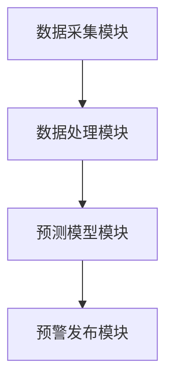
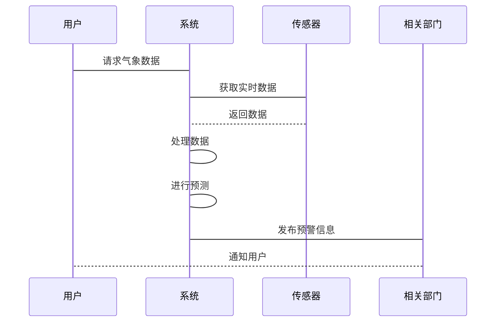

                 


# AI Agent在智能气象灾害预警系统中的实践

> 关键词：AI Agent, 智能气象灾害预警, 气象数据, 机器学习, 自然语言处理, 天气预报, 灾害预警

> 摘要：本文系统地探讨了AI Agent在智能气象灾害预警系统中的实践应用。从AI Agent的基本概念到其在气象灾害预警中的具体应用场景，结合数学模型和算法原理，分析了AI Agent如何通过感知、决策和自主学习能力提升气象灾害预警的准确性和实时性。同时，本文还详细介绍了系统的架构设计和项目实现过程，为读者提供了一套完整的AI Agent在智能气象灾害预警系统中的解决方案。

---

# 第一部分: AI Agent与智能气象灾害预警系统概述

## 第1章: AI Agent与智能气象灾害预警系统背景

### 1.1 AI Agent的基本概念与特点

#### 1.1.1 AI Agent的定义
AI Agent（智能代理）是一种能够感知环境、自主决策并执行任务的智能实体。它可以是一个软件程序、一个机器人，甚至是嵌入在系统中的算法模块。AI Agent的核心特征在于其自主性、反应性和目标导向性。

#### 1.1.2 AI Agent的核心特点
- **自主性**：AI Agent能够在没有外部干预的情况下自主运行。
- **反应性**：AI Agent能够实时感知环境变化并做出相应的反应。
- **目标导向性**：AI Agent的所有行为都围绕实现特定目标展开。
- **学习能力**：AI Agent能够通过数据和经验不断优化自身的性能。

#### 1.1.3 AI Agent与传统算法的区别
| 特性          | AI Agent                            | 传统算法                              |
|---------------|-------------------------------------|----------------------------------------|
| 自主性        | 高                                  | 低                                    |
| 学习能力      | 强                                  | 弱                                    |
| 适应性        | 强                                  | 中                                    |
| 应用场景      | 复杂、动态环境                      | 稳定、静态环境                        |

### 1.2 智能气象灾害预警系统的背景

#### 1.2.1 气象灾害的定义与分类
气象灾害是指由气象条件异常变化所引发的灾害性天气事件，主要包括：
- **暴雨**：短时间内的强降雨导致洪水、滑坡等灾害。
- **干旱**：长时间的少雨导致农作物减产、水资源短缺。
- **台风/飓风**：强热带气旋引发的风暴潮、强风和暴雨。
- **龙卷风**：强烈旋转的空气柱引发的局部破坏性天气。
- **寒潮**：强冷空气入侵导致的剧烈降温、大风和霜冻。

#### 1.2.2 智能气象灾害预警系统的必要性
传统的气象灾害预警系统主要依赖人工分析和统计模型，存在以下问题：
- **数据处理能力有限**：传统方法难以处理海量、实时的气象数据。
- **预测精度不足**：统计模型的预测能力有限，特别是在极端天气事件中的表现较差。
- **实时性不足**：人工分析的效率较低，难以满足实时预警的需求。

智能气象灾害预警系统通过引入AI Agent，可以显著提升系统的实时性、准确性和自动化能力。

#### 1.2.3 智能气象灾害预警系统的现状与挑战
当前，智能气象灾害预警系统已经在一些发达国家和地区得到了广泛应用，但仍面临以下挑战：
- **数据质量问题**：气象数据的采集和处理需要极高的精度和实时性。
- **模型优化难度**：AI Agent需要在动态变化的环境中不断优化其预测模型。
- **系统集成复杂性**：智能气象灾害预警系统需要与多种传感器、数据源和用户终端无缝集成。

### 1.3 AI Agent在气象灾害预警中的应用前景

#### 1.3.1 AI Agent在气象数据处理中的优势
- **高效的数据处理能力**：AI Agent能够快速处理海量的气象数据，包括卫星图像、地面观测数据和历史气象数据。
- **动态适应能力**：AI Agent能够根据环境变化实时调整其数据处理策略。
- **精准的预测能力**：通过机器学习算法，AI Agent可以实现对气象灾害的精准预测。

#### 1.3.2 AI Agent在灾害预警中的潜在价值
- **实时监测**：AI Agent可以实时监测气象数据，快速识别潜在的灾害迹象。
- **精准预警**：通过分析历史数据和当前数据，AI Agent可以预测灾害的发生时间和影响范围。
- **智能响应**：在灾害发生时，AI Agent可以协调多种资源，快速制定应对方案。

#### 1.3.3 AI Agent在气象系统中的未来发展趋势
- **多模态数据融合**：未来的AI Agent将能够同时处理多种类型的数据，包括气象数据、地理数据和用户反馈数据。
- **边缘计算**：AI Agent将更多地部署在边缘设备上，实现数据的实时处理和本地决策。
- **人机协作**：AI Agent将与人类专家协同工作，共同优化气象灾害预警系统。

## 第2章: AI Agent与智能气象灾害预警系统的概念联系

### 2.1 AI Agent的核心原理

#### 2.1.1 AI Agent的基本原理
AI Agent通过感知环境、分析信息、制定决策并执行操作来实现其目标。其核心流程包括：
1. **感知环境**：通过传感器或数据源获取环境信息。
2. **分析信息**：利用机器学习算法对获取的信息进行分析和理解。
3. **制定决策**：基于分析结果，生成行动计划。
4. **执行操作**：根据决策执行相应的操作，并将结果反馈到环境中。

#### 2.1.2 AI Agent的感知与决策机制
- **感知机制**：AI Agent通过多种传感器和数据源获取环境信息，如温度、湿度、风速、气压等气象数据。
- **决策机制**：AI Agent利用机器学习模型对感知到的信息进行分析，生成预测结果并制定行动计划。

#### 2.1.3 AI Agent的自主学习能力
AI Agent通过监督学习、无监督学习和强化学习等方法，不断优化其预测模型和决策策略。例如：
- **监督学习**：通过标注的数据训练AI Agent，使其能够识别特定的气象模式。
- **无监督学习**：通过聚类分析等方法，AI Agent可以发现隐藏在数据中的潜在模式。
- **强化学习**：通过与环境的互动，AI Agent可以学习到最优的决策策略。

### 2.2 智能气象灾害预警系统的概念结构

#### 2.2.1 系统的核心组成要素
智能气象灾害预警系统主要包括以下几个核心组件：
- **数据采集模块**：负责采集气象数据，包括卫星数据、地面观测数据和历史数据。
- **数据处理模块**：对采集到的数据进行清洗、融合和预处理。
- **预测模型模块**：利用机器学习算法对数据进行分析，生成气象灾害预测结果。
- **预警发布模块**：将预测结果通过多种渠道发布给相关部门和公众。
- **反馈模块**：收集用户反馈，优化预测模型和系统性能。

#### 2.2.2 系统的功能模块划分
| 功能模块                  | 描述                                      |
|---------------------------|------------------------------------------|
| 数据采集模块              | 采集气象数据，包括卫星数据、地面观测数据和历史数据。 |
| 数据处理模块              | 对采集到的数据进行清洗、融合和预处理。    |
| 预测模型模块              | 利用机器学习算法对数据进行分析，生成预测结果。 |
| 预警发布模块              | 将预测结果通过多种渠道发布给相关部门和公众。 |
| 反馈模块                  | 收集用户反馈，优化预测模型和系统性能。    |

#### 2.2.3 系统的边界与外延
智能气象灾害预警系统的边界包括：
- **输入边界**：气象数据、历史数据和用户反馈。
- **输出边界**：气象灾害预测结果、预警信息和系统优化建议。
- **外延**：与气象监测设备、通信网络和用户终端的交互。

### 2.3 AI Agent与智能气象系统的实体关系图

```mermaid
er
actor(AI Agent, "智能气象灾害预警系统", "气象数据", "灾害预警信息", "用户反馈")
```

---

# 第二部分: AI Agent的算法原理与数学模型

## 第3章: AI Agent的核心算法原理

### 3.1 AI Agent的感知与决策算法

#### 3.1.1 感知算法概述
AI Agent的感知算法主要包括数据采集、数据清洗和特征提取三个步骤。例如：
- **数据采集**：通过传感器和数据接口获取实时气象数据。
- **数据清洗**：去除噪声数据，确保数据的准确性和完整性。
- **特征提取**：从原始数据中提取有用的特征，如温度、湿度、风速等。

#### 3.1.2 决策算法概述
AI Agent的决策算法主要包括分类、回归和聚类三种类型。例如：
- **分类算法**：用于将气象数据分类为不同的灾害类型，如暴雨、干旱等。
- **回归算法**：用于预测灾害的发生时间和影响范围。
- **聚类算法**：用于识别气象数据中的异常模式。

#### 3.1.3 常见的AI Agent算法对比
| 算法类型       | 优点                           | 缺点                           |
|----------------|--------------------------------|---------------------------------|
| 分类算法       | 精度高，适用于二分类问题       | 对多分类问题表现一般           |
| 回归算法       | 可以预测连续值                 | 易受异常值影响                   |
| 聚类算法       | 适用于无监督学习               | 需要人工干预调整参数           |

### 3.2 AI Agent的自主学习算法

#### 3.2.1 监督学习算法
监督学习算法通过标注的数据训练AI Agent，使其能够识别特定的气象模式。例如：
- **线性回归**：用于预测灾害的发生时间。
- **支持向量机（SVM）**：用于分类灾害类型。

#### 3.2.2 无监督学习算法
无监督学习算法通过聚类分析等方法，识别隐藏在数据中的潜在模式。例如：
- **K-means**：用于将气象数据分成不同的类别。
- **层次聚类**：用于发现数据中的层次结构。

#### 3.2.3 强化学习算法
强化学习算法通过与环境的互动，学习最优的决策策略。例如：
- **Q-learning**：用于训练AI Agent在动态环境中做出最优决策。
- **Deep Q-Network（DQN）**：用于处理高维状态空间的复杂问题。

### 3.3 AI Agent的数学模型与公式

#### 3.3.1 概率论基础
概率论是AI Agent算法的基础，常用的概率公式包括：
- **贝叶斯定理**：$$P(A|B) = \frac{P(B|A) \cdot P(A)}{P(B)}$$
- **全概率公式**：$$P(B) = \sum_{i} P(B|A_i) \cdot P(A_i)$$

#### 3.3.2 贝叶斯网络模型
贝叶斯网络是一种有向无环图（DAG），用于表示变量之间的条件概率关系。例如：
- **变量关系**：如果变量A影响变量B，那么$$P(B|A)$$表示在A发生的条件下B发生的概率。

#### 3.3.3 马尔可夫决策过程
马尔可夫决策过程（MDP）用于描述强化学习问题，主要包括状态、动作、奖励和转移概率四个要素。例如：
- **状态转移**：$$P(s'|s,a)$$表示在状态s下执行动作a后转移到状态s'的概率。
- **奖励函数**：$$R(s,a)$$表示在状态s下执行动作a所获得的奖励。

---

## 第4章: AI Agent的数学模型与公式详解

### 4.1 概率论基础

#### 4.1.1 概率的基本公式
- **概率的加法法则**：$$P(A \cup B) = P(A) + P(B) - P(A \cap B)$$
- **条件概率**：$$P(A|B) = \frac{P(A \cap B)}{P(B)}$$

#### 4.1.2 条件概率与贝叶斯定理
贝叶斯定理用于更新基于新证据的条件概率：
$$P(A|B) = \frac{P(B|A) \cdot P(A)}{P(B)}$$

#### 4.1.3 贝叶斯网络的构建与应用
贝叶斯网络通过构建变量之间的条件概率关系，可以有效地处理复杂的问题。例如：
- **变量关系**：如果变量A影响变量B，那么$$P(B|A)$$表示在A发生的条件下B发生的概率。

### 4.2 贝叶斯网络

---

# 第三部分: AI Agent在智能气象灾害预警系统中的应用实践

## 第5章: 系统分析与架构设计

### 5.1 系统架构设计

#### 5.1.1 项目背景介绍
智能气象灾害预警系统的目标是通过AI Agent实现气象灾害的实时监测、精准预测和智能预警。系统主要包括数据采集、数据处理、预测模型和预警发布四个模块。

#### 5.1.2 系统功能设计
- **数据采集模块**：负责采集气象数据，包括卫星数据、地面观测数据和历史数据。
- **数据处理模块**：对采集到的数据进行清洗、融合和预处理。
- **预测模型模块**：利用机器学习算法对数据进行分析，生成气象灾害预测结果。
- **预警发布模块**：将预测结果通过多种渠道发布给相关部门和公众。

#### 5.1.3 系统架构图


### 5.2 系统接口设计

#### 5.2.1 系统接口设计
系统接口包括：
- **数据接口**：与气象传感器和数据源的接口。
- **用户接口**：与用户终端的接口。
- **预警发布接口**：与相关部门的接口。

#### 5.2.2 系统交互流程图


---

## 第6章: 项目实战

### 6.1 环境安装

#### 6.1.1 系统要求
- **操作系统**：Linux/Windows/MacOS
- **编程语言**：Python 3.6+
- **框架**：TensorFlow/PyTorch
- **依赖库**：NumPy, Pandas, Matplotlib, Scikit-learn

#### 6.1.2 安装步骤
```bash
pip install numpy pandas scikit-learn tensorflow matplotlib
```

### 6.2 核心代码实现

#### 6.2.1 数据采集模块
```python
import requests

def fetch_weather_data(api_key, location):
    url = f"http://api.weather.com/{api_key}/current_weather/{location}"
    response = requests.get(url)
    data = response.json()
    return data
```

#### 6.2.2 数据处理模块
```python
import pandas as pd

def preprocess_data(data):
    df = pd.DataFrame(data)
    df.dropna(inplace=True)
    df['date'] = pd.to_datetime(df['date'])
    return df
```

#### 6.2.3 预测模型模块
```python
import tensorflow as tf
from tensorflow.keras import layers

model = tf.keras.Sequential([
    layers.Dense(64, activation='relu'),
    layers.Dense(10, activation='softmax')
])

model.compile(optimizer='adam', loss='sparse_categorical_crossentropy', metrics=['accuracy'])
model.fit(x_train, y_train, epochs=10, batch_size=32)
```

#### 6.2.4 预警发布模块
```python
import smtplib

def send_alert(email, message):
    server = smtplib.SMTP('smtp.example.com', 587)
    server.starttls()
    server.login('user@example.com', 'password')
    server.sendmail('user@example.com', email, message)
    server.quit()
```

### 6.3 案例分析与代码解读

#### 6.3.1 数据采集案例
```python
data = fetch_weather_data('your_api_key', 'New York')
print(data)
```

#### 6.3.2 数据处理案例
```python
processed_data = preprocess_data(data)
print(processed_data.head())
```

#### 6.3.3 模型训练案例
```python
model.fit(x_train, y_train, epochs=10, batch_size=32)
```

#### 6.3.4 预警发布案例
```python
send_alert('user@example.com', 'Meteorological disaster warning: Hurricane alert!')
```

### 6.4 项目小结
通过以上代码实现，我们可以看到AI Agent在智能气象灾害预警系统中的具体应用。数据采集模块负责获取实时气象数据，数据处理模块对数据进行清洗和预处理，预测模型模块利用机器学习算法生成预测结果，预警发布模块将预测结果通过多种渠道发布给相关部门和公众。

---

# 第四部分: 总结与展望

## 第7章: 总结与展望

### 7.1 总结
本文系统地探讨了AI Agent在智能气象灾害预警系统中的实践应用。通过结合数学模型和算法原理，分析了AI Agent如何通过感知、决策和自主学习能力提升气象灾害预警的准确性和实时性。同时，本文还详细介绍了系统的架构设计和项目实现过程，为读者提供了一套完整的AI Agent在智能气象灾害预警系统中的解决方案。

### 7.2 展望
未来，AI Agent在智能气象灾害预警系统中的应用将更加广泛和深入。随着人工智能技术的不断发展，AI Agent将具备更强的自主学习能力和更高的预测精度。同时，通过多模态数据的融合和边缘计算技术的应用，AI Agent将能够更高效地处理气象数据，实现更精准的气象灾害预警。

### 7.3 最佳实践 tips
- **数据质量**：确保气象数据的准确性和完整性。
- **模型优化**：定期更新和优化预测模型，提高预测精度。
- **系统维护**：定期检查和维护系统，确保其稳定运行。
- **用户反馈**：收集用户反馈，优化系统功能和用户体验。

---

# 作者：AI天才研究院/AI Genius Institute & 禅与计算机程序设计艺术 /Zen And The Art of Computer Programming

