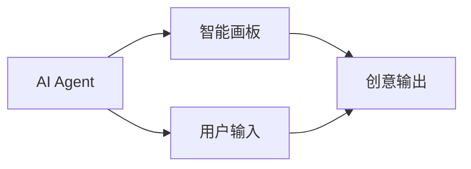
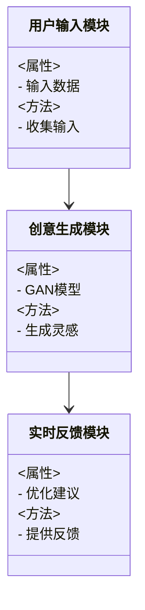
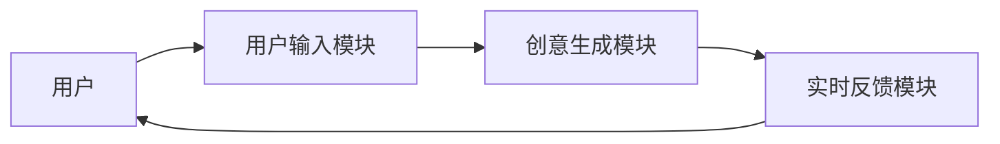
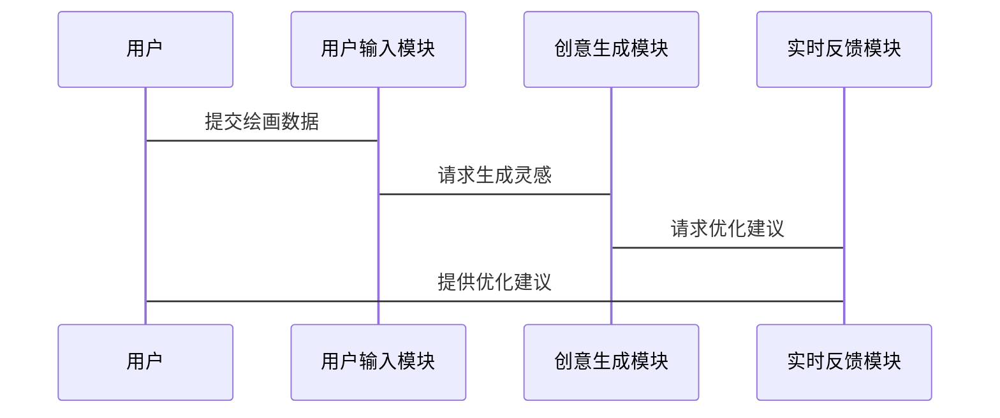

                 


# AI Agent在智能画板中的创意激发系统

> **关键词**: AI Agent, 智能画板, 创意激发, GAN, 强化学习, 系统架构

> **摘要**: 本文深入探讨了AI Agent在智能画板中的应用，特别是在创意激发系统中的核心作用。通过分析AI Agent与智能画板的结合，详细阐述了生成对抗网络（GAN）和强化学习（RL）的算法原理，并结合系统架构设计和项目实战，展示了如何通过AI技术提升智能画板的创意生成能力。文章从背景介绍、核心概念、算法实现、系统设计到项目实战，层层递进，为读者提供了一个全面的技术视角。

---

# 第一部分: AI Agent与智能画板的背景与概念

## 第1章: AI Agent与智能画板的背景介绍

### 1.1 AI Agent的核心概念

#### 1.1.1 AI Agent的定义与特点
AI Agent（人工智能代理）是指能够感知环境、自主决策并执行任务的智能实体。其核心特点包括：
- **自主性**: 能够自主决策，无需外部干预。
- **反应性**: 能够实时感知环境变化并做出反应。
- **学习性**: 能够通过经验改进自身的决策能力。

#### 1.1.2 AI Agent的核心要素与组成
AI Agent通常由以下核心要素组成：
- **感知器**: 用于感知环境信息。
- **决策器**: 用于基于感知信息做出决策。
- **执行器**: 用于执行决策结果。
- **学习模块**: 用于优化决策策略。

#### 1.1.3 AI Agent与传统AI的区别
与传统AI相比，AI Agent具有更强的自主性和适应性，能够根据环境动态调整自身行为。

### 1.2 智能画板的定义与功能

#### 1.2.1 智能画板的定义
智能画板是一种结合了人工智能技术的绘画工具，能够通过AI算法为用户提供创意灵感和绘画建议。

#### 1.2.2 智能画板的核心功能
- **创意生成**: 根据用户输入生成绘画灵感。
- **风格迁移**: 将不同风格的作品应用到用户的画作中。
- **实时反馈**: 提供实时的绘画建议和优化方案。

#### 1.2.3 智能画板的用户群体与应用场景
智能画板主要面向艺术家、设计师和普通绘画爱好者，应用场景包括艺术创作、设计辅助和教育学习。

### 1.3 AI Agent在智能画板中的问题背景

#### 1.3.1 创意激发的痛点与挑战
传统绘画工具缺乏智能性，难以满足用户对创意和灵感的需求。

#### 1.3.2 AI Agent在创意激发中的作用
AI Agent可以通过生成对抗网络（GAN）和强化学习（RL）等技术，为用户提供高质量的创意灵感。

#### 1.3.3 智能画板与AI Agent的结合场景
AI Agent可以实时分析用户的绘画行为，动态生成创意建议，帮助用户提升绘画质量。

## 第2章: AI Agent与智能画板的核心概念

### 2.1 AI Agent的核心原理

#### 2.1.1 AI Agent的基本原理
AI Agent通过感知环境、分析任务需求、制定决策并执行任务来实现其功能。

#### 2.1.2 AI Agent的决策机制
AI Agent的决策机制包括状态感知、目标设定和策略选择三个步骤。

#### 2.1.3 AI Agent的学习与优化
AI Agent通过强化学习和深度学习等技术不断优化自身的决策策略。

### 2.2 智能画板的系统架构

#### 2.2.1 智能画板的功能模块
智能画板的主要功能模块包括：
- **用户输入模块**: 收集用户的绘画行为数据。
- **创意生成模块**: 基于AI算法生成创意灵感。
- **实时反馈模块**: 提供实时的绘画建议和优化方案。

#### 2.2.2 智能画板的数据流分析
数据流从用户输入模块开始，经过创意生成模块处理后，生成创意灵感并反馈给用户。

#### 2.2.3 智能画板的用户交互界面
智能画板的用户交互界面包括绘画区域、创意灵感展示区域和实时反馈区域。

### 2.3 AI Agent与智能画板的实体关系图



---

# 第二部分: AI Agent的算法原理与实现

## 第3章: AI Agent的算法原理

### 3.1 基于生成对抗网络的创意生成

#### 3.1.1 GAN的基本原理
生成对抗网络（GAN）由生成器和判别器两部分组成，通过对抗训练生成高质量的数据样本。

#### 3.1.2 GAN在创意生成中的应用
GAN可以用于生成绘画灵感，通过不断优化生成器和判别器的参数，生成高质量的绘画作品。

#### 3.1.3 GAN的优缺点分析
- **优点**: 能够生成高质量的数据样本，具有强大的生成能力。
- **缺点**: 训练过程不稳定，容易出现模式坍缩。

### 3.2 基于强化学习的决策优化

#### 3.2.1 强化学习的基本原理
强化学习通过智能体与环境的交互，学习最优策略以最大化累积奖励。

#### 3.2.2 强化学习在AI Agent中的应用
强化学习可以用于优化AI Agent的决策策略，使其能够在复杂环境中做出最优选择。

#### 3.2.3 强化学习的数学模型

强化学习的数学模型包括：
- **状态空间**: 表示智能体所处的环境状态。
- **动作空间**: 表示智能体可以执行的动作。
- **奖励函数**: 表示智能体执行动作后获得的奖励。

### 3.3 GAN与强化学习的结合

#### 3.3.1 GAN与强化学习的协同机制
GAN可以生成高质量的绘画灵感，强化学习可以优化AI Agent的决策策略，两者结合可以实现更高效的创意生成。

#### 3.3.2 GAN与强化学习的联合训练
通过联合训练GAN和强化学习模型，可以实现更高效的创意生成和决策优化。

#### 3.3.3 GAN与强化学习的优缺点对比
- **优点**: 结合了GAN的生成能力和强化学习的优化能力。
- **缺点**: 训练过程复杂，计算资源消耗较大。

## 第4章: 算法实现与数学模型

### 4.1 GAN的数学模型

#### 4.1.1 GAN的生成器与判别器
生成器通过最大化判别器的分类错误率来生成高质量的数据样本，判别器通过区分真实数据和生成数据来优化生成器的生成能力。

#### 4.1.2 GAN的损失函数
GAN的损失函数包括生成器损失和判别器损失，具体公式如下：

生成器损失：
$$ \mathcal{L}_G = -\mathbb{E}_{z \sim p_z}[\log D(G(z))] $$

判别器损失：
$$ \mathcal{L}_D = -\mathbb{E}_{x \sim p_{data}}[\log D(x)] - \mathbb{E}_{z \sim p_z}[\log (1 - D(G(z)))] $$

### 4.2 强化学习的数学模型

#### 4.2.1 强化学习的环境与动作空间
强化学习的环境定义了智能体所处的状态空间和动作空间。

#### 4.2.2 强化学习的奖励机制
奖励机制定义了智能体执行动作后获得的奖励，具体公式如下：

$$ r(s, a) = \text{奖励值} $$

#### 4.2.3 强化学习的策略网络
策略网络通过输出概率分布来选择动作，具体公式如下：

$$ \pi(a|s) = \text{策略网络输出} $$

### 4.3 GAN与强化学习的联合模型

#### 4.3.1 GAN与强化学习的联合训练过程
通过联合训练GAN和强化学习模型，可以实现更高效的创意生成和决策优化。

---

# 第三部分: 智能画板的系统分析与架构设计

## 第5章: 智能画板的系统分析与架构设计

### 5.1 系统功能设计

#### 5.1.1 功能模块划分
智能画板的功能模块包括：
- **用户输入模块**: 收集用户的绘画行为数据。
- **创意生成模块**: 基于AI算法生成创意灵感。
- **实时反馈模块**: 提供实时的绘画建议和优化方案。

#### 5.1.2 系统功能流程
用户输入绘画行为数据，系统通过创意生成模块生成创意灵感，并通过实时反馈模块提供优化建议。

### 5.2 系统架构设计

#### 5.2.1 领域模型类图
智能画板的领域模型类图如下：



#### 5.2.2 系统架构图
智能画板的系统架构图如下：



#### 5.2.3 系统交互序列图
智能画板的系统交互序列图如下：



---

# 第四部分: 项目实战与优化

## 第6章: 项目实战

### 6.1 环境安装与配置

#### 6.1.1 环境搭建
安装Python、TensorFlow、Keras等开发环境。

#### 6.1.2 依赖库安装
安装必要的依赖库，例如：
- `pip install tensorflow`
- `pip install keras`

### 6.2 系统核心实现

#### 6.2.1 GAN模型实现
以下是GAN模型的Python代码示例：

```python
import tensorflow as tf
from tensorflow.keras import layers

def make_generator_model():
    model = tf.keras.Sequential()
    model.add(layers.Dense(256, activation='relu', input_shape=(100,)))
    model.add(layers.Dense(512, activation='relu'))
    model.add(layers.Dense(784, activation='sigmoid'))
    return model

def make_discriminator_model():
    model = tf.keras.Sequential()
    model.add(layers.Dense(784, activation='relu', input_shape=(784,)))
    model.add(layers.Dense(256, activation='relu'))
    model.add(layers.Dense(1, activation='sigmoid'))
    return model

generator = make_generator_model()
discriminator = make_discriminator_model()
```

#### 6.2.2 强化学习模型实现
以下是强化学习模型的Python代码示例：

```python
import numpy as np

class DQN:
    def __init__(self, state_space, action_space):
        self.state_space = state_space
        self.action_space = action_space
        self.q_table = np.zeros((state_space, action_space))
    
    def choose_action(self, state):
        return np.argmax(self.q_table[state])
    
    def update_q_table(self, state, action, reward):
        self.q_table[state][action] += reward
```

### 6.3 实际案例分析

#### 6.3.1 案例背景
用户输入一幅草图，系统通过GAN生成创意灵感，并通过强化学习优化绘画建议。

#### 6.3.2 系统实现步骤
1. 用户输入草图数据。
2. GAN模型生成创意灵感。
3. 强化学习模型优化绘画建议。
4. 系统将优化后的建议反馈给用户。

### 6.4 项目小结
通过本项目实战，我们可以看到AI Agent在智能画板中的强大应用潜力，同时也为后续优化提供了方向。

---

# 第五部分: 最佳实践与总结

## 第7章: 最佳实践与总结

### 7.1 最佳实践

#### 7.1.1 算法优化建议
- 使用更先进的GAN变体，如StyleGAN。
- 引入强化学习的多智能体协作机制。

#### 7.1.2 系统设计建议
- 优化系统的实时反馈机制。
- 提高系统的容错性和可扩展性。

### 7.2 项目总结

#### 7.2.1 核心成果
- 成功实现了AI Agent在智能画板中的创意激发系统。
- 提供了高质量的绘画灵感和优化建议。

#### 7.2.2 未来展望
- 深化AI Agent在智能画板中的应用，探索更多创新方向。
- 推动AI技术在艺术创作领域的广泛应用。

---

# 结语

通过本文的详细阐述，我们深入探讨了AI Agent在智能画板中的创意激发系统，从理论到实践，全面解析了其技术实现和应用潜力。希望本文能够为相关领域的研究者和开发者提供有价值的参考和启发。

---

**作者：AI天才研究院/AI Genius Institute & 禅与计算机程序设计艺术 /Zen And The Art of Computer Programming**

