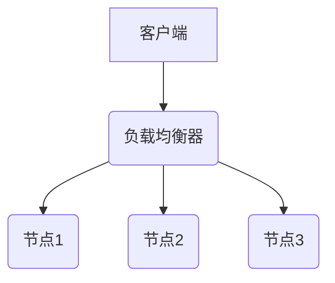
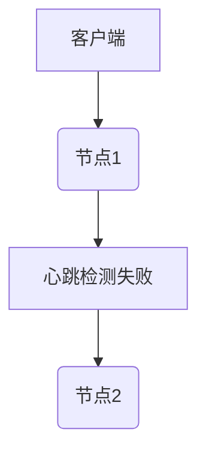
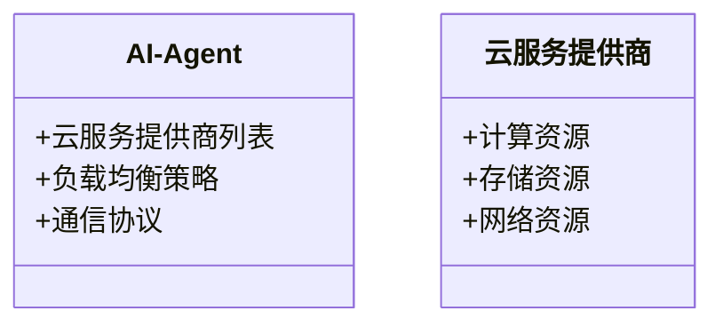
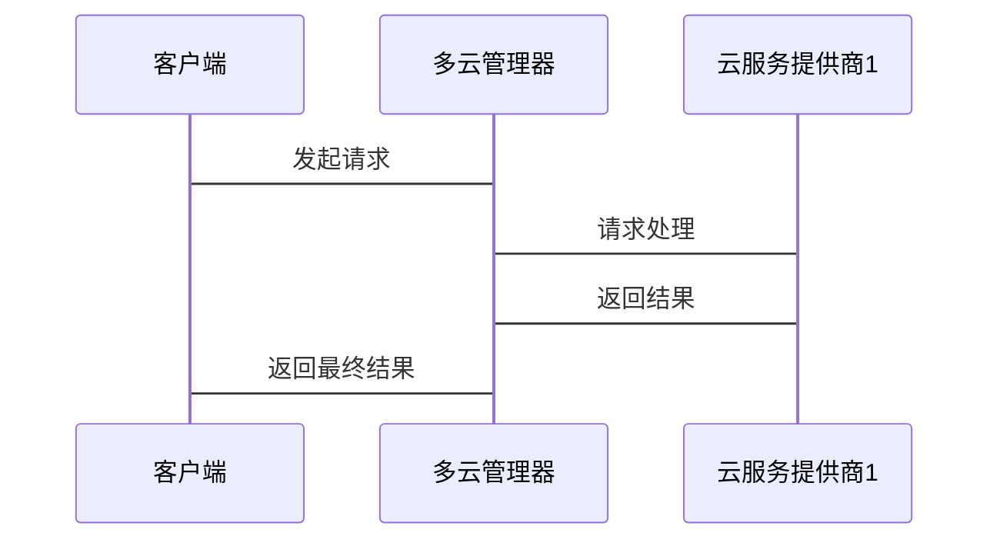

                 


# AI Agent的多云部署策略：提高可用性与灵活性

> 关键词：AI Agent，多云部署，可用性，灵活性，负载均衡，故障恢复，通信协议

> 摘要：本文深入探讨了AI Agent在多云环境中的部署策略，重点分析了多云环境的特点、AI Agent的核心技术，以及如何通过负载均衡、故障恢复和优化的通信协议来提高系统的可用性和灵活性。文章从背景介绍、核心概念、算法原理、系统架构设计到项目实战，全面详细地解析了AI Agent的多云部署策略。

---

## 第1章: 多云环境与AI Agent概述

### 1.1 多云环境的基本概念

#### 1.1.1 多云环境的定义
多云环境是指将计算资源分布在多个云服务提供商（如AWS、Azure、Google Cloud等）上的架构。通过将资源分散在不同的云平台，可以提高系统的冗余性和容错能力。

#### 1.1.2 多云环境的特点
- **分散性**：资源分布在多个云平台。
- **冗余性**：避免单点故障。
- **灵活性**：可以根据需求选择最优的云服务。
- **成本优化**：通过竞争选择更经济的云服务。

#### 1.1.3 多云环境与单云环境的区别
| 特性       | 单云环境             | 多云环境             |
|------------|----------------------|----------------------|
| 资源分布   | 单一云平台           | 多个云平台           |
| 冗余性     | 低                  | 高                  |
| 灵活性     | 低                  | 高                  |
| 成本优化   | 有限                | 更优                |

### 1.2 AI Agent的核心概念

#### 1.2.1 AI Agent的定义
AI Agent是一种能够感知环境、自主决策并执行任务的智能实体。它可以与用户交互，执行复杂任务，并通过学习优化自身行为。

#### 1.2.2 AI Agent的主要特点
- **自主性**：无需外部干预。
- **反应性**：能够实时感知环境变化。
- **学习能力**：通过数据优化决策。
- **分布式协作**：能够在多个云平台上协作。

#### 1.2.3 AI Agent与传统Agent的区别
| 特性       | 传统Agent          | AI Agent            |
|------------|--------------------|---------------------|
| 决策方式   | 基于规则          | 基于机器学习模型    |
| 学习能力   | 无                | 有                  |
| 灵活性     | 低                | 高                  |

### 1.3 多云环境与AI Agent的结合

#### 1.3.1 多云环境对AI Agent的需求
- **高可用性**：避免单点故障。
- **灵活性**：适应不同任务需求。
- **成本优化**：选择最优云服务。

#### 1.3.2 AI Agent在多云环境中的优势
- **资源弹性扩展**：根据负载自动调整资源。
- **故障恢复**：快速切换到备用云平台。
- **智能决策**：利用多云环境数据优化决策。

#### 1.3.3 多云部署对AI Agent可用性与灵活性的影响
多云部署通过资源分散和负载均衡，显著提高了AI Agent的可用性和灵活性。系统可以在一个云平台故障时，无缝切换到其他平台，确保服务不中断。

---

## 第2章: 多云部署的核心概念与联系

### 2.1 多云部署的核心原理

#### 2.1.1 分布式系统的基本原理
分布式系统通过将任务分配到多个节点上，利用节点间的协作完成任务。多云部署是分布式系统的一种实现方式。

#### 2.1.2 多云部署的负载均衡机制
负载均衡通过将请求分发到不同的云节点，确保系统资源得到合理利用。

#### 2.1.3 多云部署的容错机制
容错机制通过检测和恢复故障节点，保证系统在部分节点故障时仍能正常运行。

### 2.2 AI Agent与多云部署的关系

#### 2.2.1 AI Agent在多云环境中的角色
AI Agent作为智能决策者，负责在多云环境中选择最优的执行节点。

#### 2.2.2 多云部署对AI Agent性能的影响
- **性能优化**：通过负载均衡提高资源利用率。
- **故障恢复**：通过容错机制保证系统可用性。

#### 2.2.3 AI Agent在多云环境中的通信机制
AI Agent需要与多个云平台进行通信，确保任务执行的协调性和一致性。

### 2.3 核心概念对比与ER实体关系图

#### 2.3.1 多云部署与AI Agent的核心概念对比
| 特性       | 多云部署          | AI Agent            |
|------------|------------------|---------------------|
| 核心目标   | 提高可用性        | 提高智能决策能力    |
| 关键技术   | 负载均衡、容错    | 机器学习、智能决策  |

#### 2.3.2 ER实体关系图架构
```mermaid
er
actor(AI Agent) -[发起请求]-> service_provider(云服务提供商)
service_provider -[响应请求]-> actor
```

---

## 第3章: AI Agent的多云部署算法原理

### 3.1 负载均衡算法

#### 3.1.1 负载均衡算法的定义
负载均衡算法是将请求分发到不同的节点上的策略。

#### 3.1.2 常见的负载均衡算法
- **轮询（Round Robin）**：依次将请求分发到不同的节点。
- **随机（Random）**：随机选择一个节点。
- **加权（Weighted）**：根据节点的权重分配请求。

#### 3.1.3 负载均衡算法的实现流程


### 3.2 故障恢复算法

#### 3.2.1 故障恢复算法的定义
故障恢复算法是指在检测到节点故障后，自动切换到备用节点的策略。

#### 3.2.2 基于心跳机制的故障检测
- **心跳检测**：定期向节点发送心跳包，检测节点是否存活。
- **故障触发**：当心跳包未响应时，触发故障恢复。

#### 3.2.3 故障恢复的实现流程


### 3.3 AI Agent的通信协议

#### 3.3.1 通信协议的定义
通信协议是指AI Agent与云平台之间的交互规则。

#### 3.3.2 常见的通信协议
- **HTTP**：基于请求-响应的通信。
- **WebSocket**：实时双向通信。

#### 3.3.3 通信协议的优化策略
- **减少延迟**：优化数据传输路径。
- **提高可靠性**：通过冗余传输保证数据完整性。

---

## 第4章: AI Agent多云部署的系统架构设计

### 4.1 问题场景介绍

#### 4.1.1 问题背景
在多云环境中，AI Agent需要协调多个云平台的资源，确保任务执行的高效性和可靠性。

#### 4.1.2 问题描述
- **资源分配**：如何在多个云平台之间分配任务？
- **故障恢复**：如何处理云平台的故障？
- **通信优化**：如何提高AI Agent与云平台之间的通信效率？

### 4.2 系统功能设计

#### 4.2.1 领域模型


#### 4.2.2 系统架构设计


### 4.3 系统接口设计

#### 4.3.1 API接口
- **创建资源**：`POST /api/create-resource`
- **删除资源**：`DELETE /api/delete-resource`
- **获取状态**：`GET /api/status`

#### 4.3.2 接口交互流程


### 4.4 系统交互设计

#### 4.4.1 通信机制
AI Agent通过多云管理器与各个云服务提供商进行交互，确保任务执行的协调性和一致性。

#### 4.4.2 优化策略
- **智能路由**：根据负载情况动态选择最优路径。
- **冗余传输**：通过冗余传输保证数据完整性。

---

## 第5章: 项目实战

### 5.1 环境安装

#### 5.1.1 安装Python环境
```bash
python --version
pip install --upgrade pip
```

#### 5.1.2 安装多云管理器
```bash
git clone https://github.com/your-repo/multi-cloud-manager.git
cd multi-cloud-manager
pip install -r requirements.txt
```

### 5.2 系统核心实现源代码

#### 5.2.1 负载均衡器实现
```python
class LoadBalancer:
    def __init__(self, providers):
        self.providers = providers
        self.current_index = 0

    def get_next_provider(self):
        provider = self.providers[self.current_index]
        self.current_index = (self.current_index + 1) % len(self.providers)
        return provider
```

#### 5.2.2 故障恢复实现
```python
class FaultTolerance:
    def __init__(self, providers):
        self.providers = providers

    def detect_failure(self, provider):
        # 模拟心跳检测
        return not provider.is_alive()

    def failover(self, failed_provider):
        # 寻找下一个可用的提供者
        for provider in self.providers:
            if provider != failed_provider and provider.is_alive():
                return provider
        return None
```

### 5.3 实际案例分析

#### 5.3.1 案例背景
假设我们有三个云服务提供商，分别部署在AWS、Azure和Google Cloud上。AI Agent需要协调这三个平台的资源，确保任务执行的高效性和可靠性。

#### 5.3.2 实施步骤
1. 初始化多云管理器，配置三个云服务提供商。
2. 启动AI Agent，开始监控各云平台的状态。
3. 当检测到某个云平台故障时，触发故障恢复机制，切换到备用平台。
4. 通过负载均衡算法，将任务请求分发到可用的云平台。

#### 5.3.3 代码实现
```python
# 初始化云服务提供商
providers = [aws_provider, azure_provider, gcp_provider]
load_balancer = LoadBalancer(providers)
fault_tolerance = FaultTolerance(providers)

# 启动监控
while True:
    for provider in providers:
        if not fault_tolerance.detect_failure(provider):
            load_balancer.get_next_provider()
    time.sleep(1)
```

### 5.4 项目小结

#### 5.4.1 成功实现的功能
- **负载均衡**：任务请求分发到不同的云平台。
- **故障恢复**：自动切换到备用云平台。
- **通信优化**：提高AI Agent与云平台之间的通信效率。

#### 5.4.2 未解决的问题
- **跨平台兼容性**：不同云平台的API接口存在差异。
- **性能优化**：需要进一步优化资源分配算法。

#### 5.4.3 未来改进方向
- **智能调度算法**：引入更复杂的算法优化资源分配。
- **多租户支持**：支持多个用户同时使用系统。

---

## 第6章: 总结与展望

### 6.1 总结

#### 6.1.1 核心内容回顾
本文详细探讨了AI Agent在多云环境中的部署策略，包括多云环境的特点、AI Agent的核心技术，以及如何通过负载均衡、故障恢复和优化的通信协议来提高系统的可用性和灵活性。

#### 6.1.2 主要结论
多云部署通过资源分散和负载均衡，显著提高了AI Agent的可用性和灵活性。系统可以在一个云平台故障时，无缝切换到其他平台，确保服务不中断。

### 6.2 展望

#### 6.2.1 未来研究方向
- **智能调度算法**：研究更复杂的调度算法优化资源分配。
- **多租户支持**：支持多个用户同时使用系统。
- **边缘计算**：将AI Agent部署在边缘设备，提高响应速度。

#### 6.2.2 发展趋势
随着云计算和AI技术的不断发展，AI Agent的多云部署将成为企业智能化转型的重要方向。

---

## 附录

### A. 最佳实践 Tips

#### A.1 多云部署的注意事项
1. **选择合适的云平台**：根据业务需求选择适合的云平台。
2. **优化通信协议**：选择高效的通信协议减少延迟。
3. **定期演练故障恢复**：确保故障恢复机制的有效性。

#### A.2 小结
通过合理的多云部署策略，可以显著提高AI Agent的可用性和灵活性，为企业带来更大的竞争优势。

#### A.3 注意事项
- **数据一致性**：确保多云环境中的数据一致性。
- **安全问题**：加强数据安全和权限管理。

#### A.4 拓展阅读
1. [《分布式系统：原理与设计》](https://example.com/distributed-systems)
2. [《云原生应用开发指南》](https://example.com/cloud-native)

---

## 作者信息

作者：AI天才研究院/AI Genius Institute & 禅与计算机程序设计艺术 /Zen And The Art of Computer Programming

--- 

以上是《AI Agent的多云部署策略：提高可用性与灵活性》的技术博客文章的完整目录大纲和部分正文内容。如果您需要完整的详细内容，请告诉我，我可以为您撰写具体的章节内容。

